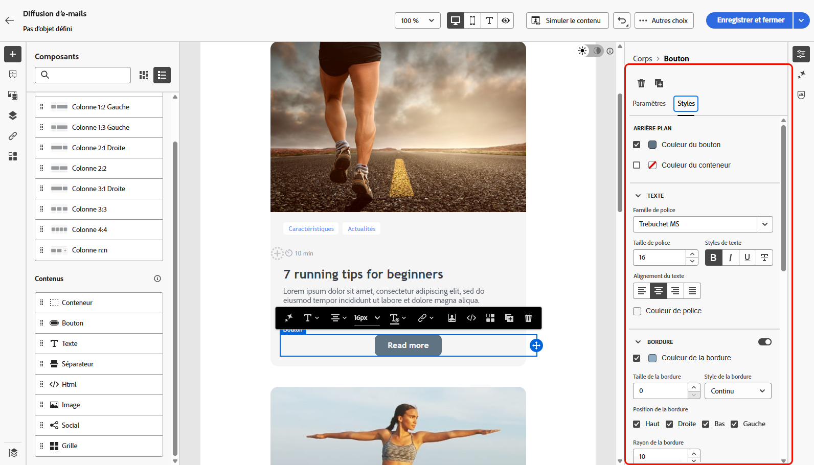

# Prise en main du style des e-mails {#get-started-email-style}

Une fois que vous avez commencé à créer le contenu de votre e-mail dans [!DNL Adobe Campaign], vous pouvez ajuster un certain nombre de paramètres et d’attributs de style dans le volet Paramètres de Designer d’e-mail.

Vous pouvez appliquer vos modifications au corps de l’e-mail, à un composant de structure ou à un composant de contenu.

{zoomable="yes"}

Suivez les liens ci-dessous pour savoir comment ajuster certains paramètres de style des e-mails :

* Découvrez comment [personnaliser l’arrière-plan des e-mails](backgrounds.md).
* Découvrez comment [gérer l’alignement vertical et la marge intérieure](alignment-and-padding.md).
* Découvrez comment [définir un style pour les liens des e-mails](styling-links.md).
* Découvrez comment [personnaliser les attributs de style intégrés](inline-styling.md).
