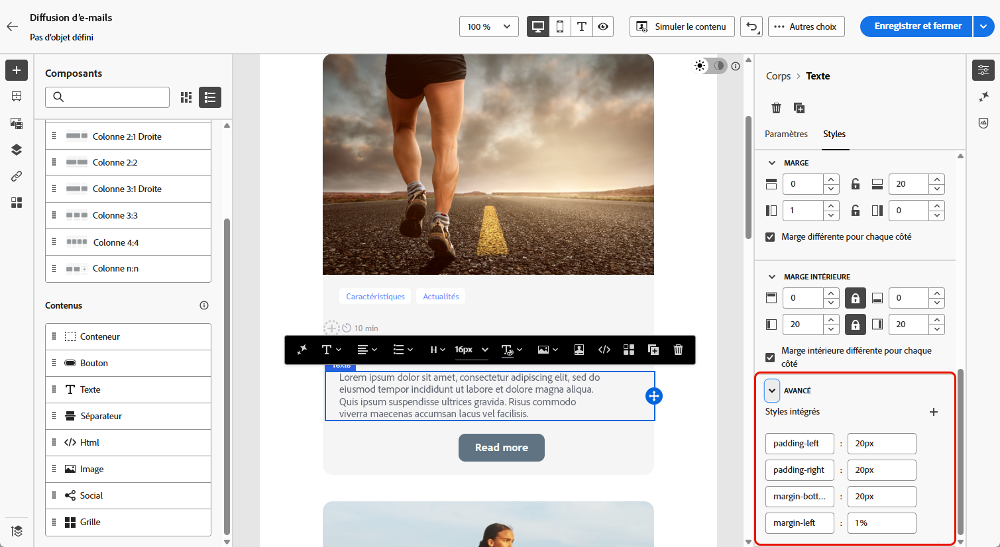
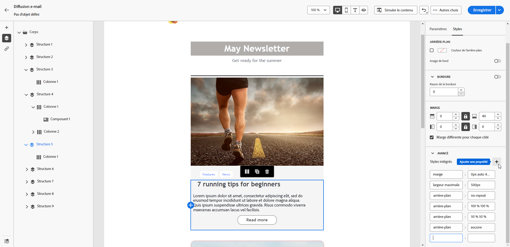

# Ajouter des attributs de style intégrés {#adding-inline-styling-attributes}

Dans l’interface Designer d’e-mail, lorsque vous sélectionnez un élément et affichez ses paramètres dans le volet de droite, vous personnalisez les attributs intégrés et leurs valeurs pour cet élément spécifique.

1. Sélectionnez un composant directement dans votre contenu ou utilisez l’**[!UICONTROL arborescence de navigation]** disponible dans le volet de gauche.

1. Dans l’onglet **[!UICONTROL Styles]**, cliquez sur le menu déroulant **[!UICONTROL Avancé]**.

   {zoomable="yes"}

1. Modifiez les valeurs des attributs existants.

1. Ajoutez de nouvelles propriétés à l’aide du bouton **+** . Ajoutez un attribut et une valeur quelconques compatibles avec CSS.

   {zoomable="yes"}

La mise en forme s’applique à l’élément sélectionné.

>[!NOTE]
>
>Si aucun attribut de style spécifique n’est défini pour les éléments enfants, ils héritent du style de l’élément parent.