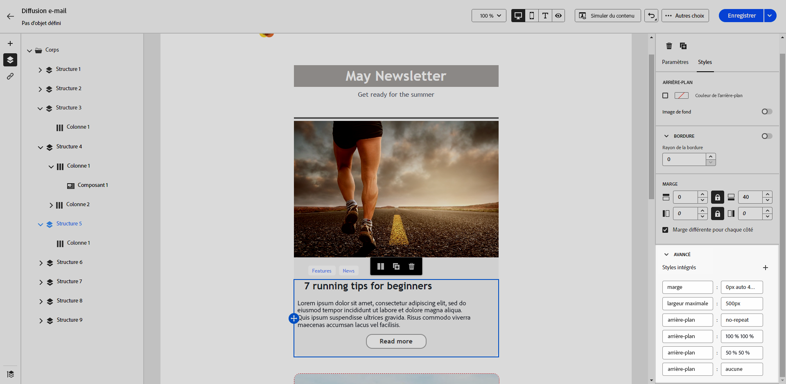

# Ajouter des attributs de style intégrés {#adding-inline-styling-attributes}

Dans l’interface du concepteur d’e-mail, lorsque vous sélectionnez un élément et affichez ses paramètres dans le volet de droite, vous pouvez personnaliser les attributs intégrés et leur valeur pour cet élément spécifique.

1. Sélectionnez un composant directement dans votre contenu ou à l’aide de la fonction **[!UICONTROL Arborescence de navigation]** disponible dans le volet de gauche.

1. Dans l’onglet **[!UICONTROL Styles]**, cliquez sur le menu déroulant **[!UICONTROL Avancé]**.

   {zoomable=&quot;yes&quot;}

1. Modifiez les valeurs des attributs existants.

1. Vous pouvez ajouter de nouvelles propriétés à l’aide du bouton **+**. Vous pouvez ajouter tout attribut et toute valeur compatible CSS.

   {zoomable=&quot;yes&quot;}

Le style est ensuite appliqué à l’élément sélectionné.

>[!NOTE]
>
>Si aucun attribut de style spécifique n’est défini pour les éléments enfants, ils héritent du style de l’élément parent.

