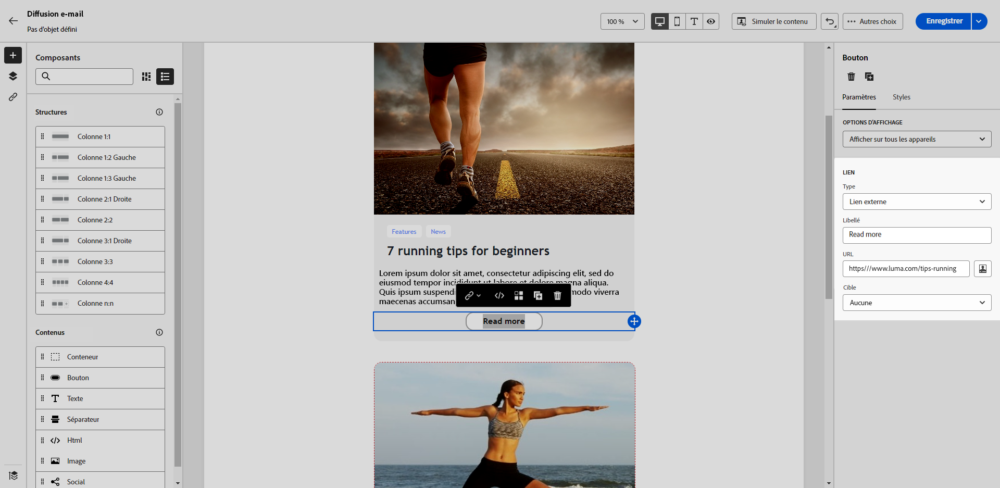

# Ajouter des liens et suivre les messages {#tracking}

Utilisez le concepteur d’e-mail pour ajouter des liens à votre contenu et tracker les messages envoyés afin de surveiller le comportement de vos destinataires.

## Insérer des liens {#insert-links}

Lors de la conception d’un message, vous pouvez ajouter des liens à votre contenu.

>[!NOTE]
>
>Lorsque le tracking est activé, tous les liens inclus dans le contenu du message sont trackés.

Pour insérer des liens dans le contenu de votre e-mail, procédez comme suit :

1. Sélectionnez un élément et cliquez sur **[!UICONTROL Insérer un lien]** dans la barre d’outils contextuelle.

1. Sélectionnez le type de lien que vous souhaitez créer :

   {zoomable="yes"}

   * **[!UICONTROL Lien externe]** : insérez un lien vers une URL externe.

     >[!AVAILABILITY]
     >
     >Les fonctionnalités suivantes (lien vers une **[!UICONTROL Page de destination]**, **[!UICONTROL Lien d’abonnement]** et **[!UICONTROL Lien de désabonnement]**) sont en disponibilité limitée. Elles sont limitées aux clientes et clients effectuant la migration à partir d’**Adobe Campaign Standard vers Adobe Campaign v8** et ne peuvent pas être déployées dans un autre environnement.

   * **[!UICONTROL Page de destination]** : insérez un lien vers une page de destination. Si vous sélectionnez une page de destination dynamique (avec l’option **[!UICONTROL Service à partir d’une URL]** sélectionnée), vous pouvez sélectionner n’importe quel service dans la liste. [En savoir plus](../landing-pages/create-lp.md#define-actions-on-form-submission)

     {zoomable="yes"}

   * **[!UICONTROL Lien d’abonnement]** : insérez un lien vers un service d’abonnement. Lorsque les utilisateurs et utilisatrices cliquent sur le lien, ils sont redirigés vers la page de destination d’abonnement référencée dans le service sélectionné. [En savoir plus](../audience/manage-services.md#create-service)

     {zoomable="yes"}

   * **[!UICONTROL Lien de désabonnement]** : insérez un lien vers un service de désabonnement. Lorsque les personnes abonnées cliquent sur le lien, elles sont redirigées vers la page de destination de désabonnement référencée dans le service sélectionné. [En savoir plus](../audience/manage-services.md#create-service)

   <!--* **[!UICONTROL Mirror page]**: Add a link to display the email content in a web browser. [Learn more]-->

1. Saisissez l’URL de votre choix dans le champ correspondant ou sélectionnez une page de destination ou un service, puis définissez les paramètres et les styles du lien.

1. Ajoutez un **[!UICONTROL Libellé]** et un **[!UICONTROL Lien]**.

1. Enregistrez vos modifications.

1. Une fois le lien créé, vous pouvez encore le modifier dans l’onglet **[!UICONTROL Paramètres]**.

   * Vous pouvez modifier le lien ainsi que sa **[!UICONTROL Cible]**.
   * Vous pouvez choisir de souligner le lien en cochant l’option correspondante.

   {zoomable="yes"}

>[!NOTE]
>
>Les e-mails de type marketing doivent inclure un lien d’exclusion, qui n’est pas obligatoire pour les messages transactionnels. La catégorie du message (**[!UICONTROL Marketing]** ou **[!UICONTROL Transactionnel]**) est définie au niveau de la surface du canal et lors de la création du message.

Il est recommandé d’insérer un lien vers la page miroir dans tous les e-mails. En savoir plus sur la page miroir dans [cette section](mirror-page.md).

## Gérer le tracking {#manage-tracking}

Le [concepteur d’e-mail](create-email-content.md) permet de gérer les URL trackées : par exemple, vous pouvez modifier le type de tracking de chaque lien.

1. Cliquez sur l’icône **[!UICONTROL Liens]** dans le volet de gauche pour afficher la liste de toutes les URL du contenu à tracker.

   Cette liste permet d’avoir une vue centrale et de localiser chaque URL dans le contenu de l’e-mail.

1. Pour éditer un lien, cliquez sur l’icône représentant un crayon correspondante.

   {zoomable="yes"}

1. Vous pouvez modifier le **[!UICONTROL Type de tracking]** si nécessaire :

   {zoomable="yes"}

   Pour chaque URL trackée, vous pouvez définir le mode de tracking sur l’une des valeurs suivantes :

   * **[!UICONTROL Trackée]** : active le tracking de cette URL.
   * **[!UICONTROL Opt-out]** : traite cette URL comme une URL d’opt-out ou de désinscription.
   * **[!UICONTROL Page miroir]** : traite cette URL comme une URL de page miroir.
   * **[!UICONTROL Jamais]** : n’active jamais le tracking de cette URL. <!--This information is saved: if the URL appears again in a future message, its tracking is automatically deactivated.-->

1. Ajoutez une **[!UICONTROL Catégorie]** à votre lien pour regrouper les liens trackés, puis cliquez sur **[!UICONTROL Enregistrer]**.

   {zoomable="yes"}

1. Une fois votre diffusion envoyée, accédez à votre rapport de diffusion. Dans le menu **[!UICONTROL Tracking]**, le rapport **[!UICONTROL URL et flux de clics]** affiche les URL de votre diffusion les plus visitées. [En savoir plus](../reporting/gs-reports.md)
