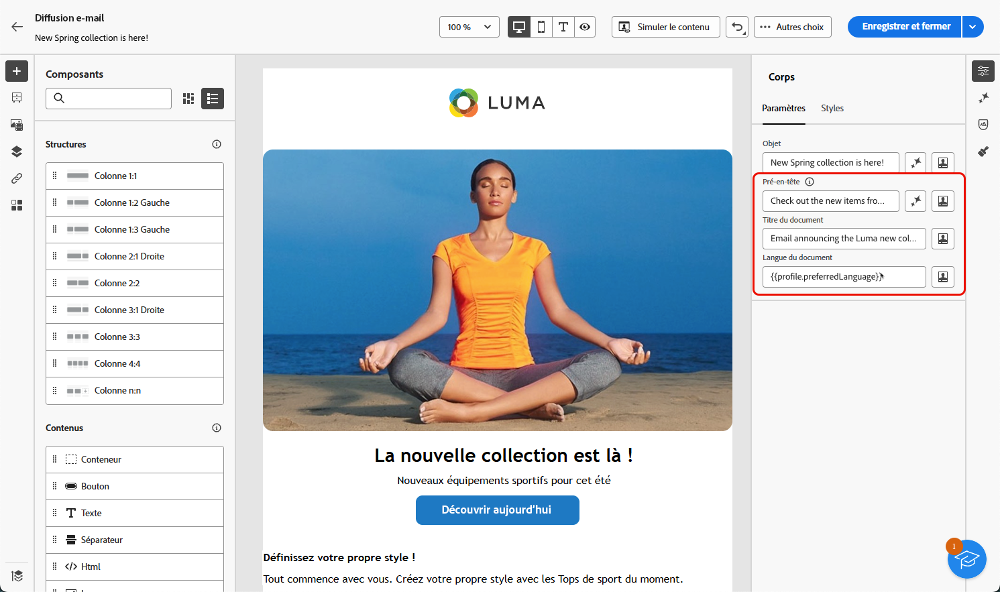
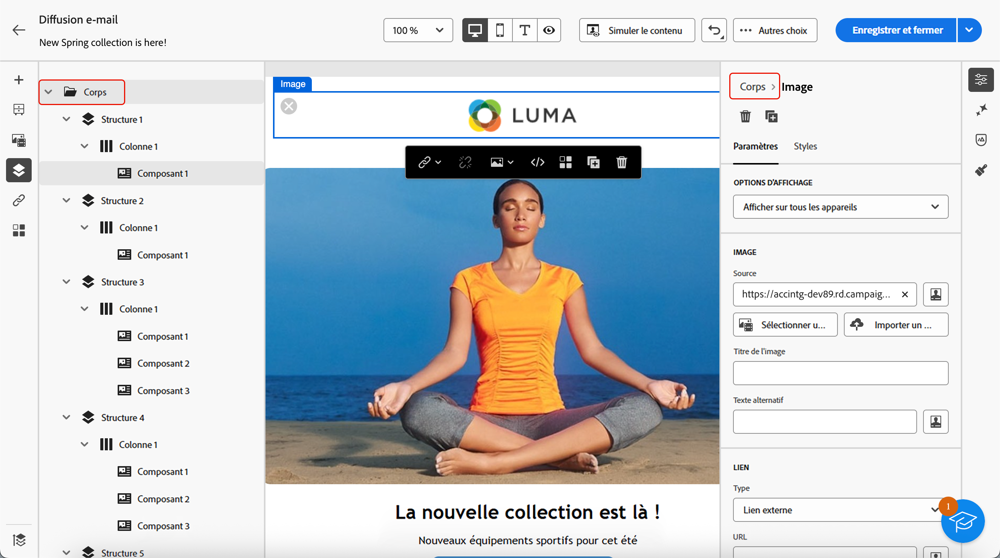
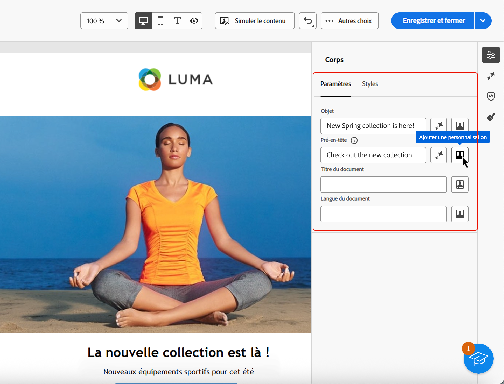

# Ajout de métadonnées au contenu de votre e-mail {#email-metadata}

>[!CONTEXTUALHELP]
>id="ac_edition_preheader"
>title="Définir un pré-titre"
>abstract="Un pré-en-tête est un bref résumé qui suit l’objet d’un e-mail lorsque vous le visualisez depuis votre client de messagerie. Dans de nombreux cas, il fournit un bref résumé de l’e-mail et contient généralement une seule phrase."

Lors de la conception de vos e-mails, vous pouvez définir des méta-attributs supplémentaires pour votre contenu afin d’en améliorer la lisibilité et l’accessibilité. Le [!DNL Journey Optimizer] [Email Designer](get-started-email-designer.md) permet de définir les éléments suivants :

* **[!UICONTROL Pré-titre]** : un pré-titre est un texte de résumé court qui suit l’objet d’un e-mail lorsque vous le visualisez à partir de votre client de messagerie. Dans de nombreux cas, il fournit un bref résumé de l’e-mail et contient généralement une seule phrase.

  >[!NOTE]
  >
  >Les pré-titres ne sont pas pris en charge par tous les clients de messagerie. Le pré-titre ne s’affiche pas s’il n’est pas pris en charge.

* **[!UICONTROL Titre du document]** : ce champ, qui correspond à l’élément `<title>`, fournit des informations descriptives sur le contenu de votre e-mail, généralement affichées sous la forme d’une info-bulle lorsque vous pointez dessus. Il peut aider les utilisateurs en situation de handicap en fournissant un contexte supplémentaire et peut contribuer à une meilleure compréhension de votre contenu par les moteurs de recherche.

* **[!UICONTROL Langue du document]** : pour garantir l’accessibilité, vous pouvez spécifier la langue que les lecteurs d’écran utiliseront pour convertir le texte et les images en parole ou en braille (pour les personnes ayant une déficience visuelle ou des difficultés d’apprentissage). Ce paramètre correspond à l’attribut `lang` dans l’élément `<html>`.

Pour configurer ces paramètres, procédez comme suit.

1. À partir du [Designer d’e-mail](create-email-content.md), ajoutez au moins un **[!UICONTROL composant de structure]** pour commencer à concevoir votre e-mail.

1. Cliquez sur **[!UICONTROL Corps]** dans l’**[!UICONTROL Arborescence de navigation]** à gauche ou en haut du volet de droite.

   

1. Dans l’onglet **[!UICONTROL Paramètres]**, saisissez du texte dans les champs **[!UICONTROL Pré-titre]**, **[!UICONTROL Titre du document]** et/ou **[!UICONTROL Langue du document]**.

1. Vous pouvez également cliquer sur l’icône de personnalisation en regard de chaque champ pour personnaliser votre contenu à partir des attributs de profil, des audiences, des attributs contextuels, etc. [En savoir plus sur la personnalisation](../personalization/gs-personalization.md)

   

1. Cliquez sur **[!UICONTROL Enregistrer]** pour confirmer vos modifications.