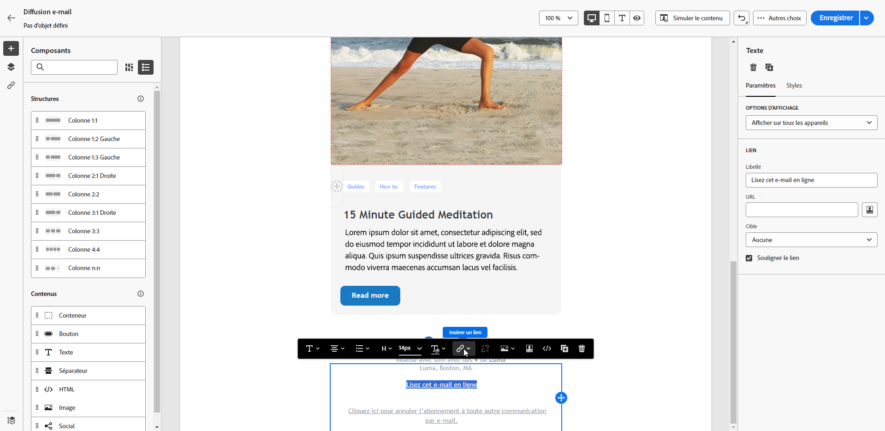
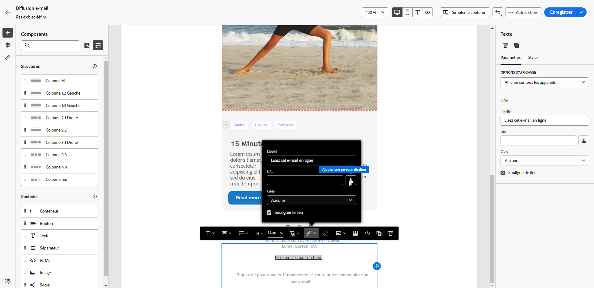
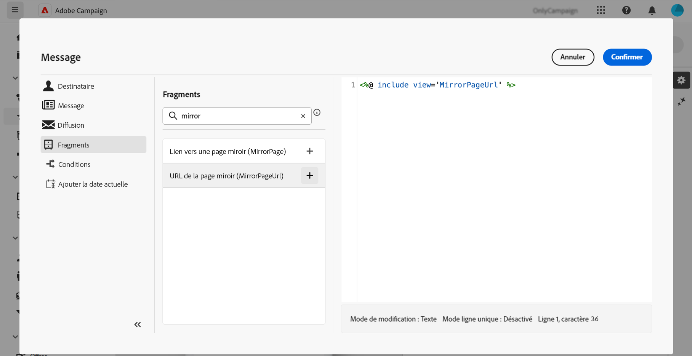

# Ajouter un lien vers la page miroir{#mirror-page}

La page miroir est une version en ligne de votre e-mail.

La plupart des clients de messagerie affichent les images sans problème. Toutefois, certains préréglages peuvent empêcher le rendu des images, notamment pour des raisons de sécurité. Les utilisateurs et utilisatrices consultent la page miroir d’un e-mail en cas de problème d’affichage des images dans leur boîte de réception ou lorsque ces dernières sont endommagées. Il est également recommandé de fournir une version en ligne pour des raisons d’accessibilité ou pour faciliter le partage sur les réseaux sociaux.

La page miroir générée par Adobe Campaign contient toutes les données de personnalisation.

{width="600" align="left"}

## Ajouter un lien vers la page miroir{#link-to-mirror-page}

Il est recommandé d’insérer un lien vers la page miroir. Vous pouvez nommer le lien « Afficher cet e-mail dans votre navigateur » ou « Lire ceci en ligne », par exemple. Il se trouve généralement dans l’en-tête ou le pied de page de l’e-mail.

Dans Adobe Campaign, vous pouvez insérer un lien vers la page miroir dans le contenu de l’e-mail à l’aide du **bloc de personnalisation** dédié. Le bloc de personnalisation intégré **Lien vers la page miroir** insère le code suivant dans le contenu de votre e-mail : `<%@ include view='MirrorPage' %>`.

Pour ajouter un lien vers une page miroir dans l’e-mail :

1. Sélectionnez un élément et cliquez sur **[!UICONTROL Insérer un lien]** dans la barre d’outils contextuelle.

   {zoomable=&quot;yes&quot;}

1. Sélectionnez l’icône **[!UICONTROL Ajouter une personnalisation]** pour accéder au menu de personnalisation.

   {zoomable=&quot;yes&quot;}

1. Dans le menu **[!UICONTROL Bloc de contenu]**, sélectionnez **[!UICONTROL URL de la page miroir]** et cliquez sur **[!UICONTROL Ajouter]**.

   {zoomable=&quot;yes&quot;}

   Pour plus d’informations sur l’insertion de blocs de contenu personnalisés, consultez [cette section](../personalization/personalize.md#personalize-emails).

La page miroir est automatiquement créée.

>[!IMPORTANT]
>
>Les liens de pages miroir sont générés automatiquement et ne peuvent pas être modifiés. Ils contiennent toutes les données personnalisées chiffrées requises pour générer l’e-mail original. Par conséquent, l’utilisation d’attributs personnalisés avec des valeurs élevées peut générer de longues URL de pages miroir. Cela peut empêcher le lien de fonctionner dans les navigateurs web qui imposent des limites de longueur d’URL.

Une fois l’e-mail envoyé, lorsque les destinataires cliquent sur le lien de la page miroir, le contenu de l’e-mail s’affiche dans leur navigateur web par défaut.

>[!NOTE]
>
>Dans le BAT envoyé aux profils de test, le lien vers la page miroir est inactif. Il n’est activé que dans les messages finaux.

Par défaut, la période de conservation d’une page miroir est de 60 jours. Une fois ce délai écoulé, la page miroir n’est plus disponible.

## Génération de la page miroir{#mirror-page-generation}

Par défaut, la page miroir est automatiquement générée par Adobe Campaign si le contenu de l’e-mail n’est pas vide et s’il comporte un lien vers la page miroir (ou lien miroir).

Vous pouvez choisir le mode de génération de la page miroir de l’e-mail. Plusieurs options s’offrent à vous dans les propriétés de la diffusion. [En savoir plus](../advanced-settings/delivery-settings.md#mirror)
