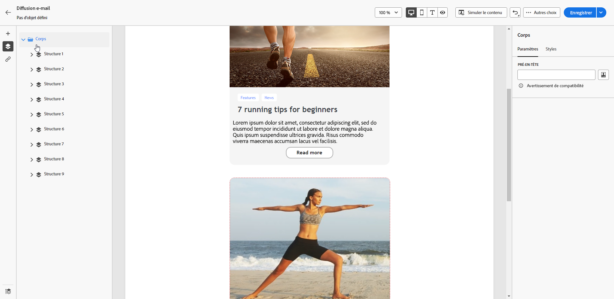
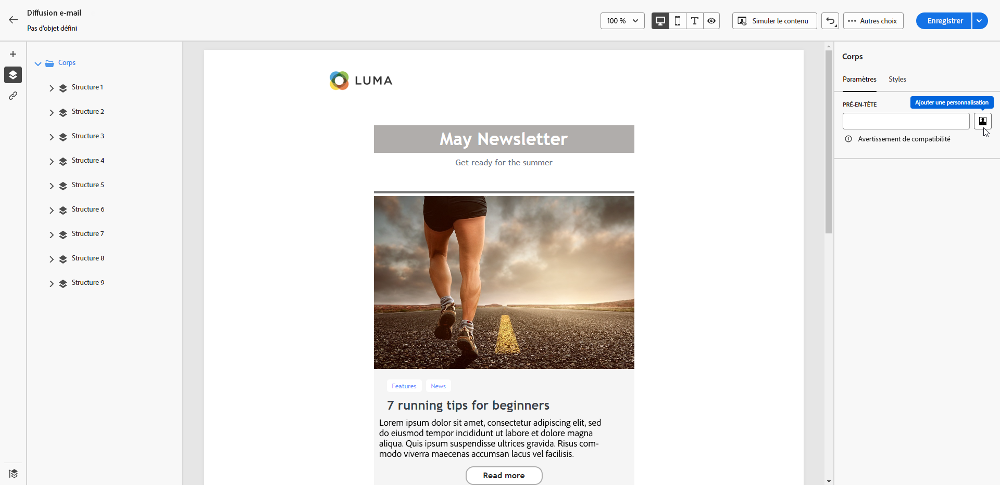
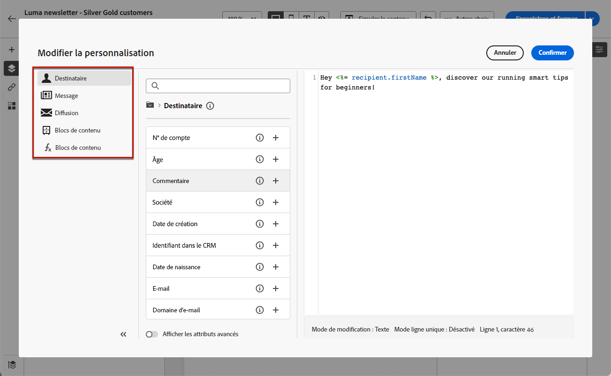

# Ajouter un pré-en-tête à un e-mail {#preheader}

>[!CONTEXTUALHELP]
>id="ac_edition_preheader"
>title="Ajouter un pré-en-tête"
>abstract="Un pré-en-tête est un bref résumé qui suit l’objet d’un e-mail lorsque vous le visualisez depuis votre client de messagerie. Dans de nombreux cas, il fournit un bref résumé de l’e-mail et contient généralement une seule phrase."

Un pré-titre est un texte court qui suit l’objet d’un e-mail lorsque vous le visualisez depuis n’importe quel client de messagerie principal.

Dans de nombreux cas, il fournit un bref résumé du contenu et contient généralement une seule phrase.

>[!NOTE]
>
>Les pré-titres ne sont pas pris en charge par tous les clients de messagerie. Le pré-titre ne s’affiche pas s’il n’est pas pris en charge.

Pour définir le pré-titre d’un e-mail, procédez comme suit :

1. À partir du [concepteur d’e-mail](create-email-content.md), ajoutez au moins un composant de **[!UICONTROL Structure]** pour commencer à concevoir votre e-mail.

1. Cliquez sur l’icône **[!UICONTROL Arborescence de navigation]** dans le volet de gauche, puis sélectionnez **[!UICONTROL Corps]**.

   

1. Sous l’onglet **[!UICONTROL Paramètres]**, saisissez le texte de votre pré-titre.

1. Pour le personnaliser davantage, cliquez sur l’icône **[!UICONTROL Ajouter une personnalisation]** à gauche du champ **[!UICONTROL Pré-titre]**.

   

1. Dans la fenêtre **[!UICONTROL Modifier la personnalisation]**, vous pouvez ajouter des [champs de personnalisation](../personalization/personalize.md), des [blocs de contenu](../personalization/content-blocks.md) et du [contenu conditionnel](../personalization/conditions.md) à l’aide des entrées dédiées situées sur la gauche.

   

1. Cliquez sur **[!UICONTROL Confirmer]**.

Le pré-titre de votre e-mail est à présent configuré.
