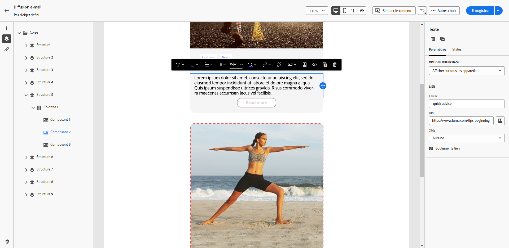
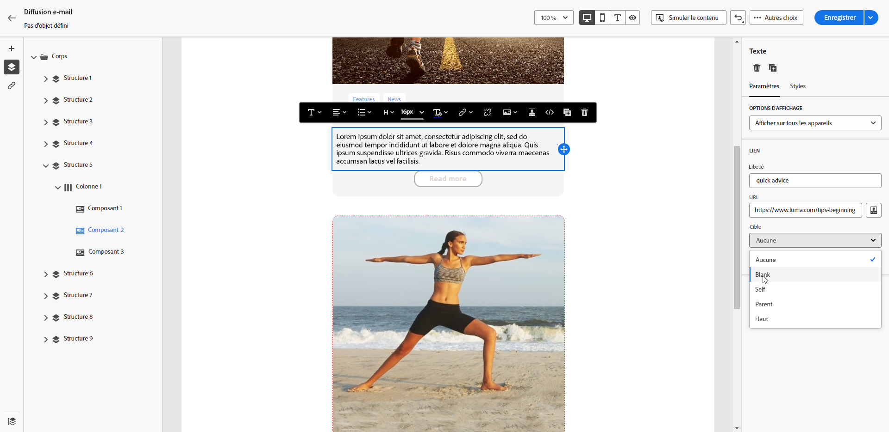
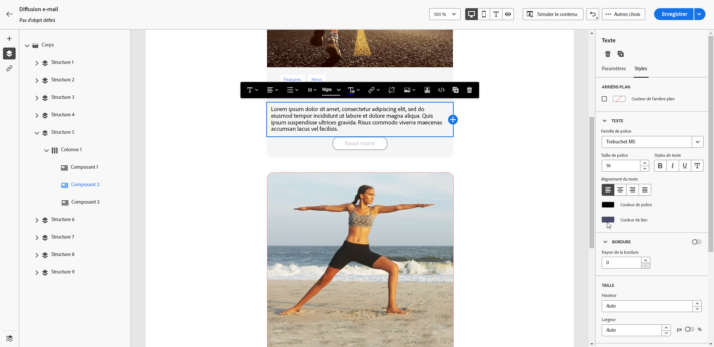

# Définir un style pour les liens {#styling-links}

Vous pouvez souligner un lien et sélectionner sa couleur et sa cible dans le concepteur d’e-mail.

1. Dans un composant **[!UICONTROL Texte]** contenant un lien, sélectionnez ce dernier.

1. Dans l’onglet **[!UICONTROL Paramètres]**, cochez la case **[!UICONTROL Souligner le lien]** pour souligner le libellé.

   {zoomable="yes"}

1. Choisissez la manière de rediriger votre audience avec la liste déroulante **[!UICONTROL Cible]** :

   * **[!UICONTROL Aucune]** : ouvre le lien dans le même cadre que celui sur lequel l’utilisateur ou l’utilisatrice a cliqué (par défaut).
   * **[!UICONTROL Vide]** : ouvre le lien dans une nouvelle fenêtre ou un nouvel onglet.
   * **[!UICONTROL Self]** : ouvre le lien dans le même cadre que celui sur lequel l’utilisateur a cliqué.
   * **[!UICONTROL Parent]** : ouvre le lien dans le cadre parent.
   * **[!UICONTROL Haut]** : ouvre le lien dans le corps complet de la fenêtre.

   {zoomable="yes"}

1. Pour modifier la couleur de votre lien, cliquez sur **[!UICONTROL Couleur du lien]** dans l’onglet **[!UICONTROL Styles]**.

   {zoomable="yes"}

1. Enregistrez vos modifications.