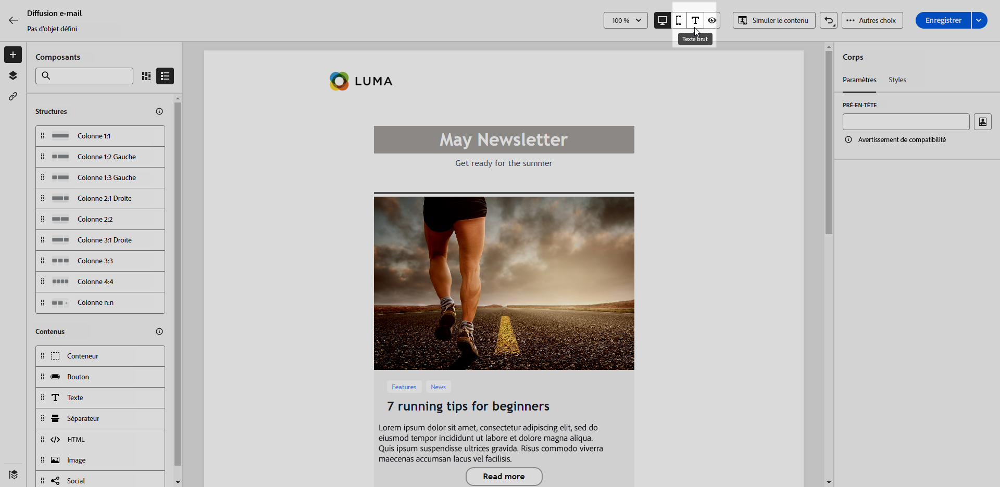

# Créer la version texte d’un e-mail {#text-version-email}

Nous vous recommandons de créer une version texte du corps de votre e-mail, qui est utilisée lorsque le contenu HTML ne peut pas être affiché.

Par défaut, le concepteur d’e-mail crée une version **[!UICONTROL Texte brut]** de votre e-mail, y compris les champs de personnalisation. Cette version est automatiquement générée et synchronisée avec la version HTML de votre contenu.

Si vous préférez utiliser un contenu différent pour la version en texte brut, procédez comme suit :

1. Dans votre e-mail, sélectionnez l’onglet **[!UICONTROL Texte brut]**.

   {zoomable="yes"}

1. Utilisez le bouton (bascule) **[!UICONTROL Synchroniser avec le code HTML]** pour désactiver la synchronisation.

   {zoomable="yes"}

1. Cliquez sur la coche pour confirmer votre choix.

   {zoomable="yes"}

1. Modifiez la version en texte brut selon vos besoins.

>[!CAUTION]
>
>* Les modifications effectuées dans la vue **[!UICONTROL Texte brut]** ne sont pas reflétées dans la vue HTML.
>
>* Si vous réactivez l’option **[!UICONTROL Synchroniser avec le code HTML]** après la mise à jour de votre contenu en texte brut, vos modifications sont perdues et remplacées par du contenu texte généré à partir de la version HTML.