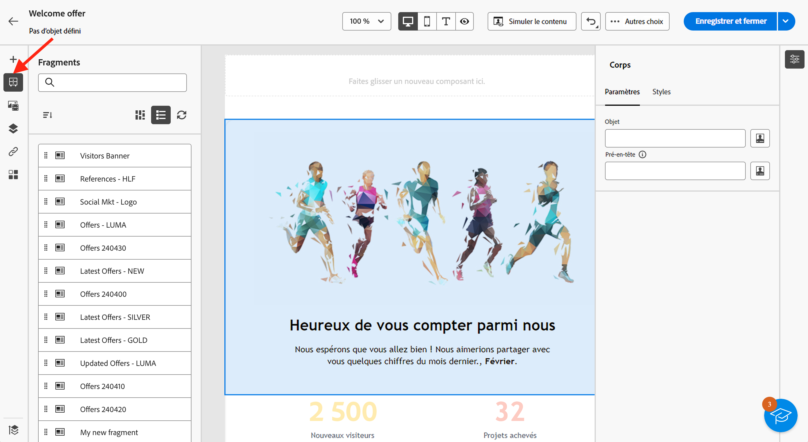
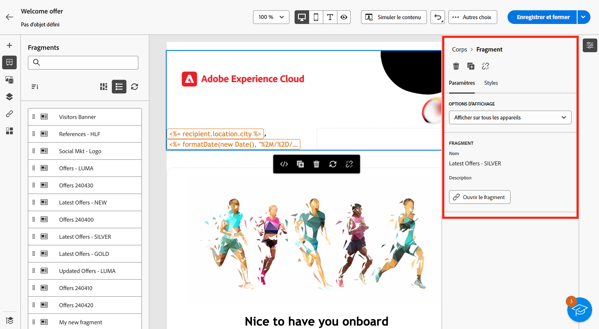
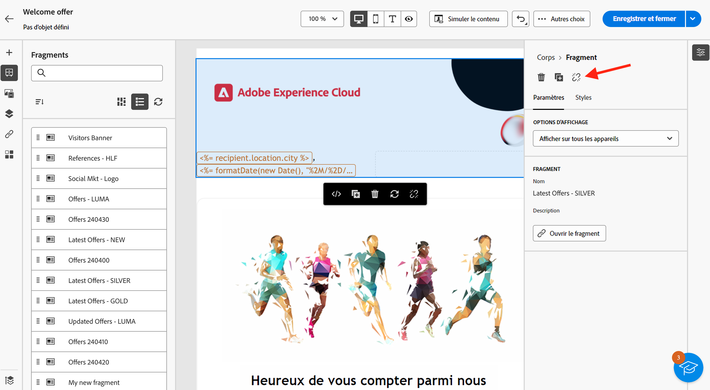

# Ajout de fragments visuels à vos emails {#use-visual-fragments}

Vous pouvez utiliser un fragment visuel dans une [diffusion email](get-started-email-designer.md)ou dans un [modèle de contenu](use-email-templates.md).

>[!NOTE]
>
>Découvrez comment créer et gérer des fragments dans [cette section](fragments.md).

## Utilisation d’un fragment {#use-fragment}

Pour insérer un fragment dans le contenu d&#39;un email, procédez comme suit :

1. Ouvrez un contenu d’email ou de modèle à l’aide de la méthode [Concepteur d&#39;email](get-started-email-designer.md).

1. Sélectionnez la variable **[!UICONTROL Fragments]** dans le rail de gauche.

   

1. La liste de tous les fragments visuels créés sur l’environnement de test actuel s’affiche. Vous pouvez ainsi effectuer les actions suivantes :

   * Recherchez un fragment spécifique en commençant à saisir son libellé.
   * Triez les fragments par ordre croissant ou décroissant.
   * Modifiez l’affichage des fragments (mode Carte ou Liste).

   >[!NOTE]
   >
   >Les fragments sont triés par date de création : les fragments visuels récemment ajoutés sont affichés en premier dans la liste.

   Si des fragments ont été modifiés ou ajoutés pendant que vous modifiez votre contenu, cliquez sur l’icône **Actualiser** pour mettre à jour la liste avec les dernières modifications.

1. Faites glisser un fragment de la liste et déposez-le dans la zone où vous souhaitez l’insérer. Comme tout autre composant, vous pouvez déplacer le fragment dans votre contenu.

1. Sélectionnez le fragment pour afficher ses options dans le volet de droite.

   

   Dans la **[!UICONTROL Paramètres]** vous pouvez :

   * Sélectionnez les appareils sur lesquels vous souhaitez que le fragment s’affiche.
   * Ouvrez le fragment dans un nouvel onglet pour le modifier, si nécessaire. [En savoir plus](../email/fragments.md#edit-fragments)

   Vous pouvez personnaliser davantage votre fragment à l’aide du **[!UICONTROL Styles]** .

1. Si nécessaire, vous pouvez rompre l’héritage avec le fragment d’origine. [En savoir plus](#break-inheritance)
Vous pouvez également supprimer le fragment de votre contenu ou le dupliquer. Ces actions peuvent être effectuées directement à partir du menu contextuel qui s’affiche au-dessus du fragment.

1. Ajoutez autant de fragments que vous le souhaitez et **[!UICONTROL Enregistrer]** vos modifications.

## Rompre l&#39;héritage {#break-inheritance}

Lorsque vous modifiez un fragment visuel, les modifications sont synchronisées. Elles sont automatiquement propagées à toutes les diffusions email et à tous les modèles de contenu contenant ce fragment.

Lorsqu&#39;ils sont ajoutés à un email ou à un modèle de contenu, les fragments sont synchronisés par défaut.

Vous pouvez toutefois rompre l’héritage du fragment d’origine. Dans ce cas, le contenu du fragment est copié dans la conception actuelle et les modifications ne sont plus synchronisées.

Pour rompre l’héritage, procédez comme suit :

1. Sélectionnez le fragment.

1. Cliquez sur l’icône de déverrouillage dans la barre d’outils contextuelle.

   

1. Ce fragment devient un élément autonome qui n’est plus lié au fragment d’origine. Modifiez-le comme tout autre composant de contenu de votre contenu. [En savoir plus](content-components.md)
