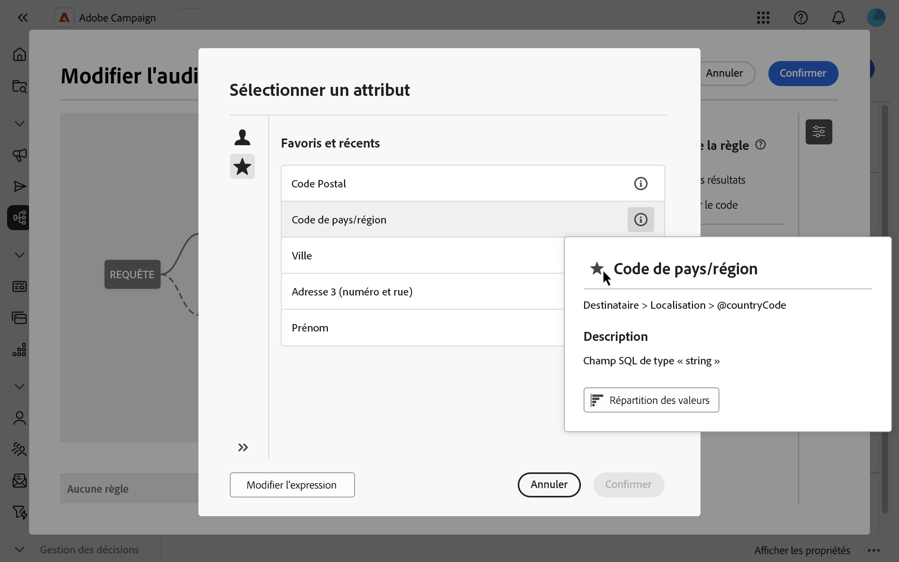

# Sélectionner des attributs et les ajouter aux favoris {#folders}

L’interface utilisateur web de Campaign permet aux utilisateurs de sélectionner des attributs dans la base de données à différents emplacements, en fonction de l’action effectuée. Par exemple, des attributs peuvent être sélectionnés lors de la définition des colonnes de sortie pour une diffusion courrier ou un fichier à extraire. De même, les attributs peuvent être sélectionnés lors de l’utilisation du requêteur pour créer des règles, des filtres ou créer des audiences.

Pour réutiliser rapidement les attributs fréquemment utilisés, ajoutez-les aux favoris. Cela permet de s’assurer qu’ils sont facilement accessibles pour les tâches futures. Outre les favoris, les utilisateurs peuvent afficher et utiliser les attributs sélectionnés le plus récemment.

L’interface propose également un outil de distribution des valeurs, qui vous permet de visualiser la distribution des valeurs d’un attribut dans un tableau. Cet outil permet d’identifier la plage et la fréquence des valeurs, assurant ainsi la cohérence des données lors de la création de requêtes ou d’expressions.

## Attributs favoris et récents {#favorites}

>[!CONTEXTUALHELP]
>id="acw_attribute_picker_favorites_recents"
>title="Favoris et récents"
>abstract="Le menu **[!UICONTROL Favoris et récents]** du sélecteur d’attributs fournit une vue organisée des attributs que vous avez ajoutés aux favoris, ainsi qu’une liste des attributs récemment utilisés. Les attributs favoris apparaissent en premier, suivis des attributs récemment utilisés, ce qui facilite la localisation des attributs dont vous avez besoin."

Le menu **[!UICONTROL Favoris et récents]** du sélecteur d’attributs fournit une vue organisée des attributs ajoutés aux favoris, ainsi qu’une liste des attributs récemment utilisés. Les attributs favoris apparaissent en premier, suivis des attributs récemment utilisés, ce qui facilite la localisation des attributs requis.

Pour ajouter un attribut aux favoris, pointez sur son bouton d’informations et sélectionnez l’icône en forme d’étoile. L’attribut est ensuite automatiquement ajouté à la liste des favoris. Pour supprimer un attribut des favoris, sélectionnez à nouveau l’icône en forme d’étoile.

Les utilisateurs peuvent ajouter jusqu’à 20 attributs aux favoris. Les attributs favoris et récents sont associés à chaque utilisateur au sein d’une organisation, ce qui garantit l’accessibilité sur différents ordinateurs et offre une expérience transparente sur tous les appareils.

## Identifier la répartition des valeurs dans un tableau {#distribution}

Le bouton **Répartition des valeurs**, disponible dans le volet d’informations d’un attribut, permet aux utilisateurs d’analyser la répartition des valeurs de cet attribut dans le tableau. Cette fonctionnalité est utile pour comprendre les valeurs disponibles, leur nombre et leurs pourcentages. Cela permet également d’éviter des problèmes tels que l’incohérence des majuscules ou de l’orthographe lors de la création de requêtes ou d’expressions.

Pour les attributs comportant un grand nombre de valeurs, l’outil affiche uniquement les vingt premières valeurs. Dans ce cas, une notification **[!UICONTROL Charge partielle]** apparaît pour indiquer cette limitation. Appliquez des filtres avancés pour affiner les résultats affichés et vous concentrer sur des valeurs ou des sous-ensembles de données spécifiques. Des instructions détaillées sur l’utilisation des filtres sont disponibles [ici](../get-started/work-with-folders.md#filter-the-values).

Pour plus d’informations sur l’utilisation de l’outil de distribution des valeurs dans différents contextes, consultez les sections suivantes :

* [Répartition des valeurs dans un dossier](../get-started/work-with-folders.md##distribution-values-folder)
* [Répartition des valeurs dans une requête](../query/build-query.md#distribution-values-query)