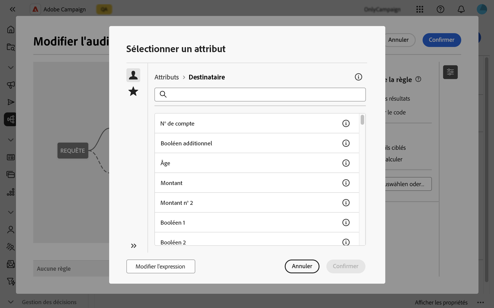
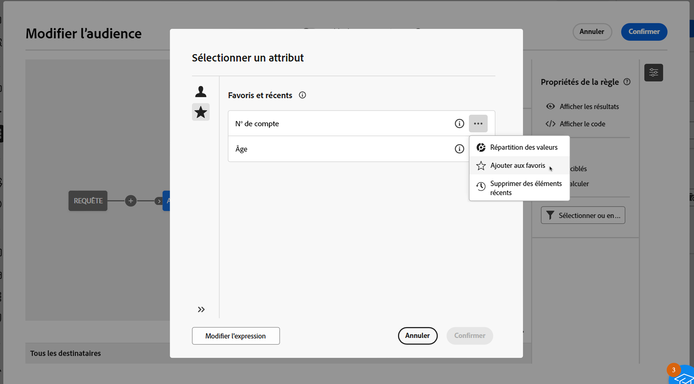
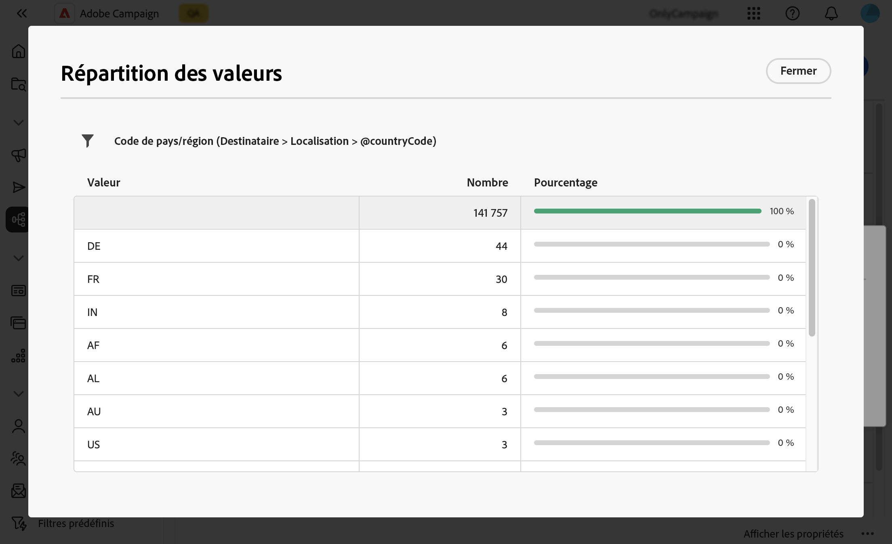

# Sélectionner des attributs et les ajouter aux favoris {#folders}

L’interface d’utilisation de Campaign Web permet de sélectionner des attributs de la base de données à différents emplacements, selon l’action que vous souhaitez effectuer. Par exemple, vous pouvez sélectionner des attributs lors de la définition des colonnes de sortie pour une diffusion par courrier ou un fichier à extraire. De même, vous pouvez sélectionner des attributs lors de l’utilisation du concepteur de requête pour créer des règles, des filtres ou des audiences.

Pour réutiliser rapidement des attributs fréquemment utilisés, vous pouvez désormais les ajouter aux favoris. Cela permet de s’assurer qu’ils sont facilement accessibles pour les tâches futures. Outre les favoris, vous pouvez également afficher et utiliser les derniers attributs sélectionnés.

L’interface propose également un outil de répartition des valeurs, qui vous permet de visualiser la répartition des valeurs d’un attribut dans un tableau. Cet outil vous aide à identifier la plage et la fréquence des valeurs, assurant ainsi la cohérence des données lors de la création de requêtes ou d’expressions.

## Attributs favoris et récents {#favorites}

>[!CONTEXTUALHELP]
>id="acw_attribute_picker_favorites_recents"
>title="Favoris et récents"
>abstract="Le menu **[!UICONTROL Favoris et récents]** du sélecteur d’attributs fournit une vue organisée des attributs que vous avez ajoutés aux favoris, ainsi qu’une liste des attributs récemment utilisés. Les attributs favoris apparaissent en premier, suivis des attributs récemment utilisés, ce qui facilite la localisation des attributs dont vous avez besoin."

Le menu **[!UICONTROL Favoris et récents]** du sélecteur d’attributs fournit une vue organisée des attributs que vous avez ajoutés aux favoris et de ceux que vous avez utilisés récemment. Les attributs favoris apparaissent en premier, suivis des attributs utilisés récemment, ce qui vous aide à les localiser rapidement.

Pour ajouter un attribut aux favoris, cliquez sur le bouton Développer et sélectionnez **[!UICONTROL Ajouter aux favoris]**. L’attribut est alors automatiquement ajouté à votre liste de favoris. Pour supprimer un attribut des favoris, sélectionnez à nouveau l’icône en forme d’étoile.

Vous pouvez ajouter jusqu’à 20 attributs aux favoris. Les attributs favoris et récents sont associés à chaque utilisateur et utilisatrice au sein d’une organisation, ce qui garantit l’accessibilité sur différents ordinateurs et offre une expérience fluide sur tous les appareils.

## Identifier la répartition des valeurs dans un tableau {#distribution}

Le bouton **Répartition des valeurs**, disponible en cliquant sur le bouton Développer en regard d’un attribut, vous permet d’analyser la répartition des valeurs de cet attribut dans le tableau. Cette fonctionnalité est particulièrement utile pour comprendre les valeurs disponibles, leur nombre et leur pourcentage. Cela permet également d’éviter des problèmes, par exemple en matière de majuscules ou d’orthographe, lors de la création de requêtes ou d’expressions.

Pour les attributs comportant un grand nombre de valeurs, l’outil affiche uniquement les vingt premières valeurs. Une notification **[!UICONTROL Chargement partiel]** s’affiche pour vous informer de cette limite. Vous pouvez appliquer des filtres avancés pour affiner les résultats affichés et travailler sur des valeurs ou des sous-ensembles de données spécifiques. Vous trouverez des instructions détaillées sur l’utilisation des filtres [ici](../get-started/work-with-folders.md#filter-the-values).

Pour plus d’informations sur l’utilisation de l’outil de distribution des valeurs dans différents contextes, consultez les sections suivantes :

* [Répartition des valeurs dans un dossier](../get-started/work-with-folders.md##distribution-values-folder)
* [Répartition des valeurs dans une requête](../query/build-query.md#distribution-values-query)