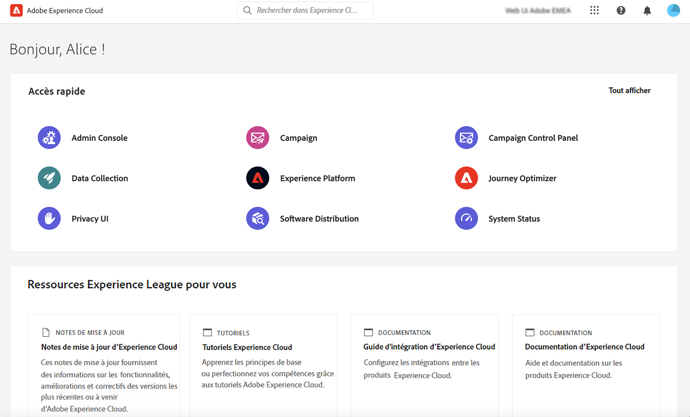
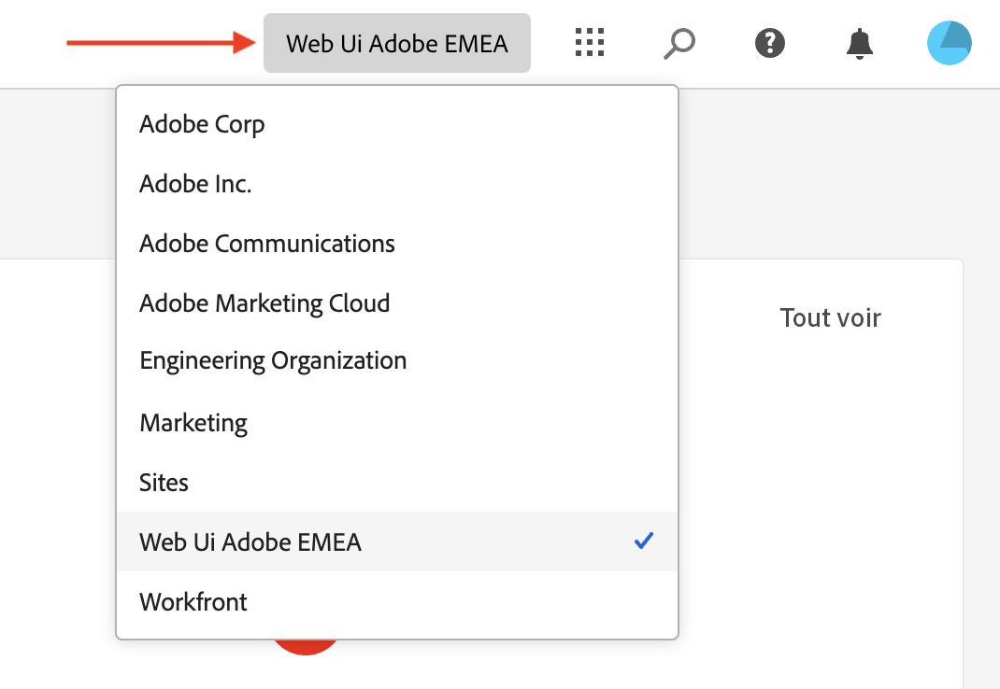
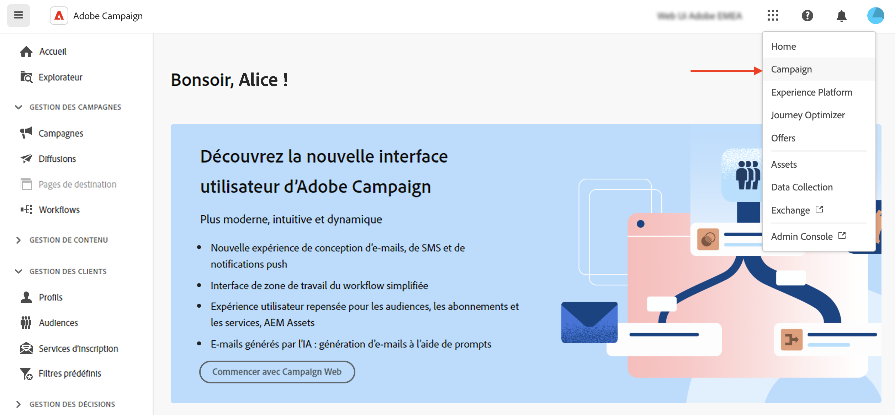
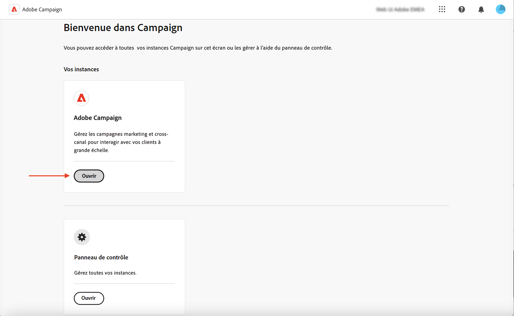

# Se connecter à Adobe Campaign {#connect-to-campaign}

Experience Cloud est la famille intégrée d’applications, de produits et de services de marketing numérique d’Adobe. Grâce à son interface intuitive, vous pouvez accéder rapidement à vos applications cloud, fonctionnalités de produit et services. Découvrez comment vous connecter à Adobe Experience Cloud et accéder à l’interface d’Adobe Campaign Web dans cette page.

## Se connecter à Adobe Experience Cloud {#sign-in-to-exc}

Vous ne pouvez utiliser que l’authentification unique (SSO) pour vous connecter à Campaign. En règle générale, les administrateurs et administratrices d’Experience Cloud accordent l’accès aux applications et services. Suivez les étapes de votre invitation par e-mail à Experience Cloud.

Pour vous connecter à Adobe Experience Cloud, les étapes de base sont les suivantes :

1. Connectez-vous à [Adobe Experience Cloud](https://experience.adobe.com/){target="_blank"}.

1. Connectez-vous à l’aide de votre Adobe ID ou de votre Enterprise ID. Apprenez-en plus sur les types d’identités chez Adobe dans [cet article](https://helpx.adobe.com/fr/enterprise/using/identity.html){target="_blank"}.

   Une fois la connexion à Experience Cloud effectuée, vous pouvez accéder rapidement à toutes vos solutions et applications.

   {zoomable=&quot;yes&quot;}

1. Vérifiez que vous vous trouvez dans la bonne organisation.

   {zoomable=&quot;yes&quot;}{width="50%" align="left"}

   Apprenez-en plus sur les organisations dans Adobe Experience Cloud dans [cet article](https://experienceleague.adobe.com/docs/core-services/interface/administration/organizations.html?lang=fr){target="_blank"}.

## Accéder à Adobe Campaign {#access-to-campaign}

Pour accéder à votre environnement Campaign, sélectionnez **Campaign** dans la section **Accès rapide** de la page d’accueil d’Adobe Experience Cloud.

Si vous disposez déjà d’une connexion à une autre solution Adobe Experience Cloud, vous pouvez également accéder à votre environnement Campaign à partir du sélecteur de solution situé en haut à droite de votre écran.

{zoomable=&quot;yes&quot;}

Si vous avez accès à plusieurs environnements, y compris le panneau de contrôle Campaign, cliquez sur le bouton **Démarrer** de l’instance appropriée.

{zoomable=&quot;yes&quot;}

Vous êtes maintenant connecté(e) à Campaign. Découvrez comment commencer à utiliser l’interface utilisateur sur [cette page](user-interface.md).

## Navigation de niveau supérieur d’Adobe Experience Cloud {#top-bar}

La barre supérieure de l’interface vous permet d’effectuer les actions suivantes :

* partager des commentaires à propos de l’interface utilisateur web de Campaign ;
* basculer entre vos organisations ;
* basculer entre vos solutions et applications Adobe Experience Cloud.
* rechercher de l’aide sur [Adobe Experience League](https://experienceleague.adobe.com/docs/?lang=fr){target="_blank"} ;
* vérifier vos notifications de produit ;
* modifier votre profil Adobe et gérer les paramètres, par exemple [mettre à jour votre langue préférée](#language-pref) ou [passer au thème clair/sombre](#dark-theme).

{zoomable=&quot;yes&quot;}{width="50%" align="left"}

## Navigateurs pris en charge {#browsers}

Adobe Campaign Web est conçu pour fonctionner de manière optimale dans la dernière version de Google Chrome, Safari et Microsoft Edge. Vous pouvez rencontrer des problèmes lors de l’utilisation de certaines fonctionnalités sur des versions plus anciennes ou d’autres navigateurs.

## Préférences de langue {#language-pref}

Adobe Campaign Web est actuellement disponible dans les langues suivantes :

* Anglais (États-Unis) - EN-US
* Français - FR
* Allemand - DE
* Italien - IT
* Espagnol - ES
* Portugais (Brésil) - PTBR
* Japonais - JP
* Coréen - KR
* Chinois simplifié - CHS
* Chinois traditionnel - CHT

La langue par défaut pour Campaign Web est déterminée par la langue préférée spécifiée dans votre profil utilisateur. Elle n’est pas liée à la langue de votre serveur Campaign et de votre console cliente.

Pour changer de langue :

1. Cliquez sur l’icône de votre profil, en haut à droite, puis sélectionnez **Préférences**.
1. Cliquez ensuite sur le lien de la langue affichée sous votre adresse e-mail.
1. Sélectionnez la langue de votre choix et cliquez sur **Enregistrer**. Vous pouvez sélectionner une seconde langue si le composant que vous utilisez n’est pas localisé dans votre première langue.

>[!CAUTION]
>
>Si vous prévoyez d’utiliser la fonctionnalité d’[Aide contextuelle optimisée par l’IA](using-ai.md), vous devez définir votre langue préférée sur l’anglais. Les autres langues ne sont pas prises en charge.
>

## Thèmes sombre et clair {#dark-theme}

Adobe Campaign est disponible dans les thèmes clair et sombre. Par défaut, l’interface utilisateur est activée avec le thème clair. Pour passer au thème sombre, cliquez sur l’icône de votre profil, puis utilisez la bascule **Thème sombre** pour l’activer/le désactiver.

Les paramètres de profil utilisateur et les préférences de compte sont détaillés dans [cette section](https://experienceleague.adobe.com/docs/core-services/interface/experience-cloud.html?lang=fr#preferences){target="_blank"}.

Apprenez-en plus sur les composants de l’interface centrale Experience Cloud dans [cette documentation](https://experienceleague.adobe.com/docs/core-services/interface/experience-cloud.html?lang=fr){target="_blank"}.
