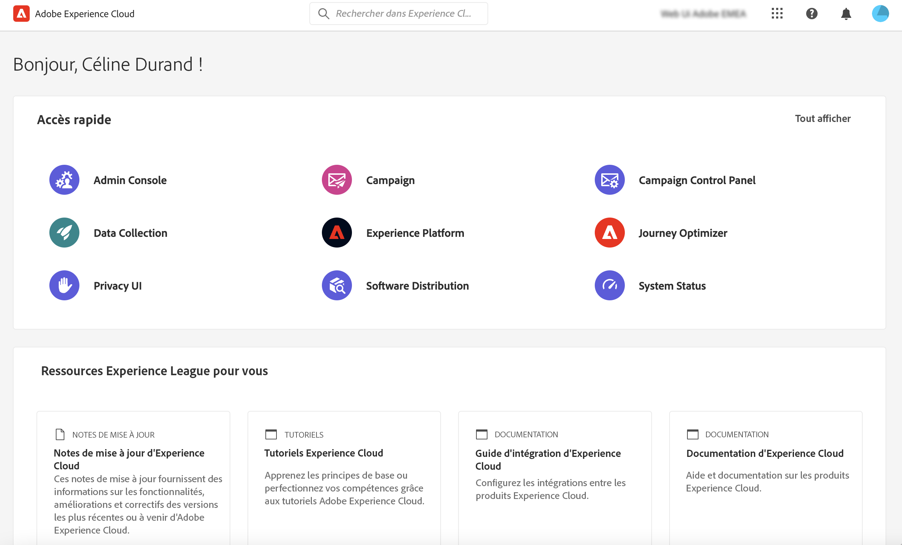

# Se connecter à Adobe Campaign {#connect-to-campaign}

Experience Cloud est la famille intégrée d’applications, de produits et de services de marketing numérique d’Adobe. Grâce à son interface intuitive, vous pouvez accéder rapidement à vos applications cloud, fonctionnalités de produit et services. Découvrez comment vous connecter à Adobe Experience Cloud et accéder à l’interface d’Adobe Campaign Web sur cette page.

## Se connecter à Adobe Experience Cloud {#sign-in-to-exc}

Vous ne pouvez utiliser que l’authentification unique (SSO) pour vous connecter à Campaign. En règle générale, les administrateurs et administratrices d’Experience Cloud accordent l’accès aux applications et services. Suivez les étapes de votre invitation par e-mail à Experience Cloud.

Pour vous connecter à Adobe Experience Cloud, procédez comme suit :

1. Accédez à [Adobe Experience Cloud](https://experience.adobe.com/){target="_blank"}.

1. Connectez-vous à l’aide de votre Adobe ID ou de votre Enterprise ID. Pour en savoir plus sur les types d’identités chez Adobe, consultez [cet article](https://helpx.adobe.com/fr/enterprise/using/identity.html){target="_blank"}.

   Une fois la connexion à Experience Cloud effectuée, vous pouvez accéder rapidement à toutes vos solutions et applications.

   {zoomable="yes"}

1. Vérifiez que vous vous trouvez dans la bonne organisation.

   {zoomable="yes"}{width="50%" align="left"}

   Pour en savoir plus sur les organisations dans Adobe Experience Cloud, consultez [cet article](https://experienceleague.adobe.com/docs/core-services/interface/administration/organizations.html?lang=fr){target="_blank"}.

## Accéder à Adobe Campaign {#access-to-campaign}

Pour accéder à votre environnement Campaign, sélectionnez **Campaign** dans la section **Accès rapide** de la page d’accueil d’Adobe Experience Cloud.

Si vous disposez déjà d’une connexion à une autre solution Adobe Experience Cloud, vous pouvez également accéder à votre environnement Campaign à partir du sélecteur de solution situé en haut à droite de votre écran.

{zoomable="yes"}

Si vous avez accès à plusieurs environnements, y compris le panneau de contrôle Campaign, cliquez sur le bouton **Démarrer** de l’instance appropriée.

{zoomable="yes"}

Vous êtes maintenant connecté(e) à Campaign. Découvrez comment commencer à utiliser l’interface utilisateur sur [cette page](user-interface.md).

### Contrôle d’accès {#access-control}

>[!CONTEXTUALHELP]
>id="acw_explorer_permissions_create"
>title="Autorisation requise"
>abstract="Avant de pouvoir créer cet objet, votre administrateur ou administratrice doit vous accorder une autorisation."

>[!CONTEXTUALHELP]
>id="acw_audiences_read_only"
>title="Cette audience est en lecture seule."
>abstract="Vous ne disposez pas des autorisations nécessaires pour modifier cette audience. Si nécessaire, contactez votre administrateur ou administratrice, qui vous accordera l’accès."

>[!CONTEXTUALHELP]
>id="acw_subscription_services_read_only"
>title="Ce service est en lecture seule."
>abstract="Vous ne disposez pas des autorisations nécessaires pour modifier ce service. Si nécessaire, contactez votre administrateur ou administratrice, qui vous accordera l’accès."

>[!CONTEXTUALHELP]
>id="acw_recipients_readonlyprofile"
>title="Profil en lecture seule des personnes destinataires"
>abstract="Vous ne disposez pas des autorisations nécessaires pour modifier ce profil. Si nécessaire, contactez votre administrateur ou administratrice, qui vous accordera l’accès."

>[!CONTEXTUALHELP]
>id="acw_campaign_read_only"
>title="Cette campagne est en lecture seule."
>abstract="Vous ne disposez pas des autorisations nécessaires pour modifier cette campagne. Si nécessaire, contactez votre administrateur ou administratrice, qui vous accordera l’accès."

>[!CONTEXTUALHELP]
>id="acw_deliveries_read_only"
>title="Cette diffusion est en lecture seule."
>abstract="Vous ne disposez pas des autorisations nécessaires pour modifier cette diffusion. Si nécessaire, contactez votre administrateur ou administratrice, qui vous accordera l’accès."

>[!CONTEXTUALHELP]
>id="acw_wf_read_only"
>title="Ce workflow est en lecture seule."
>abstract="Vous ne disposez pas des permissions nécessaires pour modifier ce workflow. Si nécessaire, contactez votre administrateur ou administratrice, qui vous accordera l’accès."

Le contrôle d’accès permet de restreindre l’accès aux objets et données des listes principales, telles que les diffusions, les destinataires ou les workflows. Ces restrictions s’appliquent également dans l’arborescence de navigation de l’explorateur. En outre, vous avez besoin d’autorisations pour créer, supprimer, dupliquer et modifier des objets à partir de l’interface utilisateur.

Toutes les autorisations de Campaign Web sont synchronisées avec celles de la console cliente Campaign. Seuls les administrateurs ou les administratrices de Campaign peuvent définir et modifier les autorisations utilisateur.

Lorsque vous naviguez dans l’interface d’utilisation de Campaign Web, vous pouvez accéder aux données, aux objets et aux fonctionnalités selon vos autorisations. Par exemple, si vous ne disposez pas des autorisations d’accès à un dossier, vous ne pouvez pas l’afficher. Vos autorisations ont également une incidence sur la gestion des objets et des données. Sans autorisation d’écriture pour un dossier spécifique, vous ne pouvez pas créer de diffusion dans ce dossier, même si vous pouvez l’afficher dans l’interface utilisateur.

Vous pouvez apprendre à [afficher et gérer les autorisations ici](permissions.md).

## Navigation de niveau supérieur d’Adobe Experience Cloud {#top-bar}

La barre supérieure de l’interface vous permet d’effectuer les actions suivantes :

* Partager des commentaires à propos de l’interface d’utilisation de Campaign Web
* Basculer entre vos organisations
* Basculer entre vos solutions et applications Adobe Experience Cloud
* Rechercher de l’aide sur [Adobe Experience League](https://experienceleague.adobe.com/docs/?lang=fr){target="_blank"}
* Vérifier les notifications de produit
* Modifier votre profil Adobe et gérer les paramètres, par exemple [mettre à jour la langue](#language-pref) ou [passer au thème clair/sombre](#dark-theme)

{zoomable="yes"}{width="50%" align="left"}

## Navigateurs pris en charge {#browsers}

Adobe Campaign Web est conçu pour fonctionner de manière optimale dans la dernière version de Google Chrome, Safari et Microsoft Edge. Vous pouvez rencontrer des problèmes lors de l’utilisation de certaines fonctionnalités sur des versions plus anciennes ou d’autres navigateurs.

## Préférences de langue {#language-pref}

Adobe Campaign Web est actuellement disponible dans les langues suivantes :

* Anglais (États-Unis) - EN-US
* Français - FR
* Allemand - DE
* Italien - IT
* Espagnol - ES
* Portugais (Brésil) - PTBR
* Japonais - JP
* Coréen - KR
* Chinois simplifié - CHS
* Chinois traditionnel - CHT

En outre, un formatage spécifique aux paramètres régionaux (comme les dates, heures, calendriers, nombres) peut également être disponible dans différentes variantes des langues prises en charge par l’interface utilisateur :

* Anglais (Israël)
* Anglais (Royaume-Uni)
* Espagnol (Mexique)
* Espagnol (Amérique latine)
* Français (Canada)

La langue par défaut pour Campaign Web est déterminée par la langue préférée spécifiée dans votre profil utilisateur. Elle n’est pas liée à la langue de votre serveur Campaign et de votre console cliente.

Pour changer de langue :

1. Cliquez sur l’icône de votre profil, en haut à droite, puis sélectionnez **Préférences**.
1. Cliquez ensuite sur le lien de la langue sous votre adresse e-mail.
1. Sélectionnez la langue de votre choix et cliquez sur **Enregistrer**. Vous pouvez sélectionner une seconde langue si le composant que vous utilisez n’est pas localisé dans votre première langue.

## Thèmes sombre et clair {#dark-theme}

Adobe Campaign est disponible dans les thèmes clair et sombre. Par défaut, l’interface utilisateur est activée avec le thème clair. Pour passer au thème sombre, cliquez sur l’icône de votre profil, puis cliquez sur le bouton (bascule) **Thème sombre** pour l’activer ou le désactiver.

Les paramètres de profil utilisateur et les préférences de compte sont présentées dans [cette section](https://experienceleague.adobe.com/docs/core-services/interface/experience-cloud.html?lang=fr#preferences){target="_blank"}.

Pour en savoir plus sur les composants de l’interface centrale d’Experience Cloud, consultez [cette documentation](https://experienceleague.adobe.com/docs/core-services/interface/experience-cloud.html?lang=fr){target="_blank"}.