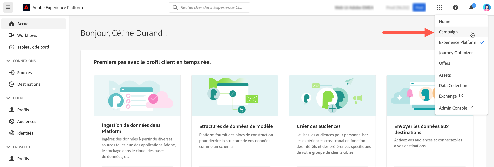
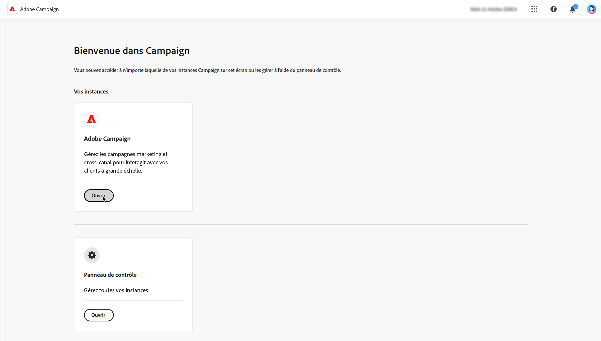

# Connexion à Adobe Campaign {#connect-to-campaign}

Experience Cloud est la famille intégrée d’applications, de produits et de services de marketing numérique d’Adobe. Grâce à son interface intuitive, vous pouvez accéder rapidement à vos applications cloud, fonctionnalités de produit et services. Découvrez comment vous connecter à Adobe Experience Cloud et accéder à l’interface web d’Adobe Campaign v8 dans cette page.

## Connexion à Adobe Experience Cloud {#sign-in-to-exc}

En règle générale, les administrateurs Experience Cloud accordent l’accès aux applications et services. Suivez les étapes de votre invitation par courrier électronique à l’Experience Cloud.

Pour vous connecter à Adobe Experience Cloud, procédez comme suit :

1. Connectez-vous à [Adobe Experience Cloud](https://experience.adobe.com/){target="_blank"}.

1. Connectez-vous à l’aide de votre Adobe ID ou de votre Enterprise ID. En savoir plus sur les types d’identités à l’Adobe de la section [cet article](https://helpx.adobe.com/fr/enterprise/using/identity.html){target="_blank"}.

   Une fois connecté à Experience Cloud, vous pouvez accéder rapidement à toutes vos solutions et applications.

   

1. Vérifiez que vous vous trouvez dans la bonne organisation.

   {width="50%" align="left"}

   En savoir plus sur les organisations dans Adobe Experience Cloud dans [cet article](https://experienceleague.adobe.com/docs/core-services/interface/administration/organizations.html?lang=fr){target="_blank"}.

## Accès à Adobe Campaign {#access-to-campaign}

Pour accéder à votre environnement Campaign, sélectionnez **Campagne** de la **Accès rapide** de la page d’accueil de Adobe Experience Cloud.

Si vous disposez déjà d’une connexion à une autre solution Adobe Experience Cloud, vous pouvez également accéder à votre environnement Campaign à partir du sélecteur de solution situé en haut à droite de votre écran.

Si vous avez accès à plusieurs environnements, y compris le Panneau de Contrôle Campaign, cliquez sur le bouton **Launch** pour la bonne instance.

Vous êtes maintenant connecté(e) à Campaign. Découvrez comment commencer à utiliser l’interface utilisateur sur [cette page](user-interface.md).

## Navigation supérieure de Adobe Experience Cloud {#top-bar}

La barre supérieure de l’interface vous permet d’effectuer les actions suivantes :

* partager vos commentaires en tant qu’utilisateur bêta ;
* basculer entre vos organisations
* basculez entre vos solutions et applications Adobe Experience Cloud

{width="50%" align="left"}

## Navigateurs pris en charge {#browsers}

Campaign v8 Web est conçu pour fonctionner de manière optimale dans la dernière version de Google Chrome, Safari et Microsoft Edge. Vous pouvez rencontrer des problèmes lors de l’utilisation de certaines fonctionnalités sur des versions plus anciennes ou sur d’autres navigateurs.

## Préférences de langue {#language-pref}

Campaign v8 Web est actuellement disponible dans les langues suivantes :

* Anglais (États-Unis) - EN-US
* Français - FR
* Allemand - DE
* Italien - IT
* Espagnol - ES
* Portugais (Brésil) - PTBR
* Japonais - JP
* Coréen - KR
* Chinois simplifié - CHS
* Chinois traditionnel - CHT

La langue par défaut pour Campaign Web est déterminée par la langue préférée spécifiée dans votre profil utilisateur. Elle n’est pas liée à la langue de votre serveur Campaign et de votre console cliente.

Pour changer de langue :

1. Cliquez sur l’icône de votre profil, en haut à droite, puis sélectionnez **Préférences**.
1. Cliquez ensuite sur le lien de la langue affichée sous votre adresse e-mail.
1. Sélectionnez la langue de votre choix et cliquez sur **Enregistrer**. Vous pouvez sélectionner une seconde langue au cas où le composant que vous utilisez n’est pas localisé dans votre première langue.

## Thème sombre {#dark-theme}

Vous pouvez passer au thème sombre à partir de l’icône de votre profil. Utilisez le bouton (bascule) **Thème sombre** pour l’activer ou le désactiver.

Les paramètres de profil utilisateur et les préférences de compte sont détaillés dans la section [cette section](https://experienceleague.adobe.com/docs/core-services/interface/experience-cloud.html#preferences){target="_blank"}.

En savoir plus sur les composants de l’interface centrale Experience Cloud dans [cette documentation](https://experienceleague.adobe.com/docs/core-services/interface/experience-cloud.html){target="_blank"}.

