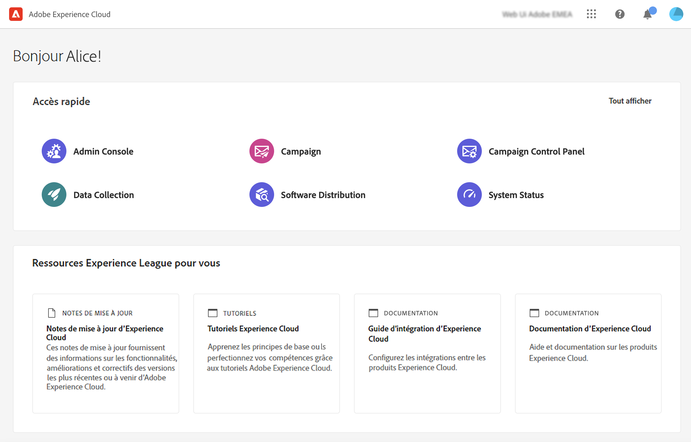

# Prise en main {#get-started}

>[!NOTE]
>
>Cette documentation est en cours d’élaboration et est fréquemment mise à jour. La version finale de ce contenu sera prête en janvier 2023.

<!--
V8 web overview
context, scope (targets cross-channel practitioners), limitations
only existing customers
-->
>[!CONTEXTUALHELP]
>id="acw_homepage_card1"
>title="Prise en main"
>abstract="Découvrez les principales fonctionnalités, l’interface utilisateur et les directives globales."

>[!NOTE]
>
>L’application web de Campaign v8 est actuellement en version Alpha. L’accès est limité à un petit groupe de clients et clientes Alpha. Notez que l’interface, les fonctionnalités et les flux d’utilisation du produit peuvent changer sans préavis.

Adobe Campaign propose une plateforme qui permet de concevoir des expériences client cross-canal ainsi quʼun environnement pour lʼorchestration visuelle de campagnes, la gestion dʼinteractions en temps réel et lʼexécution cross-canal.

Outre toutes les fonctionnalités existantes disponibles dans la console, nous avons créé une nouvelle interface utilisateur web moderne afin de simplifier la conception et la diffusion des campagnes marketing et de la rendre cohérente avec Adobe Experience Platform.

## Fonctionnalités Alpha

Actuellement, cette interface web n’est disponible que pour les utilisateurs d’Alpha disposant des fonctionnalités suivantes :

**Une expérience moderne, intuitive et unifiée**

* Accédez à la nouvelle interface et aux autres applications avec une session utilisateur unique et partagée.
* Intégration de Shell unifié : accédez aux apprentissages de la communauté, au centre d’aide, au sélecteur de solution.
<!--
No search and pulse notifications in Alpha
-->
* Découvrez la nouvelle navigation avec les menus de gauche et les dossiers.

**Créer, lancer et mesurer votre campagne par e-mail**

* Concevoir un contenu d&#39;email personnalisé avec le Concepteur d&#39;email
* Définition des audiences cibles avec le créateur de règles
* Prévisualiser, tester et envoyer vos e-mails
* Surveiller l’envoi et la mesure des résultats à l’aide de rapports intégrés

<!--
add info somewhere to remind users that
* they still have access to their console (+ link to v8 console doc)
* they keep their existing data (example: will be able to use their existing delivery templates to create deliveries)
-->

>[!NOTE]
>
>Veuillez noter que les campagnes cross-canal et les fonctionnalités de gestion des workflows seront disponibles dans le programme bêta.

## La console cliente

Si vous devez utiliser une fonctionnalité de Campaign v8 qui n’est pas disponible dans l’interface utilisateur web, vous pouvez utiliser la console cliente. Pour plus d’informations sur l’utilisation de Campaign v8, reportez-vous à la [documentation](https://experienceleague.adobe.com/docs/campaign/campaign-v8/campaign-home.html?lang=fr).

Les données sont partagées entre la console et l’interface utilisateur web. Par exemple, si vous avez créé un modèle de diffusion à partir de la console, il sera disponible dans l’interface web.

## Se connecter à Campaign

1. Connectez-vous à [Adobe Experience Cloud](http://experience.adobe.com).
1. Connectez-vous à l’aide de vos informations d’identification Adobe 
1. Dans la section **Accès rapide**, cliquez sur **Campaign**.

<!--
-> experience cloud home: "Campaign" -> home campaign v8
-> or Campaign v8 web if direct URL
-->
