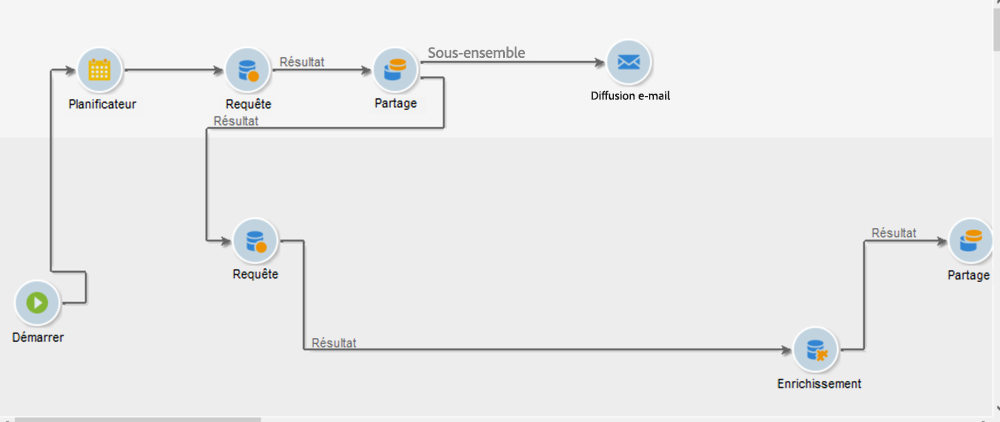

# Barrières de sécurité et limites des workflows {#guardrails-limitations}

Lorsque vous utilisez l&#39;interface utilisateur Web de Campaign avec des workflows créés ou modifiés dans la console cliente Campaign, les barrières de sécurité et limitations répertoriées ci-dessous s&#39;appliquent.

Veuillez noter que, bien que cette page identifie les points essentiels à prendre en compte lors de l’utilisation des workflows dans la console et l’interface utilisateur web, elle n’englobe pas toutes les incompatibilités potentielles entre les deux interfaces.

## Activités de workflows {#wkf-activities}

Les activités de workflow qui ne sont pas encore prises en charge sur le Web de Campaign sont en lecture seule et affichées en tant qu&#39;activités incompatibles. Vous pouvez toujours exécuter le workflow, envoyer des messages, vérifier les journaux, etc. Les activités de workflow disponibles dans le Web de Campaign et dans la console cliente sont modifiables.

Les activités de workflow qui ne sont pas encore prises en charge dans l&#39;interface utilisateur Web de Campaign sont en lecture seule et affichées en tant qu&#39;activités incompatibles. Vous pouvez toujours exécuter le workflow, envoyer des messages, vérifier les journaux, etc. Les activités de workflow disponibles dans l&#39;interface utilisateur Web de Campaign et dans la console cliente Campaign sont modifiables.

| Console | Web |
| --- | --- |
| {zoomable=&quot;yes&quot;}{width="800px" align="left" zoomable="yes"} | {zoomable=&quot;yes&quot;}{width="800px" align="left" zoomable="yes"} |

Lorsqu’une **Requête** ou **Enrichissement** activité est paramétrée avec des données additionnelles dans la console, les données d&#39;enrichissement sont prises en compte dans Campaign Web et transmises à la transition sortante, mais elles ne peuvent pas être éditées.

| Console | Web |
| --- | --- |
| {zoomable=&quot;yes&quot;}{width="800px" align="left" zoomable="yes"} | {zoomable=&quot;yes&quot;}{width="800px" align="left" zoomable="yes"} |

Dans la console, l’activité **Enrichissement** peut effectuer à la fois la réconciliation et l’enrichissement. Si vous avez défini, dans la console cliente, les paramètres de réconciliation dans la **Enrichissement** activité, elle s’affiche sous la forme d’une **Réconciliation** activité dans l&#39;interface utilisateur Web de Campaign.

| Console | Web |
| --- | --- |
| {zoomable=&quot;yes&quot;}{width="800px" align="left" zoomable="yes"} | {zoomable=&quot;yes&quot;}{width="800px" align="left" zoomable="yes"} |

## Canevas de workflow {#wkf-canvas}

Lors de la création d’un workflow dans l’interface utilisateur Web de Campaign, le canevas ne prend en charge qu’un seul point d’entrée. Cependant, si vous avez créé un workflow dans la console avec plusieurs points d&#39;entrée, vous pouvez l&#39;ouvrir et l&#39;éditer dans l&#39;interface utilisateur Web de Campaign.

| Console | Web |
| --- | --- |
| {zoomable=&quot;yes&quot;}{width="800px" align="left" zoomable="yes"} | {zoomable=&quot;yes&quot;}{width="800px" align="left" zoomable="yes"} |

Le positionnement des nœuds est actualisé à chaque fois qu’une activité est ajoutée ou supprimée. Si vous créez un workflow dans la console, modifiez-le à l&#39;aide de l&#39;interface utilisateur Web de Campaign et rouvrez-le dans la console, vous constaterez peut-être des imperfections mineures de positionnement. Cela n’a aucun impact sur les processus et les tâches du workflow.

| Workflow initial | Changement de positionnement |
| --- | --- |
| {zoomable=&quot;yes&quot;}{width="800px" align="left" zoomable="yes"} | {zoomable=&quot;yes&quot;}{width="800px" align="left" zoomable="yes"} |
