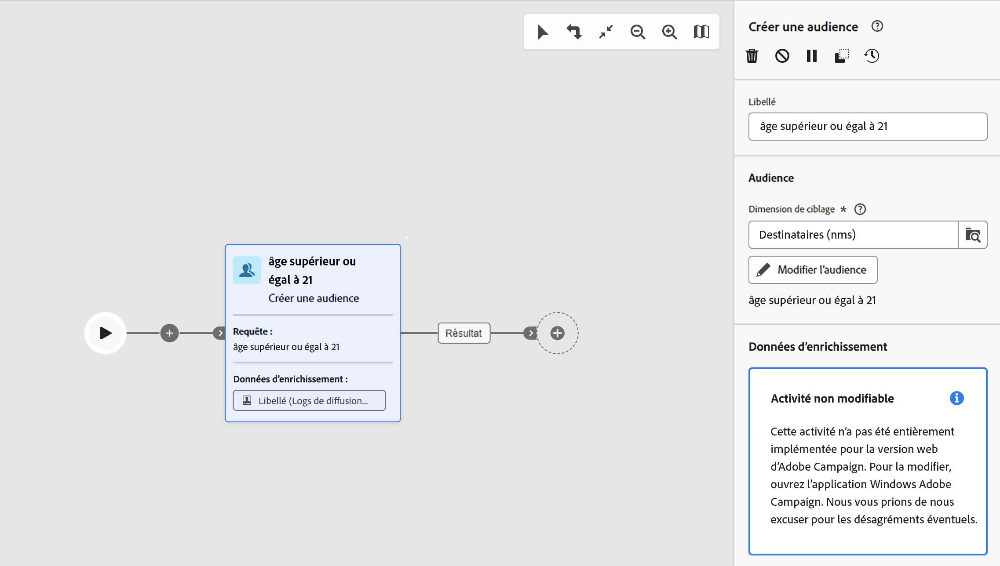

# Mécanismes de sécurisation et limitations {#guardrails-limitations}

Lorsque vous utilisez l’interface utilisateur web de Campaign avec des composants créés ou modifiés dans la console cliente Campaign, les barrières de sécurité et les limitations répertoriées ci-dessous s’appliquent.

## Workflows {#wf-guardrails-limitations}

### Activités

Les activités de workflow qui ne sont pas encore prises en charge dans l’interface utilisateur web sont en lecture seule et affichées en tant qu’activités incompatibles. Vous pouvez toujours exécuter le workflow, envoyer des messages, vérifier les logs, etc. Les activités de workflow disponibles dans l’interface utilisateur web et dans la console cliente sont modifiables.

| Console | Interface utilisateur web |
| --- | --- |
| {width="800px" align="left" zoomable="yes"} | {width="800px" align="left" zoomable="yes"} |

Les paramètres d’activité de workflow qui ne sont pas encore pris en charge dans l’interface utilisateur web ne s’affichent pas. Toutefois, lorsque le workflow est exécuté, ces paramètres s’appliquent.

| Console | Interface utilisateur web |
| --- | --- |
| {width="800px" align="left" zoomable="yes"} | {width="800px" align="left" zoomable="yes"} |

Dans la console, la fonction **Enrichissement** l’activité peut effectuer à la fois la réconciliation et l’enrichissement. Dans l’interface utilisateur web, les fonctionnalités de réconciliation ne sont pas encore disponibles. Si vous avez défini des paramètres de réconciliation dans la console, **Enrichissement** , elle s’affiche en tant qu’activité en lecture seule non compatible dans l’interface utilisateur web.

| Console | Interface utilisateur web |
| --- | --- |
| {width="800px" align="left" zoomable="yes"} | {width="800px" align="left" zoomable="yes"} |

### Canevas

Lors de la création d’un workflow dans l’interface utilisateur web, le canevas ne prend en charge qu’un seul point d’entrée. Cependant, si vous avez créé un workflow dans la console avec plusieurs points d’entrée, vous pouvez l’ouvrir et le modifier dans l’interface utilisateur web.

| Console | Interface utilisateur web |
| --- | --- |
| {width="800px" align="left" zoomable="yes"} | {width="800px" align="left" zoomable="yes"} |

Les boucles ne sont pas encore disponibles dans l’interface utilisateur web. Si vous avez créé un workflow comprenant une boucle à l’aide de la console, vous ne pouvez pas y accéder à partir de l’interface utilisateur web. Un message d’erreur s’affiche.

| Console | Interface utilisateur web |
| --- | --- |
| {width="800px" align="left" zoomable="yes"} | {width="800px" align="left" zoomable="yes"} |

Le positionnement des noeuds est actualisé chaque fois qu’une activité est ajoutée ou supprimée. Si vous créez un workflow dans la console, modifiez-le à l’aide de l’interface utilisateur web et rouvrez-le dans la console, vous constaterez peut-être des imperfections mineures du positionnement. Cela n’a aucun impact sur la variable

| Workflow initial | Changement de positionnement |
| --- | --- |
| {width="800px" align="left" zoomable="yes"} | {width="800px" align="left" zoomable="yes"} |

## Filtres prédéfinis {#filters-guardrails-limitations}

Lors de la sélection de l&#39;audience d&#39;une diffusion, ou lors de la création d&#39;une audience dans un workflow, certains filtres prédéfinis ne sont pas disponibles dans l&#39;interface utilisateur, dans cette version du produit.

Un message d’erreur spécifique s’affiche.

{width="70%" align="left"}

Même si vous ne pouvez pas afficher la représentation graphique de la requête dans le créateur de règles et si vous ne pouvez pas modifier le filtre, vous pouvez toujours l’utiliser et afficher les conditions de filtrage dans la variable **Attributs** de l’écran.

{width="70%" align="left"}

Vous pouvez également accéder à la requête SQL pour vérifier les paramètres exacts. Pour ce faire, cliquez sur le bouton **Affichage du code** bouton .

{width="70%" align="left"}

Cliquez sur le bouton **Calculer** pour vérifier combien d’éléments correspondent aux critères du filtre.

{width="70%" align="left"}

Utilisez la variable **Affichage des résultats** pour afficher ces éléments.

{width="70%" align="left"}

Notez que si vous créez un filtre dans l’interface Web et que vous le modifiez dans la console avec des attributs non pris en charge, la représentation graphique ne peut plus être disponible dans l’interface Web. Dans tous les cas, vous pouvez toujours utiliser le filtre.

Les attributs non pris en charge sont répertoriés ci-dessous.

### Types de données non pris en charge {#unsupported-data-type}

Les types de données suivants disponibles dans la console cliente ne sont pas pris en charge lors de l’affichage d’un filtre ou d’une règle dans l’interface web :

* datetime
* time
* timespan
* double
* float

### Fonctionnalités de filtrage non prises en charge {#unsupported-filtering-capabilities}

Lorsqu&#39;un filtre est créé avec des expressions et fonctions complexes dans la console cliente, il ne peut pas être édité dans l&#39;interface Web.

En outre, les opérateurs suivants ne sont pas pris en charge :

* Type numérique
   * est compris dans
   * no dans

* Type de chaîne
   * supérieur à
   * inférieur à
   * supérieur ou égal à
   * inférieur ou égal à
   * comme
   * pas comme

* Type de date
   * après ou égal à
   * avant ou égal à
   * n’est pas égal à
   * est vide
   * n&#39;est pas vide
   * est compris dans
   * n&#39;est pas compris dans
   * in last

* Liens 1-N
   * COMPTAGE, SOMME, AVG, MIN, MAX