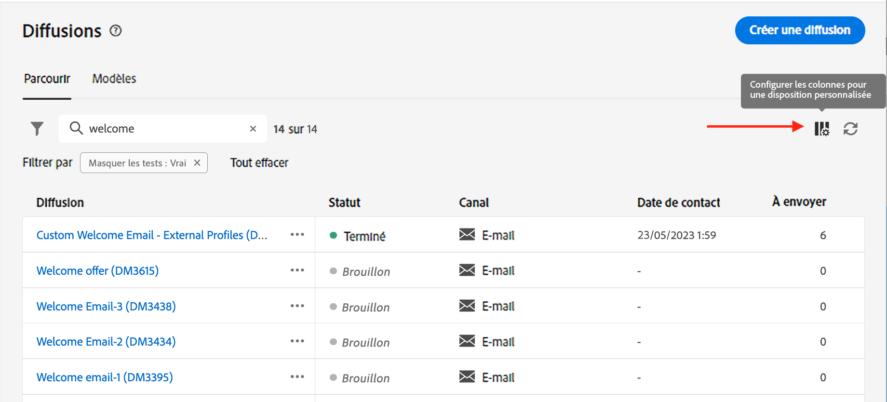
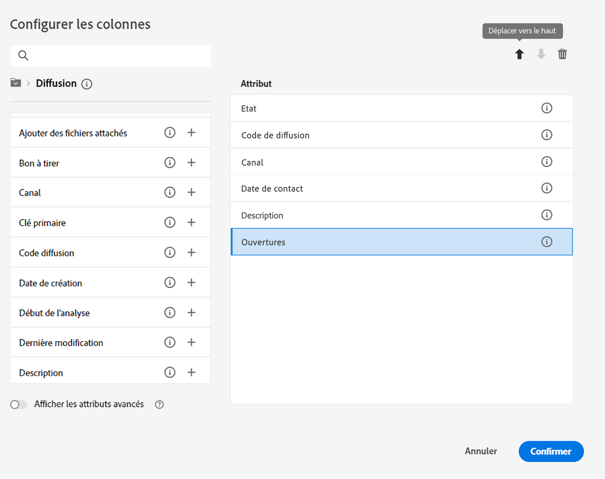
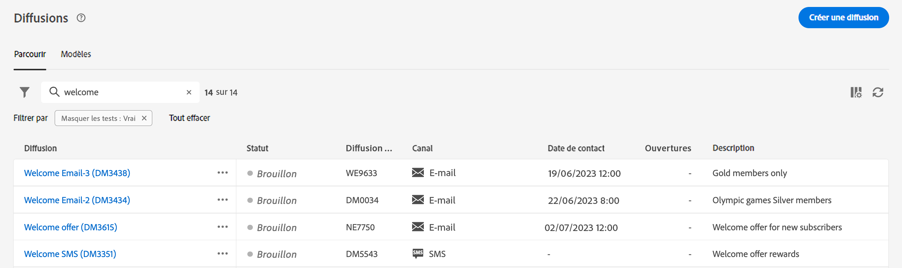
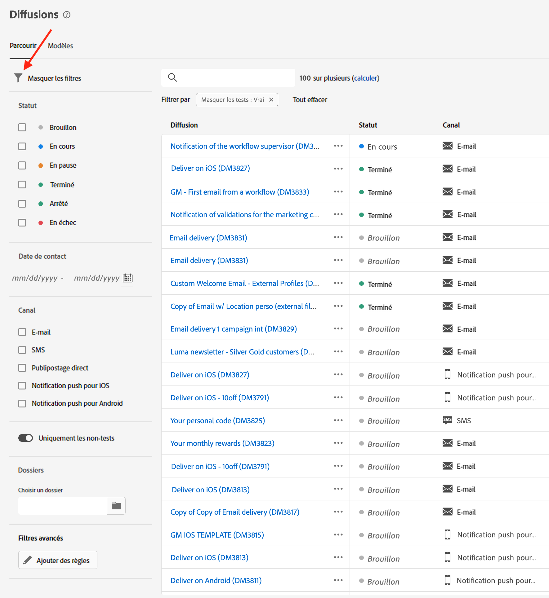

# Parcourir et filtrer les listes {#list-screens}

La plupart des liens du menu de navigation de gauche affichent des listes d’objets, telles que la liste des **Diffusions** ou des **Campagnes**. Certaines de ces fenêtres de liste sont en lecture seule. Vous pouvez personnaliser l’affichage de la liste et filtrer ces listes, comme décrit ci-dessous.

## Personnaliser les fenêtres de liste {#custom-lists}

Les listes sont affichées en colonnes. Vous pouvez également afficher des informations supplémentaires en modifiant la configuration des colonnes. Pour ce faire, cliquez sur l’icône **Configurer une colonne pour une disposition personnalisée** dans le coin supérieur droit de la liste.

{zoomable="yes"}{width="70%" align="left" zoomable="yes"}

Dans la fenêtre **Configurer des colonnes**, ajoutez ou supprimez des colonnes et modifiez leur ordre d’affichage.

Par exemple, pour les paramètres suivants :

{zoomable="yes"}{width="70%" align="left" zoomable="yes"}

La liste affiche les colonnes suivantes :

{zoomable="yes"}{width="70%" align="left" zoomable="yes"}

## Trier les données {#sort-lists}

Vous pouvez également trier les éléments de la liste en cliquant sur l’en-tête d’une colonne. Une flèche s’affiche (vers le haut ou vers le bas) pour indiquer que la liste est triée sur cette colonne.

Pour les colonnes numériques ou de date, la flèche vers le **haut** indique que la liste est triée par ordre croissant, tandis que la flèche vers le **bas** indique un ordre décroissant. Pour les colonnes de type chaîne ou alphanumérique, les valeurs sont classées par ordre alphabétique.

## Filtres {#list-built-in-filters}

Pour trouver les éléments plus rapidement, vous pouvez utiliser la barre de recherche ou les filtres intégrés et personnalisés pour adapter la liste selon des critères contextuels.

{zoomable="yes"}{width="70%" align="left" zoomable="yes"}

Des informations détaillées sur l’utilisation des filtres et la création de vos propres filtres personnalisés sont disponibles dans [cette section](../query/filter.md).

<!--
## Use advanced attributes {#adv-attributes}

>[!CONTEXTUALHELP]
>id="acw_attributepicker_advancedfields"
>title="Display advanced attributes"
>abstract="Only the most common attributes are displayed by default in the attribute list. Activate the **Display advanced attributes** toggle to see all available attributes for the current list in the left palette of the rule builder, such as nodes, groupings, 1-1 links, 1-N links."

>[!CONTEXTUALHELP]
>id="acw_rulebuilder_advancedfields"
>title="Rule builder advanced fields"
>abstract="Only the most common attributes are displayed by default in the attribute list. Activate the **Display advanced attributes** toggle to see all available attributes for the current list in the left palette of the rule builder, such as nodes, groupings, 1-1 links, 1-N links."

>[!CONTEXTUALHELP]
>id="acw_rulebuilder_properties_advanced"
>title="Rule builder advanced attributes"
>abstract="Only the most common attributes are displayed by default in the attribute list. Activate the **Display advanced attributes** toggle to see all available attributes for the current list in the left palette of the rule builder, such as nodes, groupings, 1-1 links, 1-N links."

Only most common attributes are displayed by default in the attribute list and filter configuration screens. Attributes which were set as `advanced` attributes in the data schema are hidden from the configuration screens. 

Activate the **Display advanced attributes** toggle to see all available attributes for the current list in the left palette of the rule builder, such as nodes, groupings, 1-1 links, 1-N links. The attribute list is updated instantly.

{zoomable="yes"}{width="70%" align="left" zoomable="yes"}
-->