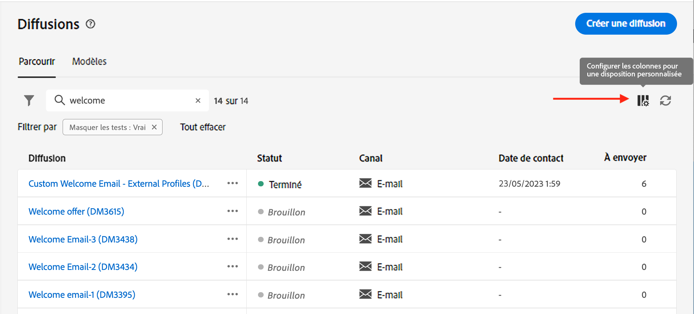
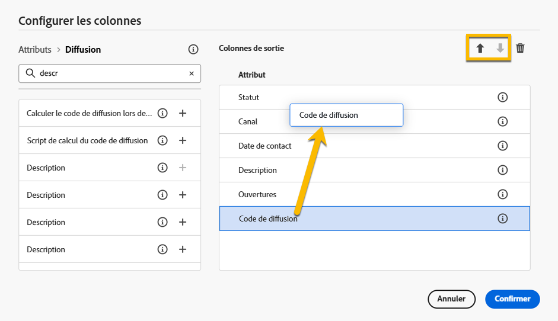
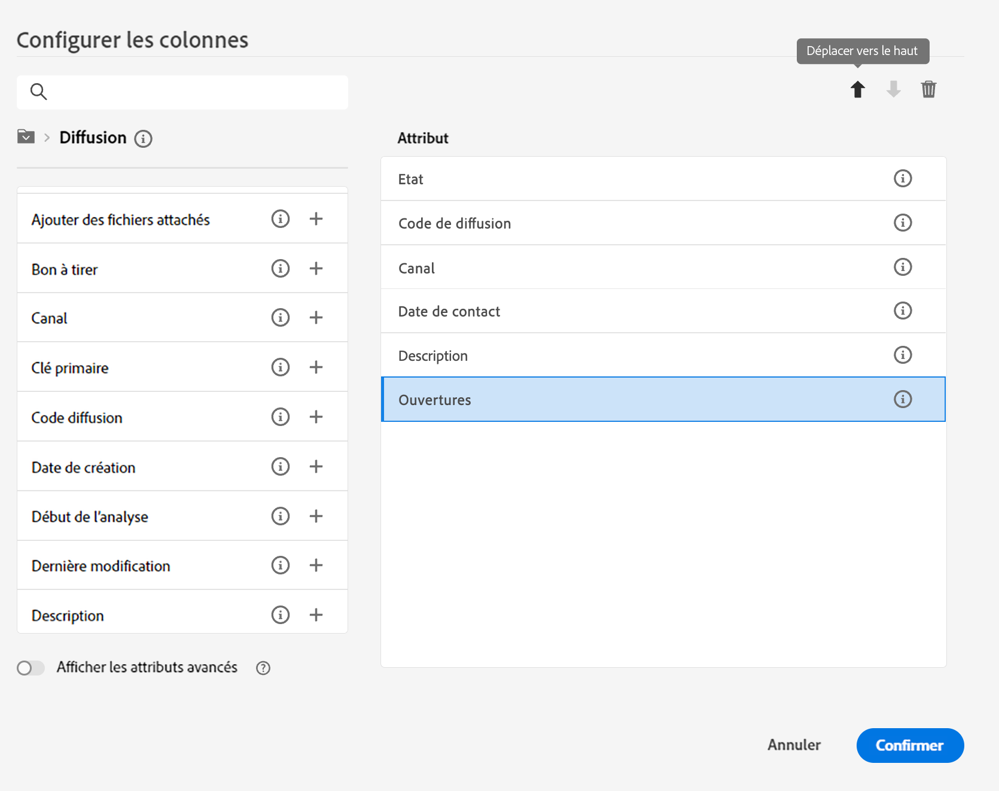
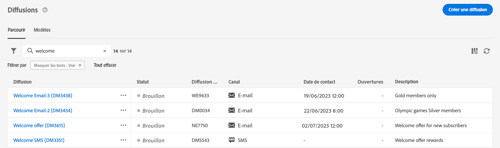
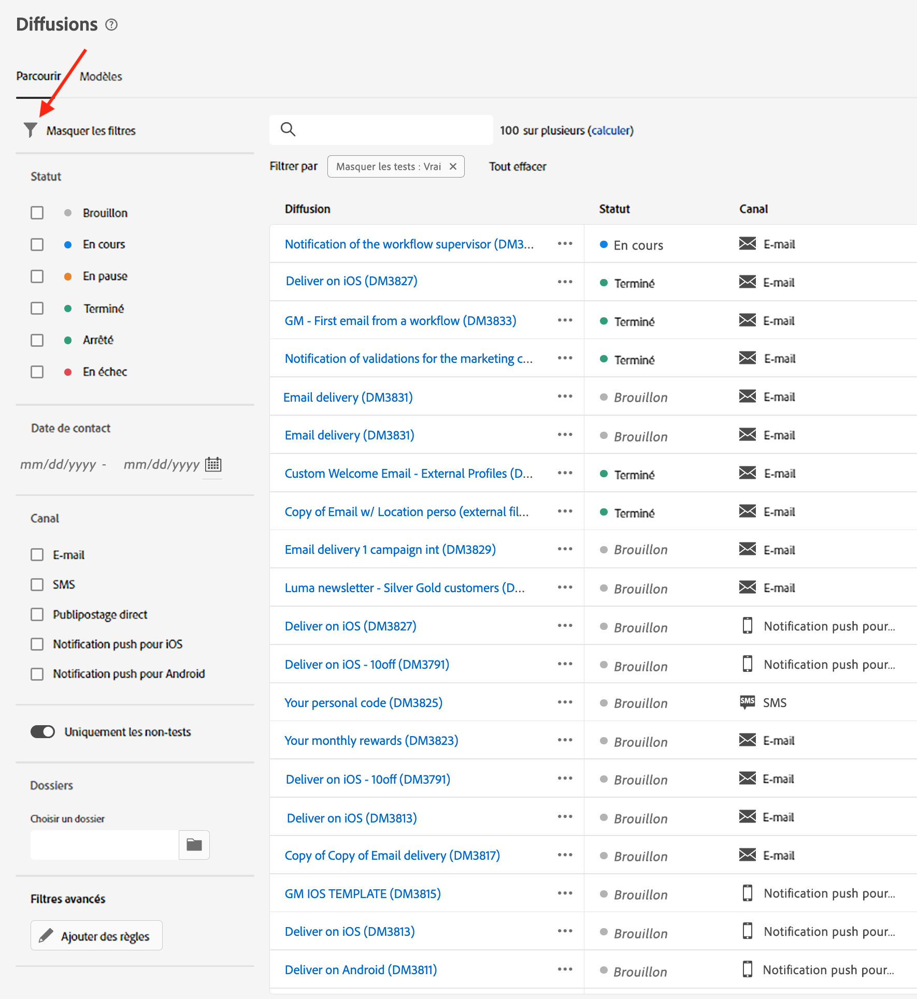

# Parcourir et filtrer les listes {#list-screens}

La plupart des liens du menu de navigation de gauche affichent des listes d’objets, telles que la liste des **diffusions** ou des **campagnes**. Certaines de ces fenêtres de liste sont en lecture seule. Vous pouvez personnaliser l’affichage de ces listes, les filtrer et exporter leurs données sous forme de fichiers CSV, comme décrit ci-dessous.

## Personnaliser les fenêtres de liste {#custom-lists}

Les listes sont affichées en colonnes. Vous pouvez également afficher des informations supplémentaires en modifiant la configuration des colonnes. Pour ce faire, cliquez sur l’icône **Configurer une colonne pour une disposition personnalisée** dans le coin supérieur droit de la liste.

{zoomable="yes"}{width="70%"}

Dans la fenêtre **Configurer des colonnes**, ajoutez ou supprimez des colonnes et modifiez leur ordre d’affichage.

Vous pouvez modifier l’ordre de votre liste par **glisser-déposer** ou en utilisant les **flèches haut et bas**, comme illustré ci-dessous :

{zoomable="yes"}{width="70%"}

Par exemple, pour les paramètres suivants :

{zoomable="yes"}{width="70%" zoomable="yes"}

La liste affiche les colonnes suivantes :

{zoomable="yes"}{width="70%"}

## Trier les données {#sort-lists}

Vous pouvez trier les éléments de la liste en cliquant sur l’en-tête d’une colonne. Une flèche s’affiche (vers le haut ou vers le bas) pour indiquer que la liste est triée sur cette colonne.

Pour les colonnes numériques ou de date, la flèche **vers le haut** indique que la liste est triée par ordre croissant, tandis que la flèche **vers le bas** indique un ordre décroissant. Pour les colonnes de type chaîne ou alphanumérique, les valeurs sont classées par ordre alphabétique.

## Filtres {#list-built-in-filters}

Pour trouver les éléments plus rapidement, vous pouvez utiliser la barre de recherche ou les filtres intégrés et personnalisés afin d’adapter la liste selon des critères contextuels.

{zoomable="yes"}{width="70%"}

Vous trouverez des informations détaillées sur l’utilisation des filtres et la création de filtres personnalisés dans [cette section](../query/filter.md).

## Exporter les données de la liste {#export-list}

Vous pouvez exporter des données depuis n’importe quel écran de liste, y compris les journaux de suivi.Pour exporter une liste, procédez comme suit :

1. Ouvrez la liste que vous souhaitez exporter.
1. Ajustez les colonnes affichées et appliquez la recherche ou les filtres de votre choix.L’export prend en compte les colonnes affichées à l’écran ainsi que les recherches ou filtres actifs.
1. Faites défiler l’écran vers le bas pour afficher d’autres lignes si nécessaire.Seules les lignes actuellement chargées dans la liste sont exportées.
1. Cliquez sur le bouton **Exporter les lignes chargées au format CSV** situé au-dessus de la liste.Le fichier est enregistré dans le dossier de téléchargement par défaut de votre navigateur.

{zoomable="yes"}

<!--
## Use advanced attributes {#adv-attributes}

>[!CONTEXTUALHELP]
>id="acw_attributepicker_advancedfields"
>title="Display advanced attributes"
>abstract="Only the most common attributes are displayed by default in the attribute list. Activate the **Display advanced attributes** toggle to see all available attributes for the current list in the left palette of the rule builder, such as nodes, groupings, 1-1 links, 1-N links."

>[!CONTEXTUALHELP]
>id="acw_rulebuilder_advancedfields"
>title="Rule builder advanced fields"
>abstract="Only the most common attributes are displayed by default in the attribute list. Activate the **Display advanced attributes** toggle to see all available attributes for the current list in the left palette of the rule builder, such as nodes, groupings, 1-1 links, 1-N links."

>[!CONTEXTUALHELP]
>id="acw_rulebuilder_properties_advanced"
>title="Rule builder advanced attributes"
>abstract="Only the most common attributes are displayed by default in the attribute list. Activate the **Display advanced attributes** toggle to see all available attributes for the current list in the left palette of the rule builder, such as nodes, groupings, 1-1 links, 1-N links."

Only the most common attributes are displayed by default in the attribute list and filter configuration screens. Attributes set as `advanced` attributes in the data schema are hidden from the configuration screens.

Activate the **Display advanced attributes** toggle to see all available attributes for the current list in the left palette of the rule builder, such as nodes, groupings, 1-1 links, 1-N links. The attribute list updates instantly.

[The screenshot shows the Display advanced attributes toggle used to reveal hidden attributes in the rule builder palette.](assets/adv-toggle.png){zoomable="yes"}{width="70%" zoomable="yes"}
-->