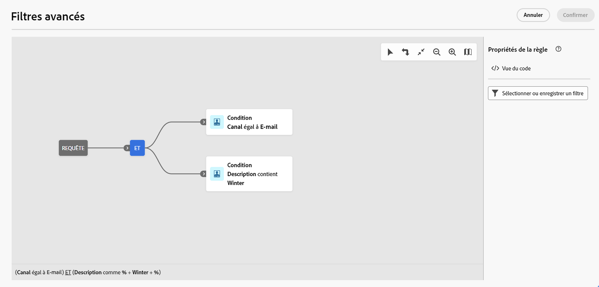

# Parcourir, rechercher et filtrer les listes {#list-screens}

La plupart des liens du menu de navigation de gauche affichent des listes d’objets, telles que la liste des **Diffusions** ou des **Campagnes**. Certaines de ces fenêtres de liste sont en lecture seule. Vous pouvez personnaliser l’affichage de la liste et filtrer ces listes, comme décrit ci-dessous.

Pour supprimer un filtre, cliquez sur le bouton **Effacer tout**.

## Personnaliser les fenêtres de liste {#custom-lists}

Les listes sont affichées en colonnes. Vous pouvez également afficher des informations supplémentaires en modifiant la configuration des colonnes. Pour ce faire, cliquez sur l’icône **Configurer une colonne pour une disposition personnalisée** dans le coin supérieur droit de la liste.

{width="70%" align="left" zoomable="yes"}

Dans la fenêtre **Configurer des colonnes**, ajoutez ou supprimez des colonnes et modifiez leur ordre d’affichage.

Par exemple, pour les paramètres suivants :

{width="70%" align="left" zoomable="yes"}

La liste affiche les colonnes suivantes :

{width="70%" align="left" zoomable="yes"}

Utilisez le bouton **Afficher les attributs avancés** pour afficher tous les attributs de la liste actuelle. [En savoir plus](#adv-attributes)

## Trier les données {#sort-lists}

Vous pouvez également trier les éléments de la liste en cliquant sur l’en-tête d’une colonne. Une flèche s’affiche (vers le haut ou vers le bas) pour indiquer que la liste est triée sur cette colonne.

Pour les colonnes numériques ou de date, la flèche vers le **haut** indique que la liste est triée par ordre croissant, tandis que la flèche vers le **bas** indique un ordre décroissant. Pour les colonnes de type chaîne ou alphanumérique, les valeurs sont classées par ordre alphabétique.

## Filtres intégrés {#list-built-in-filters}

Pour trouver les éléments plus rapidement, vous pouvez utiliser la barre de recherche ou filtrer la liste selon des critères contextuels.

{width="70%" align="left" zoomable="yes"}

Vous pouvez, par exemple, filtrer les diffusions selon leur statut, leur canal, leur date de contact ou leur dossier. Vous pouvez également masquer les tests.

## Filtres personnalisés{#list-custom-filters}

Pour créer des filtres personnalisés sur les données, naviguez jusqu’au bas des filtres et cliquez sur le bouton **Ajouter des règles**.

Faites glisser et déposez des attributs pour créer vos critères de filtre dans la fenêtre **Filtres avancés**.

{width="70%" align="left" zoomable="yes"}

Utilisez le bouton **Afficher les attributs avancés** pour afficher tous les attributs de la liste actuelle. [En savoir plus](#adv-attributes)

Le principe de fonctionnement du créateur de règles pour les filtres personnalisés est similaire au créateur de règles utilisé pour créer des audiences. Des informations détaillées sur son utilisation sont disponibles dans la section [Documentation sur les audiences](../audience/segment-builder.md).

## Utiliser les attributs avancés {#adv-attributes}

>[!CONTEXTUALHELP]
>id="acw_attributepicker_advancedfields"
>title="Afficher les attributs avancés"
>abstract="Seuls les attributs les plus courants sont affichés par défaut dans la liste des attributs. Activez la variable **Afficher les attributs avancés** bascule pour afficher tous les attributs disponibles pour la liste actuelle dans la palette gauche du créateur de règles, tels que les noeuds, les regroupements, les liens 1-1, les liens 1-N."

>[!CONTEXTUALHELP]
>id="acw_rulebuilder_advancedfields"
>title="Champs avancés du créateur de règles"
>abstract="Seuls les attributs les plus courants sont affichés par défaut dans la liste des attributs. Activez la variable **Afficher les attributs avancés** bascule pour afficher tous les attributs disponibles pour la liste actuelle dans la palette gauche du créateur de règles, tels que les noeuds, les regroupements, les liens 1-1, les liens 1-N."

>[!CONTEXTUALHELP]
>id="acw_rulebuilder_properties_advanced"
>title="Attributs avancés du créateur de règles"
>abstract="Seuls les attributs les plus courants sont affichés par défaut dans la liste des attributs. Activez la variable **Afficher les attributs avancés** bascule pour afficher tous les attributs disponibles pour la liste actuelle dans la palette gauche du créateur de règles, tels que les noeuds, les regroupements, les liens 1-1, les liens 1-N."

Seuls les attributs les plus courants sont affichés par défaut dans la liste des attributs et les fenêtres de configuration des filtres. Les attributs définis comme attributs `advanced` dans le schéma de données sont masqués dans les fenêtres de configuration.

Activez la variable **Afficher les attributs avancés** bascule pour afficher tous les attributs disponibles pour la liste actuelle dans la palette gauche du créateur de règles, tels que les noeuds, les regroupements, les liens 1-1, les liens 1-N. La liste des attributs est mise à jour instantanément.

{width="70%" align="left" zoomable="yes"}
