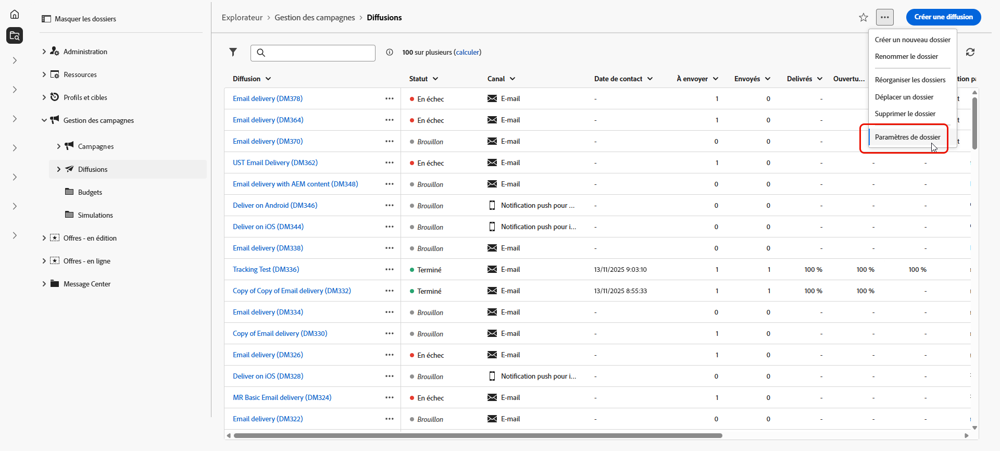
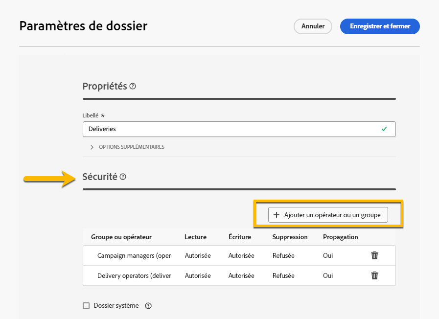
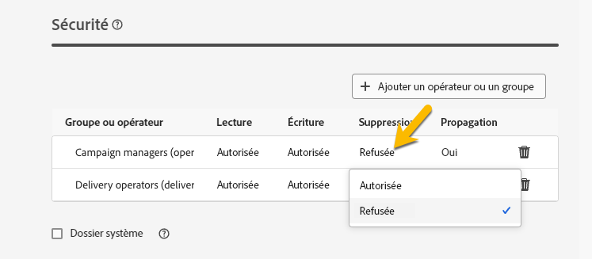

# Autorisations {#permissions}

Chaque utilisateur et utilisatrice d’Adobe Campaign dispose de ses propres autorisations et restrictions dans l’application. Cette personne peut faire partie d’un groupe de personnes opératrices et hérite des autorisations du groupe.

En fonction de ses autorisations, un opérateur ou une opératrice peut :

* l’accès à certaines fonctionnalités
* l’accès à certaines données
* l’accès à certaines actions (création, modification ou suppression)

La procédure détaillée de configuration des autorisations dans Adobe Campaign est disponible dans la [documentation Adobe Campaign v8 (console)](https://experienceleague.adobe.com/fr/docs/campaign/campaign-v8/admin/permissions/gs-permissions){target="_blank"}.

## Autorisations sur les dossiers {#folder-permissions}

En fonction de vos droits, vous avez la possibilité d’afficher et de gérer les autorisations des dossiers dans les **[!UICONTROL Paramètres du dossier]**.

Voici un exemple de dossier de diffusion :

{zoomable="yes"}

Dans la section **[!UICONTROL Sécurité]** des **[!UICONTROL Paramètres du dossier]**, vous pouvez afficher et gérer (ajouter ou supprimer) des personnes opératrices ou des groupes qui peuvent accéder au dossier.

{zoomable="yes"}

Vous pouvez cliquer directement sur les autorisations et les modifier en **[!UICONTROL Autorisé]** ou **[!UICONTROL Refusé]**.

{zoomable="yes"}

Si l’option **[!UICONTROL Propager]** est activée, toutes les autorisations définies pour un dossier sont appliquées à tous ses sous-dossiers. Ces autorisations peuvent être surchargées pour chaque sous-dossier.

Si l’option **[!UICONTROL Dossier système]** est activée, l’accès est autorisé à toutes les personnes opératrices, quelles que soient leurs autorisations.

Vous pouvez également [gérer les autorisations sur les dossiers dans la console Adobe Campaign](https://experienceleague.adobe.com/fr/docs/campaign/campaign-v8/admin/permissions/folder-permissions){target="_blank"}.

Toutes les autorisations de l’interface utilisateur Campaign Web sont synchronisées avec celles de la console cliente Campaign.
