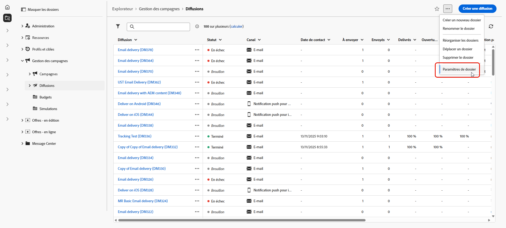
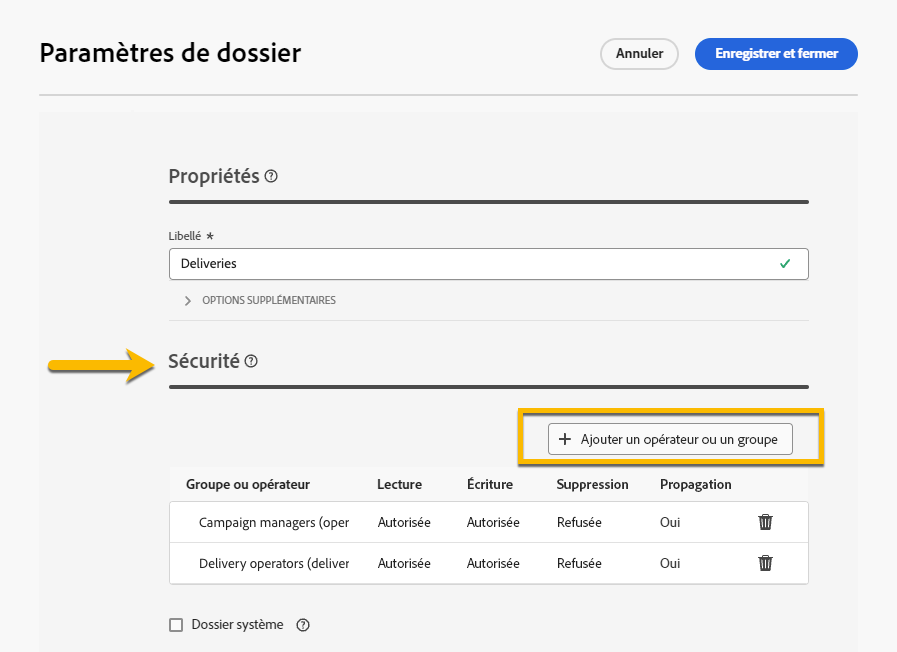
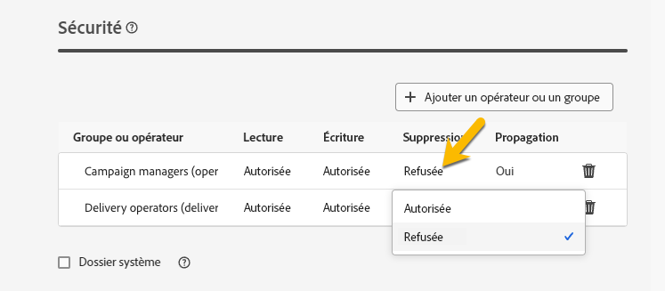

<?xml version="1.0" encoding="UTF-8"?>
<xliff xmlns="urn:oasis:names:tc:xliff:document:1.2" xmlns:okp="okapi-framework:xliff-extensions" xmlns:its="http://www.w3.org/2005/11/its" xmlns:itsxlf="http://www.w3.org/ns/its-xliff/" version="1.2" its:version="2.0">
<file original="help/v8/get-started/permissions.md.mdsc" source-language="en-US" target-language="en-XX" datatype="x-text/markdown">
<body>
<trans-unit id="tu10" xml:space="preserve">
<source xml:lang="en-US">https://experienceleague.adobe.com/fr/docs/campaign/campaign-v8/admin/permissions/gs-permissions</source>
<target xml:lang="en-XX">https://experienceleague.adobe.com/fr/docs/campaign/campaign-v8/admin/permissions/gs-permissions</target>
</trans-unit>
<trans-unit id="tu26" xml:space="preserve">
<source xml:lang="en-US">https://experienceleague.adobe.com/docs/campaign/campaign-v8/permissions/manage-permissions.html?lang=fr#use-named-rights</source>
<target xml:lang="en-XX">https://experienceleague.adobe.com/docs/campaign/campaign-v8/permissions/manage-permissions.html?lang=fr#use-named-rights</target>
</trans-unit>
<trans-unit id="tu1" restype="x-YAML_METADATA_HEADER_VALUE" xml:space="preserve">
<source xml:lang="en-US">Permission management in Campaign Web user interface</source>
<target xml:lang="en-XX">Gestion des autorisations dans l’interface utilisateur web de Campaign</target>
</trans-unit>
<trans-unit id="tu2" restype="x-YAML_METADATA_HEADER_VALUE" xml:space="preserve">
<source xml:lang="en-US">Learn more about permissions in Campaign Web user interface</source>
<target xml:lang="en-XX">En savoir plus sur les autorisations dans l’interface utilisateur web de Campaign</target>
</trans-unit>
<trans-unit id="tu3" xml:space="preserve">
<source xml:lang="en-US">Permissions</source>
<target xml:lang="en-XX">Autorisations</target>
</trans-unit>
<trans-unit id="tu4" xml:space="preserve">
<source xml:lang="en-US">Each user in Adobe Campaign has specific permissions and restrictions in the application. The user can belong to an operators group and inherit the group's permissions.</source>
<target xml:lang="en-XX">Chaque utilisateur et utilisatrice d’Adobe Campaign dispose de ses propres autorisations et restrictions dans l’application. L’utilisateur ou l’utilisatrice peut appartenir à un groupe d’opérateurs et d’opératrices et hériter des autorisations du groupe.</target>
</trans-unit>
<trans-unit id="tu5" xml:space="preserve">
<source xml:lang="en-US">Based on their permissions, an operator can:</source>
<target xml:lang="en-XX">En fonction de ses autorisations, l’opérateur ou l’opératrice peut :</target>
</trans-unit>
<trans-unit id="tu6" xml:space="preserve">
<source xml:lang="en-US">Access certain capabilities</source>
<target xml:lang="en-XX">Accéder à certaines fonctionnalités</target>
</trans-unit>
<trans-unit id="tu7" xml:space="preserve">
<source xml:lang="en-US">Access certain data</source>
<target xml:lang="en-XX">Accéder à certaines données</target>
</trans-unit>
<trans-unit id="tu8" xml:space="preserve">
<source xml:lang="en-US">Access certain actions (create, modify, delete)</source>
<target xml:lang="en-XX">Accéder à certaines actions (création, modification ou suppression)</target>
</trans-unit>
<trans-unit id="tu9" xml:space="preserve">
<source xml:lang="en-US">A detailed procedure for setting up permissions in Adobe Campaign is available in <ph id="1" ctype="x-LINK">&lbrack;</ph>Adobe Campaign v8 (console) documentation<ph id="2" ctype="x-LINK">[#$tu10]{target="_blank"}</ph>.</source>
<target xml:lang="en-XX">La procédure détaillée de configuration des autorisations dans Adobe Campaign est disponible dans la <ph id="1" ctype="x-LINK">&lbrack;</ph>documentation Adobe Campaign v8 (console)<ph id="2" ctype="x-LINK">[#$tu10]{target="_blank"}</ph>.</target>
</trans-unit>
<trans-unit id="tu11" xml:space="preserve">
<source xml:lang="en-US">Permissions on folders</source>
<target xml:lang="en-XX">Autorisations sur les dossiers</target>
</trans-unit>
<trans-unit id="tu12" xml:space="preserve">
<source xml:lang="en-US">Based on your rights, you can view and manage permissions on folders in the <ph id="1" ctype="x-STRONG_EMPHASIS">**[!UICONTROL </ph>Folder settings<ph id="3" ctype="x-LINK_REF">]**</ph>.</source>
<target xml:lang="en-XX">En fonction de vos droits, vous pouvez afficher et gérer les autorisations sur les dossiers dans les <ph id="1" ctype="x-STRONG_EMPHASIS">**[!UICONTROL </ph>paramètres des dossiers<ph id="3" ctype="x-LINK_REF">]**</ph>.</target>
</trans-unit>
<trans-unit id="tu13" xml:space="preserve">
<source xml:lang="en-US">Below is an example of a delivery folder:</source>
<target xml:lang="en-XX">Voici un exemple de dossier de diffusion :</target>
</trans-unit>
<trans-unit id="tu14" xml:space="preserve">
<source xml:lang="en-US"><ph id="1" ctype="x-IMAGE">{zoomable="yes"}</ph></source>
<target xml:lang="en-XX"><ph id="1" ctype="x-IMAGE">{zoomable="yes"}</ph></target>
</trans-unit>
<trans-unit id="tu15" xml:space="preserve">
<source xml:lang="en-US">In the <ph id="1" ctype="x-STRONG_EMPHASIS">**[!UICONTROL </ph>Security<ph id="3" ctype="x-LINK_REF">]**</ph> section of the <ph id="5" ctype="x-STRONG_EMPHASIS">**[!UICONTROL </ph>Folder settings<ph id="7" ctype="x-LINK_REF">]**</ph>, you can view and manage (add or delete) operators or groups who can access the folder.</source>
<target xml:lang="en-XX">Dans la section <ph id="1" ctype="x-STRONG_EMPHASIS">**[!UICONTROL </ph>Sécurité<ph id="3" ctype="x-LINK_REF">]**</ph> des <ph id="5" ctype="x-STRONG_EMPHASIS">**[!UICONTROL </ph>Paramètres du dossier<ph id="7" ctype="x-LINK_REF">]**</ph>, vous pouvez afficher et gérer (ajouter ou supprimer) des opérateurs ou opératrices ou des groupes qui peuvent accéder au dossier.</target>
</trans-unit>
<trans-unit id="tu16" xml:space="preserve">
<source xml:lang="en-US"><ph id="1" ctype="x-IMAGE">{zoomable="yes"}</ph></source>
<target xml:lang="en-XX"><ph id="1" ctype="x-IMAGE">{zoomable="yes"}</ph></target>
</trans-unit>
<trans-unit id="tu17" xml:space="preserve">
<source xml:lang="en-US">You can directly click on the permissions and change them to either <ph id="1" ctype="x-STRONG_EMPHASIS">**[!UICONTROL </ph>Allowed<ph id="3" ctype="x-LINK_REF">]**</ph> or <ph id="5" ctype="x-STRONG_EMPHASIS">**[!UICONTROL </ph>Denied<ph id="7" ctype="x-LINK_REF">]**</ph>.</source>
<target xml:lang="en-XX">Vous pouvez cliquer directement sur les autorisations et les définir sur <ph id="1" ctype="x-STRONG_EMPHASIS">**[!UICONTROL </ph>Autorisé<ph id="3" ctype="x-LINK_REF">]**</ph> ou <ph id="5" ctype="x-STRONG_EMPHASIS">**[!UICONTROL </ph>Refusé<ph id="7" ctype="x-LINK_REF">]**</ph>.</target>
</trans-unit>
<trans-unit id="tu18" xml:space="preserve">
<source xml:lang="en-US"><ph id="1" ctype="x-IMAGE">{zoomable="yes"}</ph></source>
<target xml:lang="en-XX"><ph id="1" ctype="x-IMAGE">{zoomable="yes"}</ph></target>
</trans-unit>
<trans-unit id="tu19" xml:space="preserve">
<source xml:lang="en-US"><ph id="1" ctype="x-regxph" equiv-text="&lbrack;!NOTE">[!NOTE]</ph></source>
<target xml:lang="en-XX"><ph id="1" ctype="x-regxph" equiv-text="&lbrack;!NOTE">[!NOTE]</ph></target>
</trans-unit>
<trans-unit id="tu20" xml:space="preserve">
<source xml:lang="en-US">You should not be able to create an object for which you do not have at least one folder with writing rights.</source>
<target xml:lang="en-XX">Vous ne devriez pas être en mesure de créer un objet pour lequel vous n’avez pas au moins un dossier avec des droits d’écriture.</target>
</trans-unit>
<trans-unit id="tu21" xml:space="preserve">
<source xml:lang="en-US">You do not need to be an admin to create fragments, but you must have writing rights on at least one "Content visual fragment" folder. Otherwise, you won't be able to create a visual fragment.</source>
<target xml:lang="en-XX">Vous n’avez pas besoin de droits d’administration pour créer des fragments, mais vous devez disposer de droits d’écriture sur au moins un dossier « Fragment visuel de contenu ». Sinon, vous ne pourrez pas créer de fragment visuel.</target>
</trans-unit>
<trans-unit id="tu22" xml:space="preserve">
<source xml:lang="en-US">If the <ph id="1" ctype="x-STRONG_EMPHASIS">**[!UICONTROL </ph>Propagate<ph id="3" ctype="x-LINK_REF">]**</ph> option is enabled, all permissions defined for a folder apply to all its sub-folders. These permissions can be overridden for each sub-folder.</source>
<target xml:lang="en-XX">Si l’option <ph id="1" ctype="x-STRONG_EMPHASIS">**[!UICONTROL </ph>Propager<ph id="3" ctype="x-LINK_REF">]**</ph> est activée, toutes les autorisations définies pour un dossier sont appliquées à tous ses sous-dossiers. Ces autorisations peuvent être remplacées pour chaque sous-dossier.</target>
</trans-unit>
<trans-unit id="tu23" xml:space="preserve">
<source xml:lang="en-US">If the <ph id="1" ctype="x-STRONG_EMPHASIS">**[!UICONTROL </ph>System folder<ph id="3" ctype="x-LINK_REF">]**</ph> option is selected, access is allowed to all operators, regardless of their permissions.</source>
<target xml:lang="en-XX">Si l’option <ph id="1" ctype="x-STRONG_EMPHASIS">**[!UICONTROL </ph>Dossier système<ph id="3" ctype="x-LINK_REF">]**</ph> est activée, l’accès est autorisé à tous les opérateurs et opératrices, quelles que soient leurs autorisations.</target>
</trans-unit>
<trans-unit id="tu24" xml:space="preserve">
<source xml:lang="en-US">See this <ph id="1" ctype="x-LINK">[</ph>section<ph id="2" ctype="x-LINK">](work-with-folders.md#folder-access-rights)</ph> to learn how these rights affect the actions available to you on a folder.</source>
<target xml:lang="en-XX">Consultez cette <ph id="1" ctype="x-LINK">[</ph>section<ph id="2" ctype="x-LINK">](work-with-folders.md#folder-access-rights)</ph> pour découvrir comment ces droits affectent les actions à votre disposition sur un dossier.</target>
</trans-unit>
<trans-unit id="tu25" xml:space="preserve">
<source xml:lang="en-US">Named rights also determine which folder actions are available to an operator. Refer to the <ph id="1" ctype="x-LINK">&lbrack;</ph>Campaign v8 documentation<ph id="2" ctype="x-LINK">[#$tu26]{target="_blank"}</ph>.</source>
<target xml:lang="en-XX">Les droits nommés déterminent également les actions de dossier disponibles pour un opérateur ou une opératrice. Consultez la <ph id="1" ctype="x-LINK">&lbrack;</ph>documentation de Campaign v8<ph id="2" ctype="x-LINK">[#$tu26]{target="_blank"}</ph>.</target>
</trans-unit>
<trans-unit id="tu27" xml:space="preserve">
<source xml:lang="en-US">All permissions in the Campaign Web user interface synchronize with Campaign Client Console permissions.</source>
<target xml:lang="en-XX">Toutes les autorisations de l’interface d’utilisation de Campaign Web sont synchronisées avec celles de la console cliente Campaign.</target>
</trans-unit>
</body>
</file>
</xliff>