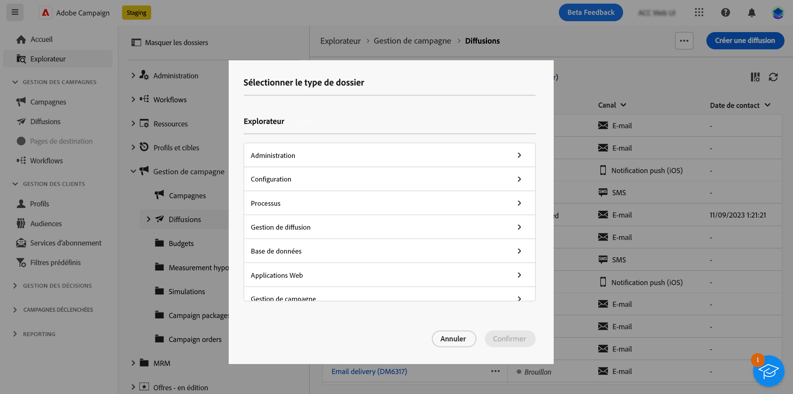

# Accès et autorisations {#access-and-permissions}

>[!CONTEXTUALHELP]
>id="acw_explorer_permissions_create"
>title="Autorisation requise"
>abstract="Avant de pouvoir créer cet objet, votre administrateur ou administratrice doit vous accorder une autorisation."

>[!CONTEXTUALHELP]
>id="acw_audiences_read_only"
>title="Cette audience est en lecture seule."
>abstract="Vous ne disposez pas des autorisations nécessaires pour modifier cette audience. Si nécessaire, contactez votre administrateur ou administratrice, qui vous accordera l’accès."

>[!CONTEXTUALHELP]
>id="acw_subscription_services_read_only"
>title="Ce service est en lecture seule."
>abstract="Vous ne disposez pas des autorisations nécessaires pour modifier ce service. Si nécessaire, contactez votre administrateur ou administratrice, qui vous accordera l’accès."

>[!CONTEXTUALHELP]
>id="acw_recipients_readonlyprofile"
>title="Profil en lecture seule des personnes destinataires"
>abstract="Vous ne disposez pas des autorisations nécessaires pour modifier ce profil. Si nécessaire, contactez votre administrateur ou administratrice, qui vous accordera l’accès."

>[!CONTEXTUALHELP]
>id="acw_campaign_read_only"
>title="Cette campagne est en lecture seule."
>abstract="Vous ne disposez pas des autorisations nécessaires pour modifier cette campagne. Si nécessaire, contactez votre administrateur ou administratrice, qui vous accordera l’accès."

>[!CONTEXTUALHELP]
>id="acw_deliveries_read_only"
>title="Cette diffusion est en lecture seule."
>abstract="Vous ne disposez pas des autorisations nécessaires pour modifier cette diffusion. Si nécessaire, contactez votre administrateur ou administratrice, qui vous accordera l’accès."

>[!CONTEXTUALHELP]
>id="acw_wf_read_only"
>title="Ce workflow est en lecture seule."
>abstract="Vous ne disposez pas des autorisations nécessaires pour modifier ce workflow. Si nécessaire, contactez votre administrateur ou administratrice, qui vous accordera l’accès."

Le contrôle d’accès peut restreindre l’accès aux objets et données des listes principales, telles que les diffusions, les destinataires ou les workflows. Ces restrictions s’appliquent également dans l’arborescence de navigation de l’**explorateur**. En outre, vous avez besoin d’autorisations pour créer, supprimer, dupliquer et modifier des objets à partir de l’interface utilisateur.

Le contrôle d’accès est géré dans la console cliente Campaign. Toutes les autorisations de Campaign web sont synchronisées avec celles de la console cliente Campaign. Seuls les administrateurs ou les administratrices de Campaign peuvent définir et modifier les autorisations utilisateur. En savoir plus sur les autorisations utilisateur dans la [documentation de Campaign v8 (console cliente)](https://experienceleague.adobe.com/docs/campaign/campaign-v8/admin/permissions/gs-permissions.html?lang=fr){target="_blank"}.

Lorsque vous naviguez dans l’interface utilisateur de Campaign Web, vous pouvez accéder aux données, aux objets et aux fonctionnalités selon vos autorisations. Par exemple, si vous ne disposez pas des autorisations d’accès à un dossier, vous ne pouvez pas l’afficher. Vos autorisations ont également une incidence sur la gestion des objets et des données. Sans autorisation d’écriture pour un dossier spécifique, vous ne pouvez pas créer de diffusion dans ce dossier, même si vous pouvez l’afficher dans l’interface utilisateur.

## Afficher les autorisations {#view-permissions}

Dans l’**Explorateur**, vous pouvez parcourir les autorisations de chaque dossier. Ces autorisations sont définies dans la console cliente et sont utilisées pour organiser et contrôler l’accès aux données de Campaign.

Pour afficher les autorisations d’un dossier, procédez comme suit :

1. Dans le menu de navigation de gauche **Explorateur**, sélectionnez un dossier.
1. Cliquez sur les trois points dans le coin supérieur droit et sélectionnez **Autorisations de dossier**.

   {zoomable="yes"}{width="70%" align="left" zoomable="yes"}

1. Vérifiez les détails dans l’écran, comme ci-dessous :

   {zoomable="yes"}{width="70%" align="left" zoomable="yes"}

   Un groupe, un opérateur ou une opératrice, peut disposer des autorisations de lecture, d’écriture et/ou de suppression sur les données stockées dans le dossier sélectionné.

   Si l’option **Propager** est activée, toutes les autorisations définies pour un dossier sont appliquées à tous ses sous-dossiers. Ces autorisations peuvent être surchargées pour chaque sous-dossier.

   Si l’option **Dossier système** est activée, l’accès est autorisé à tous les opérateurs, quelles que soient leurs autorisations.

En savoir plus sur les autorisations de dossier dans la [documentation de Campaign v8 (console cliente)](https://experienceleague.adobe.com/docs/campaign/campaign-v8/admin/permissions/folder-permissions.html?lang=fr){target="_blank"}.

## Utiliser des dossiers {#folders}

Vous pouvez créer, renommer, réorganiser et déplacer des dossiers pour organiser vos composants et vos données. Vous pouvez également supprimer des dossiers à partir du même menu.

>[!CAUTION]
>
>Lors de la suppression d’un dossier, toutes les données stockées dans le dossier sont également supprimées.

Pour créer un dossier, procédez comme suit :

1. Dans le menu de navigation de gauche **Explorateur**, sélectionnez un dossier.
1. Cliquez sur les trois points dans le coin supérieur droit et choisissez **Créer un dossier**.
1. Saisissez le nom du dossier.

   {zoomable="yes"}{width="70%" align="left" zoomable="yes"}

1. Sélectionnez le type de dossier. Par défaut, le type de dossier parent est sélectionné, &quot;Diffusions&quot;, dans notre exemple. Pour modifier le type de dossier, cliquez sur l’icône de dossier et sélectionnez un autre type.

   {zoomable="yes"}{width="70%" align="left" zoomable="yes"}

1. Cliquez sur **Créer**.

   Le dossier est ajouté en tant que sous-dossier du dossier actuel. Accédez à ce nouveau dossier pour y créer des composants directement. Vous pouvez également créer un composant à partir de n’importe quel dossier, puis l’enregistrer dans ce nouveau dossier, à partir de la section **Options supplémentaires** des propriétés, comme illustré ci-dessous pour une diffusion :

   {zoomable="yes"}{width="70%" align="left" zoomable="yes"}
