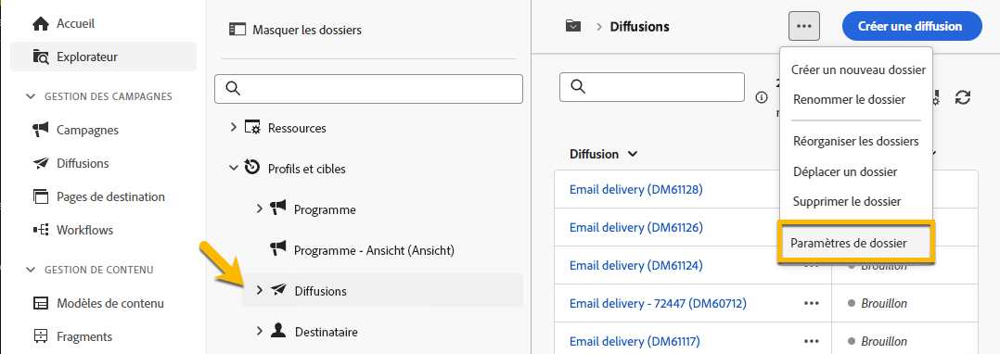

# Autorisations {#permissions}

Chaque utilisateur d’Adobe Campaign dispose d’autorisations et de restrictions spécifiques dans l’application. L’utilisateur peut appartenir à un groupe d’opérateurs et hériter des autorisations du groupe.

En fonction de ses autorisations, un opérateur peut :

* Accéder à certaines fonctionnalités
* Accès à certaines données
* Accéder à certaines actions (création, modification ou suppression)

Une procédure détaillée de configuration des autorisations dans Adobe Campaign est disponible dans la documentation d’[Adobe Campaign v8 (console)](https://experienceleague.adobe.com/fr/docs/campaign/campaign-v8/admin/permissions/gs-permissions){target="_blank"}.

## Autorisations sur les dossiers {#folder-permissions}

En fonction de vos droits, vous pouvez afficher et gérer les autorisations sur les dossiers dans la **[!UICONTROL Paramètres des dossiers]**.

Voici un exemple de dossier de diffusion :

{zoomable="yes"}

Dans la section **[!UICONTROL Sécurité]** de la section **[!UICONTROL Paramètres du dossier]**, vous pouvez afficher et gérer (ajouter ou supprimer) les opérateurs ou les groupes qui peuvent accéder au dossier.

{zoomable="yes"}

Vous pouvez directement cliquer sur les autorisations et les modifier en **[!UICONTROL Autorisé]** ou **[!UICONTROL Refusé]**.

{zoomable="yes"}

Si l&#39;option **[!UICONTROL Propager]** est activée, toutes les autorisations définies pour un dossier s&#39;appliquent à tous ses sous-dossiers. Ces autorisations peuvent être remplacées pour chaque sous-dossier.

Si l&#39;option **[!UICONTROL Dossier système]** est sélectionnée, l&#39;accès est autorisé à tous les opérateurs, quelles que soient leurs autorisations.

Vous pouvez également [gérer les autorisations sur les dossiers dans la console Adobe Campaign](https://experienceleague.adobe.com/fr/docs/campaign/campaign-v8/admin/permissions/folder-permissions){target="_blank"}.

Toutes les autorisations de l’interface utilisateur web de Campaign se synchronisent avec les autorisations de la console cliente Campaign.