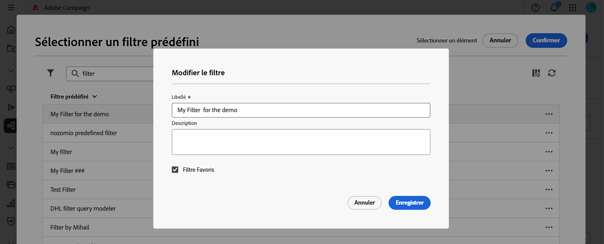

# Utiliser des filtres prédéfinis {#predefined-filters}

>[!CONTEXTUALHELP]
>id="acw_homepage_learning_card4"
>title="Gestion des filtres prédéfinis"
>abstract="L’interface d’utilisation de Campaign Web offre une expérience conviviale et simple de gestion et de personnalisation des filtres prédéfinis qui répond à vos besoins. Créez-les une fois et enregistrez-les pour une utilisation ultérieure."

>[!CONTEXTUALHELP]
>id="acw_predefined-filters-dashboard"
>title="Filtres prédéfinis"
>abstract="L’interface d’utilisation de Campaign Web offre une expérience conviviale et simple de gestion et de personnalisation des filtres prédéfinis qui répond à vos besoins. Créez-les une fois et enregistrez-les pour une utilisation ultérieure."

>[!CONTEXTUALHELP]
>id="acw_delivery_alerting_filter"
>title="Créer un critère d’alerte"
>abstract="Vous pouvez créer vos propres filtres de diffusion à partir du menu Gestion des clientes et clients > Filtres prédéfinis."

Les filtres prédéfinis sont des filtres personnalisés que vous créez, puis que vous enregistrez en vue d’une utilisation ultérieure. Ils servent de raccourcis lors des opérations de filtrage avec le concepteur de requête. Vous pouvez notamment les utiliser pour filtrer une liste de données ou créer l’audience d’une diffusion.

Vous pouvez utiliser des filtres intégrés existants pour accéder à un sous-ensemble spécifique de données ou créer vos propres filtres prédéfinis et les enregistrer.

{zoomable="yes"}

## Créer un filtre prédéfini {#create-predefined-filter}

>[!CONTEXTUALHELP]
>id="acw_predefined-filters-creation"
>title="Créer un filtre prédéfini"
>abstract="Saisissez un libellé pour le filtre prédéfini et sélectionnez le tableau auquel il s’applique. Ouvrez les options supplémentaires pour ajouter une description et définir ce filtre comme favori. Utilisez ensuite le bouton « Créer une règle » pour définir les conditions de filtrage."

>[!CONTEXTUALHELP]
>id="acw_predefined-filters-rules"
>title="Créer des règles de filtrage prédéfinies"
>abstract="Pour définir les conditions de filtrage de votre filtre personnalisé, cliquez sur le bouton « Créer une règle »."

### Créer un filtre à partir du concepteur de requête {#create-from-rule-builder}

Vous pouvez enregistrer un filtre personnalisé à partir du [concepteur de requête](../query/query-modeler-overview.md) afin qu’il soit disponible pour une utilisation ultérieure. Procédez comme suit :

1. Ouvrez le concepteur de requête et définissez vos conditions de filtrage. Dans l’exemple ci-dessous, vous filtrez les personnes destinataires qui vivent à Madrid et qui sont abonnées à une newsletter.
1. Cliquez sur le bouton **Sélectionner ou enregistrer un filtre** et sélectionnez **Enregistrer en tant que filtre**.

   {zoomable="yes"}

1. Sélectionnez **Créer un filtre**, puis saisissez un nom et une description pour ce filtre.

   {zoomable="yes"}

   Si nécessaire, vous pouvez enregistrer le filtre en tant que favori. En savoir plus dans [cette section](#fav-filter).

1. Cliquez sur **Confirmer** pour sauvegarder vos changements.

Votre filtre personnalisé est désormais disponible dans la liste des **Filtres prédéfinis** et accessible à tous les utilisateurs et utilisatrices de Campaign.

### Créer un filtre à partir de la liste des filtres {#create-filter-from-list}

Vous pouvez créer un filtre à partir de l’entrée **Filtres prédéfinis** dans le menu de gauche. Procédez comme suit :

1. Accédez à l’entrée **Filtres prédéfinis** dans le menu de gauche.
1. Cliquez sur le bouton **Créer un filtre**.
1. Saisissez le nom du filtre et, dans le champ **Type de document**, sélectionnez le schéma auquel il s’applique. Le schéma par défaut est `Recipients(nms)`.

1. Définissez la règle pour le filtre. Par exemple, les profils de plus de 30 ans.

   {zoomable="yes"}

1. Enregistrez vos modifications.

   {zoomable="yes"}

Le filtre est ajouté à la liste des filtres prédéfinis. Si nécessaire, vous pouvez enregistrer le filtre en tant que favori. En savoir plus dans [cette section](#fav-filter).

## Enregistrer votre filtre comme favori {#fav-filter}

Lors de la création d’un filtre prédéfini, vous pouvez activer l’option **Enregistrer en tant que favori** afin qu’il apparaisse dans vos filtres favoris.

Lorsqu’un filtre est enregistré comme favori, il est disponible pour tous les utilisateurs et utilisatrices de la section **Filtres favoris** de la liste de création de filtre, comme illustré ci-dessous :

{zoomable="yes"}{width="30%" align="left"}

## Utiliser un filtre prédéfini {#use-predefined-filter}

Les filtres prédéfinis sont disponibles lors de la définition des propriétés de règle. Pour accéder aux filtres prédéfinis, choisissez l’option **Sélectionner un filtre personnalisé** dans la liste déroulante du concepteur de requête.

Vous pouvez ensuite accéder à la liste complète des filtres prédéfinis disponibles pour le contexte actuel et utiliser les raccourcis de la section **Filtres favoris** de la liste déroulante. Pour en savoir plus sur les favoris, consultez [cette section](#fav-filter).

Par exemple, pour créer une audience à partir d’un filtre prédéfini, procédez comme suit :

1. Accédez à l’entrée **Audiences** dans le menu de gauche, puis cliquez sur le bouton **Créer une audience** dans le coin supérieur gauche de la liste des audiences.
1. Saisissez le nom de l’audience, puis cliquez sur le bouton **Créer une audience**.
1. Sélectionnez l’activité **Requête**, puis, dans le volet de droite, cliquez sur le bouton **Créer une audience**.

   {zoomable="yes"}

1. À partir du bouton **Sélectionner ou enregistrer un filtre**, choisissez l’option **Sélectionner un filtre personnalisé**.

   {zoomable="yes"}

1. Accédez au filtre prédéfini à utiliser pour créer l’audience, sélectionnez-le et confirmez.

   {zoomable="yes"}

1. Vérifiez les propriétés de règle pour ce filtre et confirmez.

   Le filtre est désormais utilisé comme requête dans l’activité **Requête**.

   {zoomable="yes"}

1. Enregistrez vos modifications et cliquez sur le bouton **Démarrer** pour créer l’audience et la rendre disponible dans la liste des audiences.

## Gérer vos filtres prédéfinis {#manage-predefined-filter}

Les filtres prédéfinis sont tous regroupés dans l’entrée dédiée du menu de navigation de gauche.

{zoomable="yes"}

Dans cette liste, vous pouvez créer un filtre et effectuer les actions ci-dessous :

* Modifier un filtre existant, puis modifier ses règles et ses propriétés
* dupliquer un filtre prédéfini ;
* supprimer un filtre prédéfini.

Vous pouvez également modifier ou supprimer un filtre prédéfini directement à partir du créateur de règles. Dans la fenêtre de sélection des filtres prédéfinis, utilisez le bouton **Plus d’actions**. Vous pouvez supprimer le filtre ou le modifier. Vous pouvez modifier le libellé, ajouter une description et l’ajouter en tant que favori.

{zoomable="yes"}

<!--
## Built-in predefined filters {#ootb-predefined-filter}

Campaign comes with a set of predefined filters, built from the client console. These filters can be used to define your audiences, and rules. They must not be modified.
-->