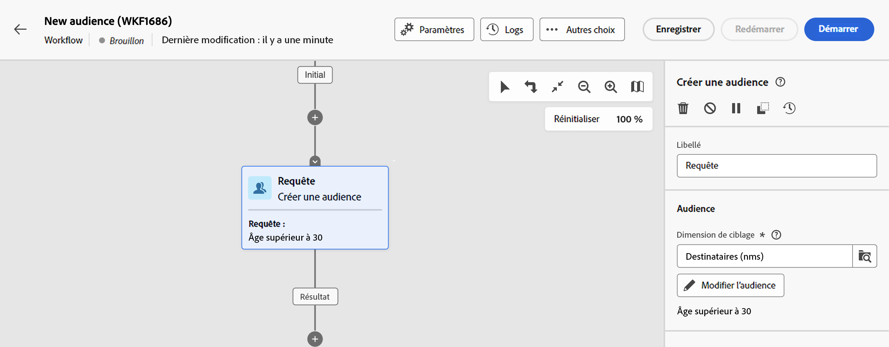

# Utilisation de filtres prédéfinis {#predefined-filters}

>[!CONTEXTUALHELP]
>id="acw_homepage_card3"
>title="Gestion des filtres prédéfinis"
>abstract="Le web de Campaign vous offre désormais une interface conviviale pour gérer et personnaliser facilement des filtres prédéfinis en fonction de vos besoins spécifiques. Créez une fois et enregistrez pour une utilisation ultérieure."

>[!CONTEXTUALHELP]
>id="acw_predefined-filters-dashboard"
>title="Filtres prédéfinis"
>abstract="Le web de Campaign vous offre désormais une interface conviviale pour gérer et personnaliser facilement des filtres prédéfinis en fonction de vos besoins spécifiques. Créez une fois et enregistrez pour une utilisation ultérieure."

Les filtres prédéfinis sont des filtres personnalisés qui sont créés et enregistrés afin d’être disponibles pour une utilisation ultérieure. Ils peuvent être utilisés comme raccourcis lors d’opérations de filtrage avec le créateur de règles, par exemple lors du filtrage d’une liste de données ou de la création de l’audience d’une diffusion.

Vous pouvez utiliser des filtres intégrés existants pour accéder à un sous-ensemble spécifique de vos données, ou créer vos propres filtres prédéfinis et les enregistrer.

## Créer un filtre prédéfini {#create-predefined-filter}

>[!CONTEXTUALHELP]
>id="acw_predefined-filters-creation"
>title="Créer un filtre prédéfini"
>abstract="Saisissez un libellé pour le filtre prédéfini et sélectionnez le tableau auquel il s&#39;applique. Ouvrez les options supplémentaires pour ajouter une description et définir ce filtre comme favori. Utilisez ensuite le bouton &quot;Créer une règle&quot; pour définir les conditions de filtrage."

>[!CONTEXTUALHELP]
>id="acw_predefined-filters-rules"
>title="Création de règles de filtrage prédéfinies"
>abstract="Pour définir les conditions de filtrage de votre filtre personnalisé, cliquez sur le bouton &quot;Créer une règle&quot;."

### Création d’un filtre à partir du créateur de règles {#create-from-rule-builder}

Vous pouvez enregistrer un filtre personnalisé à partir du créateur de règles afin de le rendre disponible pour une utilisation ultérieure. Procédez comme suit :

1. Ouvrez le créateur de règles et définissez vos conditions de filtrage. Dans l&#39;exemple ci-dessous, vous filtrez les destinataires qui vivent à Madrid.
1. Cliquez sur le bouton **Sélectionner ou enregistrer un filtre** et sélectionnez **Enregistrer en tant que filtre**.

   

1. Sélectionner **Créer un nouveau filtre**, puis saisissez un nom et une description pour ce filtre.

   

   Si nécessaire, vous pouvez enregistrer le filtre en tant que favori. En savoir plus dans [cette section](#fav-filter).

1. Cliquez sur **Confirmer** pour sauvegarder vos changements.

Votre filtre personnalisé est désormais disponible dans la **Filtres prédéfinis** Liste et accessible à tous les utilisateurs de Campaign.

### Créer un filtre à partir de la liste des filtres {#create-filter-from-list}

Vous pouvez créer un filtre à partir du **Filtres prédéfinis** dans le menu de gauche. Pour ce faire, suivez les étapes ci-après :

1. Parcourez les **Filtres prédéfinis** dans le menu de gauche.
1. Cliquez sur le bouton **Créer un filtre** bouton .
1. Saisissez le nom du filtre et, dans la **Type de document** , sélectionnez le schéma auquel il s’applique. Le schéma par défaut est : `Recipients(nms)`.

   Si nécessaire, vous pouvez enregistrer le filtre en tant que favori. En savoir plus dans [cette section](#fav-filter).

1. Définissez la règle pour le filtre. Par exemple, les profils de plus de 30 ans.

   

1. Enregistrez vos modifications. Le filtre est ajouté à la liste des filtres prédéfinis.

## Enregistrer votre filtre comme favori {#fav-filter}

Lors de la création d’un filtre prédéfini, vous pouvez activer la fonction **Enregistrer en tant que favori** si vous souhaitez voir ce filtre prédéfini dans vos favoris.

Lorsqu’un filtre est enregistré comme favori, il est disponible pour tous les utilisateurs de la variable **Filtres favoris** de la liste de création de filtre, comme illustré ci-dessous :

## Utiliser un filtre prédéfini {#use-predefined-filter}

Les filtres prédéfinis sont disponibles lors de la définition des propriétés de règle. Pour accéder aux filtres prédéfinis, choisissez la **Sélectionner un filtre personnalisé** dans la liste déroulante du créateur de règles.

Vous pouvez ensuite accéder à la liste complète des filtres prédéfinis disponibles pour le contexte actuel.

Vous pouvez également utiliser les raccourcis de filtrage disponibles dans la **Filtres favoris** de la liste déroulante. En savoir plus sur les favoris dans [cette section](#fav-filter).

Par exemple, pour créer une audience à partir d’un filtre prédéfini, procédez comme suit :

1. Parcourez les **Audiences** dans le menu de gauche.
1. Cliquez sur le bouton **Création d’une audience** bouton .
1. Saisissez le nom de l’audience, puis cliquez sur le bouton **Création d’une audience** bouton .
1. Sélectionnez la variable **Requête** activité, puis, dans le volet de droite, cliquez sur **Créer une audience** bouton .

   

1. Dans la **Bouton Sélectionner ou enregistrer un filtre**, choisissez la variable **Sélectionner un filtre personnalisé** .

   

1. Accédez au filtre prédéfini à utiliser pour créer l’audience, sélectionnez-la et confirmez-la.

   

1. Vérifiez les propriétés de la règle pour ce filtre et confirmez.

   

   Le filtre est désormais utilisé comme requête dans la variable **Requête** activité.

   

1. Enregistrez vos modifications et cliquez sur le bouton **Début** pour créer l’audience et la rendre disponible dans la liste des audiences.

## Gestion des filtres prédéfinis {#manage-predefined-filter}

Les filtres prédéfinis sont tous regroupés dans l’entrée dédiée du menu de navigation de gauche.

Dans cette liste, vous pouvez créer un nouveau filtre, comme décrit ci-dessus, et :

* modifier un filtre existant, puis modifier ses règles et ses propriétés ;
* dupliquer un filtre prédéfini
* suppression d’un filtre prédéfini

Vous pouvez ajouter un filtre prédéfini comme favori pour un accès rapide lors de la création de vos règles. En savoir plus dans [cette section](#fav-filter).

## Filtres prédéfinis intégrés {#ootb-predefined-filter}

Campaign est fourni avec un ensemble de filtres prédéfinis, créés à partir de la console cliente. Ces filtres peuvent être utilisés pour définir vos audiences et règles. Ils ne doivent pas être modifiés.
