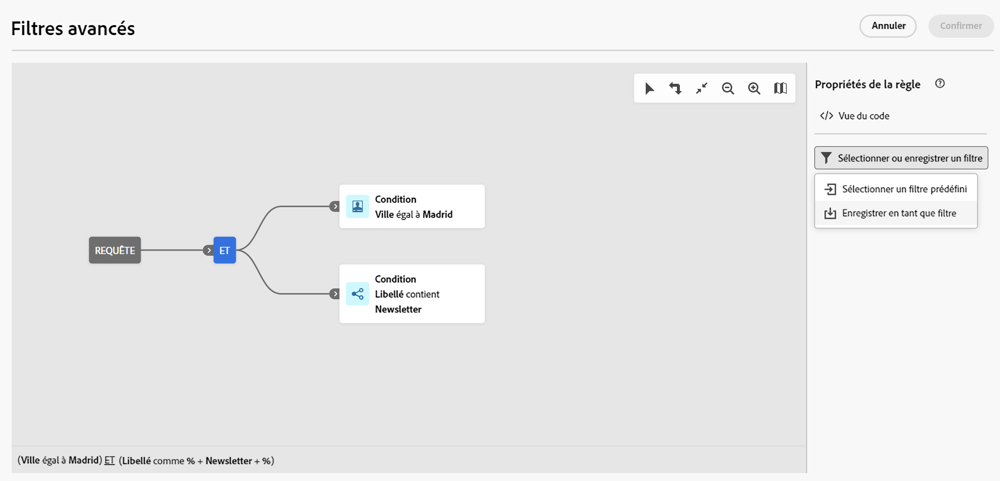
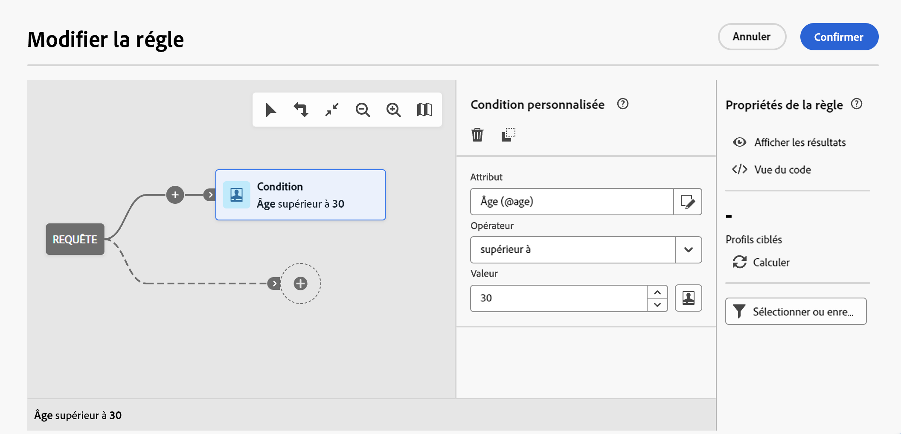
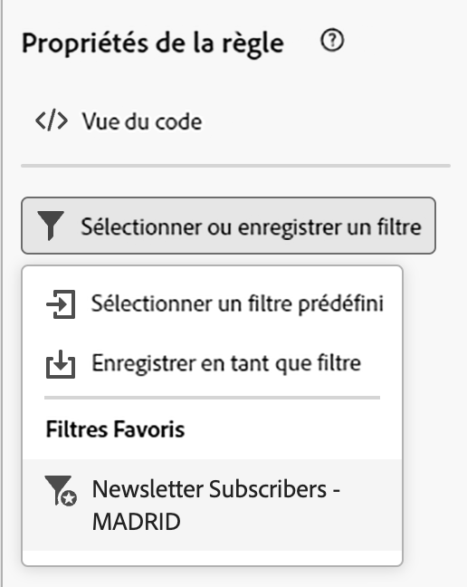
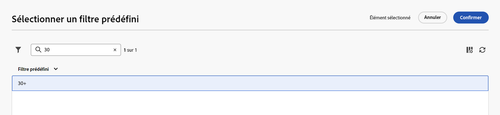

# Utiliser des filtres prédéfinis {#predefined-filters}

>[!CONTEXTUALHELP]
>id="acw_homepage_learning_card4"
>title="Gestion des filtres prédéfinis"
>abstract="L’interface utilisateur web de Campaign vous offre désormais une interface conviviale pour gérer et personnaliser facilement des filtres prédéfinis qui répondent à vos besoins spécifiques. Créez une fois et enregistrez pour une utilisation ultérieure."

<!--TO REMOVE BELOW-->
>[!CONTEXTUALHELP]
>id="acw_homepage_card4"
>title="Gestion des filtres prédéfinis"
>abstract="L’interface utilisateur web de Campaign vous offre désormais une interface conviviale pour gérer et personnaliser facilement des filtres prédéfinis qui répondent à vos besoins spécifiques. Créez une fois et enregistrez pour une utilisation ultérieure."

<!--TO REMOVE ABOVE-->

>[!CONTEXTUALHELP]
>id="acw_predefined-filters-dashboard"
>title="Filtres prédéfinis"
>abstract="L’interface utilisateur web de Campaign vous offre désormais une interface conviviale pour gérer et personnaliser facilement des filtres prédéfinis qui répondent à vos besoins spécifiques. Créez une fois et enregistrez pour une utilisation ultérieure."

Les filtres prédéfinis sont des filtres personnalisés qui sont créés et enregistrés afin d’être disponibles pour une utilisation ultérieure. Ils peuvent être utilisés comme raccourcis lors d’opérations de filtrage avec le concepteur de requête, par exemple lors du filtrage d’une liste de données ou de la création de l’audience d’une diffusion.

Vous pouvez utiliser des filtres intégrés existants pour accéder à un sous-ensemble spécifique de vos données ou créer vos propres filtres prédéfinis et les enregistrer.

>[!IMPORTANT]
>
>Dans cette version du produit, lors de la création de règles, de la sélection de l’audience d’une diffusion ou de la création d’une audience dans un workflow, certains filtres prédéfinis ne sont pas disponibles dans l’interface utilisateur. Vous pouvez toujours les utiliser. [En savoir plus](guardrails.md#predefined-filters-filters-guardrails-limitations)

## Créer un filtre prédéfini {#create-predefined-filter}

>[!CONTEXTUALHELP]
>id="acw_predefined-filters-creation"
>title="Créer un filtre prédéfini"
>abstract="Saisissez un libellé pour le filtre prédéfini et sélectionnez le tableau auquel il s’applique. Ouvrez les options supplémentaires pour ajouter une description et définir ce filtre comme favori. Utilisez ensuite le bouton « Créer une règle » pour définir les conditions de filtrage."

>[!CONTEXTUALHELP]
>id="acw_predefined-filters-rules"
>title="Créer des règles de filtrage prédéfinies"
>abstract="Pour définir les conditions de filtrage de votre filtre personnalisé, cliquez sur le bouton « Créer une règle »."

### Créer un filtre à partir du concepteur de requête {#create-from-rule-builder}

Vous pouvez enregistrer un filtre personnalisé à partir du [concepteur de requête](../query/query-modeler-overview.md) afin de le rendre disponible pour une utilisation ultérieure. Procédez comme suit :

1. Ouvrez le concepteur de requête et définissez vos conditions de filtrage. Dans l’exemple ci-dessous, vous filtrez les personnes destinataires qui vivent à Madrid et qui ont un abonnement à une newsletter.
1. Cliquez sur le bouton **Sélectionner ou enregistrer un filtre** et sélectionnez **Enregistrer en tant que filtre**.

   

1. Sélectionnez **Créer un filtre**, puis saisissez un nom et une description pour ce filtre.

   

   Si nécessaire, vous pouvez enregistrer le filtre en tant que favori. En savoir plus dans [cette section](#fav-filter).

1. Cliquez sur **Confirmer** pour sauvegarder vos changements.

Votre filtre personnalisé est désormais disponible dans la liste des **Filtres prédéfinis** et accessible à tous les utilisateurs et utilisatrices de Campaign.

### Créer un filtre à partir de la liste des filtres {#create-filter-from-list}

Vous pouvez créer un filtre à partir de l’entrée **Filtres prédéfinis** dans le menu de gauche. Pour ce faire, suivez les étapes ci-après :

1. Parcourez l’entrée **Filtres prédéfinis** dans le menu de gauche.
1. Cliquez sur le bouton **Créer un filtre**.
1. Saisissez le nom du filtre et, dans le champ **Type de document**, sélectionnez le schéma auquel il s’applique. Le schéma par défaut est `Recipients(nms)`.

1. Définissez la règle pour le filtre. Par exemple, les profils de plus de 30 ans.

   

1. Enregistrez vos modifications.

   

Le filtre est ajouté à la liste des filtres prédéfinis. Si nécessaire, vous pouvez enregistrer le filtre en tant que favori. En savoir plus dans [cette section](#fav-filter).

## Enregistrez votre filtre comme favori. {#fav-filter}

Lors de la création d’un filtre prédéfini, vous pouvez activer l’option **Enregistrer en tant que favori** si vous souhaitez voir ce filtre prédéfini dans vos favoris.

Lorsqu’un filtre est enregistré comme favori, il est disponible pour tous les utilisateurs et utilisatrices de la section **Filtres favoris** de la liste de création de filtre, comme illustré ci-dessous :

{width="30%" align="left"}

## Utiliser un filtre prédéfini {#use-predefined-filter}

Les filtres prédéfinis sont disponibles lors de la définition des propriétés de règle. Pour accéder aux filtres prédéfinis, choisissez la **Sélectionner un filtre personnalisé** dans la liste déroulante du modèle de requête.

Vous pouvez ensuite accéder à la liste complète des filtres prédéfinis disponibles pour le contexte actuel.

Vous pouvez également utiliser les raccourcis de filtrage disponibles dans la section **Filtres favoris** de la liste déroulante. Pour en savoir plus sur les favoris, consultez [cette section](#fav-filter).

Par exemple, pour créer une audience à partir d’un filtre prédéfini, procédez comme suit :

1. Parcourez l’entrée **Audiences** dans le menu de gauche.
1. Cliquez sur le bouton **Créer une audience**.
1. Saisissez le nom de l’audience, puis cliquez sur le bouton **Créer une audience**.
1. Sélectionnez l’activité **Requête**, puis, dans le volet de droite, cliquez sur le bouton **Créer une audience**.

   

1. À partir du **bouton Sélectionner ou enregistrer un filtre**, choisissez l’option **Sélectionner un filtre personnalisé**.

   

1. Accédez au filtre prédéfini à utiliser pour créer l’audience, sélectionnez-le et confirmez.

   

1. Vérifiez les propriétés de règle pour ce filtre et confirmez.

   Le filtre est désormais utilisé comme requête dans l’activité **Requête**.

   

1. Enregistrez vos modifications et cliquez sur le bouton **Démarrer** pour créer l’audience et la rendre disponible dans la liste des audiences.

## Gérer vos filtres prédéfinis {#manage-predefined-filter}

Les filtres prédéfinis sont tous regroupés dans l’entrée dédiée du menu de navigation de gauche.

Dans cette liste, vous pouvez créer un nouveau filtre, comme décrit ci-dessus, et :

* modifier un filtre existant, puis modifier ses règles et ses propriétés ;
* dupliquer un filtre prédéfini ;
* supprimer un filtre prédéfini.

Vous pouvez ajouter un filtre prédéfini comme favori pour un accès rapide lors de la création de vos audiences. En savoir plus dans [cette section](#fav-filter).

<!--
## Built-in predefined filters {#ootb-predefined-filter}

Campaign comes with a set of predefined filters, built from the client console. These filters can be used to define your audiences, and rules. They must not be modified.
-->
