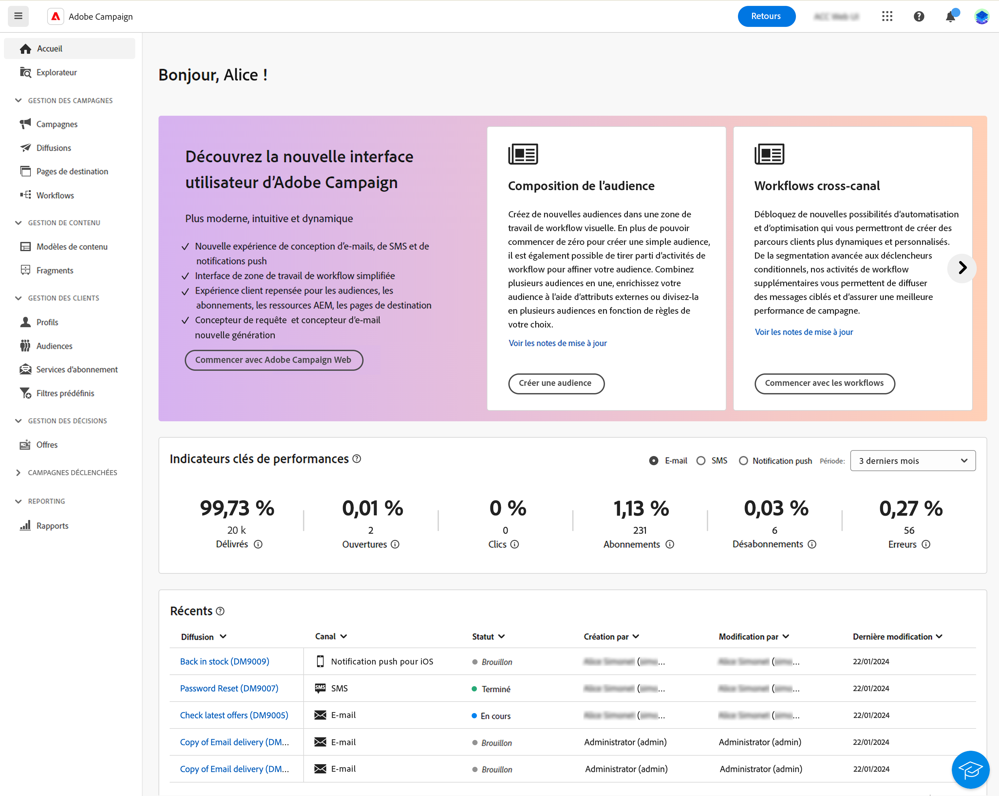
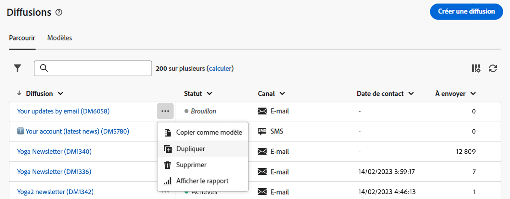
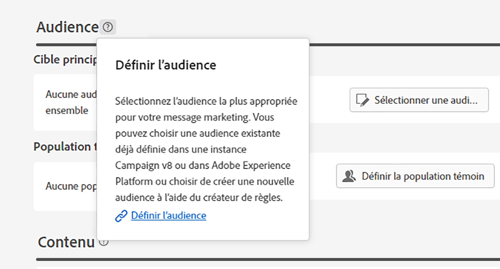

# Découvrir l’interface {#user-interface}

La nouvelle interface web de Campaign v8 offre une expérience utilisateur moderne et intuitive, afin de simplifier la conception et la diffusion des campagnes marketing. Cette nouvelle interface est intégrée aux applications et solutions Adobe Experience Cloud.

>[!NOTE]
>
>Cette documentation est fréquemment mise à jour pour prendre en compte les dernières modifications apportées à l’interface utilisateur du produit. Cependant, certaines captures d’écran peuvent légèrement différer de votre interface utilisateur.

## Menu de navigation gauche {#user-interface-left-nav}

Parcourez les liens situés à gauche pour accéder aux fonctionnalités de Campaign v8 Web. Plusieurs liens affichent des listes d’objets qui peuvent être triés et filtrés. Vous pouvez également configurer des colonnes pour afficher toutes les informations dont vous avez besoin. Consultez cette [section](#list-screens). Certains écrans de liste sont en lecture seule. Les éléments affichés dans le menu de navigation de gauche dépendent de vos autorisations. Pour en savoir plus sur les autorisations, consultez [cette section](permissions.md).

### Accueil {#user-interface-home}

Les liens et les ressources clés de cet écran offrent un accès rapide aux principales fonctionnalités de Campaign v8 Web.

>[!CONTEXTUALHELP]
>id="acw_homepage_recent"
>title="Récents"
>abstract="La liste **Récents** offre des raccourcis vers les diffusions récemment créées et modifiées. Cette liste affiche le canal, le statut, le ou la propriétaire, les dates de création et de modification."

La liste **Récents** offre des raccourcis vers les diffusions récemment créées et modifiées. Cette liste affiche le canal, le statut, le ou la propriétaire, les dates de création et de modification. Cliquez sur le bouton **Afficher plus** pour charger d’autres diffusions.

Les **indicateurs clés de performance** vous permettent de vérifier l’efficacité de votre plateforme grâce aux KPI courants. Pour en savoir plus sur les KPI, consultez [cette page](../reporting/kpis.md).

Accédez aux pages principales d’aide de Campaign v8 Web depuis la section **Formation** de la page d’accueil.

### Explorateur {#user-interface-explorer}

>[!CONTEXTUALHELP]
>id="acw_explorer"
>title="Explorateur"
>abstract="Le menu **Explorateur** affiche tous les composants et objets Campaign avec la même hiérarchie de dossiers que celle de la console cliente. Parcourez tous vos composants, dossiers et schémas Campaign v8, vérifiez les autorisations associées et créez des dossiers et des sous-dossiers à partir de ce menu."

Le menu **Explorateur** affiche toutes les ressources et tous les objets Campaign avec la même hiérarchie de dossiers que celle de la console cliente. Parcourez tous les composants, dossiers et schémas de Campaign v8 et créez des diffusions, des workflows et des campagnes.

Les éléments affichés dans l’**Explorateur** dépendent de vos autorisations. Vous pouvez également ajouter des dossiers et des sous-dossiers, si vous disposez des droits adéquats. Pour en savoir plus sur les autorisations, consultez [cette section](permissions.md).

Vous pouvez configurer des colonnes pour personnaliser l’affichage afin de consulter toutes les informations dont vous avez besoin. Consultez cette [section](#list-screens). Vous pouvez également ajouter des dossiers et des sous-dossiers, comme décrit dans [cette section](permissions.md#folders).

Pour plus d’informations sur l’explorateur Campaign, la hiérarchie des dossiers et les ressources, reportez-vous à la [documentation de Campaign v8 (console)](https://experienceleague.adobe.com/docs/campaign/campaign-v8/new/campaign-ui.html?lang=fr#ac-explorer-ui){target="_blank"}.

### Campaign Management {#user-interface-campaign-management}

Dans la section GESTION DE CAMPAGNES, vous pouvez accéder aux campagnes marketing, aux diffusions et aux workflows.

* **Campagnes** : il s’agit de la liste de vos campagnes et modèles de campagne. Par défaut, pour chaque campagne, vous pouvez afficher les dates de début, de fin, de création, de dernière modification, le statut actuel et le nom de l’opérateur ou de l’opératrice Campaign qui l’a créée. Vous pouvez filtrer la liste par statut, dates de début et de fin, ou par dossier, ou créer un filtre avancé afin de définir vos propres critères de filtrage. En savoir plus sur les campagnes [dans cette section](../campaigns/gs-campaigns.md).

* **Diffusions** - Parcourez votre liste de diffusions. Vous pouvez consulter leur état, date de dernière modification ainsi que les principaux KPI. Vous pouvez filtrer la liste par statut, date de contact ou canal. Pour obtenir une vue d’ensemble des détails d’une diffusion e-mail, cliquez sur celle-ci afin d’ouvrir son tableau de bord. Les diffusions sur d’autres canaux sont en lecture seule. Pour en savoir plus sur les diffusions, consultez [cette section](../msg/gs-messages.md).

  Utilisez le bouton **Autres actions** pour supprimer ou dupliquer une diffusion.

  {width="70%" align="left"}

* **Workflows** : dans cet écran, vous pouvez accéder à la liste complète des workflows et des modèles de workflows. Vous pouvez vérifier leur statut, les dates de dernière exécution ou de prochaine exécution, et créer un nouveau workflow ou un nouveau modèle de workflow. Vous pouvez filtrer la liste selon les mêmes critères que pour les autres objets. En outre, vous pouvez filtrer les workflows appartenant ou non à une campagne. Pour en savoir plus sur les workflows, consultez [cette section](../workflows/gs-workflows.md).

### Gestion des clients {#user-interface-customer-management}

Dans la section GESTION DES CLIENTS, vous pouvez afficher vos destinataires, vos audiences et vos abonnements. Ces listes sont en lecture seule.

* **Destinataires** - Accédez à la base de données des destinataires. Par défaut, vous pouvez consulter leur adresse e-mail, prénom et nom. Pour en savoir plus sur les destinataires, consultez [cette section](../audience/about-recipients.md).
* **Audiences** - Il s’agit de votre liste d’audiences. Par défaut, vous pouvez consulter leur type, origine, date de création/dernière modification et libellé. Vous pouvez filtrer la liste par origine. Pour en savoir plus sur les audiences, consultez [cette section](../audience/about-recipients.md).
* **Listes d’abonnements** : parcourez vos listes d’abonnements. Par défaut, vous pouvez consulter leur type, mode et libellé. Découvrez comment gérer les abonnements et les désabonnements dans la [documentation d’Adobe Campaign v8 (console)](https://experienceleague.adobe.com/docs/campaign/campaign-v8/campaigns/send/subscriptions.html?lang=fr){target="_blank"}.

### Gestion des décisions {#decision-management}

>[!CONTEXTUALHELP]
>id="acw_offers_list"
>title="Offres"
>abstract="Parcourez les listes d’offres et de modèles d’offres qui ont été créées dans la console à l’aide du module **Interaction**. Ces listes sont en lecture seule."
>additional-url="https://experienceleague.adobe.com/docs/campaign-web/v8/msg/offers.html?lang=fr" text="Ajouter des offres à une diffusion"

Dans la section GESTION DES DÉCISIONS, vous pouvez visualiser les offres et les modèles d’offres. Ces listes sont en lecture seule.

* **Offres** - Parcourez la liste des offres et des modèles d’offres créés dans la console à l’aide du module **Interaction**. Par défaut, vous pouvez consulter leur statut, les dates de début/fin et leur environnement. Vous pouvez filtrer la liste par statut et par dates de début/fin. Des modèles d’offre sont également disponibles.

Découvrez comment créer et envoyer des offres dans des e-mails et des SMS dans [cette section](../content/offers.md).

## Aide contextuelle {#user-interface-help}

Une aide contextuelle est disponible dans l’interface. Si elle est présente, cliquez sur l’icône `?` pour afficher des informations d’aide et des liens vers la documentation connexe.

{width="40%" align="left"}

Avec la nouvelle version Beta, l’**assistant de connaissances optimisé par l’IA** incorporé dans l’aide contextuelle révolutionne la recherche de documentation et la réponse aux questions pratiques en analysant facilement de vastes référentiels de documentation grâce à l’identification instantanée des informations précises dont vous avez besoin.

Grâce aux fonctionnalités de l’IA générative de Campaign, cet assistant transforme votre expérience, en facilitant la récupération d’informations et la résolution de problèmes. Que vous soyez à la recherche de conseils dans une tâche complexe ou que vous parcouriez des documents volumineux, notre assistant de connaissances optimisé par l’IA devient votre meilleur compagnon, en vous offrant une efficacité et une précision inégalées à chaque interaction.

En savoir plus dans [cette section](using-ai.md).

## En savoir plus {#learn-more}

Découvrez [sur cette page](list-filters.md) comment parcourir, rechercher et filtrer les listes disponibles dans votre environnement Campaign.

<!--
######## This part stores the contextualHelp definition for WebUI BETA ###########
######## These blocks should be dispatched in the appropriate pages when available ###########
######## PLEASE DO NOT DELETE ###########
REFER TO 
https://wiki.corp.adobe.com/pages/viewpage.action?spaceKey=neolane&title=v8+WebUI+Contextual+Help+%3CALPHA%3E-+Official+list
-->

>[!CONTEXTUALHELP]
>id="acw_push_permission_for_segment"
>title="Autorisation requise"
>abstract="Avant de pouvoir créer un segment, votre administrateur ou administratrice doit vous accorder une autorisation."

>[!CONTEXTUALHELP]
>id="acw_push_overview_edit"
>title="Autorisation requise"
>abstract="Avant de pouvoir créer un segment, votre administrateur ou administratrice doit vous accorder une autorisation."

<!-- Workflows-->

<!-- delivery template settings-->

>[!CONTEXTUALHELP]
>id="acw_global_reporting_sending"
>title="Envoi de rapports globaux"
>abstract="Les mesures des rapports de suivi sont visibles dans cet écran."

>[!CONTEXTUALHELP]
>id="acw_global_reporting_tracking"
>title="Suivi des rapports globaux"
>abstract="Les mesures des rapports de suivi sont visibles dans cet écran."

>[!CONTEXTUALHELP]
>id="acw_campaign_workflow_list"
>title="Liste des workflows dans une campagne"
>abstract="Liste des workflows dans une campagne"

<!-- delivery settings-->

<!-- FOR BETA (alignment) -->
<!--https://wiki.corp.adobe.com/display/neolane/v8+WebUI+Contextual+Help+%3CBETA%3E-+Official+list-->

<!-- FOR GA -->
<!-- Aligned with https://wiki.corp.adobe.com/display/neolane/v8+WebUI+Contextual+Help+%3CGA%3E-+Official+list -->

>[!CONTEXTUALHELP]
>id="acw_recipients_creation_list"
>title="Création de destinataires"
>abstract="Création de destinataires"

>[!CONTEXTUALHELP]
>id="acw_recipients_creation_details"
>title="Détails des destinataires"
>abstract="Détails des destinataires"

>[!CONTEXTUALHELP]
>id="acw_recipients_creation_contactinformation"
>title="Coordonnées des destinataires"
>abstract="Coordonnées des destinataires"

>[!CONTEXTUALHELP]
>id="acw_recipients_creation_address"
>title="Adresse des destinataires"
>abstract="Adresse des destinataires"

>[!CONTEXTUALHELP]
>id="acw_recipients_creation_account"
>title="Compte des destinataires"
>abstract="Compte des destinataires"

>[!CONTEXTUALHELP]
>id="acw_recipients_creation_customfields"
>title="Champs personnalisés des destinataires"
>abstract="Champs personnalisés des destinataires"

>[!CONTEXTUALHELP]
>id="acw_recipients_creation_cardoverview"
>title="Présentation de la carte des destinataires"
>abstract="Présentation de la carte des destinataires"

>[!CONTEXTUALHELP]
>id="acw_recipients_creation_touchpoints"
>title="Points de contact des destinataires"
>abstract="Points de contact des destinataires"

>[!CONTEXTUALHELP]
>id="acw_recipients_subscription_list"
>title="Liste des abonnements des destinataires"
>abstract="Liste des abonnements des destinataires"

>[!CONTEXTUALHELP]
>id="acw_recipients_subscription_selection"
>title="Sélection des abonnements des destinataires"
>abstract="Sélection des abonnements des destinataires"

>[!CONTEXTUALHELP]
>id="acw_recipients_offers_eligible_list"
>title="Les destinataires proposent une liste éligible"
>abstract="Les destinataires proposent une liste éligible"

>[!CONTEXTUALHELP]
>id="acw_recipients_offers_preview_proposition"
>title="Prévisualisation des offres des destinataires"
>abstract="Prévisualisation des offres des destinataires"

>[!CONTEXTUALHELP]
>id="acw_subscriptions_delivery_template"
>title="Modèle de diffusion Abonnements"
>abstract="Modèle de diffusion Abonnements"

>[!CONTEXTUALHELP]
>id="acw_landingpages_menu"
>title="Landing pages"
>abstract="Landing pages"

>[!CONTEXTUALHELP]
>id="acw_landingpages_properties"
>title="Propriétés Landing Pages"
>abstract="Propriétés Landing Pages"

>[!CONTEXTUALHELP]
>id="acw_landingpages_pages_list"
>title="Pages d’entrée"
>abstract="Pages d’entrée"

>[!CONTEXTUALHELP]
>id="acw_landingpages_schedule"
>title="Planification des pages d’entrée"
>abstract="Planification des pages d’entrée"

>[!CONTEXTUALHELP]
>id="acw_landingpages_primarypage"
>title="Page principale Pages d’entrée"
>abstract="Page principale Pages d’entrée"

>[!CONTEXTUALHELP]
>id="acw_landingpages_subscription"
>title="Abonnement aux landing pages"
>abstract="Abonnement aux landing pages"

>[!CONTEXTUALHELP]
>id="acw_landingpages_calltoaction"
>title="Appel à l’action des pages d’entrée"
>abstract="Appel à l’action des pages d’entrée"

>[!CONTEXTUALHELP]
>id="acw_landingpages_simulate"
>title="Simulation des pages d’entrée"
>abstract="Simulation des pages d’entrée"

>[!CONTEXTUALHELP]
>id="acw_orchestration_query_enrichment_noneditable"
>title="Activité non modifiable"
>abstract="Activité non modifiable"

>[!CONTEXTUALHELP]
>id="acw_fragments_menu"
>title="Fragments"
>abstract="Fragments"

>[!CONTEXTUALHELP]
>id="acw_fragments_save"
>title="Enregistrement des fragments"
>abstract="Enregistrement des fragments"

>[!CONTEXTUALHELP]
>id="acw_fragments_create"
>title="Création de fragments"
>abstract="Création de fragments"

>[!CONTEXTUALHELP]
>id="acw_fragments_properties"
>title="Propriétés des fragments"
>abstract="Propriétés des fragments"

>[!CONTEXTUALHELP]
>id="acw_fragments_type"
>title="Type de fragment"
>abstract="Type de fragment"

>[!CONTEXTUALHELP]
>id="acw_fragments_list"
>title="Liste de fragments"
>abstract="Liste de fragments"

>[!CONTEXTUALHELP]
>id="acw_fragments_details"
>title="Détails des fragments"
>abstract="Détails des fragments"

>[!CONTEXTUALHELP]
>id="acw_contenttemplate_menu"
>title="Modèle de contenu"
>abstract="Modèle de contenu"

>[!CONTEXTUALHELP]
>id="acw_contenttemplate_properties"
>title="Propriétés du modèle de contenu"
>abstract="Propriétés du modèle de contenu"

>[!CONTEXTUALHELP]
>id="acw_contenttemplate_design"
>title="Conception de modèle de contenu"
>abstract="Conception de modèle de contenu"

>[!CONTEXTUALHELP]
>id="acw_contenttemplate_selection"
>title="Sélection du modèle de contenu"
>abstract="Sélection du modèle de contenu"

>[!CONTEXTUALHELP]
>id="acw_orchestration_loadfile"
>title="Chargement de fichier  activité"
>abstract="Chargement de fichier  activité"

>[!CONTEXTUALHELP]
>id="acw_orchestration_reconciliation"
>title="Activité Réconciliation"
>abstract="Activité Réconciliation"

>[!CONTEXTUALHELP]
>id="acw_orchestration_reconciliation_targeting"
>title="Ciblage de la réconciliation"
>abstract="Ciblage de la réconciliation"

>[!CONTEXTUALHELP]
>id="acw_orchestration_reconciliation_rules"
>title="Règles de réconciliation"
>abstract="Règles de réconciliation"

>[!CONTEXTUALHELP]
>id="acw_orchestration_reconciliation_targeting_selection"
>title="Dimension de ciblage de réconciliation"
>abstract="Dimension de ciblage de réconciliation"

>[!CONTEXTUALHELP]
>id="acw_orchestration_reconciliation_field"
>title="Champ de sélection de la réconciliation"
>abstract="Champ de sélection de la réconciliation"

>[!CONTEXTUALHELP]
>id="acw_orchestration_reconciliation_attribute"
>title="Attribut de sélection de réconciliation"
>abstract="Attribut de sélection de réconciliation"

>[!CONTEXTUALHELP]
>id="acw_orchestration_reconciliation_condition"
>title="Condition de création de réconciliation"
>abstract="Condition de création de réconciliation"

>[!CONTEXTUALHELP]
>id="acw_orchestration_reconciliation_complement"
>title="Génération d’une réconciliation complémentaire"
>abstract="Génération d’une réconciliation complémentaire"

>[!CONTEXTUALHELP]
>id="acw_conditionalcontent_savefilter"
>title="Filtre d’enregistrement de contenu conditionnel"
>abstract="Filtre d’enregistrement de contenu conditionnel"

>[!CONTEXTUALHELP]
>id="acw_conditionalcontent_selectfilter"
>title="Filtre de sélection de contenu conditionnel"
>abstract="Filtre de sélection de contenu conditionnel"

>[!CONTEXTUALHELP]
>id="acw_conditionalcontent_subjectline"
>title="Contenu conditionnel sur la ligne d’objet"
>abstract="Contenu conditionnel sur la ligne d’objet"

>[!CONTEXTUALHELP]
>id="acw_conditionalcontent_subjectlinecondition"
>title="Condition d’objet du contenu conditionnel"
>abstract="Condition d’objet du contenu conditionnel"

>[!CONTEXTUALHELP]
>id="acw_audiences_properties"
>title="Propriétés de l&#39;audience"
>abstract="Propriétés de l&#39;audience"

>[!CONTEXTUALHELP]
>id="acw_audiences_count"
>title="Nombre d’audiences"
>abstract="Nombre d’audiences"

>[!CONTEXTUALHELP]
>id="acw_deliveries_simulate_testprofiles"
>title="Simulation des profils de test"
>abstract="Simulation des profils de test"

>[!CONTEXTUALHELP]
>id="acw_deliveries_simulate_profiles_selection"
>title="Simulation de la sélection de profils de test"
>abstract="Simulation de la sélection de profils de test"

>[!CONTEXTUALHELP]
>id="acw_deliveries_simulate_send_testprofiles"
>title="Simulation de l’envoi de profils de test"
>abstract="Simulation de l’envoi de profils de test"

>[!CONTEXTUALHELP]
>id="acw_deliveries_simulate_email_log"
>title="Simulation du journal des emails"
>abstract="Simulation du journal des emails"

>[!CONTEXTUALHELP]
>id="acw_subscriptions_totalnumber_subscribers"
>title="Nombre total d’abonnements"
>abstract="Nombre total d’abonnements"

>[!CONTEXTUALHELP]
>id="acw_subscriptions_overtheperiod_subscribers"
>title="Abonnements sur la période"
>abstract="Abonnements sur la période"

>[!CONTEXTUALHELP]
>id="acw_subscriptions_overallevolution_subscribers"
>title="Evolution globale des inscriptions"
>abstract="Evolution globale des inscriptions"
