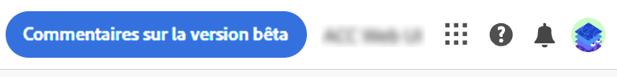
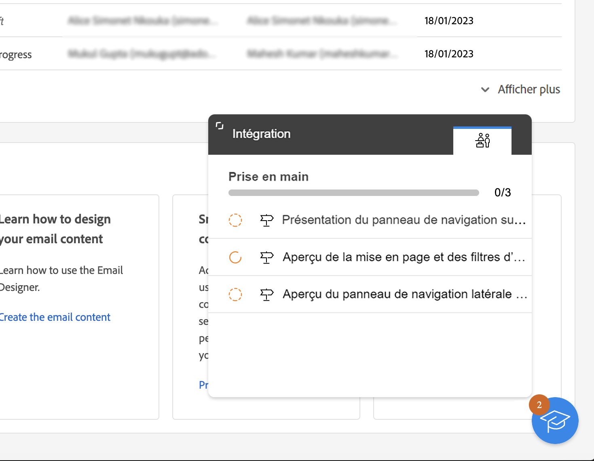

# Découvrir l’interface {#user-interface}

>[!CONTEXTUALHELP]
>id="acw_homepage_learnmore"
>title="Découvrir l’interface"
>abstract="La nouvelle interface de Campaign v8 Web offre une expérience client intégrée, intuitive et cohérente."

La nouvelle interface web de Campaign v8 Web offre une expérience utilisateur moderne et intuitive, afin de simplifier la conception et la diffusion des campagnes marketing. Cette nouvelle interface est intégrée à Adobe Experience Platform.

>[!NOTE]
>
>Cette documentation est fréquemment mise à jour pour prendre en compte les dernières modifications apportées à l’interface utilisateur du produit. Cependant, certaines captures d’écran peuvent légèrement différer de votre interface utilisateur.

## Menu de navigation gauche {#user-interface-left-nav}

Parcourez les liens situés à gauche pour accéder aux fonctionnalités de Campaign v8 Web. Plusieurs liens affichent des listes d’objets qui peuvent être triés et filtrés. Vous pouvez également configurer des colonnes pour afficher toutes les informations dont vous avez besoin. Consultez cette [section](#list-screens). Tous les écrans de type Liste sont en lecture seule, à l’exception de la liste de diffusion e-mail. La version Alpha ne permet pas de cliquer sur un élément de liste pour le modifier/visualiser. Toutes les listes pourront être modifiées dans les versions ultérieures. Les éléments affichés dans le menu de navigation de gauche dépendent de vos autorisations utilisateur.

### Accueil {#user-interface-home}

Les liens et les ressources clés de cet écran offrent un accès rapide aux principales fonctionnalités de Campaign v8 Web.

La liste **Récents** offre des raccourcis vers les diffusions récemment créées et modifiées. Cette liste affiche le canal, le statut, le ou la propriétaire, les dates de création et de modification.

Accédez aux pages principales d’aide de Campaign v8 Web depuis la section **Formation** de la page d’accueil.

### Explorateur {#user-interface-explorer}

>[!CONTEXTUALHELP]
>id="acw_explorer"
>title="Explorateur"
>abstract="Le menu **Explorateur** affiche tous les composants et objets Campaign avec la même hiérarchie de dossiers que celle de la console cliente. Parcourez tous les composants, dossiers et schémas de Campaign v8 et créez des diffusions, des workflows et des campagnes. Toutes les autres listes sont en lecture seule."

Le menu **Explorateur** affiche toutes les ressources et tous les objets Campaign avec la même hiérarchie de dossiers que celle de la console cliente. Parcourez tous les composants, dossiers et schémas de Campaign v8 et créez des diffusions, des workflows et des campagnes. Toutes les autres listes sont en lecture seule.

Les éléments affichés dans l’Explorateur dépendent de vos autorisations utilisateur.

Comme dans n’importe quel écran de liste, vous pouvez configurer des colonnes pour personnaliser l’affichage en fonction des informations que vous souhaitez. Consultez cette [section](#list-screens).

Pour plus d’informations sur l’explorateur Campaign, la hiérarchie des dossiers et les ressources, reportez-vous à la [documentation de Campaign v8 (console)](https://experienceleague.adobe.com/docs/campaign/campaign-v8/new/campaign-ui.html?lang=fr#ac-explorer-ui){target="_blank"}.

### Campaign Management {#user-interface-campaign-management}

>[!CONTEXTUALHELP]
>id="acw_campaigns_list"
>title="Campagnes"
>abstract="Il s’agit de la liste de vos campagnes. Vous pouvez afficher des informations utiles telles que leurs dates de début, de fin ou de dernière modification, ainsi que leur statut. Vous pouvez filtrer la liste par statut ou date de début/fin. Cliquez sur le bouton « Créer une campagne » pour ajouter une nouvelle campagne. Sélectionnez une campagne pour afficher son contenu, ses diffusions et ses détails. Accédez à l’onglet « Modèles » pour afficher et créer des modèles."

Dans la section GESTION DE CAMPAGNES, vous pouvez accéder aux campagnes marketing, aux diffusions et aux workflows.

* **Campagnes** : il s’agit de la liste de vos campagnes et modèles de campagne. Par défaut, pour chaque campagne, vous pouvez afficher les dates de début, de fin, de création, de dernière modification, le statut actuel et le nom de l’opérateur ou de l’opératrice Campaign qui l’a créée. Vous pouvez filtrer la liste par statut, dates de début et de fin, ou par dossier, ou créer un filtre avancé afin de définir vos propres critères de filtrage. En savoir plus sur les campagnes [dans cette section](../campaigns/gs-campaigns.md).

* **Diffusions** - Parcourez votre liste de diffusions. Vous pouvez consulter leur état, date de dernière modification ainsi que les principaux KPI. Vous pouvez filtrer la liste par statut, date de contact ou canal. Pour obtenir une vue d’ensemble des détails d’une diffusion e-mail, cliquez sur celle-ci afin d’ouvrir son tableau de bord. Les diffusions sur d’autres canaux sont en lecture seule. Pour en savoir plus sur les diffusions, consultez [cette section](../msg/gs-messages.md).

  Utilisez le bouton **Autres actions** pour supprimer ou dupliquer une diffusion.

  {width="70%" align="left"}

* **Workflows** : dans cet écran, vous pouvez accéder à la liste complète des workflows et des modèles de workflows. Vous pouvez vérifier leur statut, les dates de dernière exécution ou de prochaine exécution, et créer un nouveau workflow ou un nouveau modèle de workflow. Vous pouvez filtrer la liste selon les mêmes critères que pour les autres objets. En outre, vous pouvez filtrer les workflows appartenant ou non à une campagne. Pour en savoir plus sur les workflows, consultez [cette section](../workflows/gs-workflows.md).

### Gestion des clients {#user-interface-customer-management}

>[!CONTEXTUALHELP]
>id="acw_recipients_list"
>title="Destinataires"
>abstract="Accédez à la base de données des destinataires. Vous pouvez consulter des informations utiles telles que leur adresse e-mail, prénom et nom. Cette liste est en lecture seule."

>[!CONTEXTUALHELP]
>id="acw_audiences_list"
>title="Audiences"
>abstract="Il s’agit de votre liste d’audiences. Vous pouvez consulter leur type, origine, date de création/dernière modification et libellé. Vous pouvez filtrer la liste par origine. Cette liste est en lecture seule."

>[!CONTEXTUALHELP]
>id="acw_subscriptions_list"
>title="Listes d’abonnements"
>abstract="Parcourez les listes d’abonnements. Vous pouvez consulter leur type, mode et libellé. Cette liste est en lecture seule."

Dans la section GESTION DES CLIENTS, vous pouvez afficher vos destinataires, vos audiences et vos abonnements. Ces listes sont en lecture seule.

* **Destinataires** - Accédez à la base de données des destinataires. Par défaut, vous pouvez consulter leur adresse e-mail, prénom et nom. En savoir plus sur les destinataires dans la [documentation d’Adobe Campaign v8 (console)](https://experienceleague.adobe.com/docs/campaign/campaign-v8/audience/gs-audiences.html?lang=fr){target="_blank"}.
* **Audiences** - Il s’agit de votre liste d’audiences. Par défaut, vous pouvez consulter leur type, origine, date de création/dernière modification et libellé. Vous pouvez filtrer la liste par origine. En savoir plus sur les audiences et les listes dans la [documentation d’Adobe Campaign v8 (console)](https://experienceleague.adobe.com/docs/campaign/campaign-v8/audience/create-audiences/create-audiences.html?lang=fr){target="_blank"}.
* **Listes d’abonnements** : parcourez vos listes d’abonnements. Par défaut, vous pouvez consulter leur type, mode et libellé. Découvrez comment gérer les abonnements et les désabonnements dans la [documentation d’Adobe Campaign v8 (console)](https://experienceleague.adobe.com/docs/campaign/campaign-v8/campaigns/send/subscriptions.html?lang=fr){target="_blank"}.

### Gestion des décisions

>[!CONTEXTUALHELP]
>id="acw_offers_list"
>title="Offres"
>abstract="Parcourez votre liste d’offres Interaction. Par défaut, vous pouvez consulter leur état, les dates de début/fin et leur environnement. Vous pouvez filtrer la liste par statut et par date de début/fin. Des modèles d’offre sont également disponibles. Ces listes sont en lecture seule."

* **Offres** - Parcourez votre liste d’offres d’interaction. Par défaut, vous pouvez consulter leur état, les dates de début/fin et leur environnement. Vous pouvez filtrer la liste par statut et par date de début/fin. Des modèles d’offre sont également disponibles. Ces listes sont en lecture seule.

Découvrez comment créer et gérer des offres dans la [documentation d’Adobe Campaign v8 (console)](https://experienceleague.adobe.com/docs/campaign/campaign-v8/offers/interaction.html?lang=fr){target="_blank"}.

## Barre supérieure

La barre supérieure de l’interface vous permet d’effectuer les actions suivantes :

* partager vos commentaires en tant que testeur ou testeuse Alpha,
* basculer entre les organisations et les instances,
* basculer entre les applications Adobe Experience Cloud,
* accéder aux pages d’aide, contacter le support et partager vos commentaires. Vous pouvez rechercher des articles et des vidéos d’aide dans le champ de recherche.

{width="50%" align="left"}
<!--
Org / Sub-org switcher to switch between instances. Only one for Alpha. Later: intermerdiate screen with Control Panel (beta). if v8 + ACS with one card per ACS instance. Maybe quickly explain the menu for Alpha?
-->

## Aide contextuelle {#contextual-help}

Une aide contextuelle est disponible dans l’interface. Si elle est présente, cliquez sur l’icône `?` pour afficher des informations d’aide et des liens vers la documentation connexe.

{width="40%" align="left"}

<!--An on-boarding guide is also available to help you get started with Campaign v8 Web. Click the icon in the bottom right corner, choose one of the available step-by-step scenarios, and simply follow the instructions.

{width="70%" align="left"}-->

## Navigateurs pris en charge {#browsers}

Campaign v8 Web est conçu pour fonctionner de manière optimale dans la dernière version de Google Chrome, Safari et Microsoft Edge. Vous pouvez rencontrer des problèmes lors de l’utilisation de certaines fonctionnalités sur des versions plus anciennes ou d’autres navigateurs.

## Préférences de langue {#language-pref}

Campaign v8 Web est actuellement disponible dans les langues suivantes :

<table>
<tr>
<td>

Anglais (États-Unis) - EN-US

Français - FR

Allemand - DE

Italien - IT

</td>
<td>

Espagnol - ES

Portugais (Brésil) - PTBR

Japonais - JP

</td>
<td>

Coréen - KR

Chinois simplifié - CHS

Chinois traditionnel - CHT

</td>
</tr>
</table>

La langue de votre interface par défaut est déterminée par la langue préférée spécifiée dans votre profil utilisateur.

Pour changer de langue :

1. Cliquez sur l’icône de votre profil, en haut à droite, puis sélectionnez **Préférences**.
1. Cliquez ensuite sur le lien de la langue affichée sous votre adresse e-mail.
1. Sélectionnez la langue de votre choix et cliquez sur **Enregistrer**. Vous pouvez sélectionner une seconde langue au cas où le composant que vous utilisez n’est pas localisé dans votre première langue.

## En savoir plus {#learn-more}

Découvrez comment parcourir, rechercher et filtrer les listes disponibles dans votre environnement Campaign [dans cette page](list-filters.md).

<!--
######## This part stores the contextualHelp definition for WebUI BETA ###########
######## These blocks should be dispatched in the appropriate pages when available ###########
######## PLEASE DO NOT DELETE ###########
REFER TO 
https://wiki.corp.adobe.com/pages/viewpage.action?spaceKey=neolane&title=v8+WebUI+Contextual+Help+%3CALPHA%3E-+Official+list
-->

>[!CONTEXTUALHELP]
>id="acw_targetdata_personalization_enrichmentdata"
>title="Données d’enrichissement"
>abstract="À déterminer"

>[!CONTEXTUALHELP]
>id="acw_campaign_reporting_sending"
>title="Envoi des rapports"
>abstract="Consultez les indicateurs d’envoi pour le reporting de la campagne."

>[!CONTEXTUALHELP]
>id="acw_campaign_reporting_tracking"
>title="Tracking des rapports"
>abstract="Consultez les indicateurs de tracking pour le reporting de la campagne."

>[!CONTEXTUALHELP]
>id="acw_campaign_reporting_deliveries_overview"
>title="Présentation des rapports"
>abstract="Mesures clés de votre diffusion."

>[!CONTEXTUALHELP]
>id="acw_campaign_reporting_deliveries_target"
>title="Rapports sur les statistiques cibles"
>abstract="Cette section affiche des mesures spécifiques en fonction des audiences."

>[!CONTEXTUALHELP]
>id="acw_campaign_reporting_deliveries_selection"
>title="Reporting agrégé pour les diffusions"
>abstract="Sélectionnez au moins deux diffusions pour afficher un rapport de données agrégées."

>[!CONTEXTUALHELP]
>id="acw_orchestration_deduplication_fields"
>title="Champs de déduplication"
>abstract="À déterminer"

>[!CONTEXTUALHELP]
>id="acw_orchestration_deduplication_settings"
>title="Paramètres de déduplication"
>abstract="À déterminer"

>[!CONTEXTUALHELP]
>id="acw_orchestration_deduplication_complement"
>title="Complémentaire de déduplication"
>abstract="À déterminer"

>[!CONTEXTUALHELP]
>id="acw_orchestration_dimension_complement"
>title="Complémentaire de dimension"
>abstract="À déterminer"

>[!CONTEXTUALHELP]
>id="acw_push_permission_for_segment"
>title="Autorisation requise"
>abstract="Avant de pouvoir créer un segment, votre administrateur ou administratrice doit vous accorder une autorisation."

>[!CONTEXTUALHELP]
>id="acw_push_overview_edit"
>title="Autorisation requise"
>abstract="Avant de pouvoir créer un segment, votre administrateur ou administratrice doit vous accorder une autorisation."

>[!CONTEXTUALHELP]
>id="acw_keyindicators_delivered"
>title="Diffusés"
>abstract="KPI pour les messages diffusés"

>[!CONTEXTUALHELP]
>id="acw_keyindicators_opens"
>title="Ouvertures (Opens)"
>abstract="Ouvertures (Opens) KPI"

>[!CONTEXTUALHELP]
>id="acw_keyindicators_clicks"
>title="Clics"
>abstract="KPI pour les clics"

>[!CONTEXTUALHELP]
>id="acw_keyindicators_unsubscriptions"
>title="Désinscriptions (Unsubscriptions)"
>abstract="Désinscriptions (Unsubscriptions) KPI"

>[!CONTEXTUALHELP]
>id="acw_keyindicators_spam"
>title="Indésirables"
>abstract="KPI pour le courrier indésirable"

>[!CONTEXTUALHELP]
>id="acw_keyindicators_errors"
>title="Erreurs"
>abstract="KPI pour les erreurs"

>[!CONTEXTUALHELP]
>id="acw_campaign_read_only"
>title="Cette campagne est en lecture seule"
>abstract="Vous ne disposez pas des autorisations nécessaires pour modifier cette campagne. Si nécessaire, contactez votre administrateur pour lui accorder l’accès."

>[!CONTEXTUALHELP]
>id="acw_deliveries_read_only"
>title="Cette diffusion est en lecture seule"
>abstract="Vous ne disposez pas des autorisations nécessaires pour éditer cette diffusion. Si nécessaire, contactez votre administrateur pour lui accorder l’accès."

>[!CONTEXTUALHELP]
>id="acw_subscription_services_read_only"
>title="Ce service est en lecture seule"
>abstract="Vous ne disposez pas des autorisations nécessaires pour modifier ce service. Si nécessaire, contactez votre administrateur pour lui accorder l’accès."

<!-- Workflows-->

>[!CONTEXTUALHELP]
>id="acw_campaign_creation_workflow"
>title="Liste des workflows"
>abstract="Liste des workflows disponibles pour votre campagne. Utilisez le bouton « Créer un workflow » pour ajouter un workflow à votre campagne."

>[!CONTEXTUALHELP]
>id="acw_orchestration_saveaudience_outbound"
>title="Transition sortante pour la sauvegarde d’audience"
>abstract="tbc"

>[!CONTEXTUALHELP]
>id="acw_orchestration_saveaudience_activity"
>title="Sauver une audience"
>abstract="Utilisez cette activité pour enregistrer l’audience du workflow."

>[!CONTEXTUALHELP]
>id="acw_wf_read_only"
>title="Ce workflow est en lecture seule"
>abstract="Vous ne disposez pas des autorisations nécessaires pour modifier ce workflow. Si nécessaire, contactez votre administrateur pour lui accorder l’accès."

>[!CONTEXTUALHELP]
>id="acw_wf_read_only_canvas"
>title="Ce workflow est en lecture seule"
>abstract="Vous ne pouvez pas modifier ce workflow en raison d’un canevas non pris en charge ou incompatible."

<!-- delivery template settings-->

>[!CONTEXTUALHELP]
>id="acw_delivery_template_settings_tracking_validity"
>title="Période de validité"
>abstract="Cette option définit la durée d’activation du tracking sur les URL."

>[!CONTEXTUALHELP]
>id="acw_delivery_template_settings_delivery_duration"
>title="Durée de diffusion"
>abstract="Le champ Durée de diffusion permet de saisir la limite pour des reprises globales de diffusion. Concrètement, Adobe Campaign diffuse les messages à partir de la date de lancement. Puis, pour les messages en erreur uniquement, des reprises régulières et paramétrables sont effectuées tant que la limite de validité n’est pas atteinte."

>[!CONTEXTUALHELP]
>id="acw_delivery_template_settings_resources_validity"
>title="Limite de validité des ressources"
>abstract="Le champ Limite de validité est utilisé pour les ressources téléchargées, comme la page miroir ou les images. Ces ressources sont valides pour une durée limitée. Une fois la limite atteinte, elles ne sont plus disponibles."

>[!CONTEXTUALHELP]
>id="acw_delivery_template_settings_approval"
>title="Mode de validation"
>abstract="Chaque étape d’une diffusion peut faire l’objet d’une validation afin d’assurer un suivi et un contrôle complets des différents processus."

>[!CONTEXTUALHELP]
>id="acw_delivery_template_settings_retries"
>title="Nombre maximal de reprises"
>abstract="Si un message est en échec en raison d’une erreur temporaire, les reprises sont effectuées jusqu’à la fin de la durée de diffusion."

>[!CONTEXTUALHELP]
>id="acw_delivery_template_settings_recipient_importance"
>title="Importance du destinataire"
>abstract="L’importance du destinataire est une formule utilisée pour déterminer les destinataires qui sont conservés lorsque les règles de typologie de capacité sont dépassées."

>[!CONTEXTUALHELP]
>id="acw_delivery_template_settings_delivery_weight"
>title="Poids de la diffusion"
>abstract="Les poids de chaque diffusion permettent d’identifier les diffusions prioritaires dans un contexte de gestion de la pression. Les messages dont le poids est le plus important sont prioritaires."

>[!CONTEXTUALHELP]
>id="acw_delivery_template_settings_typology"
>title="Typologie"
>abstract="Ce module permet de contrôler, de filtrer et de surveiller l’envoi des diffusions."
