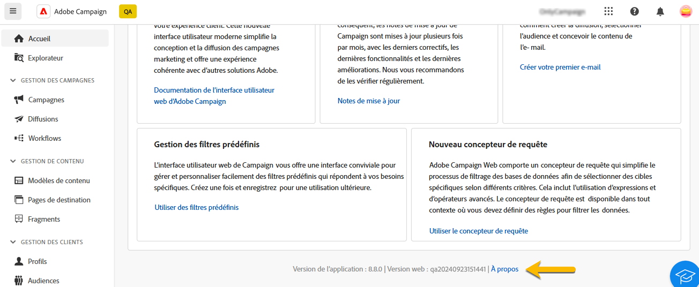
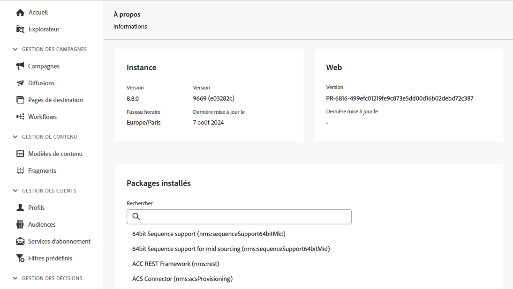

# Découvrir l’interface {#user-interface}

La nouvelle interface d’Adobe Campaign Web offre une expérience d’utilisation moderne et intuitive, afin de simplifier la conception et la diffusion des campagnes marketing. Cette nouvelle interface est intégrée aux applications et solutions Adobe Experience Cloud.

Découvrez comment vous connecter à Adobe Campaign ainsi que les principes de base de la navigation dans Experience Cloud [dans cet article](connect-to-campaign.md).

>[!NOTE]
>
>Cette documentation est fréquemment mise à jour pour prendre en compte les dernières modifications apportées à l’interface d’utilisation du produit. Cependant, certaines captures d’écran peuvent légèrement différer de votre interface d’utilisation.

## Page d’accueil de Campaign {#user-interface-home}

>[!CONTEXTUALHELP]
>id="acw_homepage_recent"
>title="Récents"
>abstract="La liste **Récents** offre des raccourcis vers les diffusions récemment créées et modifiées. Cette liste affiche le canal, le statut, la personne propriétaire, les dates de création et de modification."

La page d’accueil de Campaign vous permet de parcourir rapidement et facilement les ressources, indicateurs et composants essentiels.

La section supérieure de la page d’accueil fournit des informations à propos des dernières mises à jour et des nouvelles fonctionnalités disponibles dans le produit, incluant un lien vers les notes de mise à jour et la documentation détaillée. Utilisez la flèche de gauche pour faire défiler les cartes des fonctionnalités.

{zoomable="yes"}

La section **Indicateurs clés de performance** vous permet de consulter l’efficacité de votre plateforme grâce aux KPI les plus courants. Pour en savoir plus sur les KPI, consultez [cette page](../reporting/kpis.md).

La liste **Récents** offre des raccourcis vers les diffusions récemment créées et modifiées. Cette liste affiche le canal, le statut, le ou la propriétaire, les dates de création et de modification. Cliquez sur le lien **Afficher plus** pour charger davantage de diffusions.

Vous pouvez également accéder aux principales pages d’aide d’Adobe Campaign Web depuis la section **Formation** de la page.

### Lien À propos {#user-interface-about}

>[!CONTEXTUALHELP]
>id="acw_about"
>title="Page À propos"
>abstract="La page À propos contient des détails sur votre instance Adobe Campaign."

>[!CONTEXTUALHELP]
>id="acw_about_instance"
>title="À propos de l’instance"
>abstract="La section Instance fournit des informations clés sur votre console cliente, y compris la version et le numéro de build associé."

>[!CONTEXTUALHELP]
>id="acw_about_web"
>title="À propos du web"
>abstract="La section Web affiche la version de votre interface d’utilisation de Campaign Web, avec la date de la dernière mise à jour, le cas échéant."

>[!CONTEXTUALHELP]
>id="acw_about_packages"
>title="À propos des packages installés"
>abstract="La section Packages installés répertorie l’ensemble des modules, fonctionnalités et intégrations disponibles sur votre instance."

Au bas de la page, le lien **[!UICONTROL À propos]** fournit des détails sur votre instance Adobe Campaign. Ces informations sont en lecture seule.

{zoomable="yes"}

La section **Instance** fournit des informations clés sur votre console cliente, y compris la **version** et le numéro de **build** associé.

* La **version** fait référence à la version officielle que vous utilisez.
* Le **build** fait référence à une itération spécifique de cette version.

Les numéros de version et de build sont essentiels à la résolution des problèmes, car ils aident à identifier les fonctionnalités et les correctifs disponibles dans votre environnement.

La section **Web** affiche la version de votre interface d’utilisation de Campaign Web, avec la date de la dernière mise à jour, le cas échéant. Cela permet de suivre les modifications ou les améliorations apportées à l’interface d’utilisation de Campaign Web.

La section **Packages installés** répertorie tous les modules, fonctionnalités et intégrations disponibles sur votre instance. Ces packages étendent la fonctionnalité d’Adobe Campaign et permettent d’effectuer des tâches spécialisées telles que l’intégration à d’autres solutions Adobe ou l’activation de workflows spécifiques. Compte tenu du grand nombre de packages, vous pouvez effectuer une recherche dans cette section pour vérifier rapidement si un module particulier est installé sur votre instance.

{zoomable="yes"}

## Menu de navigation de gauche {#user-interface-left-nav}

Parcourez les liens situés à gauche pour accéder aux fonctionnalités d’Adobe Campaign Web. Plusieurs liens affichent des listes d’objets que vous pouvez trier et filtrer. Vous pouvez également configurer des colonnes pour afficher toutes les informations dont vous avez besoin. Consultez cette [section](#list-screens). Certains écrans de liste sont en lecture seule. Les éléments affichés dans le menu de navigation de gauche dépendent de vos autorisations. Pour en savoir plus sur les autorisations, consultez [cette section](permissions.md).

### Explorateur {#user-interface-explorer}

>[!CONTEXTUALHELP]
>id="acw_explorer"
>title="Explorateur"
>abstract="Le menu **Explorateur** affiche tous les composants et objets Campaign avec la même hiérarchie de dossiers que celle de la console cliente. Parcourez tous vos composants, dossiers et schémas Campaign v8, vérifiez les autorisations associées et créez des dossiers et des sous-dossiers à partir de ce menu."

Le menu **Explorateur** affiche toutes les ressources et tous les objets Campaign avec la même hiérarchie de dossiers que celle de la console cliente. Parcourez tous les composants, dossiers et schémas de Campaign v8 et créez des diffusions, des workflows et des campagnes.

Les éléments affichés dans l’**Explorateur** dépendent de vos autorisations. Vous pouvez également ajouter des dossiers et des sous-dossiers, si vous disposez des droits nécessaires. Pour en savoir plus sur les autorisations, consultez [cette section](permissions.md).

Vous pouvez configurer des colonnes pour personnaliser l’affichage afin de consulter toutes les informations dont vous avez besoin. Consultez cette [section](#list-screens). Vous pouvez également ajouter des dossiers et des sous-dossiers, comme décrit dans [cette section](permissions.md#folders).

Pour plus d’informations sur l’explorateur Campaign, la hiérarchie des dossiers et les ressources, reportez-vous à la [documentation de Campaign v8 (console)](https://experienceleague.adobe.com/docs/campaign/campaign-v8/new/campaign-ui.html?lang=fr#ac-explorer-ui){target="_blank"}.

### Gestion de campagnes {#user-interface-campaign-management}

Dans la section **Gestion de campagnes**, vous pouvez accéder aux campagnes marketing, aux diffusions et aux workflows.

* **Campagnes** : il s’agit de la liste de vos campagnes et modèles de campagne. Pour chaque campagne, les dates de début, de fin, de création, de dernière modification, le statut actuel et le nom de l’opérateur ou de l’opératrice Campaign qui l’a créée s’affichent par défaut. Vous pouvez filtrer la liste par statut, dates de début et de fin, ou par dossier, ou créer un filtre avancé afin de définir vos propres critères de filtrage. En savoir plus sur les campagnes [dans cette section](../campaigns/gs-campaigns.md).

* **Diffusions** - Parcourez votre liste de diffusions. Leur état, la date de dernière modification ainsi que les principaux KPI s’affichent par défaut. Vous pouvez filtrer la liste par statut, date de contact ou canal. Pour obtenir une vue d’ensemble des détails d’une diffusion e-mail, cliquez sur celle-ci afin d’ouvrir son tableau de bord. Les diffusions sur d’autres canaux sont en lecture seule. Pour en savoir plus sur les diffusions, consultez [cette section](../msg/gs-messages.md).

  Utilisez le bouton **Autres actions** pour supprimer ou dupliquer une diffusion.

  {zoomable="yes"}{width="70%" align="left"} [Capture d’écran montrant le bouton Plus d’actions avec des options pour supprimer ou dupliquer une diffusion]

* **Workflows** : dans cet écran, vous pouvez accéder à la liste complète des workflows et des modèles de workflows. Vous pouvez vérifier leur statut, les dates de dernière exécution ou de prochaine exécution, et créer un nouveau workflow ou un nouveau modèle de workflow. Vous pouvez filtrer la liste selon les mêmes critères que pour les autres objets. En outre, vous pouvez filtrer les workflows selon qu’ils appartiennent ou non à une campagne. Pour en savoir plus sur les workflows, consultez [cette section](../workflows/gs-workflows.md).

### Gestion de contenu {#user-interface-content-management}

Dans la section **Gestion de contenu**, vous pouvez afficher vos modèles et fragments de contenu.

* **Modèles de contenu** : pour un processus de conception accéléré et amélioré, vous pouvez créer des modèles autonomes afin de réutiliser facilement le contenu personnalisé dans [!DNL Adobe Campaign]. Cette fonctionnalité, uniquement réservée aux e-mails, permet aux personnes orientées sur le contenu d’utiliser des modèles autonomes afin que les utilisateurs et utilisatrices marketing puissent les réutiliser et les adapter dans leurs propres campagnes par e-mail. En savoir plus dans [cette section](../email/create-email-templates.md).

* **Fragments** : un fragment est un composant réutilisable pouvant être référencé dans une ou plusieurs diffusions d’une campagne à l’autre. Lors de la modification d’un fragment, chaque contenu qui l’utilise est mis à jour. [Découvrez comment utiliser les fragments](../content/fragments.md).

Cette fonctionnalité permet de précréer plusieurs blocs de contenu personnalisés destinés aux équipes marketing et permettant d’assembler rapidement les contenus d’e-mail dans un processus de conception amélioré.

### Gestion des clientes et clients {#user-interface-customer-management}

Dans la section **Gestion des clientes et clients**, vous pouvez afficher vos profils, vos audiences et vos abonnements. Ces listes sont en lecture seule.

* **Profils** : créez et gérez les profils, et accédez à votre base de données de personnes destinataires. Par défaut, vous pouvez consulter leur adresse e-mail, prénom et nom. Pour en savoir plus sur les profils, consultez [cette section](../audience/about-recipients.md).
* **Audiences** - Il s’agit de votre liste d’audiences. Le type, l’origine, la date de création, de dernière modification et le libellé s’affichent par défaut. Vous pouvez filtrer la liste par origine. Pour en savoir plus sur les audiences, consultez [cette section](../audience/about-recipients.md).
* **Services d’abonnement** : parcourez vos listes d’abonnements. Le type, le mode et le libellé s’affichent par défaut. Découvrez comment gérer les abonnements et les désabonnements dans la [documentation d’Adobe Campaign v8 (console)](https://experienceleague.adobe.com/docs/campaign/campaign-v8/campaigns/send/subscriptions.html?lang=fr){target="_blank"}.
* **Filtres prédéfinis** : les filtres prédéfinis sont des filtres personnalisés que vous créez, puis que vous enregistrez en vue d’une utilisation ultérieure. Vous pouvez les utilisez comme raccourcis lors d’opérations de filtrage avec le concepteur de requête, par exemple lors du filtrage d’une liste de données ou de la création de l’audience d’une diffusion. En savoir plus dans [cette section](predefined-filters.md).

### Gestion des décisions {#decision-management}

>[!CONTEXTUALHELP]
>id="acw_offers_list"
>title="Offres"
>abstract="Parcourez les listes d’offres et de modèles d’offres qui ont été créées dans la console à l’aide du module **Interaction**. Ces listes sont en lecture seule."
>additional-url="https://experienceleague.adobe.com/docs/campaign-web/v8/msg/offers.html?lang=fr" text="Ajouter des offres à une diffusion"

Dans la section **Gestion des décisions**, vous pouvez visualiser les offres et les modèles d’offres. Ces listes sont en lecture seule.

* **Offres** : parcourez la liste des offres et les modèles d’offres créés dans la console à l’aide du module **Interaction**. Le statut, les dates de début et de fin et leur environnement s’affichent par défaut. Vous pouvez filtrer la liste par statut et par dates de début/fin. Des modèles d’offre sont également disponibles.

Découvrez comment créer et envoyer des offres dans des e-mails et des SMS dans [cette section](../msg/offers.md).

### Rapports {#left-nav-reporting}

* **Rapports** : l’entrée **Rapport** fournit un résumé global et synthétique des mesures de trafic et d’engagement pour chaque canal de votre environnement Campaign. Ces rapports sont composés de différents widgets, chacun fournissant une perspective spécifique des performances de vos campagnes ou diffusions. En savoir plus dans [cette section](../reporting/global-reports.md).

### Administration {#left-nav-admin}

* **Journal d’audit** : l’entrée **Journal d’audit** offre aux utilisateurs et utilisatrices une visibilité complète de toutes les modifications apportées à des entités importantes de votre instance, généralement celles qui ont un impact significatif sur le bon fonctionnement de l’instance. [En savoir plus](../reporting/audit-trail.md)

* **Comptes externes** : créez des comptes externes à l’aide de l’interface d’utilisation web pour répondre à vos besoins et garantir des transferts de données fluides. [En savoir plus](../administration/external-account.md)

* **Schémas** : les champs personnalisés sont des attributs supplémentaires ajoutés aux schémas intégrés via la console Adobe Campaign. [En savoir plus](../administration/custom-fields.md)

* **Alertes de diffusion** : les alertes de diffusion sont un système de gestion des alertes qui permet à des groupes d’utilisateurs et d’utilisatrices de recevoir automatiquement des notifications par e-mail contenant des informations sur les exécutions de leurs diffusions. [En savoir plus](../msg/delivery-alerting.md)

## En savoir plus {#learn-more}

Découvrez [sur cette page](list-filters.md) comment parcourir, rechercher et filtrer les listes disponibles dans votre environnement Campaign.