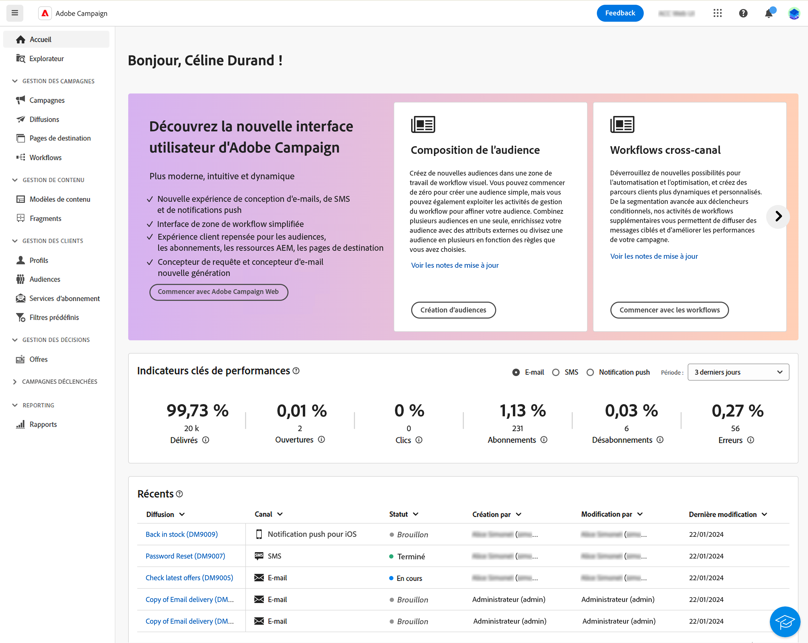

# Découvrir l’interface {#user-interface}

La nouvelle interface d’Adobe Campaign Web offre une expérience utilisateur moderne et intuitive, afin de simplifier la conception et la diffusion des campagnes marketing. Cette nouvelle interface est intégrée aux applications et solutions Adobe Experience Cloud.

Découvrez comment vous connecter à Adobe Campaign et découvrez les principes de base de la navigation dans Experience Cloud [dans cet article](connect-to-campaign.md).

>[!NOTE]
>
>Cette documentation est fréquemment mise à jour pour prendre en compte les dernières modifications apportées à l’interface utilisateur du produit. Cependant, certaines captures d’écran peuvent légèrement différer de votre interface utilisateur.

## Page d’accueil de Campaign {#user-interface-home}

>[!CONTEXTUALHELP]
>id="acw_homepage_recent"
>title="Récents"
>abstract="La liste **Récents** offre des raccourcis vers les diffusions récemment créées et modifiées. Cette liste affiche le canal, le statut, la personne propriétaire, les dates de création et de modification."

La page d’accueil de Campaign vous permet de parcourir rapidement et facilement les ressources, indicateurs et composants essentiels.

La section supérieure de la page d’accueil fournit des informations à propos des dernières mises à jour et des nouvelles fonctionnalités disponibles dans le produit, incluant un lien vers les notes de mise à jour et la documentation détaillée. Utilisez la flèche de gauche pour faire défiler les cartes des fonctionnalités.

{zoomable=&quot;yes&quot;}

Les **indicateurs clés de performance** vous permettent de vérifier l’efficacité de votre plateforme grâce aux KPI courants. Pour en savoir plus sur les KPI, consultez [cette page](../reporting/kpis.md).

La liste **Récents** offre des raccourcis vers les diffusions récemment créées et modifiées. Cette liste affiche le canal, le statut, la personne propriétaire, les dates de création et de modification. Cliquez sur le bouton **Afficher plus** pour charger d’autres diffusions.

Accédez aux pages principales d’aide d’Adobe Campaign Web depuis la section **Formation** sur la page.

## Menu de navigation de gauche {#user-interface-left-nav}

Parcourez les liens situés à gauche pour accéder aux fonctionnalités d’Adobe Campaign Web. Plusieurs liens affichent des listes d’objets qui peuvent être triés et filtrés. Vous pouvez également configurer des colonnes pour afficher toutes les informations dont vous avez besoin. Consultez cette [section](#list-screens). Certains écrans de liste sont en lecture seule. Les éléments affichés dans le menu de navigation de gauche dépendent de vos autorisations. Pour en savoir plus sur les autorisations, consultez [cette section](permissions.md).

### Explorateur {#user-interface-explorer}

>[!CONTEXTUALHELP]
>id="acw_explorer"
>title="Explorateur"
>abstract="Le menu **Explorateur** affiche tous les composants et objets Campaign avec la même hiérarchie de dossiers que celle de la console cliente. Parcourez tous vos composants, dossiers et schémas Campaign v8, vérifiez les autorisations associées et créez des dossiers et des sous-dossiers à partir de ce menu."

Le menu **Explorateur** affiche toutes les ressources et tous les objets Campaign avec la même hiérarchie de dossiers que celle de la console cliente. Parcourez tous les composants, dossiers et schémas de Campaign v8 et créez des diffusions, des workflows et des campagnes.

Les éléments affichés dans l’**Explorateur** dépendent de vos autorisations. Vous pouvez également ajouter des dossiers et des sous-dossiers, si vous disposez des droits adéquats. Pour en savoir plus sur les autorisations, consultez [cette section](permissions.md).

Vous pouvez configurer des colonnes pour personnaliser l’affichage afin de consulter toutes les informations dont vous avez besoin. Consultez cette [section](#list-screens). Vous pouvez également ajouter des dossiers et des sous-dossiers, comme décrit dans [cette section](permissions.md#folders).

Pour plus d’informations sur l’explorateur Campaign, la hiérarchie des dossiers et les ressources, reportez-vous à la [documentation de Campaign v8 (console)](https://experienceleague.adobe.com/docs/campaign/campaign-v8/new/campaign-ui.html?lang=fr#ac-explorer-ui){target="_blank"}.

### Gestion de campagne {#user-interface-campaign-management}

Dans la section GESTION DE CAMPAGNES, vous pouvez accéder aux campagnes marketing, aux diffusions et aux workflows.

* **Campagnes** : il s’agit de la liste de vos campagnes et modèles de campagne. Par défaut, pour chaque campagne, vous pouvez afficher les dates de début, de fin, de création, de dernière modification, le statut actuel et le nom de l’opérateur ou de l’opératrice Campaign qui l’a créée. Vous pouvez filtrer la liste par statut, dates de début et de fin, ou par dossier, ou créer un filtre avancé afin de définir vos propres critères de filtrage. En savoir plus sur les campagnes [dans cette section](../campaigns/gs-campaigns.md).

* **Diffusions** - Parcourez votre liste de diffusions. Vous pouvez consulter leur état, date de dernière modification ainsi que les principaux KPI. Vous pouvez filtrer la liste par statut, date de contact ou canal. Pour obtenir une vue d’ensemble des détails d’une diffusion e-mail, cliquez sur celle-ci afin d’ouvrir son tableau de bord. Les diffusions sur d’autres canaux sont en lecture seule. Pour en savoir plus sur les diffusions, consultez [cette section](../msg/gs-messages.md).

  Utilisez le bouton **Autres actions** pour supprimer ou dupliquer une diffusion.

  {zoomable=&quot;yes&quot;}{width="70%" align="left"}

* **Workflows** : dans cet écran, vous pouvez accéder à la liste complète des workflows et des modèles de workflows. Vous pouvez vérifier leur statut, les dates de dernière exécution ou de prochaine exécution, et créer un nouveau workflow ou un nouveau modèle de workflow. Vous pouvez filtrer la liste selon les mêmes critères que pour les autres objets. En outre, vous pouvez filtrer les workflows appartenant ou non à une campagne. Pour en savoir plus sur les workflows, consultez [cette section](../workflows/gs-workflows.md).

### Gestion de contenu {#user-interface-content-management}

Dans la section Gestion de contenu, vous pouvez afficher vos modèles de contenu et vos fragments de contenu.

* **Modèles de contenu** : pour un processus de conception accéléré et amélioré, vous pouvez créer des modèles autonomes afin de réutiliser facilement le contenu personnalisé dans [!DNL Adobe Campaign]. Cette fonctionnalité, uniquement réservée aux e-mails, permet aux personnes orientées sur le contenu d’utiliser des modèles autonomes afin que les utilisateurs et utilisatrices marketing puissent les réutiliser et les adapter dans leurs propres campagnes par e-mail. En savoir plus dans [cette section](../email/create-email-templates.md).

<!--
* **Fragments** -
-->

### Gestion des clientes et clients {#user-interface-customer-management}

Dans la section Gestion des clientes et clients, vous pouvez afficher vos profils, vos audiences et vos abonnements. Ces listes sont en lecture seule.

* **Profils** : créez et gérez les profils, et accédez à votre base de données de personnes destinataires. Par défaut, vous pouvez consulter leur adresse e-mail, prénom et nom. Pour en savoir plus sur les profils, consultez [cette section](../audience/about-recipients.md).
* **Audiences** - Il s’agit de votre liste d’audiences. Par défaut, vous pouvez consulter leur type, origine, date de création/dernière modification et libellé. Vous pouvez filtrer la liste par origine. Pour en savoir plus sur les audiences, consultez [cette section](../audience/about-recipients.md).
* **Services d’abonnements** : parcourez vos listes d’abonnements. Par défaut, vous pouvez consulter leur type, mode et libellé. Découvrez comment gérer les abonnements et les désabonnements dans la [documentation d’Adobe Campaign v8 (console)](https://experienceleague.adobe.com/docs/campaign/campaign-v8/campaigns/send/subscriptions.html?lang=fr){target="_blank"}.
* **Filtres prédéfinis** : les filtres prédéfinis sont des filtres personnalisés qui sont créés et enregistrés afin d’être disponibles pour une utilisation ultérieure. Ils peuvent être utilisés comme raccourcis lors d’opérations de filtrage avec le concepteur de requête, par exemple lors du filtrage d’une liste de données ou de la création de l’audience d’une diffusion. En savoir plus dans [cette section](predefined-filters.md).

### Gestion des décisions {#decision-management}

>[!CONTEXTUALHELP]
>id="acw_offers_list"
>title="Offres"
>abstract="Parcourez les listes d’offres et de modèles d’offres qui ont été créées dans la console à l’aide du module **Interaction**. Ces listes sont en lecture seule."
>additional-url="https://experienceleague.adobe.com/docs/campaign-web/v8/msg/offers.html?lang=fr" text="Ajouter des offres à une diffusion"

Dans la section GESTION DES DÉCISIONS, vous pouvez visualiser les offres et les modèles d’offres. Ces listes sont en lecture seule.

* **Offres** - Parcourez la liste des offres et des modèles d’offres créés dans la console à l’aide du module **Interaction**. Par défaut, vous pouvez consulter leur statut, les dates de début/fin et leur environnement. Vous pouvez filtrer la liste par statut et par dates de début/fin. Des modèles d’offre sont également disponibles.

Découvrez comment créer et envoyer des offres dans des e-mails et des SMS dans [cette section](../msg/offers.md).

### Rapports {#left-nav-reporting}

* **Rapports** : l’entrée **Rapport** fournit un résumé global et synthétique des mesures de trafic et d’engagement pour chaque canal de votre environnement Campaign. Ces rapports sont composés de différents widgets, chacun fournissant une perspective spécifique des performances de vos campagnes ou diffusions. En savoir plus dans [cette section](../reporting/global-reports.md).

## Aide contextuelle {#user-interface-help}

Une aide contextuelle est disponible dans l’interface. Si elle est présente, cliquez sur l’icône `?` pour afficher des informations d’aide et des liens vers la documentation connexe.

{zoomable=&quot;yes&quot;}{width="40%" align="left"}

Actuellement présent en version bêta dans la nouvelle interface utilisateur web de Campaign, l’**assistant de connaissances optimisé par l’IA** incorporé dans l’aide contextuelle révolutionne la recherche de documentation et la réponse aux questions pratiques en analysant facilement de vastes référentiels de documentation grâce à l’identification instantanée des informations précises dont vous avez besoin.

Grâce aux fonctionnalités de l’IA générative de Campaign, cet assistant transforme votre expérience, en facilitant la récupération d’informations et la résolution de problèmes. Que vous soyez à la recherche de conseils dans une tâche complexe ou que vous parcouriez des documents volumineux, notre assistant de connaissances optimisé par l’IA devient votre meilleur compagnon, en vous offrant une efficacité et une précision inégalées à chaque interaction.

En savoir plus dans [cette section](using-ai.md).

## En savoir plus {#learn-more}

Découvrez [sur cette page](list-filters.md) comment parcourir, rechercher et filtrer les listes disponibles dans votre environnement Campaign.

<!--
######## This part stores the contextualHelp definition for WebUI BETA ###########
######## These blocks should be dispatched in the appropriate pages when available ###########
######## PLEASE DO NOT DELETE ###########
REFER TO 
https://wiki.corp.adobe.com/pages/viewpage.action?spaceKey=neolane&title=v8+WebUI+Contextual+Help+%3CALPHA%3E-+Official+list
-->

>[!CONTEXTUALHELP]
>id="acw_push_permission_for_segment"
>title="Autorisation requise"
>abstract="Avant de pouvoir créer un segment, votre administrateur ou administratrice doit vous accorder une autorisation."

>[!CONTEXTUALHELP]
>id="acw_push_overview_edit"
>title="Autorisation requise"
>abstract="Avant de pouvoir créer un segment, votre administrateur ou administratrice doit vous accorder une autorisation."

<!-- delivery template settings-->

>[!CONTEXTUALHELP]
>id="acw_global_reporting_sending"
>title="Envoi de rapports globaux"
>abstract="Les mesures des rapports de suivi sont visibles dans cet écran."

>[!CONTEXTUALHELP]
>id="acw_global_reporting_tracking"
>title="Suivi des rapports globaux"
>abstract="Les mesures des rapports de suivi sont visibles dans cet écran."

<!-- FOR BETA (alignment) -->
<!--https://wiki.corp.adobe.com/display/neolane/v8+WebUI+Contextual+Help+%3CBETA%3E-+Official+list-->

<!-- FOR GA -->
<!-- Aligned with https://wiki.corp.adobe.com/display/neolane/v8+WebUI+Contextual+Help+%3CGA%3E-+Official+list -->

>[!CONTEXTUALHELP]
>id="acw_recipients_creation_list"
>title="Création de personnes destinataires"
>abstract="Création de personnes destinataires"

>[!CONTEXTUALHELP]
>id="acw_recipients_creation_cardoverview"
>title="Vue d’ensemble de la carte des personnes destinataires"
>abstract="Vue d’ensemble de la carte des personnes destinataires"

>[!CONTEXTUALHELP]
>id="acw_recipients_creation_touchpoints"
>title="Points de contact des personnes destinataires"
>abstract="Points de contact des personnes destinataires"

>[!CONTEXTUALHELP]
>id="acw_recipients_subscription_selection"
>title="Sélection des abonnements des personnes destinataires"
>abstract="Sélection des abonnements des personnes destinataires"

>[!CONTEXTUALHELP]
>id="acw_recipients_offers_eligible_list"
>title="Liste des offres éligibles des personnes destinataires"
>abstract="Liste des offres éligibles des personnes destinataires"

>[!CONTEXTUALHELP]
>id="acw_recipients_offers_preview_proposition"
>title="Aperçu des offres des personnes destinataires"
>abstract="Aperçu des offres des personnes destinataires"

>[!CONTEXTUALHELP]
>id="acw_fragments_menu"
>title="Fragments"
>abstract="Fragments"

>[!CONTEXTUALHELP]
>id="acw_fragments_save"
>title="Enregistrement de fragments"
>abstract="Enregistrement de fragments"

>[!CONTEXTUALHELP]
>id="acw_fragments_create"
>title="Création de fragments"
>abstract="Création de fragments"

>[!CONTEXTUALHELP]
>id="acw_fragments_properties"
>title="Propriétés des fragments"
>abstract="Propriétés des fragments"

>[!CONTEXTUALHELP]
>id="acw_fragments_type"
>title="Type de fragment"
>abstract="Type de fragment"

>[!CONTEXTUALHELP]
>id="acw_fragments_list"
>title="Liste de fragments"
>abstract="Liste de fragments"

>[!CONTEXTUALHELP]
>id="acw_fragments_details"
>title="Détails des fragments"
>abstract="Détails des fragments"

>[!CONTEXTUALHELP]
>id="acw_conditionalcontent_savefilter"
>title="Filtre d’enregistrement de contenu conditionnel"
>abstract="Filtre d’enregistrement de contenu conditionnel"

>[!CONTEXTUALHELP]
>id="acw_conditionalcontent_selectfilter"
>title="Filtre de sélection du contenu conditionnel"
>abstract="Filtre de sélection du contenu conditionnel"

>[!CONTEXTUALHELP]
>id="acw_conditionalcontent_subjectline"
>title="Contenu conditionnel sur la ligne d’objet"
>abstract="Contenu conditionnel sur la ligne d’objet"

>[!CONTEXTUALHELP]
>id="acw_conditionalcontent_subjectlinecondition"
>title="Condition de ligne d’objet de contenu conditionnel"
>abstract="Condition de ligne d’objet de contenu conditionnel"

>[!CONTEXTUALHELP]
>id="acw_deliveries_simulate_testprofiles"
>title="Simuler des profils de test"
>abstract="Simuler des profils de test"

<!--ML: not visible in UI-->

>[!CONTEXTUALHELP]
>id="acw_deliveries_simulate_profiles_selection"
>title="Simuler la sélection des profils de test"
>abstract="Simuler la sélection des profils de test"

<!-- ML: beta wiki page - not visible in UI-->

>[!CONTEXTUALHELP]
>id="acw_deliveries_simulate_send_testprofiles"
>title="Simuler l’envoi de profils de test"
>abstract="Simuler l’envoi de profils de test"

<!-- ML: beta wiki page - not visible in UI-->

>[!CONTEXTUALHELP]
>id="acw_deliveries_simulate_email_log"
>title="Simuler le journal de l’e-mail"
>abstract="Simuler le journal de l’e-mail"

<!-- ML: beta wiki page - not visible in UI-->

<!-- FOR POST-GA -->

<!--
Deprecated IDs - to remove in GA: -->

>[!CONTEXTUALHELP]
>id="acw_attributepicker_advancedfields"
>title="Afficher les attributs avancés"
>abstract="Seuls les attributs les plus courants sont affichés par défaut dans la liste des attributs. Activez le bouton (bascule) **Afficher les attributs avancés** pour afficher tous les attributs disponibles pour la liste actuelle dans la palette gauche du créateur de règles, tels que les nœuds, les regroupements, les liens 1-1 et les liens 1-N."

>[!CONTEXTUALHELP]
>id="acw_rulebuilder_advancedfields"
>title="Champs avancés du créateur de règles"
>abstract="Seuls les attributs les plus courants sont affichés par défaut dans la liste des attributs. Activez le bouton (bascule) **Afficher les attributs avancés** pour afficher tous les attributs disponibles pour la liste actuelle dans la palette gauche du créateur de règles, tels que les nœuds, les regroupements, les liens 1-1 et les liens 1-N."

>[!CONTEXTUALHELP]
>id="acw_rulebuilder_properties_advanced"
>title="Attributs avancés du créateur de règles"
>abstract="Seuls les attributs les plus courants sont affichés par défaut dans la liste des attributs. Activez le bouton (bascule) **Afficher les attributs avancés** pour afficher tous les attributs disponibles pour la liste actuelle dans la palette gauche du créateur de règles, tels que les nœuds, les regroupements, les liens 1-1 et les liens 1-N."

>[!CONTEXTUALHELP]
>id="acw_contenttemplate_readonlymode"
>title="Ce modèle est en lecture seule."
>abstract="Vous ne disposez pas des autorisations nécessaires pour modifier ce modèle. Si nécessaire, contactez votre administrateur ou administratrice, qui vous accordera l’accès."

<!-- Subscription activity-->

>[!CONTEXTUALHELP]
>id="acw_subscriptions_defaultlp"
>title="Page de destination par défaut"
>abstract="Sélectionnez la page de destination par défaut associée à ce service d’inscription."

>[!CONTEXTUALHELP]
>id="acw_orchestration_subscription"
>title="Activité du service d’inscription"
>abstract="Utilisez Adobe Campaign pour créer et surveiller vos services, tels que les newsletters, et pour vérifier les inscriptions ou désinscriptions à ces services. Les abonnements ne s’appliquent qu’aux diffusions e-mail et SMS."

>[!CONTEXTUALHELP]
>id="acw_orchestration_subscription_general"
>title="Paramètres du service d’inscription"
>abstract="Sélectionnez et confirmez les paramètres du service d’inscription."

>[!CONTEXTUALHELP]
>id="acw_orchestration_subscription_outboundtransition"
>title="Transition sortante des services d’inscription"
>abstract="Activez l’option **Générer une transition sortante** pour ajouter une transition après l’activité."

<!--Update file-->

>[!CONTEXTUALHELP]
>id="acw_orchestration_updatedata"
>title="Mettre à jour des données"
>abstract="L’activité **Mise à jour de données** permet de mettre à jour en masse les champs de la base de données."

>[!CONTEXTUALHELP]
>id="acw_orchestration_updatedata_operationtype"
>title="Sélectionner comment mettre à jour les données"
>abstract="Le champ **Type d’opération** permet de choisir le traitement à réaliser sur les données de la base de données : Sélectionnez la première option pour ajouter des données ou les mettre à jour (si elles ont déjà été ajoutées auparavant). Vous pouvez uniquement ajouter, mettre à jour ou supprimer des données. Sélectionnez **Mettre à jour et fusionner les collections** pour sélectionner un enregistrement principal auquel lier des doublons et supprimer ces doublons en toute sécurité."

>[!CONTEXTUALHELP]
>id="acw_orchestration_updatedata_recordid"
>title="Identification des enregistrements"
>abstract="Indiquez le mode d’identification des enregistrements dans la base de données : si les données correspondent à une dimension de ciblage existante, sélectionnez l’option **Utiliser la dimension de ciblage**, puis sélectionnez la dimension de ciblage et les champs à mettre à jour. Dans le cas contraire, indiquez un ou plusieurs liens personnalisés qui permettront d’identifier les données dans la base de données ou d’utiliser directement des clés de réconciliation."

>[!CONTEXTUALHELP]
>id="acw_orchestration_updatedata_fieldsupdate"
>title="Sélectionner les champs à mettre à jour"
>abstract="Sélectionnez les champs à mettre à jour et les paramètres de réconciliation. Vous pouvez utiliser l’option **Mappage automatique** pour identifier automatiquement les champs à mettre à jour."

>[!CONTEXTUALHELP]
>id="acw_orchestration_updatedata_advancedoptions"
>title="Options avancées de mise à jour des données"
>abstract="La section **Options avancées** vous permet de définir des paramètres supplémentaires pour la gestion des données et des doublons."

>[!CONTEXTUALHELP]
>id="acw_orchestration_updatedata_outboundtransition"
>title="Générer une transition sortante"
>abstract="Activez l’option **Générer une transition sortante** pour ajouter une transition sortante qui sera activée à la fin de l’exécution de l’activité **Mettre à jour des données**. La mise à jour marque généralement la fin d’un workflow de ciblage et l’option n’est donc pas activée par défaut."

>[!CONTEXTUALHELP]
>id="acw_orchestration_updatedata_outboundtransition_rejects"
>title="Générez une transition sortante pour les rejets."
>abstract="Activez l’option **Générer une transition sortante pour les rejets** pour ajouter une transition sortante qui contient les enregistrements qui n’ont pas été correctement traités après la mise à jour (par exemple en cas de doublon). La mise à jour marque généralement la fin d’un workflow de ciblage et l’option n’est donc pas activée par défaut."

<!--External Signal End-->

>[!CONTEXTUALHELP]
>id="acw_orchestration_externalsignal"
>title="Signal externe"
>abstract="L’activité **Signal externe** permet de déclencher l’exécution d’un ensemble de tâches dans un workflow à partir d’une API ou d’un autre workflow."

>[!CONTEXTUALHELP]
>id="acw_orchestration_externalsignal_parameters"
>title="Paramètres de signal externe"
>abstract="Paramètres de signal externe"

>[!CONTEXTUALHELP]
>id="acw_orchestration_end_trigger"
>title="Déclencheurs de fin"
>abstract="Déclencheurs de fin"

<!--JavaScript-->

>[!CONTEXTUALHELP]
>id="acw_orchestration_javascript"
>title="Code JavaScript"
>abstract="L’activité **Code JavaScript** exécute un code JavaScript dans le contexte d’un workflow."

>[!CONTEXTUALHELP]
>id="acw_orchestration_javascript_snippet"
>title="Extrait de JavaScript"
>abstract="Configurez le code à exécuter."
>additional-url="https://experienceleague.adobe.com/fr/docs/campaign/campaign-v8/developer/api" text="En savoir plus dans la documentation de Campaign v8 (console)."

>[!CONTEXTUALHELP]
>id="acw_orchestration_javascript_execution"
>title="Exécution de JavaScript"
>abstract="Par défaut, la phase d’exécution ne peut pas dépasser 1 heure. Passé ce délai, le processus est abandonné en incluant un message d’erreur et l’exécution de l’activité échoue. Activez l’option **Arrêter l’exécution après** pour définir un délai personnalisé. Pour ignorer cette limite, définissez la valeur sur 0."

>[!CONTEXTUALHELP]
>id="acw_orchestration_javascript_transition"
>title="Traiter les erreurs"
>abstract="Activez l’option **Traiter les erreurs** pour ajouter une transition sortante qui contient les erreurs."

<!--ExtractFile-->

>[!CONTEXTUALHELP]
>id="acw_orchestration_extractfile"
>title="Extraire un fichier"
>abstract="Activité Extraction de fichier"

>[!CONTEXTUALHELP]
>id="acw_orchestration_extractfile_file"
>title="Fichier à extraire"
>abstract="Sélectionnez le fichier à extraire."

>[!CONTEXTUALHELP]
>id="acw_orchestration_extractfile_destinationformat"
>title="Format de destination"
>abstract="Sélectionnez le format."

>[!CONTEXTUALHELP]
>id="acw_orchestration_extractfile_postprocessing"
>title="Post-traitement"
>abstract="Définir une étape de post-traitement"

>[!CONTEXTUALHELP]
>id="acw_orchestration_extractfile_outbound"
>title="Transition sortante"
>abstract="Activez l’option **Générer une transition sortante** pour ajouter une transition sortante après l’activité en cours."

>[!CONTEXTUALHELP]
>id="acw_orchestration_extractfile_error"
>title="Traiter les erreurs"
>abstract="Activez l’option **Traiter les erreurs** pour ajouter une transition sortante qui contient les erreurs."

<!-- Workflow settings -->

>[!CONTEXTUALHELP]
>id="acw_workflow_settings_initscript"
>title="Script d’initialisation"
>abstract="Script d’initialisation"

>[!CONTEXTUALHELP]
>id="acw_workflow_settings_execution_properties"
>title="Propriétés d’exécution"
>abstract="Propriétés d’exécution"

>[!CONTEXTUALHELP]
>id="acw_workflow_settings_execution_error"
>title="Erreur d’exécution"
>abstract="Erreur d’exécution"

>[!CONTEXTUALHELP]
>id="acw_workflow_settings_execution_initscript"
>title="Script d’initialisation de l’exécution"
>abstract="Script d’initialisation de l’exécution"

<!--incremental querry -->

>[!CONTEXTUALHELP]
>id="acw_orchestration_incrementalquery"
>title="Requête incrémentale"
>abstract="Requête incrémentale"

>[!CONTEXTUALHELP]
>id="acw_orchestration_incrementalquery_history"
>title="Historique des requêtes incrémentales"
>abstract="Historique des requêtes incrémentales"

>[!CONTEXTUALHELP]
>id="acw_orchestration_incrementalquery_processeddata"
>title="Requête incrémentale Données traitées"
>abstract="Requête incrémentale Données traitées"

<!-- Transfer file activity -->

>[!CONTEXTUALHELP]
>id="acw_orchestration_transferfile"
>title="Transfert de fichier"
>abstract="Transfert de fichier"

>[!CONTEXTUALHELP]
>id="acw_orchestration_transferfile_options"
>title="Options de transfert de fichier"
>abstract="Options de transfert de fichier"

>[!CONTEXTUALHELP]
>id="acw_orchestration_transferfile_activity"
>title="Activité de transfert de fichier"
>abstract="Activité de transfert de fichier"

>[!CONTEXTUALHELP]
>id="acw_orchestration_transferfile_remoteserver"
>title="Serveur distant de transfert de fichier"
>abstract="Serveur distant de transfert de fichier"

>[!CONTEXTUALHELP]
>id="acw_orchestration_transferfile_source"
>title="Source de transfert de fichier"
>abstract="Source de transfert de fichier"

>[!CONTEXTUALHELP]
>id="acw_orchestration_transferfile_advancedoptions_delete_file"
>title="Effacer les fichiers source après leur transfert"
>abstract="Effacer les fichiers source après leur transfert"

>[!CONTEXTUALHELP]
>id="acw_orchestration_transferfile_advancedoptions_display_logs"
>title="Afficher les journaux de la session"
>abstract="Afficher les journaux de la session"

>[!CONTEXTUALHELP]
>id="acw_orchestration_transferfile_advancedoptions_list_files"
>title="Répertorier tous les fichiers"
>abstract="Répertorier tous les fichiers"

>[!CONTEXTUALHELP]
>id="acw_orchestration_transferfile_historization"
>title="Historisation des fichiers"
>abstract="Historisation des fichiers"

>[!CONTEXTUALHELP]
>id="acw_orchestration_transferfile_process_missing_file"
>title="Traiter les fichiers absents"
>abstract="Traiter les fichiers absents"

>[!CONTEXTUALHELP]
>id="acw_orchestration_transferfile_process_errors"
>title="Traiter les erreurs"
>abstract="Traiter les erreurs"

<!-- Delivery alerting -->

>[!CONTEXTUALHELP]
>id="acw_delivery_alerting_criteria"
>title="Tableau de bord des critères des alertes de diffusion"
>abstract="Tableau de bord des critères des alertes de diffusion"

>[!CONTEXTUALHELP]
>id="acw_delivery_alerting_dashboards"
>title="Tableau de bord des alertes de diffusion"
>abstract="Tableau de bord des alertes de diffusion"

>[!CONTEXTUALHELP]
>id="acw_delivery_alerting_criteria_create"
>title="Créer des critères d’alerte de diffusion"
>abstract="Créer des critères d’alerte de diffusion"

>[!CONTEXTUALHELP]
>id="acw_delivery_alerting_criteria_create_indicators"
>title="Indicateurs à ajouter aux alertes"
>abstract="Indicateurs à ajouter aux alertes"

>[!CONTEXTUALHELP]
>id="acw_delivery_alerting_criteria_create_alert"
>title="Type d’alerte"
>abstract="Type d’alerte"

>[!CONTEXTUALHELP]
>id="acw_delivery_alerting_criteria_create_frequency"
>title="Fréquence du critère"
>abstract="Fréquence du critère"

>[!CONTEXTUALHELP]
>id="acw_delivery_alerting_create_criteria_add"
>title="Critères des alertes de diffusion"
>abstract="Critères des alertes de diffusion"

>[!CONTEXTUALHELP]
>id="acw_delivery_alerting_create_general"
>title="Paramètres généraux des alertes de diffusion"
>abstract="Alertes de diffusion"

>[!CONTEXTUALHELP]
>id="acw_delivery_alerting_create_criteria_parameters"
>title="Paramètres des critères des alertes de diffusion"
>abstract="Alertes de diffusion"

>[!CONTEXTUALHELP]
>id="acw_delivery_alerting_dashboard_alerts"
>title="Alertes de diffusion envoyées"
>abstract="Alertes de diffusion envoyées"

>[!CONTEXTUALHELP]
>id="acw_delivery_alerting_dashboard_history"
>title="Historique des alertes de diffusion"
>abstract="Historique des alertes de diffusion"
