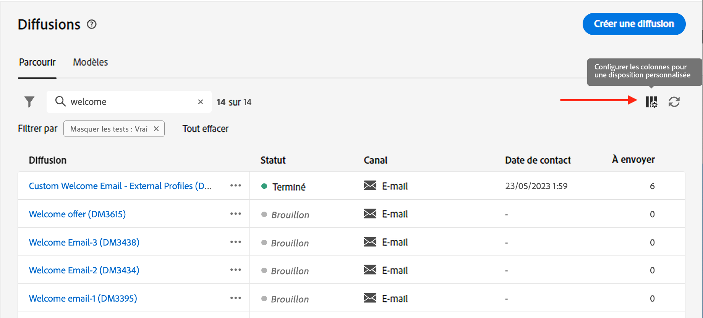

# Découvrir l’interface {#user-interface}

>[!CONTEXTUALHELP]
>id="acw_homepage_learnmore"
>title="Découvrir l’interface"
>abstract="La nouvelle interface web de Campaign v8 offre une expérience utilisateur intégrée, intuitive et cohérente."

La nouvelle interface web de Campaign v8 Web offre une expérience utilisateur moderne et intuitive, afin de simplifier la conception et la diffusion des campagnes marketing. Cette nouvelle interface est intégrée à Adobe Experience Platform.

>[!NOTE]
>
>Cette documentation est fréquemment mise à jour pour prendre en compte les dernières modifications apportées à l’interface utilisateur du produit. Cependant, certaines captures d’écran peuvent légèrement différer de votre interface utilisateur.

## Menu de navigation gauche {#user-interface-left-nav}

Parcourez les liens situés à gauche pour accéder aux fonctionnalités de Campaign v8 Web. Plusieurs liens affichent des listes d’objets qui peuvent être triés et filtrés. Vous pouvez également configurer des colonnes pour afficher toutes les informations dont vous avez besoin. Consultez cette [section](#list-screens). Tous les écrans de type Liste sont en lecture seule, à l’exception de la liste de diffusion e-mail. La version Alpha ne permet pas de cliquer sur un élément de liste pour le modifier/visualiser. Toutes les listes pourront être modifiées dans les versions ultérieures. Les éléments affichés dans le menu de navigation de gauche dépendent de vos autorisations utilisateur.

### Accueil {#user-interface-home}

Les liens et les ressources clés de cet écran offrent un accès rapide aux principales fonctionnalités de Campaign v8 Web.

La liste **Récents** offre des raccourcis vers les diffusions récemment créées et modifiées. Cette liste affiche les dates de canal, d’état, de propriétaire, de création et de modification.

Accédez aux pages d&#39;aide de la clé Web de Campaign v8 à partir de **Formation** de la page d’accueil.

### Explorateur {#user-interface-explorer}

>[!CONTEXTUALHELP]
>id="acw_explorer"
>title="Explorateur"
>abstract="Le **Explorateur** affiche tous les composants et objets Campaign avec la même hiérarchie de dossiers que celle de la console cliente. Parcourez tous les composants, dossiers et schémas de Campaign v8 et créez des diffusions, des workflows et des campagnes. Toutes les autres listes sont en lecture seule."

Le **Explorateur** affiche toutes les ressources et tous les objets Campaign avec la même hiérarchie de dossiers que celle de la console cliente. Parcourez tous les composants, dossiers et schémas de Campaign v8 et créez des diffusions, des workflows et des campagnes. Toutes les autres listes sont en lecture seule.

Les éléments affichés dans l’Explorateur dépendent de vos autorisations utilisateur.

Comme dans n’importe quel écran de liste, vous pouvez configurer des colonnes pour personnaliser l’affichage en fonction des informations que vous souhaitez. Consultez cette [section](#list-screens).

Pour plus d&#39;informations sur l&#39;explorateur Campaign, la hiérarchie des dossiers et les ressources, reportez-vous à cette section [Documentation de Campaign v8 (console)](https://experienceleague.adobe.com/docs/campaign/campaign-v8/new/campaign-ui.html?lang=fr#ac-explorer-ui){target="_blank"}.

### Campaign Management {#user-interface-campaign-management}

>[!CONTEXTUALHELP]
>id="acw_campaigns_list"
>title="Campagnes"
>abstract="Il s’agit de la liste de vos campagnes. Vous pouvez afficher des informations utiles telles que leurs dates de début, de fin ou de dernière modification, ainsi que leur statut. Vous pouvez filtrer la liste par statut ou date de début/fin. Cliquez sur le bouton « Créer une campagne » pour ajouter une nouvelle campagne. Sélectionnez une campagne pour afficher son contenu, ses diffusions et ses détails. Accédez à l’onglet « Modèles » pour afficher et créer des modèles."

>[!CONTEXTUALHELP]
>id="acw_deliveries_list"
>title="Diffusions"
>abstract="Parcourez votre liste de diffusions. Vous pouvez consulter leur statut, les dates de contact et de modification, les KPI clés. Vous pouvez filtrer la liste par état, date de contact ou canal. Cliquez sur le bouton « Créer une diffusion » pour ajouter une nouvelle diffusion. Sélectionnez une diffusion pour afficher son contenu, son audience et ses détails."

Dans la section CAMPAIGN MANAGEMENT , vous pouvez accéder aux campagnes marketing, aux diffusions et aux workflows.

* **Campagnes** : il s’agit de la liste de vos campagnes et modèles de campagne. Par défaut, pour chaque campagne, vous pouvez afficher les dates de début, de fin, de création, de dernière modification, le statut actuel et le nom de l’opérateur ou de l’opératrice Campaign qui l’a créée. Vous pouvez filtrer la liste par statut, dates de début et de fin, ou par dossier, ou créer un filtre avancé afin de définir vos propres critères de filtrage. En savoir plus sur les campagnes [dans cette section](../campaigns/gs-campaigns.md).

* **Diffusions** - Parcourez votre liste de diffusions. Vous pouvez consulter leur état, date de dernière modification ainsi que les principaux KPI. Vous pouvez filtrer la liste par état, date de contact ou canal. Pour obtenir une vue d’ensemble des détails d’une diffusion e-mail, cliquez sur celle-ci afin d’ouvrir son tableau de bord. Les diffusions sur d’autres canaux sont en lecture seule. Pour en savoir plus sur les diffusions, consultez [cette section](../msg/gs-messages.md).

  Utilisez le bouton **Autres actions** pour supprimer ou dupliquer une diffusion.

  {width="70%" align="left"}

* **Workflows** : dans cet écran, vous pouvez accéder à la liste complète des workflows et des modèles de workflows. Vous pouvez vérifier leur statut, les dates de dernière exécution ou de prochaine exécution, et créer un nouveau workflow ou un nouveau modèle de workflow. Vous pouvez filtrer la liste selon les mêmes critères que pour les autres objets. En outre, vous pouvez filtrer les workflows appartenant ou non à une campagne. Pour en savoir plus sur les workflows, consultez [cette section](../workflows/gs-workflows.md).

### Gestion des clients {#user-interface-customer-management}

>[!CONTEXTUALHELP]
>id="acw_recipients_list"
>title="Destinataires"
>abstract="Accédez à la base de données des destinataires. Vous pouvez consulter des informations utiles telles que leur adresse e-mail, prénom et nom. Cette liste est en lecture seule."

>[!CONTEXTUALHELP]
>id="acw_audiences_list"
>title="Audiences"
>abstract="Il s’agit de votre liste d’audiences. Vous pouvez consulter leur type, origine, date de création/dernière modification et libellé. Vous pouvez filtrer la liste par origine. Cette liste est en lecture seule."

>[!CONTEXTUALHELP]
>id="acw_subscriptions_list"
>title="Listes d’abonnements"
>abstract="Parcourez les listes d’abonnements. Vous pouvez consulter leur type, mode et libellé. Cette liste est en lecture seule."

Dans la section GESTION DES CLIENTS , vous pouvez afficher vos destinataires, audiences et abonnements. Ces listes sont en lecture seule.

* **Destinataires** - Accédez à la base de données des destinataires. Par défaut, vous pouvez consulter leur adresse e-mail, prénom et nom. En savoir plus sur les destinataires dans [Documentation d’Adobe Campaign v8 (console)](https://experienceleague.adobe.com/docs/campaign/campaign-v8/audience/gs-audiences.html){target="_blank"}.
* **Audiences** - Il s’agit de votre liste d’audiences. Par défaut, vous pouvez consulter leur type, origine, date de création/dernière modification et libellé. Vous pouvez filtrer la liste par origine. En savoir plus sur les audiences et les listes dans [Documentation d’Adobe Campaign v8 (console)](https://experienceleague.adobe.com/docs/campaign/campaign-v8/audience/create-audiences/create-audiences.html){target="_blank"}.
* **Abonnements** - Parcourez vos listes d&#39;abonnements. Par défaut, vous pouvez consulter leur type, mode et libellé. Découvrez comment gérer les abonnements et les désabonnements dans [Documentation d’Adobe Campaign v8 (console)](https://experienceleague.adobe.com/docs/campaign/campaign-v8/campaigns/send/subscriptions.html){target="_blank"}.

### Gestion des décisions

>[!CONTEXTUALHELP]
>id="acw_offers_list"
>title="Offres"
>abstract="Parcourez votre liste d’offres Interaction. Par défaut, vous pouvez consulter leur état, les dates de début/fin et leur environnement. Vous pouvez filtrer la liste par état et par date de début/fin. Des modèles d’offre sont également disponibles. Ces listes sont en lecture seule."

* **Offres** - Parcourez votre liste d’offres d’interaction. Par défaut, vous pouvez consulter leur état, les dates de début/fin et leur environnement. Vous pouvez filtrer la liste par état et par date de début/fin. Des modèles d’offre sont également disponibles. Ces listes sont en lecture seule.

Découvrez comment créer des offres dans [Documentation d’Adobe Campaign v8 (console)](https://experienceleague.adobe.com/docs/campaign/campaign-v8/offers/interaction.html?lang=fr){target="_blank"}.

## Barre supérieure  

Utilisez la barre supérieure de l’interface pour :

* partager vos commentaires en tant que testeur ou testeuse Alpha,
* basculer entre les organisations et les instances,
* basculer entre les applications Adobe Experience Cloud,
* accéder aux pages d’aide, contacter le support et partager vos commentaires. Vous pouvez rechercher des articles et des vidéos d’aide dans le champ de recherche.

{width="50%" align="left"}
<!--
Org / Sub-org switcher to switch between instances. Only one for Alpha. Later: intermerdiate screen with Control Panel (beta). if v8 + ACS with one card per ACS instance. Maybe quickly explain the menu for Alpha?
-->

## Parcourir et filtrer les listes {#list-screens}

La plupart des liens du menu de navigation de gauche affichent des listes d’objets, telles que la liste des **Diffusions** ou **Campagnes**. Certains de ces écrans de liste sont en lecture seule. Vous pouvez personnaliser l’affichage de la liste et filtrer ces listes, comme décrit ci-dessous.

Pour supprimer un filtre, cliquez sur le bouton **Effacer tout** bouton .

### Personnalisation des écrans de liste {#custom-lists}

Les listes sont affichées en colonnes. Vous pouvez également afficher des informations supplémentaires en modifiant la configuration des colonnes. Pour ce faire, cliquez sur le bouton **Configuration d’une colonne pour une disposition personnalisée** dans le coin supérieur droit de la liste.

{width="70%" align="left"}

Dans le **Configuration des colonnes** , ajoutez ou supprimez des colonnes et modifiez l’ordre dans lequel elles s’affichent.

Par exemple, pour les paramètres suivants :

{width="70%" align="left"}

La liste affiche les colonnes suivantes :

{width="70%" align="left"}

Utilisez la variable **Afficher les attributs avancés** pour afficher tous les attributs de la liste active. [En savoir plus](#adv-attributes)

### Trier les données {#sort-lists}

Vous pouvez également trier les éléments de la liste en cliquant sur l’en-tête d’une colonne. Une flèche s’affiche (vers le haut ou vers le bas) pour indiquer que la liste est triée sur cette colonne.

Pour les colonnes numériques ou de date, la variable **Monter** la flèche indique que la liste est triée dans l’ordre croissant lorsque la variable **Descendre** la flèche indique un ordre décroissant. Pour les colonnes de type chaîne ou alphanumérique, les valeurs sont classées par ordre alphabétique.

### Filtres intégrés {#list-built-in-filters}

Pour trouver les éléments plus rapidement, vous pouvez utiliser la barre de recherche ou filtrer la liste selon des critères contextuels.

{width="70%" align="left"}

Vous pouvez, par exemple, filtrer les diffusions selon leur état, canal, date de contact ou dossier. Vous pouvez également masquer les tests.

### Filtres personnalisés{#list-custom-filters}

Pour créer des filtres personnalisés sur les données, accédez au bas des filtres et cliquez sur le bouton **Ajouter des règles** bouton .

Faites glisser et déposez des attributs pour créer vos critères de filtre dans le **Filtres avancés** écran.

{width="70%" align="left"}

Utilisez la variable **Afficher les attributs avancés** pour afficher tous les attributs de la liste active. [En savoir plus](#adv-attributes)

### Utilisation d’attributs avancés {#adv-attributes}

>[!CONTEXTUALHELP]
>id="acw_attributepicker_advancedfields"
>title="Afficher les attributs avancés"
>abstract="Seuls les attributs les plus courants sont affichés par défaut dans la liste des attributs. Utilisez ce bouton pour créer un filtre avec des attributs avancés."

Seuls les attributs les plus courants sont affichés par défaut dans la liste des attributs et les écrans de configuration des filtres.

Utilisez la variable **Afficher les attributs avancés** pour afficher tous les attributs disponibles pour la liste actuelle.

## Aide contextuelle {#contextual-help}

Une aide contextuelle est disponible dans l’interface. Lorsque cette option est disponible, cliquez sur le `?` pour afficher des informations d’aide et des liens vers la documentation connexe.

{width="40%" align="left"}

<!--An on-boarding guide is also available to help you get started with Campaign v8 Web. Click the icon in the bottom right corner, choose one of the available step-by-step scenarios, and simply follow the instructions.

{width="70%" align="left"}-->

## Navigateurs pris en charge {#browsers}

Campaign v8 Web est conçu pour fonctionner de manière optimale dans la dernière version de Google Chrome, Safari et Microsoft Edge. Vous pouvez rencontrer des problèmes lors de l’utilisation de certaines fonctionnalités sur des versions plus anciennes ou d’autres navigateurs.

## Préférences de langue {#language-pref}

Campaign v8 Web est actuellement disponible dans les langues suivantes :

<table>
<tr>
<td>

Anglais (États-Unis) - EN-US

Français - FR

Allemand - DE

Italien - IT

</td>
<td>

Espagnol - ES

Portugais (Brésil) - PTBR

Japonais - JP

</td>
<td>

Coréen - KR

Chinois simplifié - CHS

Chinois traditionnel - CHT

</td>
</tr>
</table>

La langue de votre interface par défaut est déterminée par la langue préférée spécifiée dans votre profil utilisateur.

Pour changer de langue :

1. Cliquez sur l’icône de votre profil, en haut à droite, puis sélectionnez **Préférences**.
1. Cliquez ensuite sur le lien de la langue affiché sous votre adresse email.
1. Sélectionnez la langue de votre choix et cliquez sur **Enregistrer**. Vous pouvez sélectionner une seconde langue au cas où le composant que vous utilisez n’est pas localisé dans votre première langue.

<!--
######## This part stores the contextualHelp definition for WebUI BETA ###########
######## These blocks should be dispatched in the appropriate pages when available ###########
######## PLEASE DO NOT DELETE ###########
REFER TO 
https://wiki.corp.adobe.com/pages/viewpage.action?spaceKey=neolane&title=v8+WebUI+Contextual+Help+%3CALPHA%3E-+Official+list
-->

>[!CONTEXTUALHELP]
>id="acw_rulebuilder_advancedfields"
>title="Champs avancés du créateur de règles"
>abstract="Configurez les colonnes avec des champs avancés."

>[!CONTEXTUALHELP]
>id="acw_rulebuilder_properties_advanced"
>title="Attributs avancés du créateur de règles"
>abstract="Utilisez des attributs avancés pour définir votre règle."

>[!CONTEXTUALHELP]
>id="acw_deliveries_email_metrics_sent"
>title="Mesures envoyées"
>abstract="Nombre d’e-mails envoyés."

>[!CONTEXTUALHELP]
>id="acw_deliveries_email_metrics_errors"
>title="Mesures des erreurs"
>abstract="Nombre d’e-mails avec le statut d’erreur."

>[!CONTEXTUALHELP]
>id="acw_email_preview_option_test_target"
>title="Population test"
>abstract="Sélectionnez un mode de population test."

>[!CONTEXTUALHELP]
>id="acw_email_preview_mode"
>title="Mode Aperçu"
>abstract="Prévisualisez et testez le message en incluant la population test à la cible principale."

>[!CONTEXTUALHELP]
>id="acw_targetdata_personalization_enrichmentdata"
>title="Données d’enrichissement"
>abstract="À déterminer"

>[!CONTEXTUALHELP]
>id="acw_targetdata_personalization_dashboard"
>title="Personnalisation"
>abstract="À déterminer"

>[!CONTEXTUALHELP]
>id="acw_campaign_reporting_sending"
>title="Envoi des rapports"
>abstract="Consultez les indicateurs d’envoi pour le reporting de la campagne."

>[!CONTEXTUALHELP]
>id="acw_campaign_reporting_tracking"
>title="Tracking des rapports"
>abstract="Consultez les indicateurs de tracking pour le reporting de la campagne."

>[!CONTEXTUALHELP]
>id="acw_campaign_reporting_deliveries_overview"
>title="Présentation des rapports"
>abstract="Mesures clés de votre diffusion."

>[!CONTEXTUALHELP]
>id="acw_campaign_reporting_deliveries_target"
>title="Rapports sur les statistiques cibles"
>abstract="Cette section affiche des mesures spécifiques en fonction des audiences."

>[!CONTEXTUALHELP]
>id="acw_campaign_reporting_deliveries_selection"
>title="Reporting agrégé pour les diffusions"
>abstract="Sélectionnez au moins deux diffusions pour afficher un rapport de données agrégées."

>[!CONTEXTUALHELP]
>id="acw_orchestration_deduplication_fields"
>title="Champs de déduplication"
>abstract="À déterminer"

>[!CONTEXTUALHELP]
>id="acw_orchestration_deduplication_settings"
>title="Paramètres de déduplication"
>abstract="À déterminer"

>[!CONTEXTUALHELP]
>id="acw_orchestration_deduplication_complement"
>title="Complémentaire de déduplication"
>abstract="À déterminer"

>[!CONTEXTUALHELP]
>id="acw_orchestration_dimension_complement"
>title="Complémentaire de dimension"
>abstract="À déterminer"

>[!CONTEXTUALHELP]
>id="acw_push_permission_for_segment"
>title="Autorisation requise"
>abstract="Avant de pouvoir créer un segment, votre administrateur ou administratrice doit vous accorder une autorisation."

>[!CONTEXTUALHELP]
>id="acw_push_overview_edit"
>title="Autorisation requise"
>abstract="Avant de pouvoir créer un segment, votre administrateur ou administratrice doit vous accorder une autorisation."

>[!CONTEXTUALHELP]
>id="acw_deliveries_metrics_newquarantines"
>title="Nouvelle mesure de quarantaines"
>abstract="Nouvelle mesure de quarantaine."

>[!CONTEXTUALHELP]
>id="acw_keyindicators_delivered"
>title="Diffusés"
>abstract="IPC distribués"

>[!CONTEXTUALHELP]
>id="acw_keyindicators_opens"
>title="Ouvertures (Opens)"
>abstract="Ouvertures (Opens) KPI"

>[!CONTEXTUALHELP]
>id="acw_keyindicators_clicks"
>title="Clics"
>abstract="IPC de clics"

>[!CONTEXTUALHELP]
>id="acw_keyindicators_unsubscriptions"
>title="Désinscriptions (Unsubscriptions)"
>abstract="Désinscriptions (Unsubscriptions) KPI"

>[!CONTEXTUALHELP]
>id="acw_keyindicators_spam"
>title="Indésirables"
>abstract="IPC de spam"

>[!CONTEXTUALHELP]
>id="acw_keyindicators_errors"
>title="Erreurs"
>abstract="Indicateur de performance clé des erreurs"
