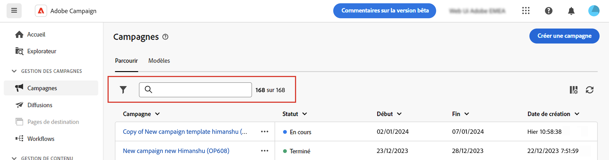
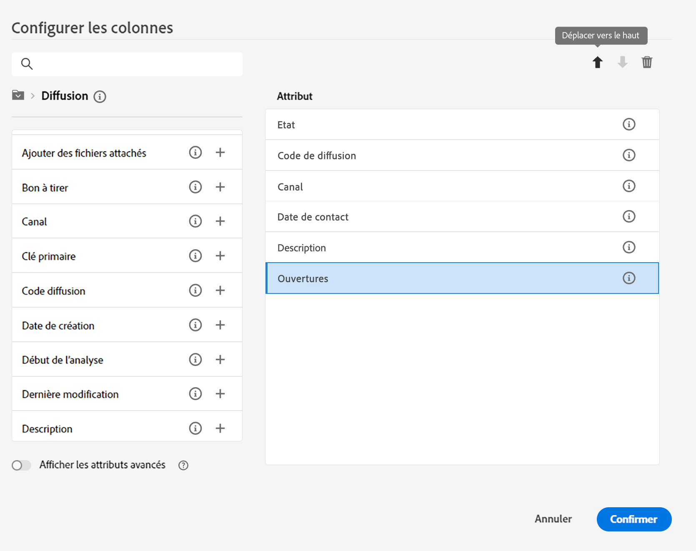

# Découvrir l’interface {#user-interface}

>[!CONTEXTUALHELP]
>id="acw_homepage_learnmore"
>title="Découvrir l’interface"
>abstract="La nouvelle interface web de Campaign v8 Web offre une expérience utilisateur intégrée, intuitive et cohérente."

La nouvelle interface web de Campaign v8 Web offre une expérience utilisateur moderne et intuitive, afin de simplifier la conception et la diffusion des campagnes marketing. Cette nouvelle interface est intégrée à Adobe Experience Platform.

<!--
Key concepts when browsing the user interface are common with Adobe Experience Platform. Refer to [Adobe Experience Platform documentation](https://experienceleague.adobe.com/docs/experience-platform/landing/platform-ui/ui-guide.html#adobe-experience-platform-ui-guide) for more details.
-->

>[!NOTE]
>
>Cette documentation est fréquemment mise à jour pour prendre en compte les dernières modifications apportées à l’interface utilisateur du produit. Cependant, certaines captures d’écran peuvent légèrement différer de votre interface utilisateur.

<!--
* console + web interface (overview, why use each of them)
* web UI made up of read-only lists that can be configured, show how to add columns
-->

## Menu de navigation gauche

Parcourez les liens situés à gauche pour accéder aux fonctionnalités de Campaign v8 Web. Plusieurs liens affichent des listes d’objets qui peuvent être triés et filtrés. Vous pouvez également configurer des colonnes pour afficher toutes les informations dont vous avez besoin. Consultez cette [section](#list-screens). Tous les écrans de type Liste sont en lecture seule, à l’exception de la liste de diffusion e-mail. La version Alpha ne permet pas de cliquer sur un élément de liste pour le modifier/visualiser. Toutes les listes pourront être modifiées dans les versions ultérieures. Les éléments affichés dans le menu de navigation de gauche dépendent de vos autorisations utilisateur.

### Accueil

Les liens et les ressources clés de cet écran offrent un accès rapide aux principales fonctionnalités de Campaign v8 Web. La liste **Récents** offre des raccourcis vers les diffusions récemment créées et modifiées. Cette liste affiche les dates et statuts de création et de modification.

<!--
* Banner
* KPIs on email channel (cross-deliveries): open rate, delivery rate, etc
* Recent items
* Learning cards
-->

Accédez aux pages principales d’aide de Campaign v8 Web depuis la section inférieure de la page d’accueil.

<!--
show global KPIs, recent items + left menu to access features)
CONTROL PANEL not alpha
Global report not alpha
-->

### Explorateur

>[!CONTEXTUALHELP]
>id="acw_explorer"
>title="Explorateur"
>abstract="Le menu **Explorateur** affiche la même hiérarchie de dossiers que celle de la console cliente. Parcourez tous vos composants, dossiers et schémas Campaign v8. Tous les écrans de type Liste sont en lecture seule, à l’exception de la liste de diffusion e-mail."

Le menu **Explorateur** affiche la même hiérarchie de dossiers que celle de la console cliente. Parcourez tous vos composants, dossiers et schémas Campaign v8. Tous les écrans de type Liste sont en lecture seule, à l’exception de la liste de diffusion e-mail.

Les éléments affichés dans l’Explorateur dépendent de vos autorisations utilisateur.

Comme dans n’importe quel écran de liste, vous pouvez configurer des colonnes pour personnaliser l’affichage en fonction des informations que vous souhaitez. Consultez cette [section](#list-screens).

Pour plus d’informations sur l’explorateur de Campaign, consultez cet [article](https://experienceleague.adobe.com/docs/campaign/campaign-v8/new/ac-ui/campaign-ui.html?lang=fr#ac-explorer-ui){target="_blank"}.
<!--
Explorer' menu in web UI to navigate through console content: console navtree second view in addition to the left menu lists with filters. The Explorer gives the real folder hierarchy from the console. Make sure you find your deliveries in sub-folders. All lists can be accessed in read-only. No Create/Edit. You can configure lists (colums). All schema fields, linked tables are available. 

If you need to view your lists of recipients (age, gender), transactions or live transactional messages. To view each/edit -> console.

Navtree view depends on permissions (same as console).
-->

### Campaign Management

>[!CONTEXTUALHELP]
>id="acw_campaigns_list"
>title="Campagnes"
>abstract="Il s’agit de la liste de vos campagnes. Vous pouvez afficher des informations utiles telles que leurs dates de début, de fin ou de dernière modification, ainsi que leur statut. Vous pouvez filtrer la liste par statut ou date de début/fin. Des modèles de campagne sont également disponibles. Ces listes sont en lecture seule."

>[!CONTEXTUALHELP]
>id="acw_deliveries_list"
>title="Diffusions"
>abstract="Parcourez votre liste de diffusions. Vous pouvez consulter leur état, date de dernière modification ainsi que les indicateurs clés de performance. Vous pouvez filtrer la liste par état, date de contact ou canal. Cliquez sur une diffusion e-mail pour ouvrir son tableau de bord. Les autres éléments sont en lecture seule. Des modèles de diffusion sont également disponibles."

* **Campagnes** - Il s’agit de la liste de vos campagnes. Par défaut, vous pouvez afficher leurs dates de début/fin/dernière modification, ainsi que leur statut. Vous pouvez filtrer la liste par statut ou date de début/fin. Des modèles de campagne sont également disponibles. Ces listes sont en lecture seule.

* **Diffusions** - Parcourez votre liste de diffusions. Vous pouvez consulter leur état, date de dernière modification ainsi que les principaux KPI. Vous pouvez filtrer la liste par état, date de contact ou canal. Pour obtenir une vue d’ensemble des détails d’une diffusion e-mail, cliquez sur celle-ci afin d’ouvrir son tableau de bord. Les diffusions sur d’autres canaux sont en lecture seule. Les modèles de diffusion sont également disponibles en lecture seule. Vous pouvez utiliser la console cliente pour les modifier. Consultez cette [documentation](https://experienceleague.adobe.com/docs/campaign/campaign-v8/campaigns/send/create-templates.html?lang=fr){target="_blank"}.

   Utilisez le bouton **Autres actions** pour supprimer ou dupliquer une diffusion.

   {width="70%" align="left"}

### Gestion des clients

>[!CONTEXTUALHELP]
>id="acw_recipients_list"
>title="Destinataires"
>abstract="Accédez à la base de données des destinataires. Vous pouvez consulter des informations utiles telles que leur adresse e-mail, prénom et nom. Cette liste est en lecture seule."

>[!CONTEXTUALHELP]
>id="acw_audiences_list"
>title="Audiences"
>abstract="Il s’agit de votre liste d’audiences. Vous pouvez consulter leur type, origine, date de création/dernière modification et libellé. Vous pouvez filtrer la liste par origine. Cette liste est en lecture seule."

>[!CONTEXTUALHELP]
>id="acw_subscriptions_list"
>title="Listes d’abonnements"
>abstract="Parcourez les listes d’abonnements. Vous pouvez consulter leur type, mode et libellé. Cette liste est en lecture seule."

>[!CONTEXTUALHELP]
>id="acw_targeting_workflow_list"
>title="Les workflows de ciblage"
>abstract="Accédez à votre liste de workflows Campaign. Vous pouvez afficher leur état, les dates de leur dernier/prochain traitement et leur environnement. Vous pouvez filtrer la liste par état, date de dernier traitement et type de workflow. Des modèles de workflow sont également disponibles. Ces listes sont en lecture seule."

* **Destinataires** - Accédez à la base de données des destinataires. Par défaut, vous pouvez consulter leur adresse e-mail, prénom et nom. Cette liste est en lecture seule.
* **Audiences** - Il s’agit de votre liste d’audiences. Par défaut, vous pouvez consulter leur type, origine, date de création/dernière modification et libellé. Vous pouvez filtrer la liste par origine. Cette liste est en lecture seule.
* **Listes d’abonnements** - Parcourez vos listes d’abonnements. Par défaut, vous pouvez consulter leur type, mode et libellé. Cette liste est en lecture seule.
* **Workflows de ciblage** - Accédez à votre liste de workflows de campagne. Par défaut, vous pouvez consulter leur état, les dates de leur dernier/prochain traitement et leur environnement. Vous pouvez filtrer la liste par état, date de dernier traitement et type de workflow. Des modèles de workflow sont également disponibles. Ces listes sont en lecture seule.

### Gestion des décisions

>[!CONTEXTUALHELP]
>id="acw_offers_list"
>title="Offres"
>abstract="Parcourez votre liste d’offres Interaction. Par défaut, vous pouvez consulter leur état, les dates de début/fin et leur environnement. Vous pouvez filtrer la liste par état et par date de début/fin. Des modèles d’offre sont également disponibles. Ces listes sont en lecture seule."

* **Offres** - Parcourez votre liste d’offres d’interaction. Par défaut, vous pouvez consulter leur état, les dates de début/fin et leur environnement. Vous pouvez filtrer la liste par état et par date de début/fin. Des modèles d’offre sont également disponibles. Ces listes sont en lecture seule.

## Barre supérieure  

La barre supérieure de l’interface vous permet de :

* partager vos commentaires en tant que testeur ou testeuse Alpha,
* basculer entre les organisations et les instances,
* basculer entre les applications Adobe Experience Cloud,
* accéder aux pages d’aide, contacter le support et partager vos commentaires. Vous pouvez rechercher des articles et des vidéos d’aide dans le champ de recherche.

{width="70%" align="left"}
<!--
Org / Sub-org switcher to switch between instances. Only one for Alpha. Later: intermerdiate screen with Control Panel (beta). if v8 + ACS with one card per ACS instance. Maybe quickly explain the menu for Alpha?
-->

## Configurer les écrans de liste {#list-screens}

Plusieurs liens du menu de navigation de gauche, par exemple **Diffusions** ou **Campagnes**, affichent des listes d’objets. Ces écrans de type Liste sont en lecture seule, à l’exception de la liste de diffusion d’e-mails.

Pour trouver les éléments plus rapidement, vous pouvez utiliser la barre de recherche ou filtrer la liste selon des critères contextuels.

{width="70%" align="left"}

Les listes sont affichées en colonnes. Vous pouvez également afficher des informations supplémentaires en modifiant la configuration des colonnes. Pour ce faire, cliquez sur l’icône dans le coin supérieur droit de la liste. Vous pouvez ajouter ou supprimer des colonnes et modifier leur ordre d’affichage.

{width="70%" align="left"}

Vous pouvez trier les éléments de la liste en cliquant sur l’en-tête d’une colonne. Une flèche s’affiche (vers le haut ou vers le bas) pour indiquer que la liste est triée sur cette colonne. Pour les colonnes numériques ou de date, la flèche vers le haut indique que la liste est triée par ordre croissant, tandis que la flèche vers le bas indique un ordre décroissant. Pour les colonnes de type chaîne ou alphanumérique, les valeurs sont classées par ordre alphabétique.

## Aide contextuelle et guide d’intégration

Une aide contextuelle est disponible dans l’interface. Lorsque cette option est disponible, cliquez sur l’icône **.Icône** pour afficher des informations d’aide et des liens vers une documentation connexe.

{width="70%" align="left"}

Un guide d’intégration est également disponible pour vous aider à commencer à utiliser Campaign v8 Web. Cliquez sur l’icône dans le coin inférieur droit, sélectionnez l’un des scénarios détaillés disponibles, puis suivez simplement les instructions.

{width="70%" align="left"}

## Navigateurs pris en charge {#browsers}

Campaign v8 Web est conçu pour fonctionner de manière optimale dans la dernière version de Google Chrome, Safari et Microsoft Edge. Vous pouvez rencontrer des problèmes lors de l’utilisation de certaines fonctionnalités sur des versions plus anciennes ou d’autres navigateurs.

## Préférences de langue {#language-pref}

Campaign v8 Web est actuellement disponible dans les langues suivantes :

<table>
<tr>
<td>

Anglais (États-Unis) - EN-US

Français - FR

Allemand - DE

Italien - IT

</td>
<td>

Espagnol - ES

Portugais (Brésil) - PTBR

Japonais - JP

</td>
<td>

Coréen - KR

Chinois simplifié - CHS

Chinois traditionnel - CHT

</td>
</tr>
</table>

La langue de votre interface par défaut est déterminée par la langue préférée spécifiée dans votre profil utilisateur.

Pour changer de langue :

1. Cliquez sur l’icône de votre profil, en haut à droite, puis sélectionnez **Préférences**.

   {width="70%" align="left"}

1. Cliquez ensuite sur la langue affichée sous votre adresse e-mail.

   

1. Sélectionnez la langue de votre choix et cliquez sur **Enregistrer**. Vous pouvez sélectionner une seconde langue au cas où le composant que vous utilisez n’est pas localisé dans votre première langue.

   

<!--
## Supported browsers {#browsers}

Adobe Campaign interface is designed to work optimally in the latest version of Google Chrome. You might have trouble using certain features on older versions or other browsers.
-->

<!--
######## This part stores the contextualHelp definition for WebUI BETA ###########
######## These blocks should be dispatched in the appropriate pages when available ###########
######## PLEASE DO NOT DELETE ###########
-->

>[!CONTEXTUALHELP]
>id="acw_sms_report_overview"
>title="Synthèse du rapport SMS"
>abstract="À déterminer"

>[!CONTEXTUALHELP]
>id="acw_push_report_overview"
>title="Synthèse du rapport des notifications push"
>abstract="À déterminer"

>[!CONTEXTUALHELP]
>id="acw_import_from_a_file"
>title="Importer une audience à partir d’un fichier"
>abstract="À déterminer"

>[!CONTEXTUALHELP]
>id="acw_import_from_a_file_formatting"
>title="Paramètres de format"
>abstract="À déterminer"

>[!CONTEXTUALHELP]
>id="acw_import_from_a_file_columns"
>title="Paramètres des colonnes"
>abstract="À déterminer"

>[!CONTEXTUALHELP]
>id="acw_push_notification_template"
>title="Modèle de notification push"
>abstract="À déterminer"
