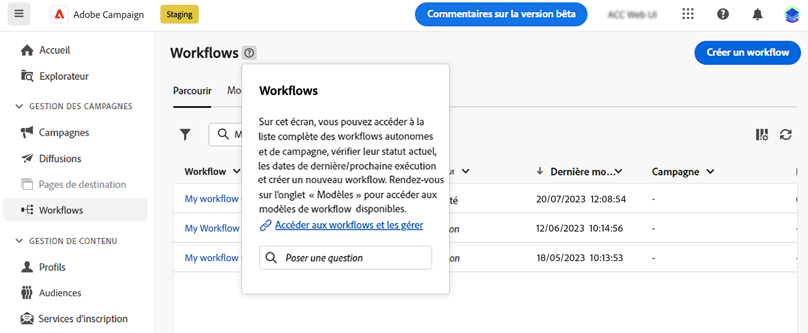

# Utilisation de l’assistant de connaissances optimisé par l’IA {#using-ai}

Obtenez des réponses rapides et générées par l’IA en fonction de la documentation du produit et de votre contexte de produit actuel, avec l’assistant de prise en charge de l’IA disponible dans les boîtes d’aide contextuelle du produit.

>[!AVAILABILITY]
>
>Cette fonctionnalité sera disponible début octobre.

La variable **Assistant de connaissances avec Gen AI** incorporé dans l’aide contextuelle révolutionne la recherche de documentation et la réponse aux questions pratiques en analysant facilement de vastes référentiels de documentation, en repérant instantanément les informations précises dont vous avez besoin.

Grâce aux fonctionnalités de Campaign Gen AI, cet assistant transforme votre expérience, en faisant de la récupération d&#39;informations et de la résolution de problèmes une brise. Que vous soyez à la recherche de conseils dans une tâche complexe ou que vous naviguiez dans des documents exhaustifs, notre assistant de connaissances avec Gen AI est votre compagnon ultime, offrant une efficacité et une précision inégalées dans chaque interaction.

{width="70%" align="left"}

<!--
## Consent {#consent-ai}

Campaign knowledge assistant embeeded in the contextual help boxes uses AI. Your use of this capability constitutes consent that the information you provide in your session will be collected, used, disclosed, and retained by Adobe in accordance with the terms of Adobe's Customer Feedback Program. Please do not provide any personal information about yourself or other parties (including your name or contact information) in the knowledge assistant.

## Privacy {#privacy-ai}

Your data is encrypted and private following our standard data protection practices. Learn more about [Adobe Privacy Policies](https://www.adobe.com/privacy/policy.html){target="_blank"}.

The knowledge assistant AI capability does not use your data to train our models. We do not allow any partners or 3rd parties to use your data for training their models or any other purpose.

For information specific to Adobe AI policies in Experience Cloud apps and solutions, refer to [this page](https://business.adobe.com/products/sensei/adobe-sensei.html){target="_blank"}.
-->

## Réponses {#answers-ai}

Les réponses peuvent être inexactes ou trompeuses. Par conséquent, l’assistant de connaissances de l’Adobe peut produire des informations incorrectes. Veillez à vérifier la documentation du produit qui est liée dans chaque zone d’aide.

L’intelligence artificielle et les modèles d’apprentissage automatique s’améliorent au fil du temps pour mieux traiter des cas d’utilisation spécifiques. L&#39;assistant de connaissances basé sur l&#39;IA de Campaign continuera à s&#39;améliorer dans les prochains mois. Nous vous conseillons vivement d’utiliser la ?? ?? à chaque fois que vous lisez une réponse, pour signaler toute réponse inappropriée à nos ingénieurs.

## Recommandations  {#recommendations-ai}

Lorsque vous posez une question dans l’assistant de connaissances optimisé par l’IA, le contexte du produit actuel, c’est-à-dire l’écran Campaign dans lequel vous vous trouvez, est pris en compte.

Pour tirer le meilleur parti de l’assistant de connaissances optimisé par l’IA, nous vous conseillons de :

* Soyez aussi précis et précis que possible et évitez toute ambiguïté. La réponse sera plus précise et utile.
* Pour aider l’assistant de connaissances optimisé par l’IA à trouver les informations correctes, ajoutez autant de détails que possible sur ce que vous essayez d’apprendre.
* Remplissez et affinez vos questions pour obtenir de meilleures réponses. Si la réponse n’est pas exacte ou utile, essayez différentes approches et ajoutez du contexte pour obtenir de meilleurs résultats.
* Utilisez des termes et des termes appropriés, avec un ton neutre.
* Évaluez les réponses et fournissez des commentaires afin que nos ingénieurs puissent apprendre de votre expérience et améliorer les résultats.

