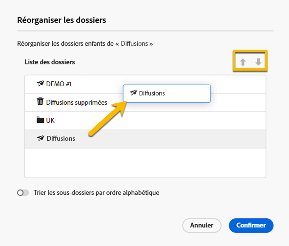
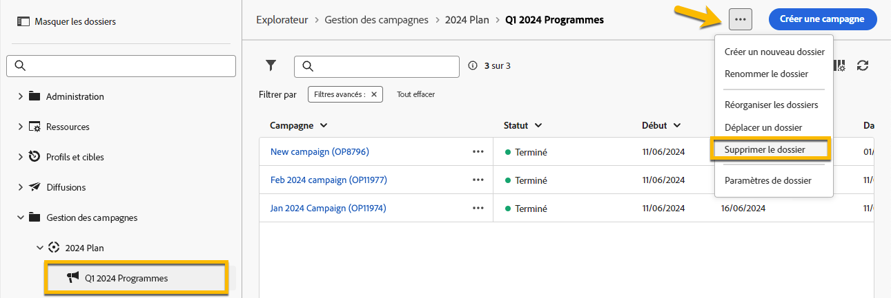
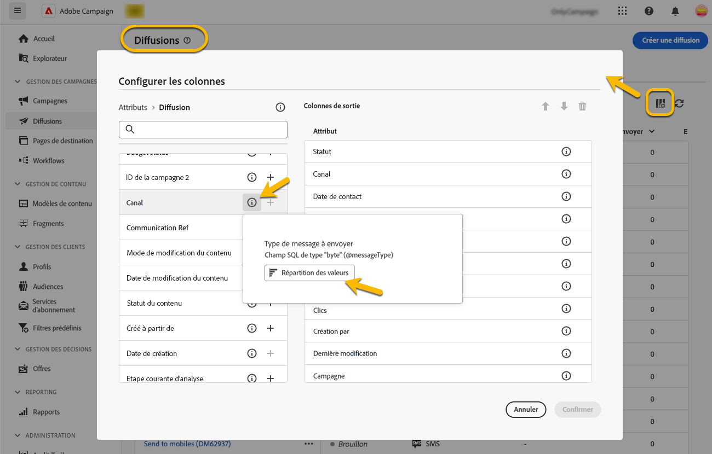

# Utiliser des dossiers {#folders}

>[!CONTEXTUALHELP]
>id="acw_folder_properties"
>title="Propriétés des dossiers"
>abstract="Propriétés des dossiers"

>[!CONTEXTUALHELP]
>id="acw_folder_security"
>title="Sécurité des dossiers"
>abstract="Sécurité des dossiers"

>[!CONTEXTUALHELP]
>id="acw_folder_restrictions"
>title="Restrictions relatives aux dossiers"
>abstract="Restrictions relatives aux dossiers"

>[!CONTEXTUALHELP]
>id="acw_folder_schedule"
>title="Planning des dossiers"
>abstract="Planning des dossiers"

## À propos des dossiers {#about-folders}

Dans Adobe Campaign, les dossiers sont des objets qui vous permettent d’organiser vos composants et vos données.

Vous pouvez créer, renommer, réorganiser et déplacer des dossiers dans l’arborescence de navigation. Vous pouvez également les supprimer en fonction de vos droits.

{zoomable="yes"}

Vous pouvez configurer un type de dossier. Par exemple, un dossier de diffusions. L’icône du dossier change en fonction de son type.

## Créer un dossier {#create-a-folder}

Pour créer un dossier dans l’interface utilisateur web d’Adobe Campaign, procédez comme suit :

1. Dans **[!UICONTROL Explorateur]**, accédez au dossier dans lequel vous souhaitez créer votre nouveau dossier. Dans le menu **[!UICONTROL ...]**, sélectionnez **[!UICONTROL Créer un dossier]**.

{zoomable="yes"}

Lorsque vous créez un dossier, le type de dossier par défaut est celui du dossier parent. Dans cet exemple, un dossier est créé dans le dossier **[!UICONTROL Diffusions]**.

{zoomable="yes"}

1. Modifiez le type de dossier en cliquant sur l’icône de type de dossier si nécessaire, puis sélectionnez le type souhaité dans la liste présentée, comme illustré ci-dessous :

{zoomable="yes"}

Configurez le type de dossier en cliquant sur le bouton **[!UICONTROL Confirmer]**.

Si vous souhaitez créer un dossier sans type spécifique, sélectionnez le type **[!UICONTROL Dossier générique]**.

Vous pouvez également [créer et gérer des dossiers dans la console Adobe Campaign](https://experienceleague.adobe.com/fr/docs/campaign/campaign-v8/config/configuration/folders-and-views).

## Réorganiser les dossiers {#reorder-folders}

Vous pouvez réorganiser les dossiers en fonction de vos besoins. Pour cela, cliquez sur **[!UICONTROL Réorganiser les dossiers]**, comme dans l&#39;exemple ci-dessous.

Dans cet exemple, le dossier **Deliveries** contient quatre sous-dossiers.

{zoomable="yes"}

Vous pouvez modifier l’ordre des dossiers par **glisser-déposer** ou à l’aide des flèches **vers le haut et vers le bas**.

{zoomable="yes"}

## Supprimer un dossier {#delete-a-folder}

>[!CAUTION]
>
>Lors de la suppression d’un dossier, toutes les données stockées dans ce dossier sont également supprimées.

Pour supprimer un dossier, sélectionnez-le dans votre arborescence **[!UICONTROL Explorateur]**, puis cliquez sur le menu **[!UICONTROL ...]** . Sélectionnez **[!UICONTROL Supprimer le dossier]**.

{zoomable="yes"}

## Répartition des valeurs dans un dossier {#distribution-values-folder}

La répartition des valeurs permet de comprendre le pourcentage d’une valeur dans une colonne d’un tableau.

Pour visualiser la répartition des valeurs dans un dossier, procédez comme expliqué ci-dessous.

Par exemple, parmi les diffusions, vous pouvez vouloir connaître la distribution des valeurs dans la colonne **Canal**.

Pour obtenir ces informations, accédez au dossier **[!UICONTROL Diffusions]** et cliquez sur l’icône **[!UICONTROL Configurer les colonnes]**.

Dans la fenêtre **[!UICONTROL Configurer les colonnes]**, cliquez sur l&#39;icône **[!UICONTROL Informations]** associée à la colonne à analyser. Cliquez ensuite sur le bouton **[!UICONTROL Répartition des valeurs]**.

{zoomable="yes"}

Le pourcentage de valeurs s’affiche dans la colonne **[!UICONTROL Canal]**.

{zoomable="yes"}

>[!NOTE]
>
>Pour les colonnes comportant de nombreuses valeurs, seules les vingt premières valeurs sont affichées. Une notification **[!UICONTROL Chargement partiel]** vous avertit.

Vous pouvez également visualiser la répartition des valeurs d’un lien.

Dans la liste des attributs, cliquez sur le bouton **+** en regard du lien souhaité, comme illustré ci-dessous. Le lien est ajouté dans les **[!UICONTROL Colonnes de sortie]**. Vous pouvez désormais accéder à l’icône **[!UICONTROL Informations]**, ce qui vous permet de visualiser la répartition de ses valeurs. Si vous ne souhaitez pas conserver le lien dans le **[!UICONTROL Colonnes de sortie]**, cliquez sur le bouton **[!UICONTROL Annuler]**.

{zoomable="yes"}

Il est également possible de visualiser la distribution des valeurs dans un requêteur. [En savoir plus ici](../query/build-query.md#distribution-of-values-in-a-query).

### Filtrer les valeurs {#filter-values}

En utilisant l’option **[!UICONTROL Filtres avancés]** dans la fenêtre Répartition des valeurs, vous pouvez filtrer les résultats en fonction de conditions spécifiées.

Dans l’exemple de la liste de diffusions ci-dessus, qui montre la distribution par canal, vous pouvez la filtrer pour n’afficher que les diffusions avec un statut **Terminé**.

{zoomable="yes"}