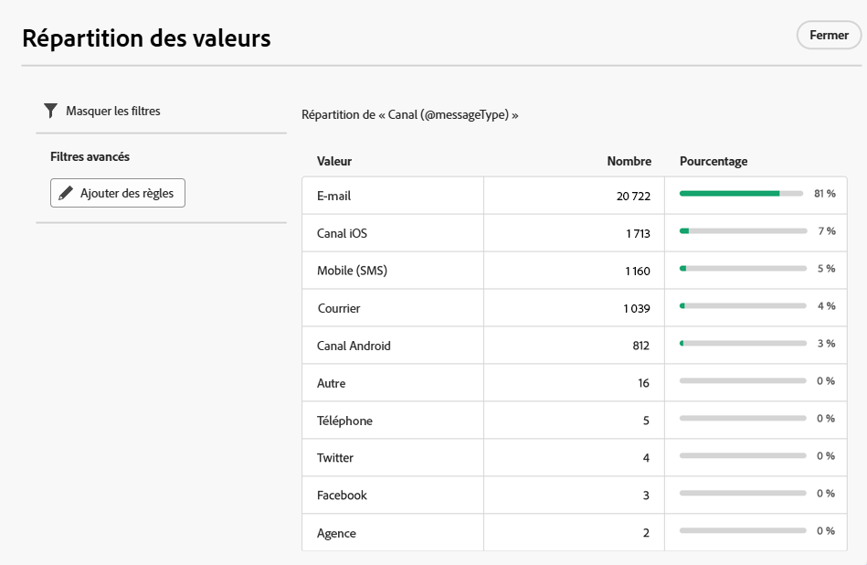
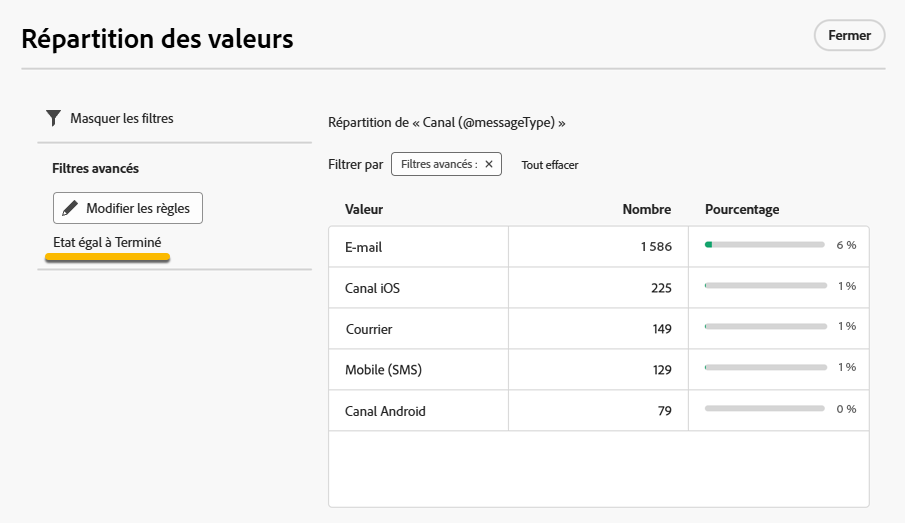

# Utiliser des dossiers {#folders}

>[!CONTEXTUALHELP]
>id="acw_folder_properties"
>title="Propriétés des dossiers"
>abstract="Propriétés des dossiers"

>[!CONTEXTUALHELP]
>id="acw_folder_security"
>title="Sécurité des dossiers"
>abstract="Sécurité des dossiers"

>[!CONTEXTUALHELP]
>id="acw_folder_restrictions"
>title="Restrictions relatives aux dossiers"
>abstract="Restrictions relatives aux dossiers"

>[!CONTEXTUALHELP]
>id="acw_folder_schedule"
>title="Planning des dossiers"
>abstract="Planning des dossiers"

## À propos des dossiers {#about-folders}

Dans Adobe Campaign, les dossiers sont des objets qui vous permettent d’organiser vos composants et vos données.

Vous pouvez créer, renommer, réorganiser et déplacer des dossiers dans l’arborescence de navigation. Vous pouvez également les supprimer selon vos autorisations.

{zoomable="yes"}

Vous pouvez configurer un type de dossier. Par exemple : un dossier de diffusions.
L’icône du dossier change en fonction de ce type.

## Créer un dossier {#create-a-folder}

Pour créer un dossier dans l’interface utilisateur web d’Adobe Campaign, procédez comme suit :

1. Dans **[!UICONTROL Explorateur]**, accédez au dossier dans lequel vous souhaitez créer votre dossier.
Sous le menu **[!UICONTROL ...]** se trouve **[!UICONTROL Créer un dossier]**.

{zoomable="yes"}

Lorsque vous créez un dossier, par défaut, le type de dossier est le type du dossier parent. Dans notre exemple, nous créons un dossier dans le dossier **[!UICONTROL Diffusions]**.

{zoomable="yes"}

1. Modifiez le type de dossier en cliquant sur l’icône Type de dossier si nécessaire et en le choisissant dans la liste qui s’affiche, comme ci-dessous :

{zoomable="yes"}

Configurez le type de dossier en cliquant sur le bouton **[!UICONTROL Confirmer]**.

Si vous souhaitez créer un dossier sans type spécifique, choisissez le type **[!UICONTROL Dossier générique]**.

Vous pouvez également [créer et gérer des dossiers dans la console Adobe Campaign](https://experienceleague.adobe.com/fr/docs/campaign/campaign-v8/config/configuration/folders-and-views).

## Réorganiser les dossiers {#reorder-folders}

Vous pouvez réorganiser les dossiers selon vos besoins. Pour ce faire, cliquez sur le bouton **[!UICONTROL Réorganiser les dossiers]** comme illustré ci-dessous.

Dans notre exemple, le dossier **Diffusions** contient 4 dossiers.

{zoomable="yes"}

Vous pouvez modifier l’ordre de vos dossiers par **glisser-déposer** ou en utilisant les **flèches haut et bas**.

{zoomable="yes"}

## Supprimer un dossier {#delete-a-folder}

>[!CAUTION]
>
>Lors de la suppression d’un dossier, toutes les données stockées dans ce dossier sont également supprimées.

Pour supprimer un dossier, sélectionnez-le dans votre arborescence **[!UICONTROL Explorateur]**, puis cliquez sur le menu **[!UICONTROL ...]**.
Sélectionnez **[!UICONTROL Supprimer le dossier]**.

{zoomable="yes"}

## Répartition des valeurs dans un dossier {#distribution-values-folder}

La répartition des valeurs permet de connaître le pourcentage d’une valeur dans une colonne d’un tableau.

Pour connaître la répartition des valeurs dans un dossier, procédez comme suit :

Par exemple, parmi les diffusions, nous voulons connaître la répartition des valeurs de la colonne **Canal**.

Pour obtenir ces informations, accédez au dossier **[!UICONTROL Diffusions]** et cliquez sur l’icône **[!UICONTROL Configurer les colonnes]**.

Dans la fenêtre **[!UICONTROL Configurer les colonnes]**, cliquez sur l’icône **[!UICONTROL Informations]** de la colonne que vous souhaitez connaître. Cliquez ensuite sur le bouton **[!UICONTROL Répartition des valeurs]**.

{zoomable="yes"}

Vous obtiendrez le pourcentage des valeurs de la colonne **[!UICONTROL Canal]**.

{zoomable="yes"}

>[!NOTE]
>
> Pour les colonnes comportant de nombreuses valeurs, seules les vingt premières valeurs seront affichées. Une notification **[!UICONTROL Chargement partiel]** vous en informera.

Vous pouvez également disposer de la répartition des valeurs d’un lien.

Dans la liste des attributs, cliquez sur le bouton **+** en regard du lien souhaité, comme illustré ci-dessous. Le lien est ajouté dans les **[!UICONTROL Colonnes de sortie]**. Vous pouvez maintenant disposer de l’icône **[!UICONTROL Informations]**, ce qui vous permet d’afficher la répartition de ses valeurs. Si vous ne souhaitez pas conserver le lien dans les **[!UICONTROL Colonnes de sortie]**, veillez à cliquer sur le bouton **[!UICONTROL Annuler]**.

{zoomable="yes"}

Il est également possible de disposer de la répartition des valeurs dans un concepteur de requête. [En savoir plus ici](../query/build-query.md#distribution-of-values-in-a-query).

### Filtrer les valeurs {#filter-values}

En utilisant les **[!UICONTROL Filtres avancés]** dans la fenêtre de distribution des valeurs, vous pouvez filtrer vos résultats selon des conditions spécifiées.

Dans l’exemple de la liste de diffusions ci-dessus, qui affiche la distribution par canal, vous pouvez, par exemple, la filtrer pour afficher uniquement les diffusions dont le statut est **Terminé**.

{zoomable="yes"}
