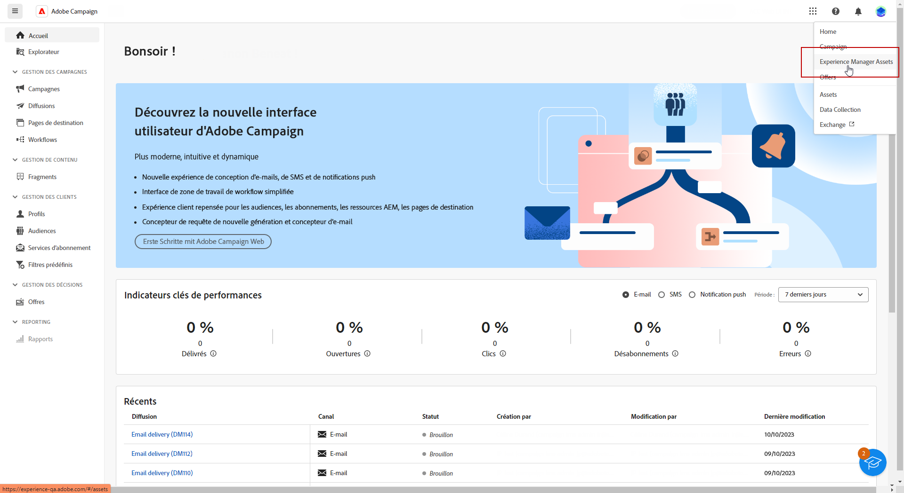
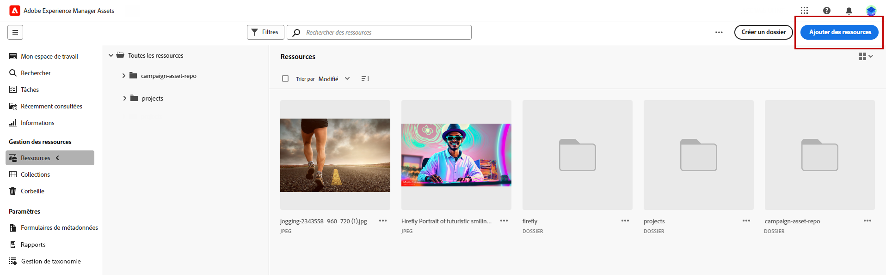
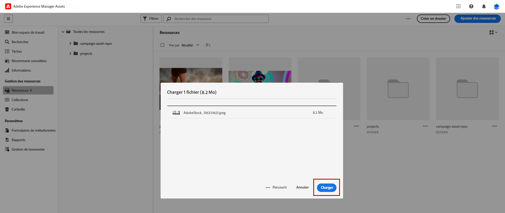
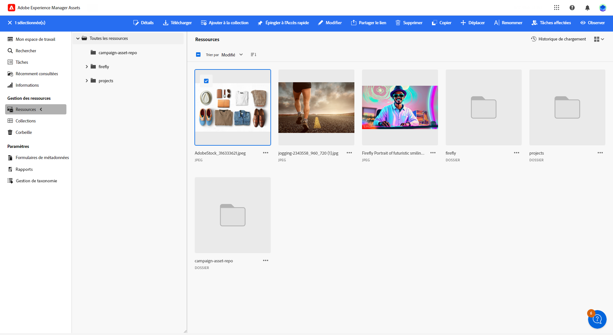
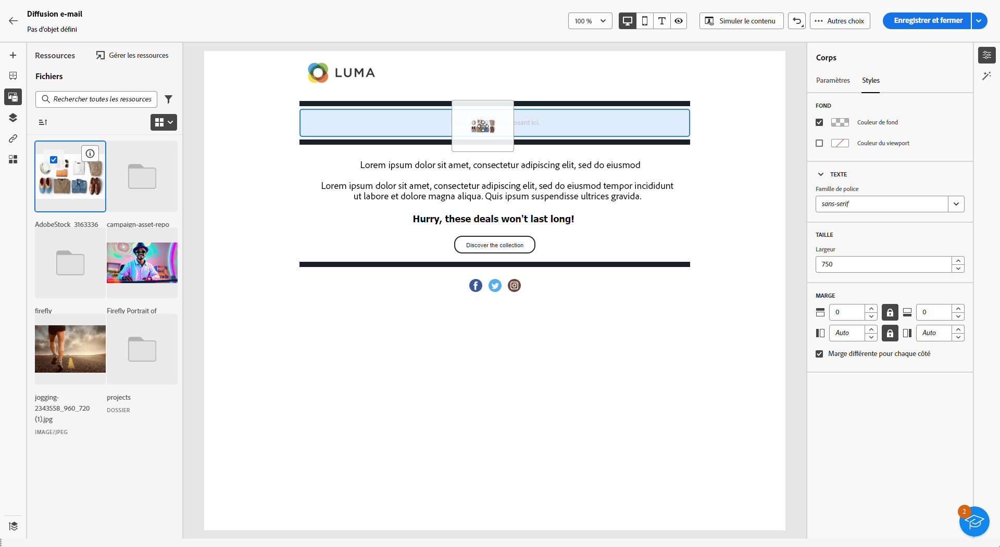
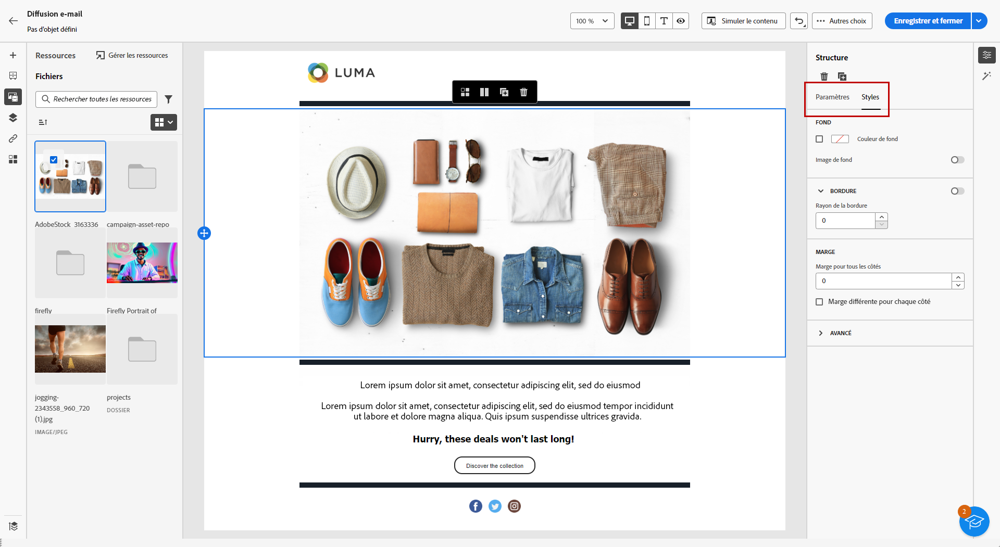

# Gérer les ressources avec [!DNL Adobe Experience Manager Assets as a Cloud Service]{#aem-assets}

## Commencer avec [!DNL Adobe Experience Manager Assets as a Cloud Service] {#get-started-assets-essentials}

[!DNL Adobe Experience Manager Assets as a Cloud Service] est une plateforme collaborative intégrée conçue pour rationaliser votre workflow créatif et centraliser les ressources numériques pour une diffusion d’expérience transparente. Elle simplifie l’organisation, le balisage et la récupération des ressources de production approuvées, assurant la cohérence de la marque entre les équipes. Avec son interface conviviale, [!DNL Assets as Cloud Service] vous permet d’accéder instantanément aux ressources et de les partager dans vos applications Adobe Creative et Experience Cloud.

Apprenez-en plus dans la [Documentation d’Adobe Experience Manager Assets as a Cloud Service](https://experienceleague.adobe.com/docs/experience-manager-cloud-service/content/assets/home.html?lang=fr){target="_blank"}.

## Charger et insérer des ressources{#add-asset}

Pour importer des fichiers dans [!DNL Assets as Cloud Service], vous devez d’abord parcourir ou créer le dossier dans lequel ils seront stockés. Vous pourrez alors les insérer dans le contenu de votre e-mail.

Pour plus d’informations sur le chargement de ressources, reportez-vous à la [Documentation d’Adobe Experience Manager Assets as a Cloud Service](https://experienceleague.adobe.com/docs/experience-manager-cloud-service/content/assets/assets-view/add-delete-assets-view.html?lang=fr){target="_blank"}.

1. Sur la page d’accueil, accédez au menu avancé et sélectionnez [!DNL Experience Manager Assets].

   {zoomable=&quot;yes&quot;}

1. Sous **Gestion des ressources**, cliquez sur **Ressources** et choisissez le référentiel pour vos ressources dans Adobe Campaign.

1. Cliquez sur un dossier dans la section centrale ou dans l’arborescence pour l’ouvrir.

   Vous pouvez également cliquer sur **[!UICONTROL Créer un dossier]** pour créer un dossier.

1. Une fois dans le dossier sélectionné ou créé, cliquez sur **[!UICONTROL Ajouter des ressources]** pour charger une nouvelle ressource dans votre dossier.

   {zoomable=&quot;yes&quot;}

1. Dans **[!UICONTROL Charger les fichiers]**, cliquez sur **[!UICONTROL Parcourir]** et choisissez si vous souhaitez **[!UICONTROL Parcourir les fichiers]** ou **[!UICONTROL Parcourir les dossiers]**.

1. Sélectionnez le fichier que vous souhaitez charger. Lorsque vous avez terminé, cliquez sur **[!UICONTROL Charger]**.

   {zoomable=&quot;yes&quot;}

1. Pour accéder au menu avancé de gestion des ressources, sélectionnez la ressource que vous venez de charger.

   Pour en savoir plus sur la gestion de vos ressources, reportez-vous à cette [page](https://experienceleague.adobe.com/docs/experience-manager-cloud-service/content/assets/assets-view/manage-organize-assets-view.html?lang=fr).

   {zoomable=&quot;yes&quot;}

1. Pour modifier davantage vos ressources avec Adobe Photoshop Express, double-cliquez dessus. Ensuite, dans le menu de droite, sélectionnez l’icône **[!UICONTROL Mode d’édition]**. [En savoir plus](https://experienceleague.adobe.com/docs/experience-manager-cloud-service/content/assets/assets-view/edit-images-assets-view.html?lang=fr#edit-using-express){target="_blank"}.

1. Dans [!DNL Adobe Campaign], sélectionnez le menu **[!UICONTROL Sélecteur de ressources]** dans le volet gauche du concepteur d’e-mail.

   {zoomable=&quot;yes&quot;}

1. Sélectionnez le dossier **[!UICONTROL Assets]** que vous avez créé précédemment. Vous pouvez également rechercher votre ressource ou votre dossier dans la barre de recherche.

   Si nécessaire, cliquez sur **[!UICONTROL Gérer les ressources]** pour accéder directement à votre espace de travail [!DNL Adobe Experience Manager Assets].

1. Faites glisser et déposez votre ressource dans le contenu de votre e-mail.

   {zoomable=&quot;yes&quot;}

1. Vous pouvez personnaliser davantage vos ressources, par exemple en ajoutant un lien externe ou du texte à l’aide des onglets **[!UICONTROL Paramètres]** et **[!UICONTROL Styles]**. [En savoir plus sur les paramètres des composants](../email/content-components.md)

   {zoomable=&quot;yes&quot;}
