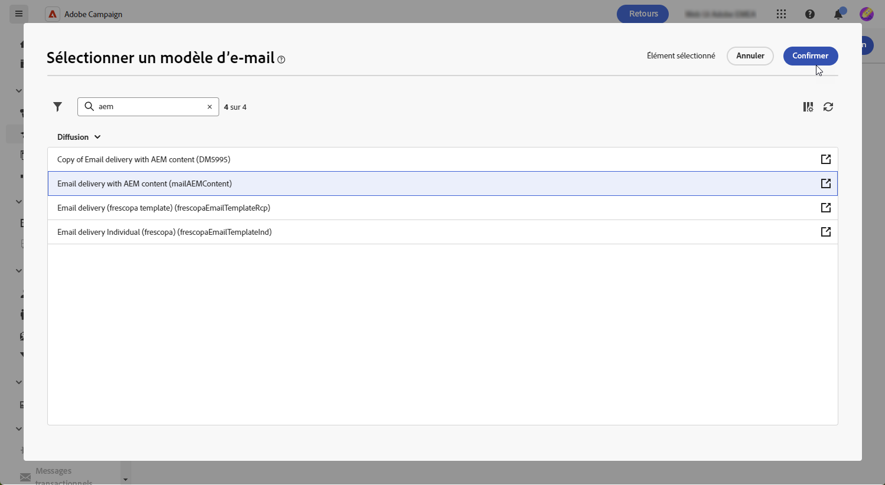
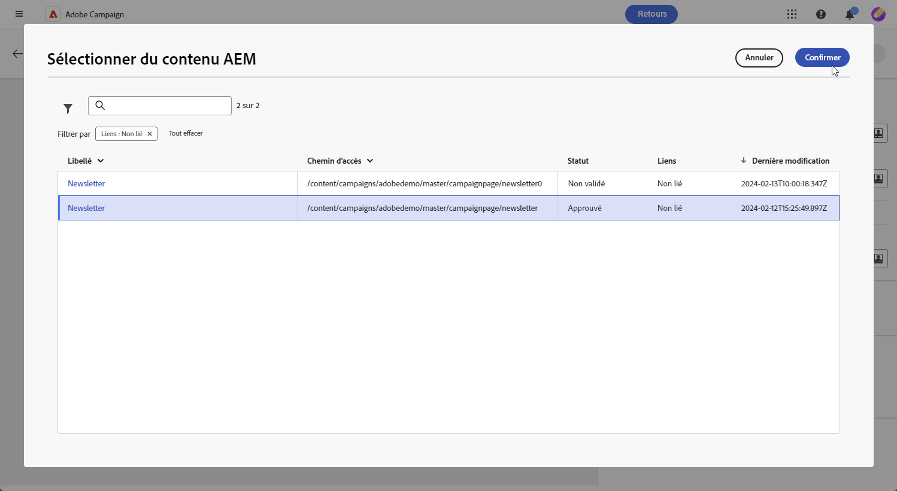
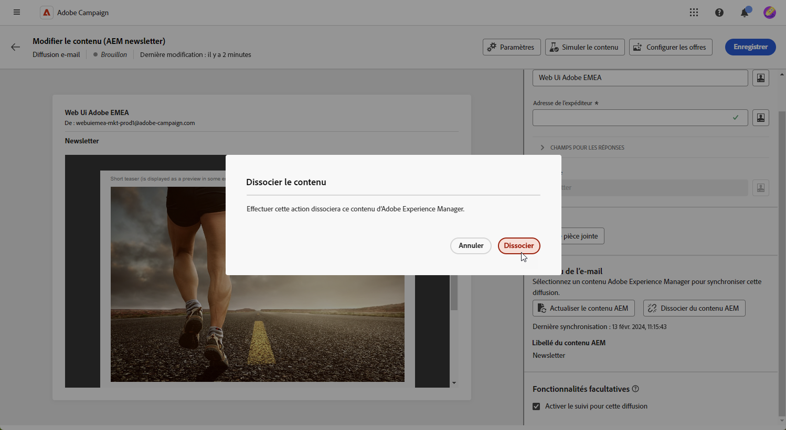

# Gestion des modèles avec [!DNL Adobe Experience Manager as a Cloud service]{#aem-assets}

## Commencer avec [!DNL Adobe Experience Manager as a Cloud service]{#create-aem}

L&#39;intégration de l&#39;interface web d&#39;Adobe Campaign avec Adobe Experience Manager facilite la gestion rationalisée du contenu et des formulaires de diffusion email directement au sein de la plateforme Adobe Experience Manager.

[En savoir plus sur Adobe Experience Manager as a Cloud Service](https://experienceleague.adobe.com/docs/experience-manager-cloud-service/content/sites/authoring/getting-started/quick-start.html?lang=en)

## Créez un modèle dans [!DNL Adobe Experience Manager as a Cloud service]{#create-aem-template}

1. Accédez à [!DNL Adobe Experience Manager] instance de création et cliquez sur Adobe l’expérience dans le coin supérieur gauche de la page. Choisir **[!UICONTROL Sites]** dans le menu.

1. Accès **[!UICONTROL Campagnes > Nom de votre marque > Zone principale > Email]**.

1. Cliquez sur **[!UICONTROL Créer]** et sélectionnez **[!UICONTROL Page]** dans le menu déroulant.

   

1. Sélectionnez la variable **[!UICONTROL Adobe Campaign Email]** modèle et nommez votre newsletter.

   

1. Personnalisez votre contenu d&#39;email en ajoutant des composants, tels que des champs de personnalisation d&#39;Adobe Campaign. [En savoir plus](https://experienceleague.adobe.com/docs/experience-manager-65/content/sites/authoring/aem-adobe-campaign/campaign.html?lang=en#editing-email-content)

1. Une fois que votre email est prêt, accédez au **[!UICONTROL Informations sur la page]** et cliquez sur **[!UICONTROL Démarrer le workflow]**.

   

1. Dans la première liste déroulante, sélectionnez **[!UICONTROL Approuver Adobe Campaign]** en tant que modèle de processus et cliquez sur **[!UICONTROL Démarrer le workflow]**.

1. Une clause de non-responsabilité s’affiche en haut de la page et indique : `This page is subject to the workflow Approve for Adobe Campaign`. Cliquez sur **[!UICONTROL Terminer]** en regard de la clause de non-responsabilité pour confirmer la révision, puis cliquez sur **[!UICONTROL Ok]**.

   

1. Cliquez sur **[!UICONTROL Terminer]** puis sélectionnez **[!UICONTROL Validation de newsletter]** dans le **[!UICONTROL Étape suivante]** menu déroulant.

Votre newsletter est maintenant prête et synchronisée dans Adobe Campaign.

## Importer un modèle de service Adobe Experience Manager as a Cloud{#aem-templates-perso}

Une fois que le modèle de Experience Manager est disponible dans Adobe Campaign Web en tant que modèle de contenu, vous pouvez identifier et incorporer le contenu nécessaire à l&#39;email, y compris la personnalisation.

1. Dans le Web de Campaign, à partir du **[!UICONTROL Diffusions]** , cliquez sur **[!UICONTROL Créer une diffusion]**.

1. Dans la fenêtre du modèle d&#39;email, sélectionnez le **[!UICONTROL Diffusion Email avec contenu AEM]** modèle.

   

1. Saisissez un **[!UICONTROL Libellé]** pour la diffusion et paramétrez des options supplémentaires en fonction de vos besoins :

   * **[!UICONTROL Nom interne]** : attribuez un identifiant unique à la diffusion.

   * **[!UICONTROL Dossier]** : stockez la diffusion dans un dossier spécifique.

   * **[!UICONTROL Code de diffusion]** : utilisez ce champ pour organiser vos diffusions selon votre propre convention de nommage.

   * **[!UICONTROL Description]** : spécifiez une description pour la diffusion.

   * **[!UICONTROL Nature]**: spécifiez la nature de l’email à des fins de classification.

1. Définition d’une **[!UICONTROL Audience]** à votre email. [En savoir plus](../email/create-email.md#define-audience)

1. Cliquez sur **[!UICONTROL Modifier le contenu]**.

1. Dans la **[!UICONTROL Modifier le contenu]** , cliquez sur **[!UICONTROL Sélectionner AEM contenu]**.

   

1. Parcourez votre modèle d&#39;AEM et sélectionnez celui à importer dans Campaign Web.

   

1. Si des modifications sont apportées à vos modèles directement dans Adobe Experience Manager, sélectionnez simplement **[!UICONTROL Actualiser AEM contenu]** pour disposer de la dernière version de votre modèle.

1. Pour supprimer la liaison entre Experience Manager et Campaign ou personnaliser davantage votre modèle de Experience Manager dans le Concepteur d&#39;email, cliquez sur **[!UICONTROL Dissocier AEM contenu]**.

   

1. Si vous avez ajouté du contenu personnalisé à votre modèle de Experience Manager, cliquez sur **[!UICONTROL Simulation du contenu]** pour prévisualiser l’affichage du message à l’aide de profils de test.

[En savoir plus sur l’aperçu et les profils de test](../preview-test/preview-content.md)

1. Lors de l&#39;affichage de l&#39;aperçu du message, tout élément personnalisé est automatiquement remplacé par les données correspondantes du profil de test sélectionné.

   Au besoin, des profils de test supplémentaires peuvent être ajoutés au moyen de la **[!UICONTROL Gestion des profils de test]** bouton .

Votre diffusion est maintenant prête à être envoyée.
