# Créer des e-mails multilingues avec Adobe Experience Manager {#aem-multilingual}

L’intégration d’Adobe Experience Manager vous permet de créer des diffusions par e-mail multilingues à l’aide de copies linguistiques Adobe Experience Manager.Vous pouvez ainsi gérer des variantes de contenu dans différentes langues et diffuser des e-mails personnalisés en fonction des préférences linguistiques des destinataires.

## Conditions préalables requises {#prerequisites}

Avant de créer une diffusion par e-mail multilingue, vérifiez que vous disposez des éléments suivants :

* Accès à une instance Adobe Experience Manager configurée pour l’intégration de l’interface Adobe Campaign Web.
* Contenu Adobe Experience Manager avec des copies linguistiques déjà été créé et approuvé.Pour en savoir plus sur l’assistant de copie linguistique, consultez la [documentation d’Adobe Experience Manager](https://experienceleague.adobe.com/fr/docs/experience-manager-cloud-service/content/sites/administering/reusing-content/translation/wizard).
* Modèle de diffusion d’e-mail configuré pour recevoir du contenu Adobe Experience Manager.Reportez-vous aux étapes détaillées dans la section [Activation du mode multilingue](#enable-multilingual).

## Création d’une diffusion multilingue

Pour créer une diffusion par e-mail multilingue, vous devez d’abord activer l’option multilingue dans vos paramètres de diffusion.Le système détecte automatiquement les copies linguistiques disponibles et vous permet de choisir celles à ajouter.

### Activation du mode multilingue {#enable-multilingual}

Créez une nouvelle diffusion et activez l’option multilingue dans les paramètres avancés.

1. Dans le menu **[!UICONTROL Diffusions]**, cliquez sur **[!UICONTROL Créer une diffusion]**.

   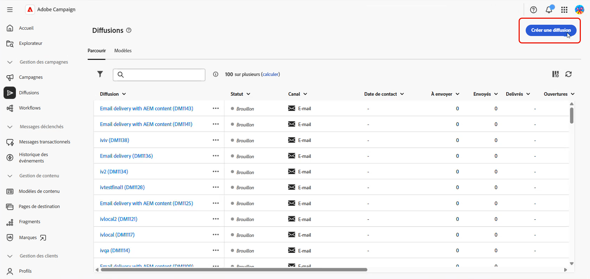

1. Sélectionnez le modèle **[!UICONTROL Diffusion par e-mail avec contenu AEM]**, puis cliquez sur **[!UICONTROL Créer une diffusion]**.

   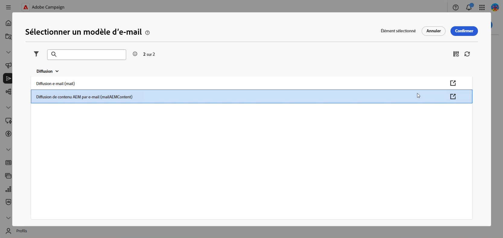

1. Saisissez le libellé de la diffusion et configurez votre audience.[En savoir plus](../email/create-email.md)

1. Accédez aux **[!UICONTROL Paramètres]** de votre diffusion, puis à la section **[!UICONTROL Avancés]**.

1. Activez l’option **[!UICONTROL Activer AEM multilingue]**.

   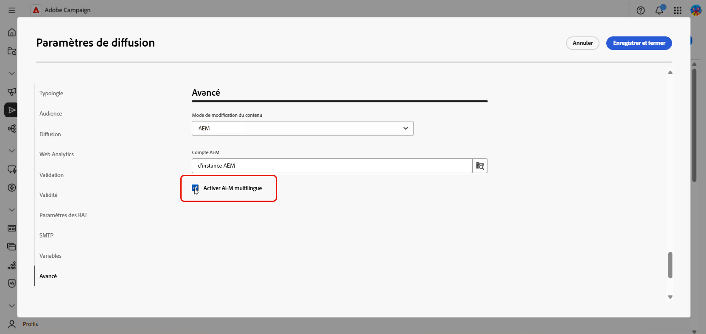

1. Vérifiez ce qui suit :

   * Le **[!UICONTROL mode de modification du contenu]** est défini sur **[!UICONTROL AEM]**.
   * Le **[!UICONTROL compte externe]** Adobe Experience Manager correct est sélectionné.

1. Cliquez sur **[!UICONTROL Enregistrer et fermer]**.

### Créer des variantes de contenu {#create-variants}

Sélectionnez votre contenu Adobe Experience Manager et choisissez les variantes linguistiques à inclure dans la diffusion.

1. Cliquez sur **[!UICONTROL Modifier le contenu]**.

1. Sélectionnez **[!UICONTROL Créer une variante de contenu]**.

   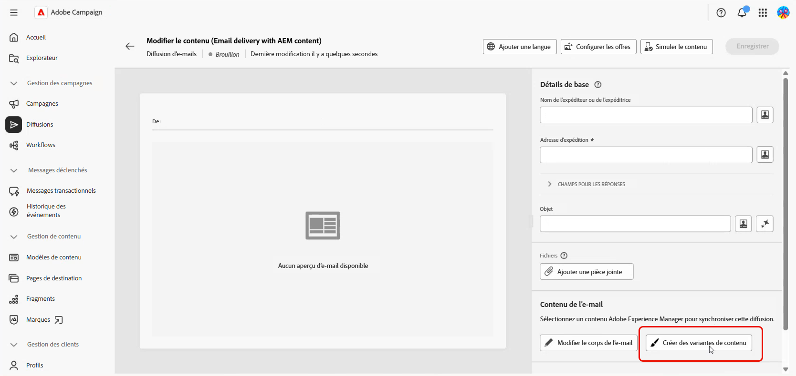

1. Sélectionnez votre contenu Adobe Experience Manager dans la liste.

   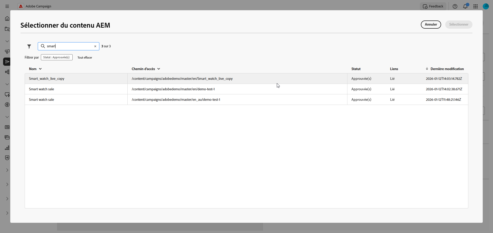

1. Le système détecte toutes les copies linguistiques associées au contenu sélectionné (relation parent-enfant). Par exemple, si votre contenu Adobe Experience Manager comporte des variantes en français, en allemand et en italien, toutes les variantes sont disponibles pour la sélection.

   Sélectionnez les variantes linguistiques à inclure dans la diffusion.

   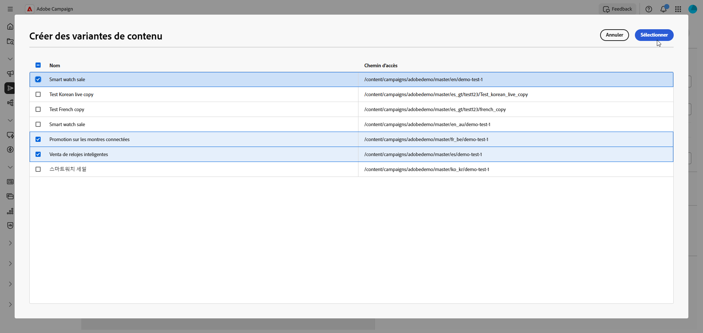

1. Cliquez sur **[!UICONTROL Enregistrer]**.

1. Vérifiez les variantes linguistiques dans l’éditeur de contenu. Vous pouvez désormais [gérer chaque variante individuellement](#manage-variants) ou poursuivre [l’envoi de la diffusion](../monitor/prepare-send.md).

   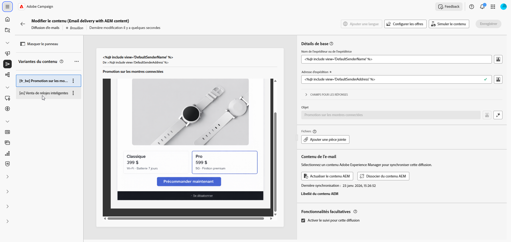

## Gérer les variantes linguistiques {#manage-variants}

Après avoir créé des variantes de contenu, vous pouvez les gérer directement dans la diffusion :

1. Pour définir une langue par défaut, accédez au menu avancé de la variante choisie et sélectionnez **[!UICONTROL Définir comme langue par défaut]**.La langue par défaut est utilisée lorsque la préférence linguistique d’un profil n’est pas définie ou ne correspond à aucune variante disponible.

   Cliquez sur **[!UICONTROL Supprimer]** pour supprimer une variante de votre diffusion.

   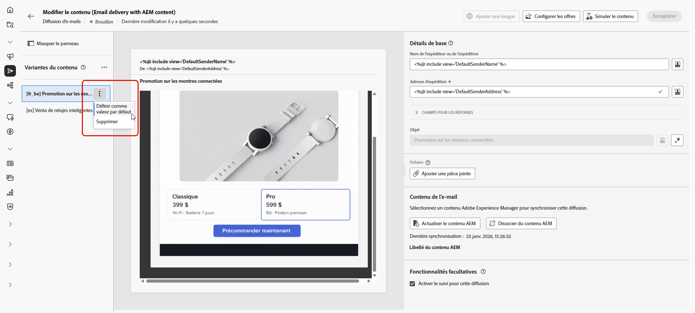

1. Dans le menu avancé Variantes de contenu, cliquez sur **[!UICONTROL Gérer les paramètres régionaux]** pour ajouter d’autres paramètres régionaux à votre diffusion.

   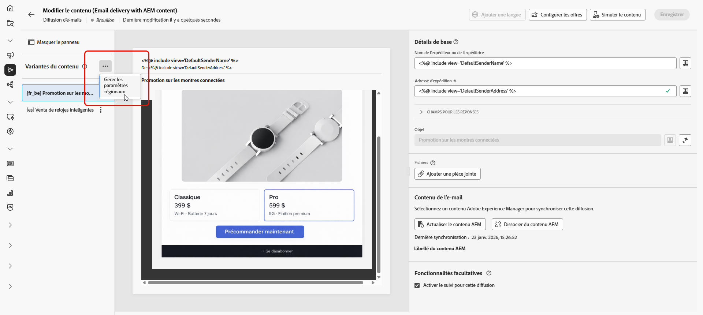

1. Sélectionnez d’autres copies linguistiques pour inclure d’autres variantes et cliquez sur **[!UICONTROL Enregistrer]**.

   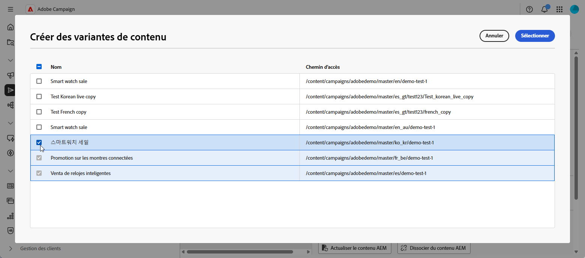

1. Si le contenu est mis à jour dans Adobe Experience Manager, cliquez sur **[!UICONTROL Actualiser le contenu AEM]** pour synchroniser toutes les variantes avec la dernière version.

   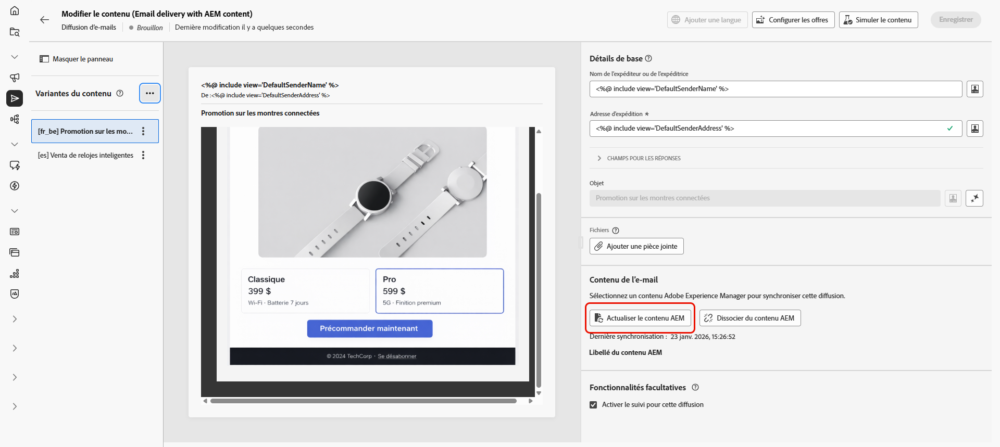

1. Cliquez sur **[!UICONTROL Dissocier le contenu AEM]** si vous souhaitez modifier le contenu directement dans Campaign ou rompre le lien avec Adobe Experience Manager.

   >[!CAUTION]
   >
   >Après la dissociation, vous ne pouvez pas actualiser le contenu d’Adobe Experience Manager ni créer de variantes.Le contenu devient indépendant d’Adobe Experience Manager.
