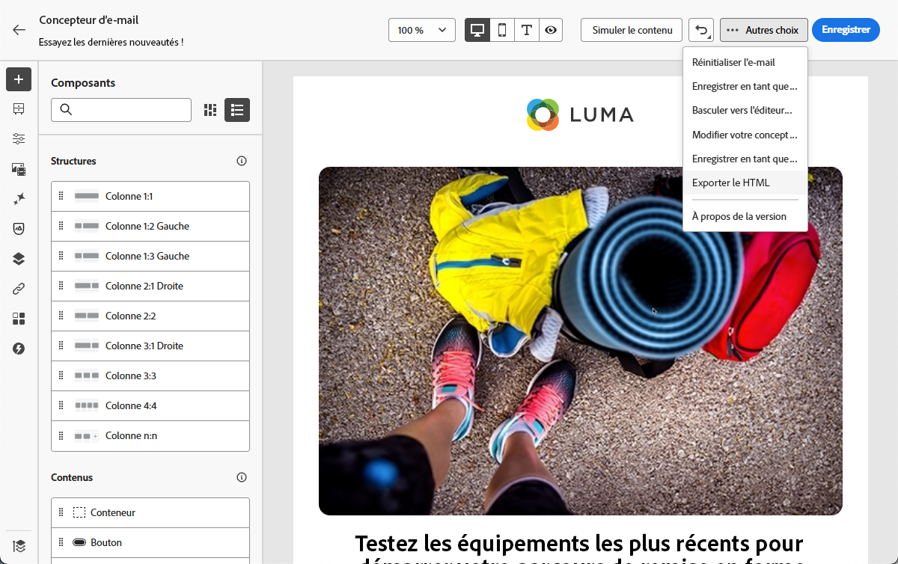
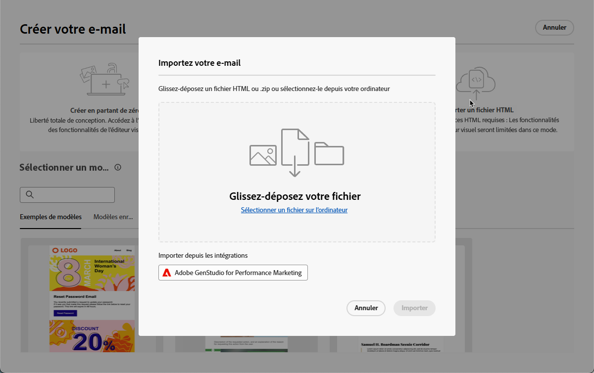
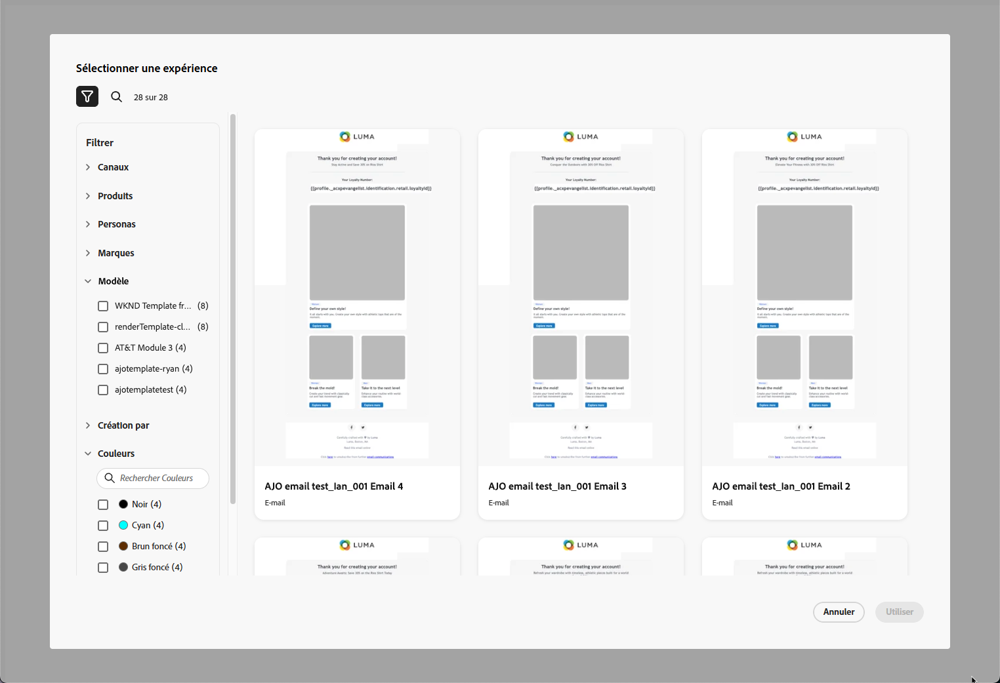
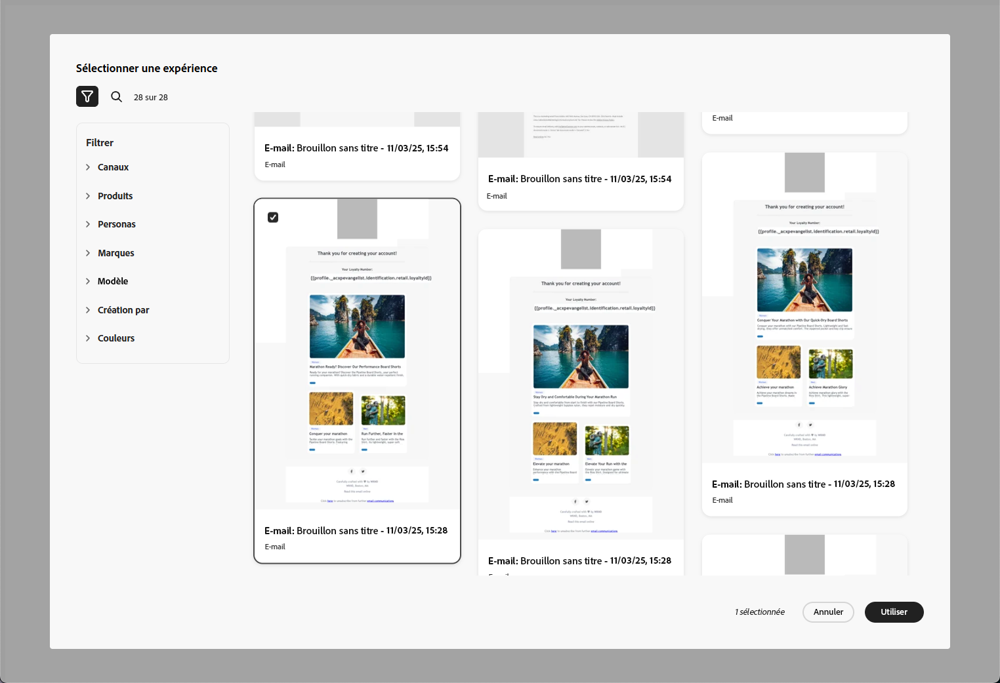
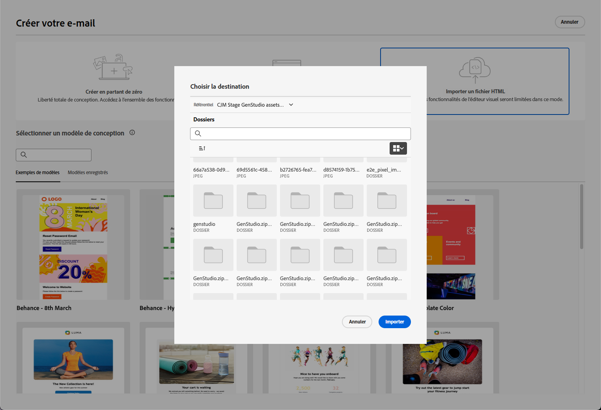
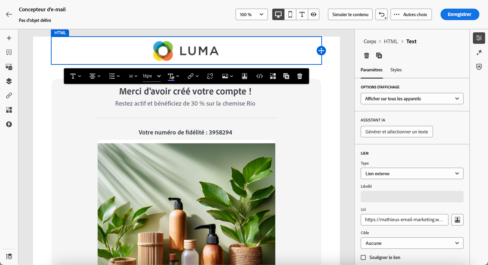

# Utiliser GenStudio for Performance Marketing {#genstudio}

>[!CONTEXTUALHELP]
>id="ac_genstudio_button"
>title="Utiliser un modèle créé avec GenStudio"
>abstract="Grâce à l’intégration transparente à Adobe GenStudio for Performance Marketing, vous pouvez facilement importer un modèle GenStudio amélioré par la technologie d’IA Adobe."

## Prise en main de GenStudio {#gs-genstudio}

[Adobe GenStudio for Performance Marketing](https://experienceleague.adobe.com/fr/docs/genstudio-for-performance-marketing/user-guide/home){target="_blank"} est une application générée, basée sur l’IA, qui permet aux équipes marketing de créer leurs propres annonces et e-mails afin de générer des campagnes marketing personnalisées et percutantes, conformes à vos normes de marque et à vos politiques d’entreprise. En utilisant la technologie d’IA d’Adobe, il fournit une suite complète d’outils qui simplifient les complexités de la création et de la gestion de contenu afin que les créatifs puissent se concentrer sur l’innovation.

>[!AVAILABILITY]
>
>Cette fonctionnalité est disponible uniquement pour le canal e-mail .

Pour améliorer l’efficacité marketing et maintenir la cohérence de la marque, vous pouvez intégrer facilement les expériences [!DNL **GenStudio for Performance Marketing**] avec [!DNL **Adobe Campaign**]. Vous pouvez ainsi tirer parti de la création de contenu optimisée par l’IA de [!DNL GenStudio], ainsi que des fonctionnalités d’orchestration avancées de [!DNL Adobe Campaign].

>[!INFO]
>
>Pour en savoir plus, consultez cette [présentation](https://business.adobe.com/fr/products/genstudio-for-performance-marketing.html#watch-overview){target="_blank"} et une [démonstration](https://business.adobe.com/fr/products/genstudio-for-performance-marketing.html#demo){target="_blank"} de [!DNL Adobe GenStudio for Performance Marketing].

## Utilisation des fonctionnalités de GenStudio dans Adobe Campaign {#use-genstudio}

L’intégration [!DNL GenStudio for Performance Marketing] et [!DNL Adobe Campaign] vous permet de faire en sorte que les professionnels du marketing de votre entreprise travaillent mieux ensemble pour rationaliser les processus.

Par exemple, un spécialiste du marketing technique, qui utilise [!DNL Adobe Campaign] pour développer et automatiser des campagnes par e-mail, peut collaborer avec un spécialiste du marketing de performance qui crée du contenu à l’aide de [!DNL GenStudio].

Grâce à cette intégration, les deux peuvent travailler ensemble pour intégrer facilement du contenu de marque provenant de [!DNL GenStudio] dans [!DNL Adobe Campaign], fournissant des e-mails attrayants qui ciblent des segments de clients spécifiques et stimulent les ventes.

### Exporter un modèle HTML d’Adobe Campaign vers GenStudio {#export-from-campaign-to-genstudio}

Tout d’abord, vous pouvez exporter un modèle HTML [!DNL Adobe Campaign], y compris les directives de votre marque vers [!DNL GenStudio for Performance Marketing]. Suivez les étapes ci-dessous.

1. Dans [!DNL Adobe Campaign], accédez au contenu de votre e-mail. [Voici comment procéder](../email/create-email.md#create-content)

1. Dans le Designer d’e-mail, sélectionnez **[!UICONTROL Exporter HTML]** à partir du bouton **[!UICONTROL Plus]**.

   {zoomable="yes"}

1. Chargez ce modèle exporté HTML dans [!DNL GenStudio for Performance Marketing]. <!--Make sure you detect the fields that the generative AI uses to insert content in order to create an actionable template.-->

   >[!NOTE]
   >
   >Découvrez comment télécharger un modèle HTML dans [!DNL GenStudio] dans la section dédiée [Guide de l’utilisateur d’Adobe GenStudio for Performance Marketing](https://experienceleague.adobe.com/fr/docs/genstudio-for-performance-marketing/user-guide/content/templates/use-templates#templates-from-ajo-and-marketo){target="_blank"}.<!--GenStudio doc to be updated with Campaign-->

1. Dans GenStudio, utilisez ce modèle pour créer plusieurs variations d’e-mail avec des invites d’IA et les enregistrer.

   >[!NOTE]
   >
   >Découvrez comment créer des expériences e-mail dans la [section](https://experienceleague.adobe.com/fr/docs/genstudio-for-performance-marketing/user-guide/create/create-email-experience){target="_blank"} dédiée à GenStudio.

### Utilisation des expériences GenStudio dans Adobe Campaign {#leverage-genstudio-experiences}

Pour tirer parti des variations d’e-mail [!DNL GenStudio] que vous venez de créer en les important dans [!DNL Adobe Campaign], procédez comme suit.

1. Dans [!DNL Adobe Campaign], [créez une diffusion email](../email/create-email.md).

1. Dans le tableau de bord de la diffusion e-mail, cliquez sur le bouton **[!UICONTROL Modifier le contenu]**. [En savoir plus](../email/create-email.md#create-content)

1. Sur la page d&#39;accueil d&#39;Email Designer, sélectionnez **[!UICONTROL Importer HTML]** et cliquez sur le bouton **[!UICONTROL Adobe GenStudio for Performance Marketing]**.

   {zoomable="yes"}

1. Parcourez les expériences GenStudio pour commencer à créer votre contenu. Vous pouvez filtrer les expériences selon plusieurs critères tels que les produits, les rôles, les marques ou même les couleurs.

   <!--{zoomable="yes"}-->

1. Sélectionnez une expérience et cliquez sur **[!UICONTROL Utiliser]**.

   {zoomable="yes"}

1. Sélectionnez le dossier dans lequel vous souhaitez importer l’expérience GenStudio.

   {zoomable="yes"}

1. Le contenu sélectionné s’affiche dans le Designer d’e-mail.

   {zoomable="yes"}

   >[!NOTE]
   >
   >Les expériences GenStudio [créées à partir d’un modèle [!DNL Adobe Campaign]  &#x200B;](#export-from-ajo-to-genstudio) sont importées directement dans le Designer d’e-mail. Les expériences GenStudio créées sans modèle de [!DNL Adobe Campaign] sont importées en [mode de compatibilité](../email/existing-content.md).

   Utilisez les [outils d’édition de contenu d’e-mail](../email/create-email-content.md) et [champs de personnalisation](../personalization/personalize.md) pour modifier votre e-mail selon vos besoins. Enregistrez votre contenu.

<!--Detail a use case with A/B testing to import other GenStudio variations and track how your tratments are performing.-->

<!--
## How-to video {#video}

Discover the process of exporting an email template from Adobe Campaign to GenStudio for Performance Marketing, crafting brand-compliant emails using the template in GenStudio, and importing them seamlessly back into Adobe Campaign.

>[!VIDEO](https://video.tv.adobe.com/v/3456038/?quality=12)
TO REPLACE WITH CAMPAIGN VIDEO WHEN/IF RELEASED
-->