# Créer et publier des pages de destination {#create-lp}

>[!CONTEXTUALHELP]
>id="acw_landingpages_menu"
>title="Créer et gérer des pages de destination"
>abstract="Adobe Campaign vous permet de créer, concevoir et partager des pages de destination afin d’orienter vos utilisateurs et utilisatrices vers des pages web en ligne où vous pouvez gérer des cas d’utilisation d’acquisition, d’abonnement/de désabonnement et de liste bloquée, en fonction de modèles intégrés."

L’interface utilisateur web de Campaign vous permet de créer, concevoir et publier des pages de destination. Une fois la publication effectuée, vous pouvez insérer un lien vers votre formulaire dans une diffusion. Lorsque les personnes destinataires cliquent sur ce lien, elles sont redirigées vers la page de destination correspondante.

[!DNL Adobe Campaign] est fourni avec quatre modèles pour gérer les cas d’utilisation suivants : **acquisition**, **abonnement**, **désabonnement** et **liste bloquée**. [En savoir plus](lp-use-cases.md)

## Accéder aux pages de destination {#access-landing-pages}

Pour accéder à la liste des pages de destination, sélectionnez **[!UICONTROL Gestion de campagne]** > **[!UICONTROL Pages de destination]** dans le menu de gauche.

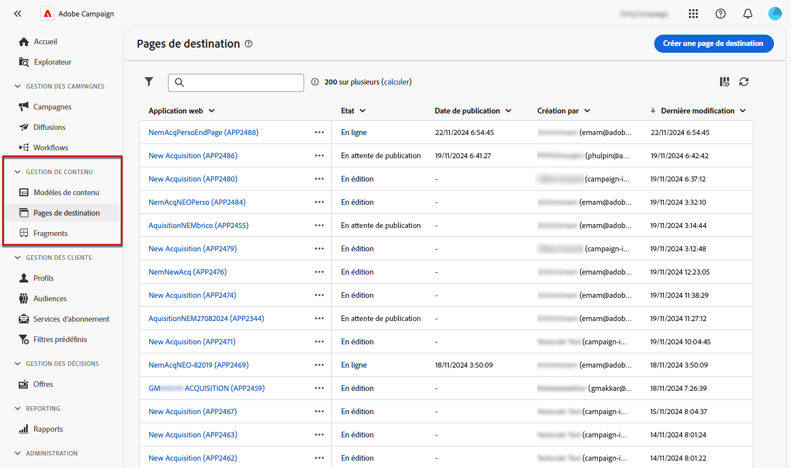{zoomable="yes"}

L’inventaire **[!UICONTROL Pages de destination]** affiche tous les éléments créés. Vous pouvez les filtrer à l’aide du bouton **[!UICONTROL Afficher les filtres]**. Vous pouvez limiter les résultats à un [dossier](../get-started/permissions.md#folders) spécifique à l’aide de la liste déroulante ou ajouter des règles à l’aide du [concepteur de requête](../query/query-modeler-overview.md).

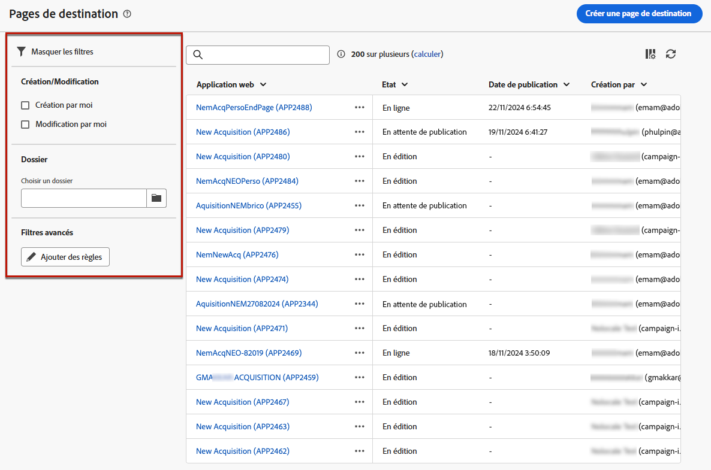{zoomable="yes"}

<!--From this list, you can access the [landing page Live report](../reports/lp-report-live.md) or [landing page Global report](../reports/lp-report-global.md) for published items.-->

>[!CAUTION]
>
>Vous ne pouvez pas afficher ni modifier les pages de destination créées à partir de la console cliente (formulaires web) dans l’interface utilisateur web de Campaign. En savoir plus dans la [documentation sur la console de Campaign](https://experienceleague.adobe.com/docs/campaign/campaign-v8/content/webapps.html?lang=fr){target="_blank"}.

<!--If you unpublish a landing page which is referenced in a message, the link to the landing page will be broken and an error page will be displayed. You cannot delete a published landing page. To delete it, you must first unpublish it.-->

Vous pouvez dupliquer ou supprimer une page de destination. Cliquez sur les points de suspension en regard d’une page de destination pour sélectionner l’action souhaitée.

## Créer une page de destination {#create-landing-page}

>[!CONTEXTUALHELP]
>id="acw_landingpages_properties"
>title="Définir les propriétés d’une page de destination"
>abstract="Renseignez les champs des propriétés tels que le libellé et modifiez le schéma si nécessaire. De plus, vous pouvez modifier le nom interne et le dossier dans lequel est stockée la page de destination, mais aussi fournir une description."

>[!CONTEXTUALHELP]
>id="acw_landingpages_pages_list"
>title="Définir le contenu de chaque page"
>abstract="Ajustez le contenu de chaque page qui fait partie de cette page de destination, comme le formulaire lui-même, la page de confirmation qui s’affiche lors de l’envoi du formulaire, ou la page vers laquelle les utilisateurs et les utilisatrices sont redirigés en cas d’erreur."

>[!CONTEXTUALHELP]
>id="acw_landingpages_schedule"
>title="Planifier votre page de destination"
>abstract="Vous pouvez définir une date de début et une date de fin pour votre page de destination. Lorsque la page atteint la fin de la période de validité, le formulaire n’est plus disponible. La page **Expiration** s’affiche à la place."

>[!CONTEXTUALHELP]
>id="acw_landingpages_preload"
>title="Définir des options de pré-chargement"
>abstract="Lorsque l’option **Préremplir avec les données référencées dans le formulaire** est activée, si la personne qui visite la page de destination correspond à un profil de la base de données, les informations du profil sont automatiquement pré-chargées dans le formulaire. Lorsque l’option **Autoriser l’absence d’identifiant** est sélectionnée, toute personne, incluant les utilisateurs et les utilisatrices anonymes, peut accéder à la page de destination."

<!--With the **Skip preloading if no ID** option selected, each profile entered will be added to the database after approval of the form."-->

>[!CONTEXTUALHELP]
>id="acw_landingpages_storage"
>title="Définir des options de stockage"
>abstract="La zone de pré-chargement permet d’indiquer comment trouver l’enregistrement à mettre à jour dans la base de données."

<!--The main steps to create landing pages are as follows:

{zoomable="yes"}-->

Pour créer une page de destination, procédez comme suit :

1. Dans l’inventaire **[!UICONTROL Pages de destination]**, cliquez sur **[!UICONTROL Créer une page de destination]**.

   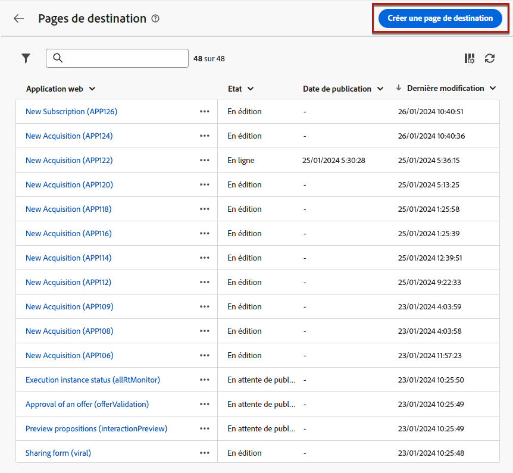{zoomable="yes"}

1. Choisissez un modèle :
   * **[!UICONTROL Acquisition]** : il s’agit du modèle par défaut des pages de destination. Il permet de capturer et de mettre à jour les données du profil.
   * **[!UICONTROL Abonnement]** : utilisez ce modèle pour permettre aux utilisateurs et aux utilisatrices de s’abonner à un [service](../audience/manage-services.md).
   * **[!UICONTROL Désabonnement]** : ce modèle peut être utilisé dans une diffusion envoyée aux personnes abonnées à un service afin de leur permettre de se désabonner de ce [service](../audience/manage-services.md).
   * **[!UICONTROL Liste bloquée]** : ce modèle doit être utilisé lorsqu’un profil clique sur un lien de désinscription dans une diffusion et ne souhaite plus être contacté.

   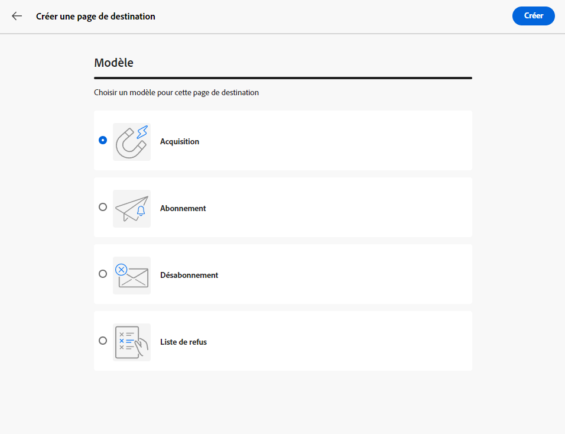{zoomable="yes"}

   >[!NOTE]
   >
   >Découvrez comment mettre en œuvre les différents cas d’utilisation correspondant à chaque modèle sur [cette page](lp-use-cases.md).

1. Cliquez sur **[!UICONTROL Créer]**.

1. Renseignez les champs des **[!UICONTROL Propriétés]**, tels que le libellé.

   Par défaut, les pages de destination sont stockées dans le dossier **[!UICONTROL Applications web]**. Vous pouvez le modifier en accédant à l’emplacement de votre choix dans les **[!UICONTROL Options supplémentaires]**. [Découvrir comment utiliser les dossiers](../get-started/permissions.md#folders)

   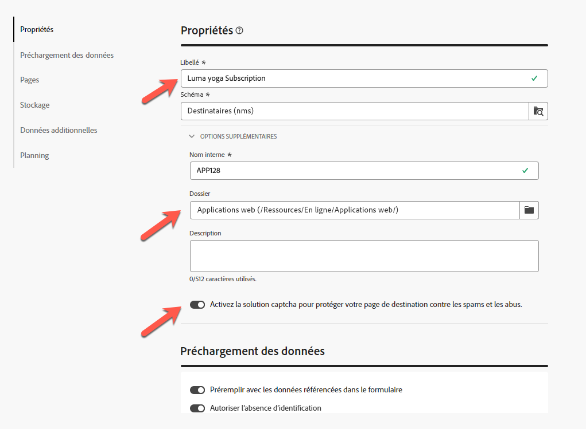{zoomable="yes"}

1. Dans la section **[!UICONTROL Préchargement des données]**, les deux options ci-dessous sont disponibles :

   * Lorsque l’option **[!UICONTROL Préremplir avec les données référencées dans le formulaire]** est activée, si la personne qui visite la page de destination correspond à un profil de la base de données, les informations du profil sont automatiquement préchargées dans le formulaire. La personne doit simplement renseigner les champs manquants et mettre à jour les valeurs existantes si nécessaire. Cela permet de fusionner les données des profils existants au lieu de créer des doublons.

     >[!NOTE]
     >
     >Cette option est sélectionnée par défaut pour tous les modèles de page de destination.

   <!--* The **[!UICONTROL Skip preloading if no ID]** option must be selected if you do not wish to update profiles. In this case, each profile entered will be added to the database after approval of the form. This option is used, for example, when the form is posted on a website.-->

   * L’option **[!UICONTROL Autoriser l’absence d’identifiant]** permet à n’importe quelle personne d’accéder à la page de destination. Désélectionner cette option empêche les personnes anonymes d’utiliser la page, ce qui signifie que seuls les utilisateurs et utilisatrices identifiés peuvent accéder au formulaire et l’envoyer.

     >[!AVAILABILITY]
     >
     >Cette fonctionnalité est en disponibilité limitée. Celle-ci est limitée aux clientes et aux clients effectuant la migration **d’Adobe Campaign Standard vers Adobe Campaign v8** et ne peut pas être déployée dans un autre environnement.

     Pour les modèles **[!UICONTROL Acquisition]** et **[!UICONTROL Abonnement]**, cette option est sélectionnée par défaut. Pour les modèles **[!UICONTROL Désabonnement]** et **[!UICONTROL Liste bloquée]**, cette option est désélectionnée par défaut et ne peut pas être modifiée<!--as per ticket - TBC? in that case, is it greyed out or doesn't display?-->.

1. Une page de destination peut comporter des pages supplémentaires. Pour ajouter des pages, accédez à la section **[!UICONTROL Pages]**, puis cliquez sur le bouton **[!UICONTROL Modifier le contenu]** pour chaque page que vous souhaitez concevoir pour cette page de destination. Le contenu de chaque page est déjà prérempli. Modifiez-le si nécessaire. [En savoir plus](lp-content.md)

   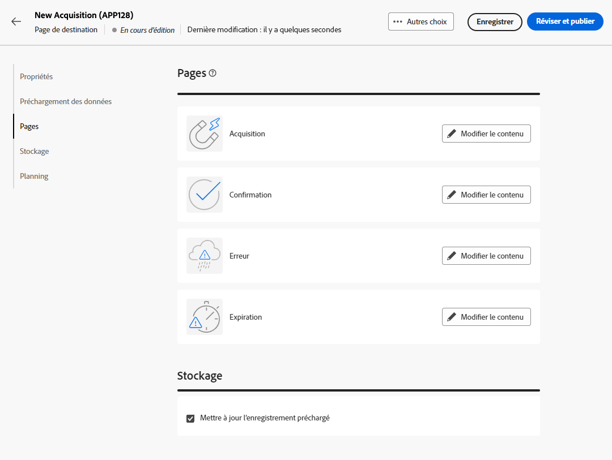{zoomable="yes"}

1. Dans la section **[!UICONTROL Stockage]**, l’option **[!UICONTROL Mise à jour de l’enregistrement préchargé]** est sélectionnée par défaut. Elle permet de mettre à jour les profils stockés dans la base via la page de destination. La zone de préchargement permet d’indiquer comment trouver l’enregistrement à mettre à jour dans la base de données.

   Vous pouvez également sélectionner parmi les champs du contexte courant de la page de destination, ceux qui seront utilisés pour retrouver le profil correspondant dans la base de données. Pour ce faire, désélectionnez l’option **[!UICONTROL Mettre à jour l’enregistrement pré-chargé]** et cochez les champs de votre choix sous **[!UICONTROL Options de réconciliation]**.

   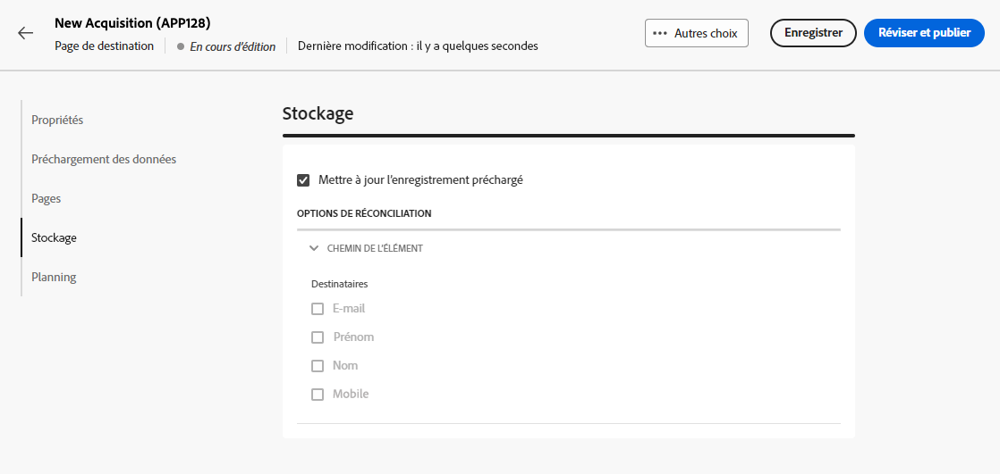{zoomable="yes"}

1. Créez des **[!UICONTROL Données additionnelles]** pour stocker les données internes lorsque la page de destination est envoyée. Ces données ne sont pas visibles par les utilisateurs et les utilisatrices qui visitent la page. Seules les valeurs constantes sont prises en charge.

   >[!AVAILABILITY]
   >
   >Cette fonctionnalité est en disponibilité limitée. Celle-ci est limitée aux clientes et aux clients effectuant la migration **d’Adobe Campaign Standard vers Adobe Campaign v8** et ne peut pas être déployée dans un autre environnement.

   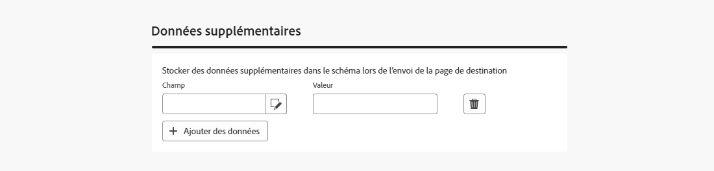{zoomable="yes"}

1. Vous pouvez définir une date de début et une date de fin pour votre page de destination. Sélectionnez **[!UICONTROL Activer la planification]** et définissez les dates.

   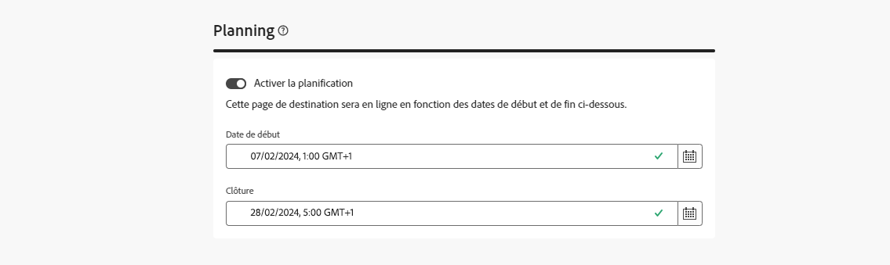{zoomable="yes"}

   * La page de destination est automatiquement publiée à la date/l’heure de début spécifiées.

     >[!NOTE]
     >
     >Si aucune date de début n’est définie, la page de destination devient active dès qu’elle est publiée.

   * Lorsque la page atteint la date de fin, <!--the landing page is automatically unpublished and -->le formulaire n’est plus disponible. La page **[!UICONTROL Expiration]** s’affiche à la place.

     >[!NOTE]
     >
     >Pour des raisons de sécurité et de performances de la plateforme, Adobe vous recommande de définir une date de fin.

1. Cliquez sur **[!UICONTROL Réviser et publier]**.

Une fois tous les paramètres définis et toutes les pages [conçues](lp-content.md), vous pouvez [tester](#test-landing-page) et [publier](#publish-landing-page) votre page de destination comme décrit ci-dessous.

## Tester la page de destination {#test-landing-page}

>[!CONTEXTUALHELP]
>id="acw_landingpages_simulate"
>title="Simuler votre page de destination"
>abstract="Vous pouvez afficher un aperçu de votre page de destination dans l’interface utilisateur de Campaign Web ou l’ouvrir dans un nouvel onglet du navigateur web."

>[!CONTEXTUALHELP]
>id="ac_preview_lp_profiles"
>title="Prévisualiser et tester votre page de destination"
>abstract="Une fois que vous avez défini les paramètres et le contenu de votre page de destination, vous pouvez utiliser des profils de test pour la prévisualiser."

Une fois les paramètres et le contenu de votre page de destination définis, vous pouvez utiliser des profils de test pour la prévisualiser. Si vous avez inséré du [contenu personnalisé](../personalization/gs-personalization.md), vous pourrez vérifier comment ce contenu s’affiche sur la page de destination en exploitant les données du profil de test.

>[!CAUTION]
>
>Vous devez disposer de profils de test pour pouvoir prévisualiser vos messages et envoyer des BAT. [En savoir plus sur les profils de test](../audience/test-profiles.md)

Pour tester votre page de destination, suivez ces étapes :

1. Cliquez ensuite sur **[!UICONTROL Réviser et publier]**, sélectionnez le bouton **[!UICONTROL Simuler du contenu]** dans le tableau de bord de la page de destination pour accéder à la sélection du profil de test.

   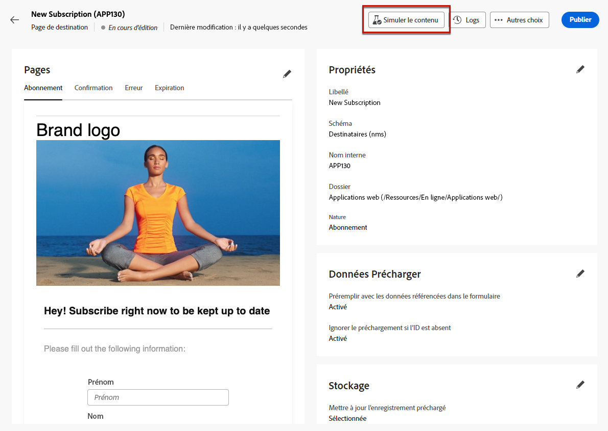{zoomable="yes"}

1. Dans l’écran **[!UICONTROL Simuler]**, sélectionnez un ou plusieurs profils de test.

   Les étapes de sélection des profils de test sont les mêmes que lors du test d’un message. Elles sont détaillées dans la section [Prévisualisation et test](../preview-test/preview-test.md).

1. Lors d’un test d’une page de destination dynamique (avec l’option **[!UICONTROL Service à partir d’une URL]** sélectionnée - [En savoir plus](../landing-pages/create-lp.md#define-actions-on-form-submission)),

1. sélectionnez **[!UICONTROL Ouvrir l’aperçu]** pour tester votre page de destination.

   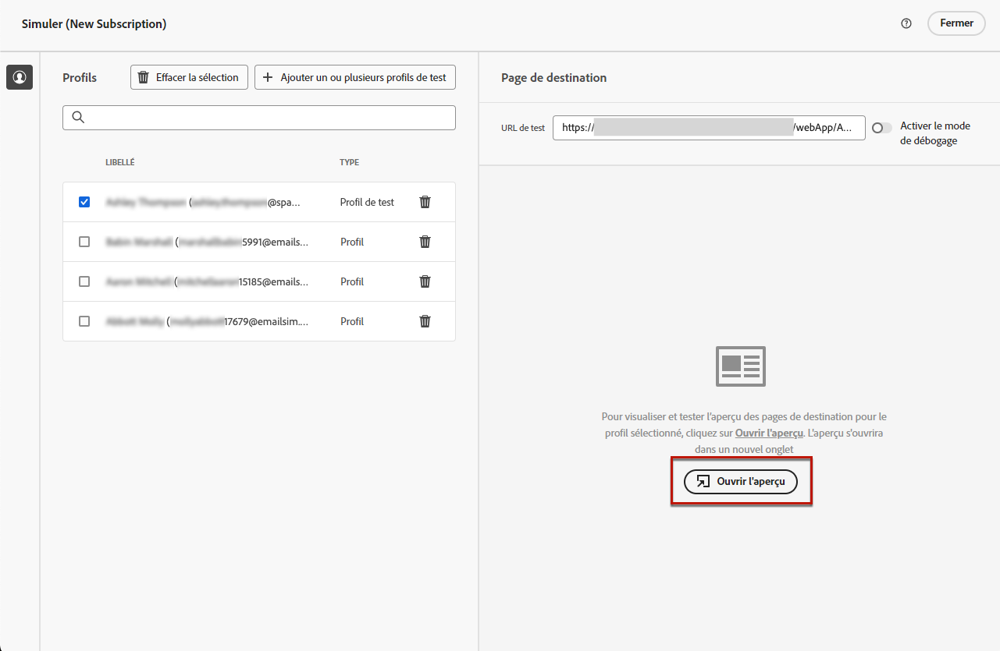{zoomable="yes"}

1. L’aperçu de votre page de destination s’ouvre dans un nouvel onglet. Les éléments personnalisés sont remplacés par les données du profil de test sélectionné.

   Si vous avez sélectionné l’option **[!UICONTROL Préremplir avec les données référencées dans le formulaire]** dans les paramètres de la page de destination, les champs du formulaire sont automatiquement préremplis avec les données de profil de test correspondantes.<!--TBC-->

   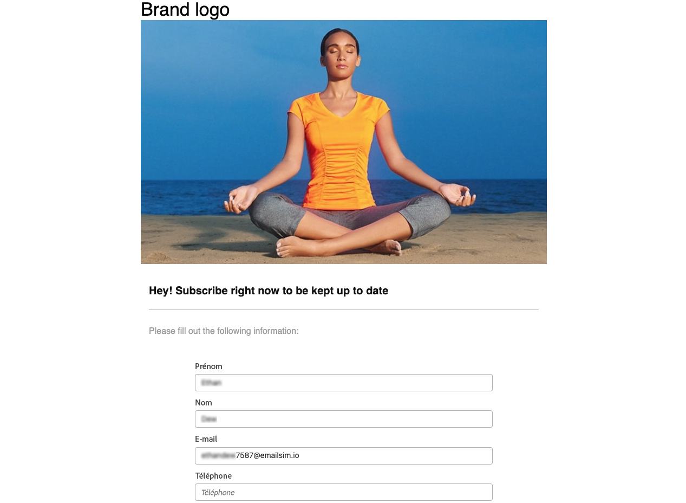{zoomable="yes"}

1. Sélectionnez d’autres profils de test pour prévisualiser le rendu pour chaque variante de votre page de destination.

<!--Can you preview Confirmation/Error/Expiration pages?-->

## Publier la page de destination {#publish-landing-page}

Une fois votre page de destination prête et validée, publiez-la afin de pouvoir l’utiliser dans une diffusion en utilisant le bouton correspondant.

Une fois la publication effectuée :

* La page de destination est ajoutée à la liste des pages de destination portant le statut **[!UICONTROL Publié]**. Elle est maintenant en ligne et prête à être référencée dans votre contenu.

* Vous pouvez copier-coller l’**[!UICONTROL URL de la page de destination]** qui s’affiche en haut de la page dans un navigateur web pour prévisualiser votre page de destination.

>[!CAUTION]
>
>Pour tester ou tirer pleinement profit de votre page de destination, vous ne pouvez pas copier-coller ce lien directement dans un navigateur web ou dans vos diffusions. À la place, utilisez la fonction [Simuler le contenu](#test-landing-page) pour la tester et suivez les étapes décrites dans [cette section](lp-use-cases.md) pour utiliser correctement votre page de destination.

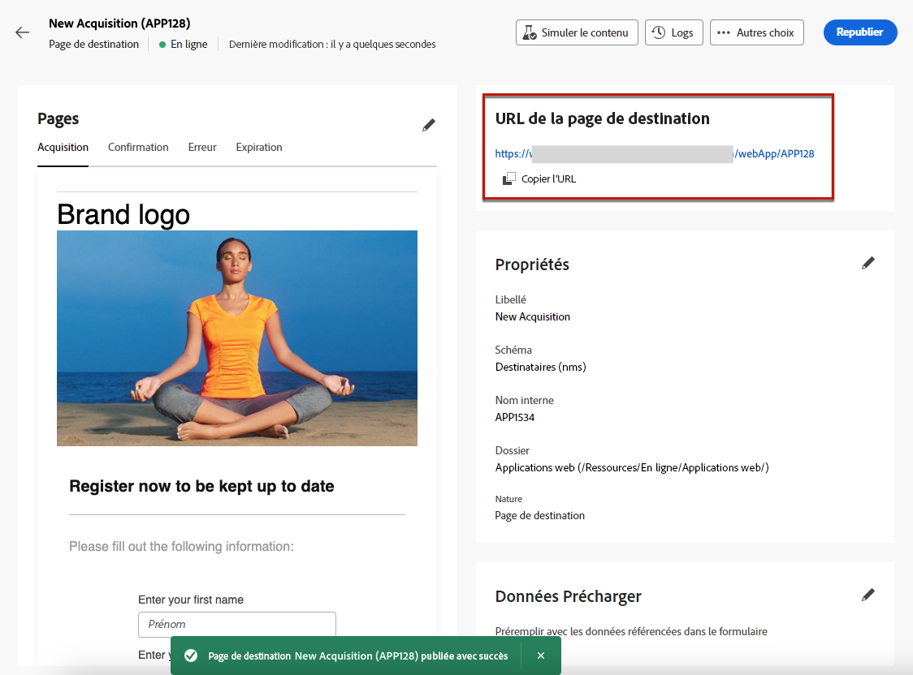{zoomable="yes"}

Vous pouvez surveiller les impacts de vos pages de destination par le biais de logs<!--and specific reports-->. Cliquez sur le bouton **[!UICONTROL Logs]**.
