# Définir du contenu spécifique à une page de destination {#lp-content}

>[!CONTEXTUALHELP]
>id="ac_lp_components"
>title="Utiliser les composants de contenu"
>abstract="Les composants de contenu sont des espaces réservés de contenu vides que vous pouvez utiliser pour créer la disposition d’une page de destination. Pour définir un contenu spécifique qui permet aux utilisateurs et utilisatrices de sélectionner et d’envoyer leurs choix, utilisez le composant de formulaire ."

>[!CONTEXTUALHELP]
>id="acw_landingpages_primarypage"
>title="Définir les paramètres de la page principale"
>abstract="La page principale s’affiche immédiatement aux utilisateurs lorsqu’ils cliquent sur le lien vers votre page de destination, à partir d’un e-mail ou d’un site web par exemple."

Vous pouvez modifier le contenu de n’importe quelle page de votre page de destination.

La première page, que les utilisateurs voient immédiatement lorsqu’ils cliquent sur le lien de votre page de destination, est déjà préremplie avec le [composant de formulaire spécifique à la page de destination](#use-form-component) pour le modèle sélectionné<!-- to enable users to select and submit their choices-->.

Le contenu des pages **[!UICONTROL Confirmation]**, **[!UICONTROL Erreur]** et **[!UICONTROL Expiration]** est également prérempli. Modifiez-le si nécessaire.

Vous pouvez également définir des [styles pour votre page de destination](#lp-form-styles).

Pour concevoir plus précisément le contenu de votre page de destination :

* Utilisez les mêmes composants que ceux utilisés pour concevoir un e-mail. [En savoir plus](../email/content-components.md#add-content-components)

* Ajoutez du contenu conditionnel à vos pages de destination de la même manière que pour un e-mail. [En savoir plus](../personalization/conditions.md#condition-condition-builder)

  >[!AVAILABILITY]
  >
  >Cette fonctionnalité est en disponibilité limitée. Elle est limitée aux personnes effectuant la migration **depuis Adobe Campaign Standard vers Adobe Campaign v8** et ne peut pas être déployée dans un autre environnement.

## Utiliser le composant de formulaire {#use-form-component}

>[!CONTEXTUALHELP]
>id="ac_lp_formfield"
>title="Définir les champs de composant de formulaire"
>abstract="Définissez la manière dont vos personnes destinataires verront et soumettront leurs choix depuis votre page de destination."

>[!CONTEXTUALHELP]
>id="acw_landingpages_calltoaction"
>title="Résultat du clic sur le bouton"
>abstract="Définissez ce qui se passe lorsque les utilisateurs et les utilisatrices envoient le formulaire de la page de destination."

Pour définir un contenu spécifique qui permet aux utilisateurs et utilisatrices de sélectionner et d’envoyer leurs choix depuis votre page de destination, modifiez le composant **[!UICONTROL Formulaire]**. Suivez les étapes ci-dessous.

1. Le composant **[!UICONTROL Formulaire]** spécifique à la page de destination est déjà affiché dans la zone de travail du modèle sélectionné.

   >[!NOTE]
   >
   >Le composant **[!UICONTROL Formulaire]** ne peut être utilisé qu’une seule fois sur la même page.

1. Sélectionnez-le. Lʼonglet **[!UICONTROL Contenu du formulaire]** s’affiche dans le panneau de droite et vous permet de modifier les différents champs du formulaire.

   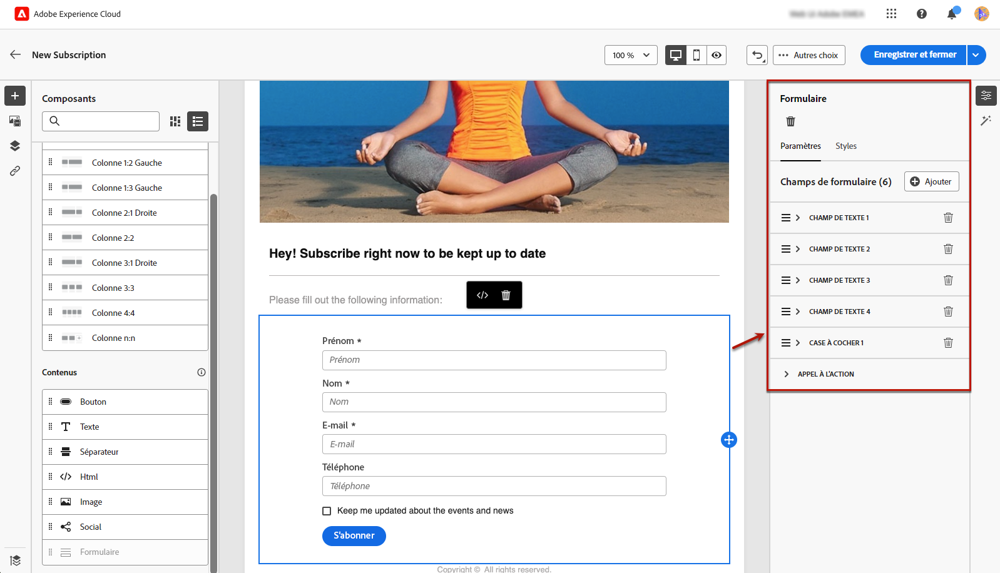{zoomable="yes"}

   >[!NOTE]
   >
   >Basculez vers l’onglet **[!UICONTROL Styles]** à tout moment pour modifier les styles du contenu de votre composant de formulaire. [En savoir plus](#lp-form-styles)

1. Développez le premier champ de texte, le cas échéant, ou ajoutez-en un à l’aide du bouton **[!UICONTROL Ajouter]**. Dans la section **[!UICONTROL Champ de texte 1]**, modifiez le type de champ, le champ de base de données à mettre à jour, le libellé et le texte affiché dans le champ avant que les utilisateurs ne saisissent une valeur.

   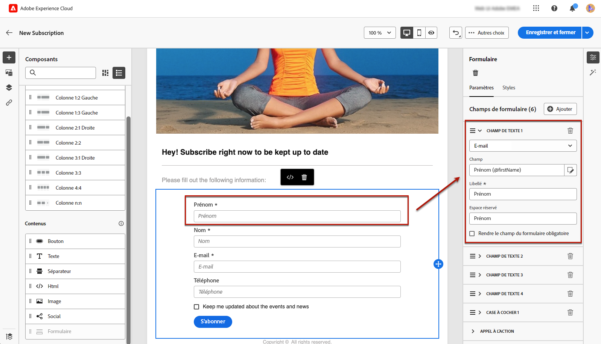{zoomable="yes"}

1. Activez l’option **[!UICONTROL Rendre le champ du formulaire obligatoire]** si nécessaire. Dans ce cas, la landing page ne peut être envoyée que si l&#39;utilisateur a renseigné ce champ.

   >[!NOTE]
   >
   >Si un champ obligatoire n’est pas renseigné, un message d’erreur s’affiche lorsque l’utilisateur ou l’utilisatrice envoie la page.

1. Développez la case à cocher, le cas échéant, ou ajoutez-en une à l’aide du bouton **[!UICONTROL Ajouter]**. Cochez cette case pour mettre à jour un service ou un champ de la base de données.

   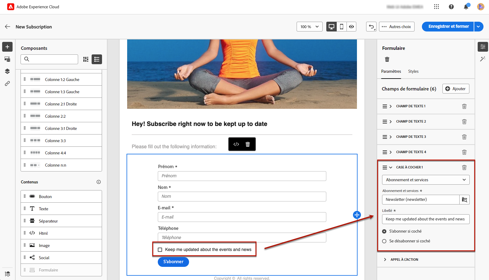{zoomable="yes"}

   Si vous sélectionnez **[!UICONTROL Abonnement et services]**, sélectionnez un [service](../audience/manage-services.md) dans la liste, puis choisissez l’une des deux options ci-dessous :

   * **[!UICONTROL S’abonner si cette case est cochée]** : les utilisateurs et les utilisatrices doivent cocher la case pour accepter (abonnement).
   * **[!UICONTROL Se désabonner si cette case est cochée]** : les utilisateurs et les utilisatrices doivent cocher la case pour retirer leur consentement (désabonnement).

   Si vous sélectionnez **[!UICONTROL Champ]**, sélectionnez un champ dans la [liste des attributs](../get-started/attributes.md), puis choisissez l’une des deux options ci-dessous :

   * **[!UICONTROL Oui si coché]**.
   * **[!UICONTROL Non si coché]**.

1. Supprimez et ajoutez autant de champs (tels que des champs de texte, des boutons radio, des cases à cocher, des listes déroulantes, etc.) que nécessaire.

1. Une fois tous les champs ajoutés ou mis à jour, cliquez sur **[!UICONTROL Appel à l’action]** pour développer la section correspondante. Cela permet de définir le comportement du bouton dans le composant **[!UICONTROL Formulaire]**. [Voici comment procéder](#define-actions-on-form-submission)

   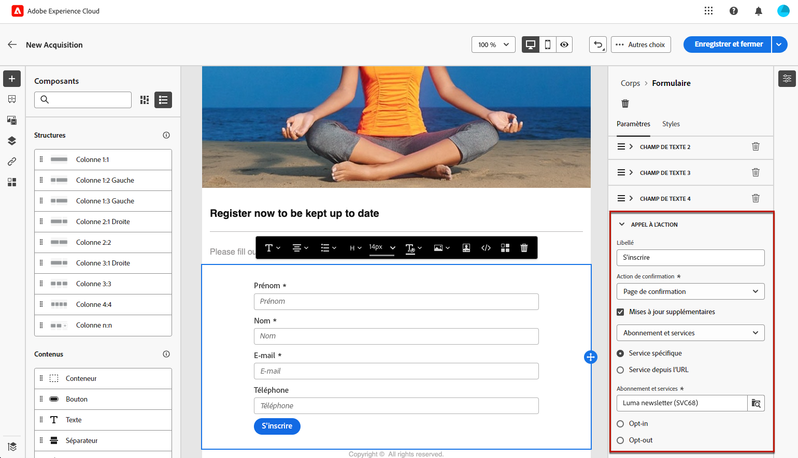{zoomable="yes"}

1. Enregistrez votre contenu pour revenir aux [propriétés de page de destination](create-lp.md#create-landing-page).

### Définir des actions lors de l’envoi du formulaire {#define-actions-on-form-submission}

1. Définissez ce qui se passe lorsque vous cliquez sur le bouton :

   * **[!UICONTROL Page de confirmation]** : par défaut, l’utilisateur est redirigé vers la page **[!UICONTROL de confirmation]** définie pour la page de destination actuelle.

   * **[!UICONTROL URL de redirection]** : saisissez l’URL de la page vers laquelle les utilisateurs sont redirigés.

   * **[!UICONTROL Page de destination]** : sélectionnez une autre page de destination vers laquelle les utilisateurs seront redirigés. Veillez à configurer la page de destination sélectionnée en conséquence.

1. Pour effectuer des mises à jour supplémentaires lors de l’envoi du formulaire, sélectionnez **[!UICONTROL Mises à jour supplémentaires]**, puis l’élément à mettre à jour :
   * Un abonnement [service](../audience/manage-services.md) : définissez si vous souhaitez exclure ou exclure des utilisateurs lors de l’envoi du formulaire. Lors de la conception d&#39;un e-mail, si vous définissez un lien de type **[!UICONTROL Landing page]** vers cette landing page, le service sélectionné est automatiquement utilisé. [En savoir plus sur l&#39;insertion de liens](../email/message-tracking.md)

     >[!NOTE]
     >
     >Si vous souhaitez utiliser plusieurs services avec cette page de destination, utilisez l’option **[!UICONTROL Service à partir de l’URL]** décrite ci-dessous.

   * Le canal : adresse e-mail utilisée lors du remplissage du formulaire.
   * Tous les canaux : lors de l’envoi du formulaire, les utilisateurs sont inscrits ou désinscrits (selon le modèle sélectionné) de toutes les communications de votre marque sur tous les canaux.
   * Un champ de la base de données : sélectionnez un champ dans la liste des attributs et définissez s’il doit être défini sur True ou False lors de l’envoi du formulaire.

   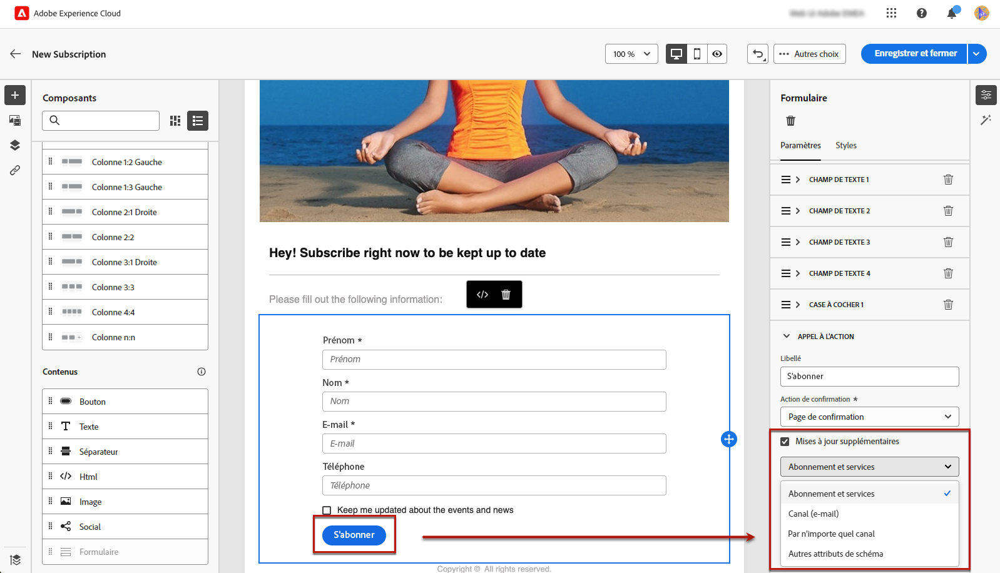{zoomable="yes"}

1. Sélectionnez l’option **[!UICONTROL Service à partir d’une URL]** pour permettre l’utilisation de la page de destination pour plusieurs services, ce qui la rend dynamique. Définissez si vous souhaitez abonner ou désabonner des utilisateurs et des utilisatrices lors de l’envoi du formulaire.

   >[!AVAILABILITY]
   >
   >Cette fonctionnalité est en disponibilité limitée. Celle-ci est limitée aux clientes et aux clients effectuant la migration **d’Adobe Campaign Standard vers Adobe Campaign v8** et ne peut pas être déployée dans un autre environnement.

   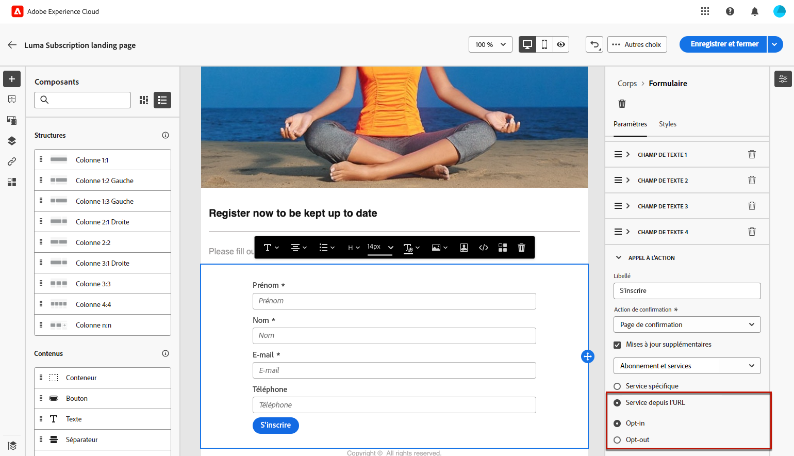{zoomable="yes"}

   Lors de la conception d’un e-mail, si vous définissez un lien de type **[!UICONTROL Page de destination]** vers cette page de destination, vous pouvez sélectionner n’importe quel service de la liste. Vous pouvez ensuite sélectionner d’autres services lors de la définition d’autres liens vers cette page de destination. [En savoir plus sur l&#39;insertion de liens](../email/message-tracking.md)

   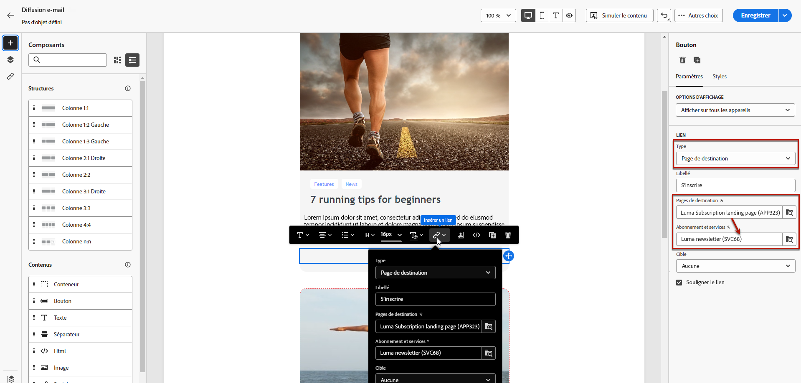{zoomable="yes"}

1. Envoyez un message lors de l’envoi de votre page de destination. [En savoir plus ici](#lp-message)

### Envoyer un message après la soumission {#lp-message}

>[!AVAILABILITY]
>
>Cette fonctionnalité est en disponibilité limitée. Celle-ci est limitée aux clientes et aux clients effectuant la migration **d’Adobe Campaign Standard vers Adobe Campaign v8** et ne peut pas être déployée dans un autre environnement.

Pour envoyer automatiquement un message de confirmation après l’envoi d’une landing page, procédez comme suit :

1. Dans la section **[!UICONTROL APPEL À L’ACTION]**, cochez l’option **[!UICONTROL Envoyer un e-mail de confirmation]**.

1. Dans la liste déroulante associée, choisissez le modèle de message transactionnel qui doit être envoyé.

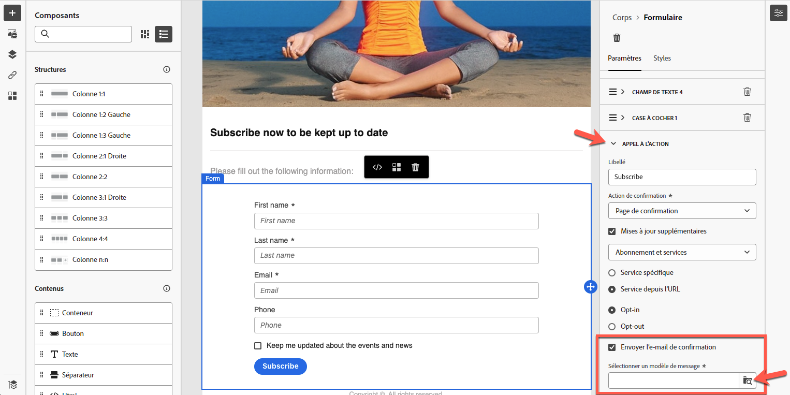{zoomable="yes"}

## Définir les styles de formulaire de page de destination {#lp-form-styles}

1. Pour modifier les styles du contenu de votre composant de formulaire, accédez à tout moment à l’onglet **[!UICONTROL Styles]**.

1. La section **[!UICONTROL Champ de texte]** est développée par défaut. Elle vous permet de modifier l’aspect des champs de texte, comme le libellé et la police, la position du libellé, la couleur d’arrière-plan du champ ou la bordure du champ.

   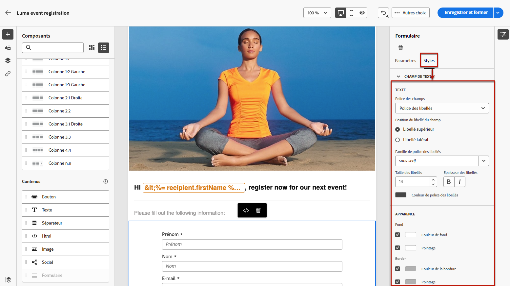{zoomable="yes"}

1. Développez la section **[!UICONTROL Case à cocher]** pour définir l’aspect des cases à cocher et du texte correspondant. Par exemple, ajustez la famille et la taille de la police, ou la couleur de la bordure de la case à cocher.

   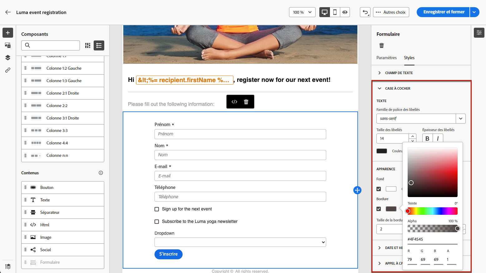{zoomable="yes"}

1. Développez et modifiez toute autre section correspondant aux autres champs que vous avez ajoutés à votre formulaire (bouton radio, liste déroulante, date et heure, etc.).

1. Développez la section **[!UICONTROL Appel à l’action]** pour modifier l’aspect du bouton dans le formulaire du composant. Par exemple, modifiez la police, ajoutez une bordure, modifiez la couleur du libellé au survol ou ajustez l’alignement du bouton.

   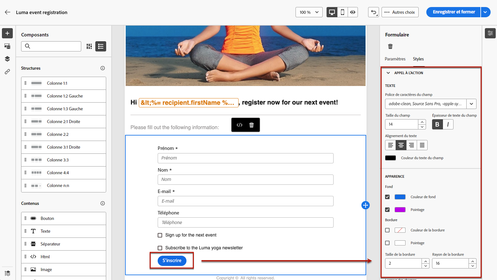{zoomable="yes"}

   Prévisualisez certains de vos paramètres, tels que la couleur du libellé du bouton au survol, à l’aide du bouton **[!UICONTROL Simuler du contenu]**. [En savoir plus](create-lp.md#test-landing-page)

1. Enregistrez vos modifications.