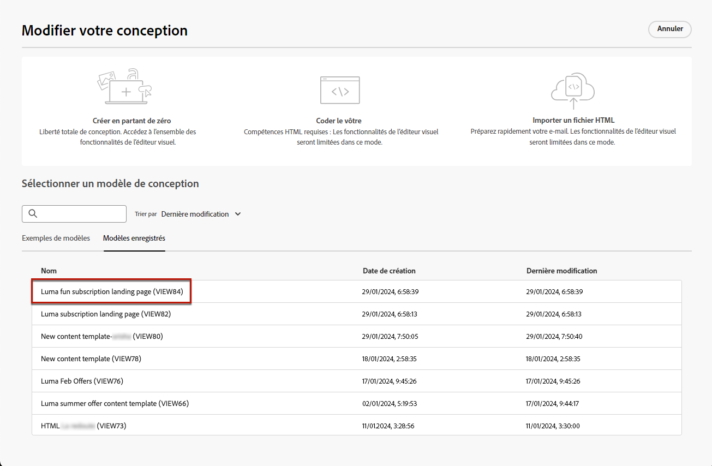
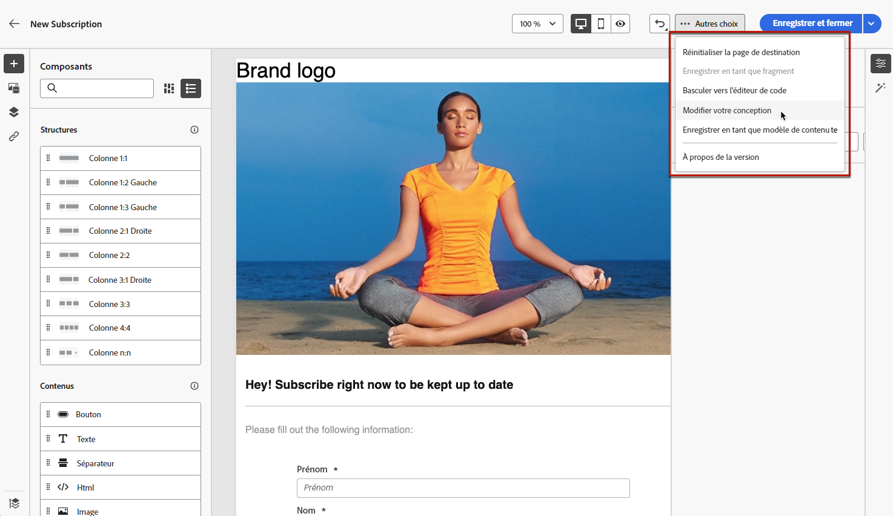
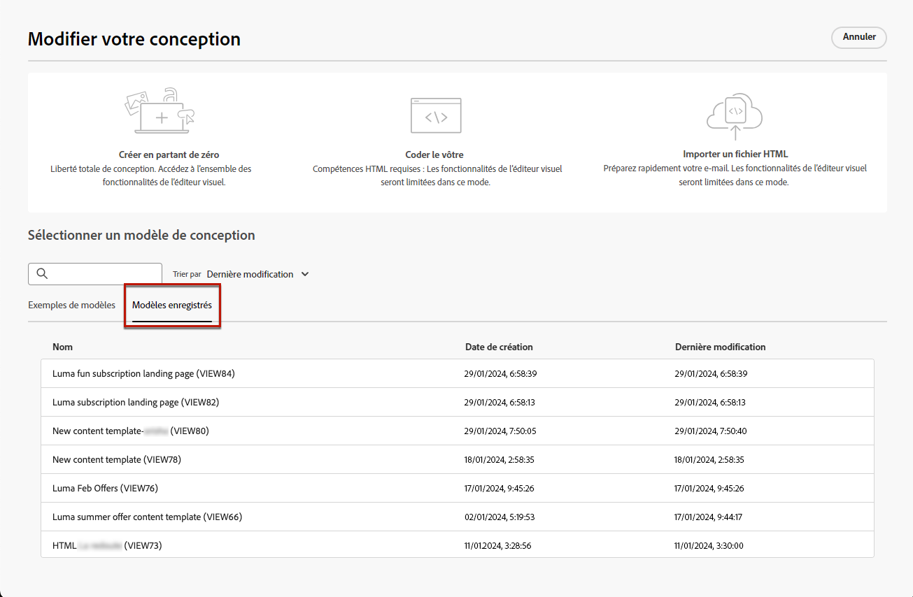
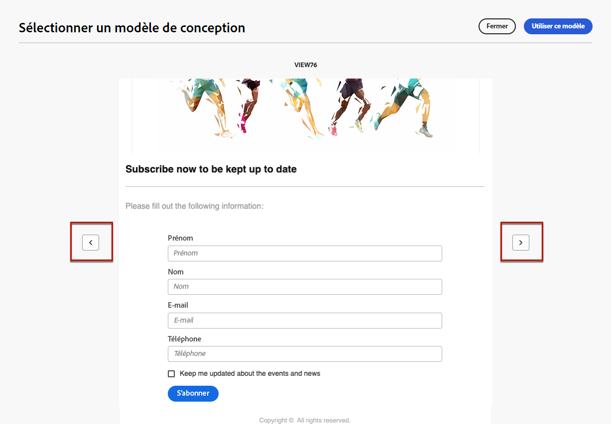

# Utiliser des modèles de contenu de page de destination {#work-with-templates}

## Enregistrer une page en tant que modèle {#save-as-template}

Une fois que vous avez conçu votre [contenu de page de destination](lp-content.md), vous pouvez l’enregistrer pour une réutilisation ultérieure. Pour enregistrer une page en tant que modèle, procédez comme suit.

1. Cliquez sur le bouton **[!UICONTROL Plus]** en haut à droite de l’écran.

1. Sélectionnez **[!UICONTROL Enregistrer comme modèle de contenu]** dans le menu déroulant.

   {zoomable="yes"}

1. Donnez un nom à ce modèle.

1. Cliquez sur **[!UICONTROL Enregistrer]**.

Vous pouvez utiliser ce modèle pour créer votre contenu la prochaine fois que vous créerez une page de destination. Pour ce faire, consultez la [section](#use-saved-template) ci-dessous.

{zoomable="yes"}

## Utiliser un modèle enregistré {#use-saved-template}

<!--Not for GA?-->

1. Lors de la modification du contenu d&#39;une landing page, cliquez sur le bouton **[!UICONTROL Plus]** et sélectionnez **[!UICONTROL Modifier votre conception]**.

   {zoomable="yes"}

1. Validez votre choix.

   >[!NOTE]
   >
   >Cette action supprime et remplace le contenu actuel par le contenu du nouveau modèle.

1. La liste de tous les modèles précédemment enregistrés s’affiche dans l’onglet **[!UICONTROL Modèles enregistrés]**. Vous pouvez les trier **[!UICONTROL Par nom]**, **[!UICONTROL Dernière modification]** et **[!UICONTROL Dernière création]**.

   {zoomable="yes"}

1. Sélectionnez le modèle de votre choix dans la liste. Une fois sélectionné, naviguez entre tous les modèles enregistrés à l’aide des flèches droite et gauche.

   {zoomable="yes"}

1. Cliquez sur **[!UICONTROL Utiliser ce modèle]**.

1. Modifiez le contenu selon vos besoins à l’aide du concepteur de page de destination.

<!--Primary page templates and subpage templates are managed separately, meaning that you cannot use a primary page template to create a subpage, and vice versa. TBC in Web user interface-->