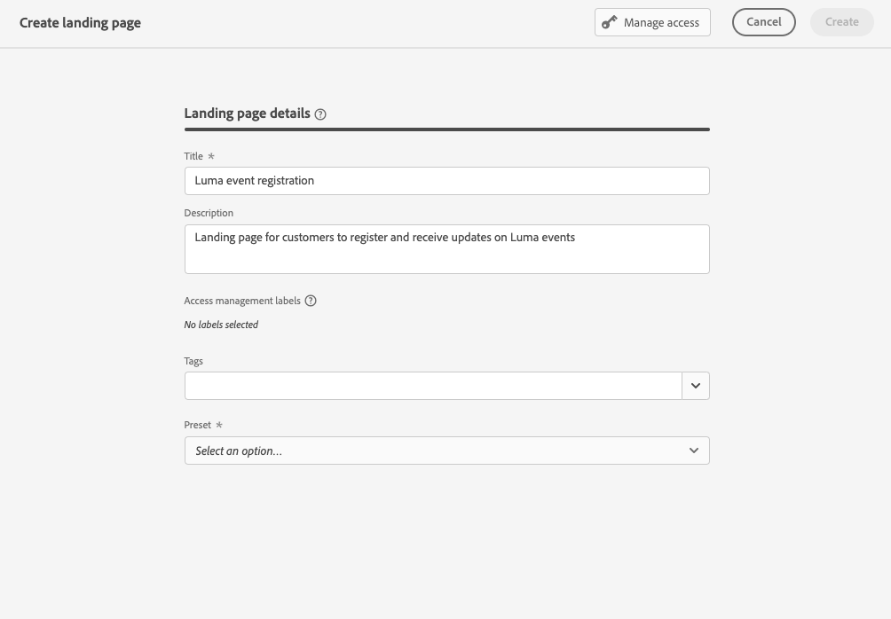
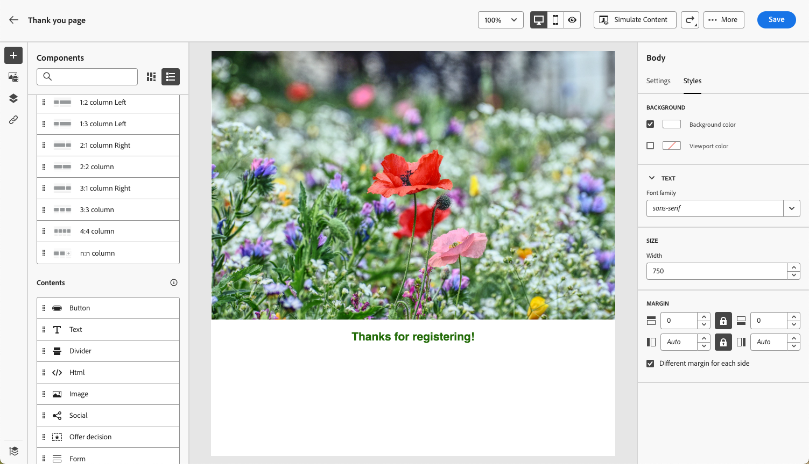
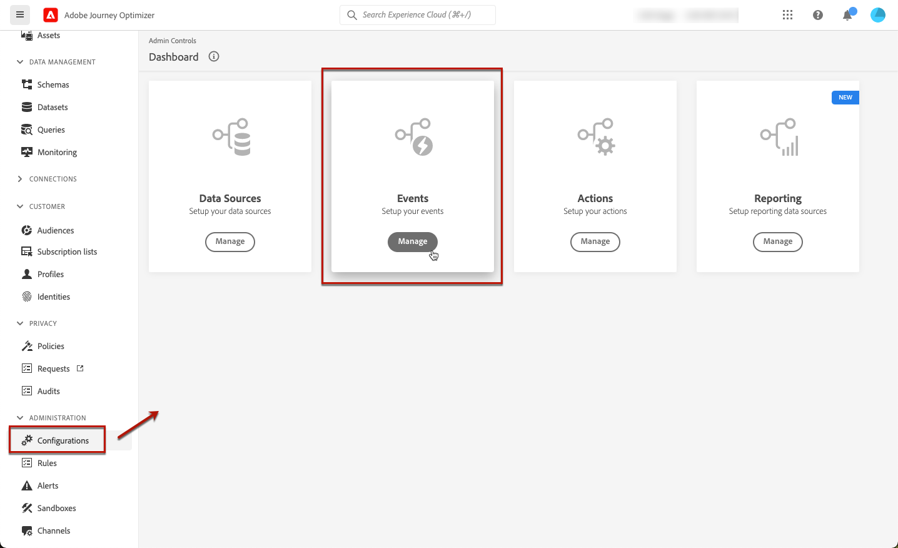

# Cas d’utilisation de l’URL de la page de destination {#lp-use-cases}

Vous trouverez ci-dessous quelques exemples d’utilisation des pages de destination [!DNL Journey Optimizer] pour que vos clientes et clients s’abonnent à certaines ou toutes vos communications, ou s’en désabonnent.

## Abonnement à un service {#subscription-to-a-service}

Un des cas d’utilisation les plus courants consiste à inviter vos clientes et vos clients à [s’abonner à un service](subscription-list.md) (comme une newsletter ou un événement) via une page de destination. Les principales étapes sont présentées dans le graphique ci-dessous :

Supposons, par exemple, que vous organisiez un événement le mois prochain et que vous souhaitiez lancer une campagne d’inscription à l’événement<!--to keep your customers that are interested updated on that event-->. Pour ce faire, vous allez envoyer un e-mail comprenant un lien vers une page de destination qui permettra à vos personnes destinataires de s’inscrire à cet événement. Les utilisateurs et les utilisatrices qui s’inscrivent s’ajouteront à la liste d’abonnements que vous avez créée à cet effet.

### Configurer une page de destination {#set-up-lp}

1. Créez la liste d’abonnements d’inscription à l’événement, qui stockera les personnes inscrites. Découvrez comment créer une liste d’abonnements [ici](subscription-list.md#define-subscription-list).

   

1. [Créez une page de destination](create-lp.md) pour permettre aux personnes destinataires de s’inscrire à votre événement.

   

1. Configurez la [page de destination principale](create-lp.md#configure-primary-page) pour l’inscription.

1. Lors de la conception du [contenu de la page de destination](design-lp.md), sélectionnez la liste d’abonnements que vous avez créée pour la mettre à jour avec les profils des personnes inscrites.

   

1. Créez une page de remerciement qui s’affichera pour vos personnes destinataires une fois le formulaire d’inscription envoyé. Découvrez comment configurer des sous-pages de destination [ici](create-lp.md#configure-subpages).

   

1. [Publiez](create-lp.md#publish) la page de destination.

1. Dans un [parcours](../building-journeys/journey.md), ajoutez une activité **E-mail** pour diriger le trafic vers la page de destination pour l’inscription.

   

1. [Concevez l’e-mail](../email/get-started-email-design.md) pour annoncer que l’inscription à votre événement est maintenant ouverte.

1. [Insérez un lien](../email/message-tracking.md#insert-links) dans le contenu de votre message. Sélectionnez **[!UICONTROL Page de destination]** comme **[!UICONTROL Type de lien]** et sélectionnez la [page de destination](create-lp.md#configure-primary-page) que vous avez créée pour l’inscription.

   

   >[!NOTE]
   >
   >Pour pouvoir envoyer votre message, vérifiez que la page de destination sélectionnée n’a pas encore expiré. Découvrez comment mettre à jour la date d’expiration [dans cette section](create-lp.md#configure-primary-page).

   Une fois l’e-mail reçu, si vos personnes destinataires cliquent sur le lien vers la page de destination, elles sont redirigées vers la page « Merci » et elles sont ajoutées à la liste d’abonnements.

### Envoyer un e-mail de confirmation {#send-confirmation-email}

De plus, vous pouvez envoyer un e-mail de confirmation aux personnes destinataires qui se sont inscrites à votre événement. Procédez comme suit :

1. Créez un autre [parcours](../building-journeys/journey.md). Vous pouvez le faire directement à partir de la page de destination en cliquant sur le bouton **[!UICONTROL Créer un parcours]**. [En savoir plus](create-lp.md#configure-primary-page)

   

1. Développez la catégorie **[!UICONTROL Événements]** et déposez une activité de **[!UICONTROL qualification de l’audience]** dans la zone de travail. [En savoir plus](../building-journeys/audience-qualification-events.md)

1. Cliquez sur le champ **[!UICONTROL Audience]** et sélectionnez la liste d’abonnements que vous avez créée.

   

1. Ajoutez un e-mail de confirmation de votre choix et envoyez-le via le parcours.

   

Toutes les personnes qui se sont inscrites à votre événement recevront l’e-mail de confirmation.

<!--The event registration's subscription list tracks the profiles who registered and you can send them targeted event updates.-->

## Désinscription {#opt-out}

Pour permettre aux personnes destinataires de se désabonner de vos communications, vous pouvez inclure dans vos e-mails un lien vers une page de destination de désinscription.

En savoir plus sur la gestion du consentement de vos personnes destinataires et son importance dans [cette section](../privacy/opt-out.md).

### Gestion des désinscriptions {#opt-out-management}

Donner aux personnes destinataires la capacité de se désabonner des communications d’une marque est une obligation légale. En savoir plus sur la législation applicable dans la [documentation Experience Platform](https://experienceleague.adobe.com/docs/experience-platform/privacy/regulations/overview.html?lang=fr#regulations){target="_blank"}.

Par conséquent, vous devez toujours inclure un **lien de désabonnement** dans chaque e-mail envoyé aux personnes destinataires :

* Lorsque vous cliquez sur ce lien, les personnes destinataires sont redirigées vers une page de destination comprenant un bouton pour confirmer leur désinscription.
* Lorsque vous cliquez sur le bouton de désinscription, les données de profil sont mises à jour avec ces informations.

### Configurer la désinscription {#configure-opt-out}

Pour permettre aux personnes destinataires d’un e-mail de se désabonner de vos communications par le biais d’une page de destination, procédez comme suit.

1. Créez votre page de destination. [En savoir plus](create-lp.md)

1. Définissez la page principale. [En savoir plus](create-lp.md#configure-primary-page)

1. [Conception](design-lp.md) du contenu de la page principale : utilisez le composant **[!UICONTROL Formulaire]** spécifique aux pages de destinations, définissez une case à cocher **[!UICONTROL Désinscription]** et mettez à jour **[!UICONTROL Canal (e-mail)]** : le profil qui active la désinscription sur votre page de destination sera exclu de toutes vos communications.

   

   <!--You can also build your own landing page and host it on the third-party system of your choice.-->

1. Ajoutez une [sous-page](create-lp.md#configure-subpages) de confirmation qui s’affiche pour les utilisateurs et les utilisatrices qui envoient le formulaire.

   

   >[!NOTE]
   >
   >Veillez à référencer la sous-page dans la section **[!UICONTROL Appel à l’action]** du composant **[!UICONTROL Formulaire]** de la page principale. [En savoir plus](design-lp.md)

1. Une fois que vous avez configuré et défini le contenu de vos pages, [publiez](create-lp.md#publish) la page de destination.

1. [Créez un e-mail](../email/get-started-email-design.md) dans un parcours.

1. Sélectionnez du texte dans votre contenu et [insérez un lien](../email/message-tracking.md#insert-links) à l’aide de la barre d’outils contextuelle. Vous pouvez également utiliser un lien sur un bouton.

1. Sélectionnez **[!UICONTROL Page de destination]** dans la liste déroulante **[!UICONTROL Type de lien]** et sélectionnez la [page de destination](create-lp.md#configure-primary-page) que vous avez créée pour les désinscriptions.

   

   >[!NOTE]
   >
   >Pour pouvoir envoyer votre message, vérifiez que la page de destination sélectionnée n’a pas encore expiré. Découvrez comment mettre à jour la date d’expiration [dans cette section](create-lp.md#configure-primary-page).

1. Publiez et exécutez le parcours. [En savoir plus](../building-journeys/journey.md).

1. Une fois le message reçu, si une personne destinataire clique sur le lien de désabonnement dans l’e-mail, votre page de destination s’affiche.

   

   Si la personne destinataire coche la case et envoie le formulaire :

   * La personne destinataire qui se désabonne est redirigée vers l’écran du message de confirmation.

   * Les données de profil sont mises à jour et le profil ne recevra aucune communication de votre marque, sauf s’il s’abonne à nouveau.

Pour vérifier que le choix du profil correspondant a été mis à jour, accédez à Experience Platform et au profil en sélectionnant un espace de noms d’identité et une valeur d’identité correspondante. En savoir plus dans la [documentation relative à Experience Platform](https://experienceleague.adobe.com/docs/experience-platform/profile/ui/user-guide.html?lang=fr#getting-started){target="_blank"}.

Dans l’onglet **[!UICONTROL Attributs]**, la valeur du **[!UICONTROL choix]** a été remplacée par **[!UICONTROL non]**.

Les informations de désinscription sont stockées dans le **jeu de données du service de consentement**. [En savoir plus sur les jeux de données](../data/get-started-datasets.md)

>[!NOTE]
>
>S’il s’agit de la méthode de fusion pour votre valeur par défaut pour [Adobe Experience Platform](https://experienceleague.adobe.com/docs/experience-platform/profile/home.html?lang=fr){target="_blank"} **[!UICONTROL Profiles]** merge policy is **[!UICONTROL Dataset Precedence]**, make sure to enable the **[!UICONTROL AJO Consent Service Dataset]** and to prioritize it in the merge policy. [Learn more](https://experienceleague.adobe.com/docs/experience-platform/profile/merge-policies/ui-guide.html?lang=fr#dataset-precedence-profile){target="_blank"},
>
>même si aucun lot n’a été ajouté à ce jeu de données, il contiendra toujours les informations d’inscription et de désinscription.

<!--

### Other ways to opt out

You can also enable your recipients to unsubscribe whithout using landing pages.

* **One-click opt-out**

    You can add a one-click opt-out link into your email content. This will enable your recipients to quickly unsubscribe from your communications, without being redirected to a landing page where they need to confirm opting out. [Learn more](../privacy/opt-out.md#one-click-opt-out-link)

* **Unsubscribe link in header**

    If the recipients' email client supports displaying an unsubscribe link in the email header, emails sent with [!DNL Journey Optimizer] automatically include this link. [Learn more](../privacy/opt-out.md#unsubscribe-header)

////////

## Leverage landing page submission event {#leverage-lp-event}

You can use information that was submitted on a landing page to send communications to your customers. For example, if a user subscribes to a given subscription list, you can leverage that information to send an email recommending other subscription lists to that user.

To do this, you need to create an event containing the landing page submission information and use it in a journey. Follow the steps below.

1. Go to **[!UICONTROL Administration]** > **[!UICONTROL Configurations]**, and in the **[!UICONTROL Events]** section, select **[!UICONTROL Manage]**.

    

1. The list of events displays. Select **[!UICONTROL Create Event]**.

    

1. The event configuration pane opens on the right side of the screen. Configure a rule-based unitary event. [Learn more](../event/about-creating.md)

1. Define the schema: select **[!UICONTROL AJO Email Tracking Experience Event Schema v.1]** (available by default in [!DNL Journey Optimizer]).

    

1. In the **[!UICONTROL Fields]** section, select the following elements:

    * **[!UICONTROL _experience]** > **[!UICONTROL customerJourneyManagement]** > **[!UICONTROL messageInteraction]** > **[!UICONTROL Interaction Type]**
    
    * **[!UICONTROL _experience]** > **[!UICONTROL customerJourneyManagement]** > **[!UICONTROL messageInteraction]** > **[!UICONTROL Landing Page Details]** > **[!UICONTROL Landing Page ID]**

    

1. Click inside the **[!UICONTROL Event ID condition]** field. Using the simple expression editor, define the condition for the **[!UICONTROL Interaction Type]** and **[!UICONTROL Landing Page ID]** fields. This will be used by the system to identify the events that will trigger your journey.

    

    >[!NOTE]
    >
    >To find the landing page ID, you can insert the landing page as a link into an email and select the source code from the contextual toolbar to display the landing page information.
    >
    >

1. Save your changes.

1. Create a [journey](../building-journeys/journey.md). You can do it directly from the landing page by clicking the **[!UICONTROL Create journey]** button. Learn more [here](create-lp.md#configure-primary-page)

    

1. In the journey, unfold the **[!UICONTROL Events]** category and drop the event that you created into the canvas. Learn more [here](../building-journeys/audience-qualification-events.md)

    

1. Unfold the **[!UICONTROL Actions]** category and drop an email action into the canvas.

    

///How do you use the information from the event to send an email to the users? -->
