# Comment utiliser une landing page {#lp-use-cases}

>[!CONTEXTUALHELP]
>id="acw_landingpages_url"
>title="Copier l’URL avec précaution"
>abstract="Pour tester ou exploiter pleinement votre landing page, vous ne pouvez pas copier-coller ce lien directement dans un navigateur web ou dans vos diffusions. Utilisez plutôt la variable **Simulation du contenu** pour le tester, et suivez les étapes décrites dans la documentation pour utiliser correctement votre landing page."

Pour utiliser correctement votre landing page, vous devez la référencer en tant que lien dans une diffusion à l&#39;aide de l&#39;option dédiée.

>[!CAUTION]
>
>Pour exploiter pleinement votre landing page, vous ne pouvez pas copier-coller le lien affiché dans le tableau de bord des diffusions publiées directement dans vos diffusions ou dans une page web.

Dans le [!DNL Adobe Campaign Web] dans l’interface, quatre modèles d’usine vous permettent de mettre en oeuvre différents cas d’utilisation. Toutefois, les principales étapes restent les mêmes et sont présentées ci-après.

1. [Créer une landing page](create-lp.md#create-landing-page) et sélectionnez le modèle de votre choix, en fonction de votre cas d’utilisation.

1. Définissez les propriétés et les paramètres de la landing page.

   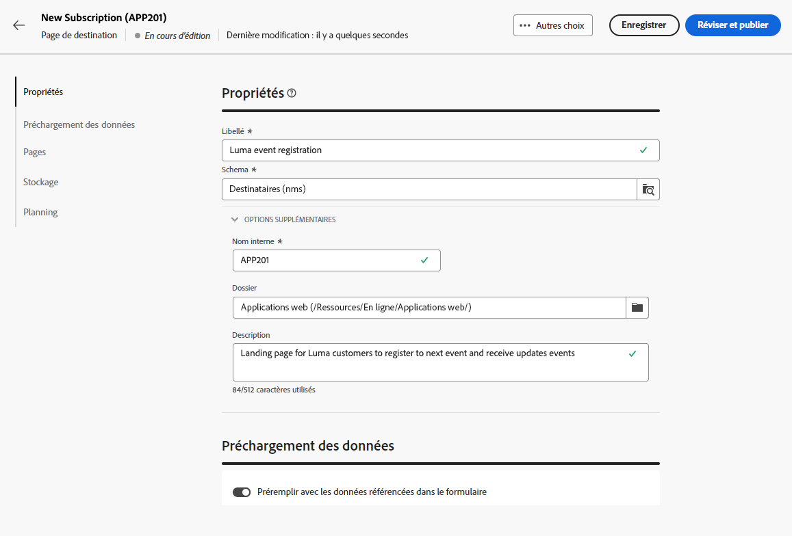{zoomable=&quot;yes&quot;}

1. Selon votre cas, sélectionnez la variable **[!UICONTROL Acquisition]**, **[!UICONTROL Abonnement]**, **[!UICONTROL Désabonnement]** ou **[!UICONTROL Liste bloquée]** page.

1. Le contenu de la page s’affiche. Sélectionnez la partie correspondant au formulaire de landing page.

   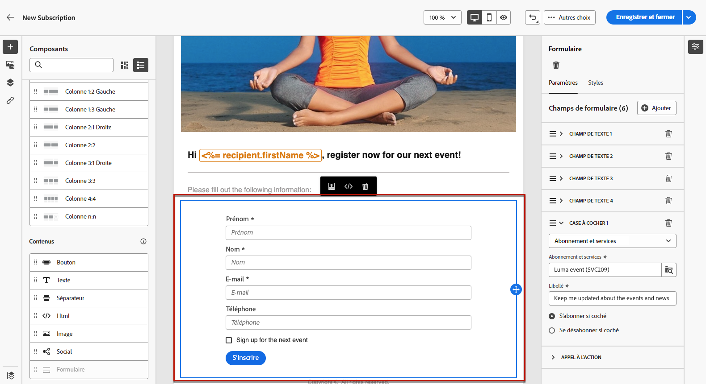{zoomable=&quot;yes&quot;}

1. Editez votre contenu en fonction du modèle sélectionné :

   * [Acquisition](#lp-acquisition)
   * [Abonnement](#lp-subscription)
   * [Désabonnement](#lp-unsubscription)
   * [Liste bloquée](#lp-denylist)

1. Modifiez le reste de votre contenu selon vos besoins, enregistrez vos modifications et fermez-les.

1. Modifiez la variable **[!UICONTROL Confirmation]** si nécessaire, ainsi que la variable **[!UICONTROL Erreur]** et **[!UICONTROL Expiration]** pages. La variable **[!UICONTROL Confirmation]** s’affichera à vos destinataires une fois le formulaire envoyé.

   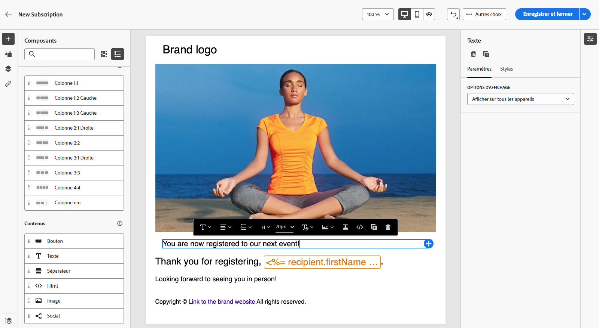{zoomable=&quot;yes&quot;}

1. [Test](create-lp.md#test-landing-page) et [publier](create-lp.md#publish-landing-page) votre landing page.

1. Créez un [email](../email/create-email.md) pour diriger le trafic vers la landing page.

1. [Insérez un lien](../email/message-tracking.md#insert-links) dans le contenu de votre message. Sélectionner **[!UICONTROL Landing page]** comme la propriété **[!UICONTROL Type de lien]** et choisissez la landing page que vous avez créée.

   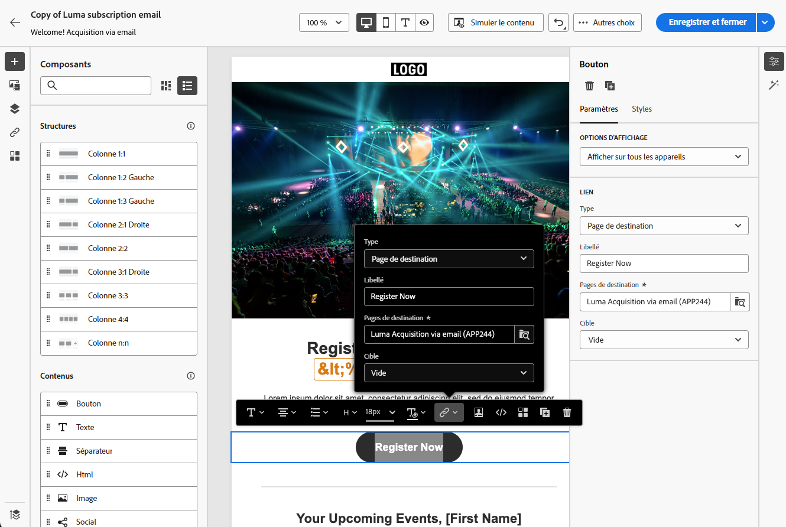{zoomable=&quot;yes&quot;}

   >[!NOTE]
   >
   >Pour pouvoir envoyer votre message, vérifiez que la page de destination sélectionnée n’a pas encore expiré. [En savoir plus](create-lp.md#create-landing-page)

Une fois qu&#39;ils ont reçu l&#39;email, si vos destinataires cliquent sur le lien vers la landing page et envoient le formulaire :

* Ils seront redirigés vers la page de confirmation.

* Toute autre action définie dans votre landing page sera appliquée. Par exemple, les utilisateurs seront abonnés à votre service ou ils ne recevront plus de communications de votre part.

Vous trouverez ci-dessous quelques exemples d’utilisation [!DNL Adobe Campaign] landing pages dans les différents cas d’utilisation possibles.

## Acquisition de profils {#lp-acquisition}

Le premier modèle permet d&#39;ajouter ou de mettre à jour un profil dans la base de données Campaign.

1. When [création de votre landing page](create-lp.md#create-landing-page), sélectionnez la variable **[!UICONTROL Acquisition]** modèle.

1. Dans les propriétés de la landing page, veillez à sélectionner la variable **[!UICONTROL Préremplir avec les données référencées dans le formulaire]** afin de précharger les informations existantes du profil et d&#39;éviter de créer des doublons.

1. Sélectionnez la variable **[!UICONTROL Acquisition]** pour modifier son contenu.

1. Modifiez les champs de texte selon les besoins, en fonction des informations que vous souhaitez rassembler sur vos profils.

1. De plus, vous pouvez ajouter une case à cocher invitant vos clients à s’abonner à votre service de newsletter. [Découvrez comment créer un service](../audience/manage-services.md)

   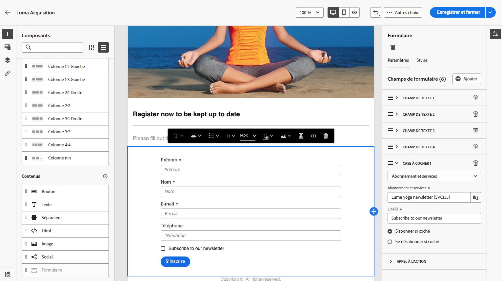{zoomable=&quot;yes&quot;}

1. Ajustez votre contenu selon vos besoins et enregistrez vos modifications.

1. Révision et [publier](create-lp.md#publish-landing-page) votre landing page.

1. Créez un [email](../email/create-email.md) et [ajouter un lien](../email/message-tracking.md#insert-links) à votre landing page.

Une fois l&#39;email reçu, si vos destinataires cliquent sur le lien vers la landing page et envoient le formulaire, leur profil sera ajouté à la base de données Campaign ou mis à jour avec les informations qu&#39;ils ont fournies.

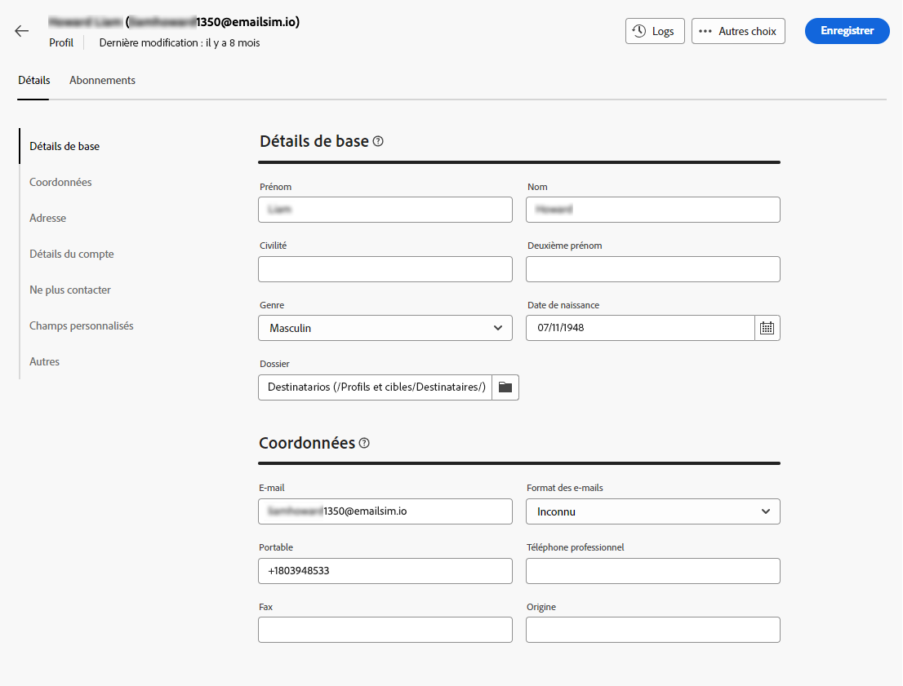{zoomable=&quot;yes&quot;}

S’ils ont choisi de recevoir votre newsletter, ils seront abonnés au service correspondant.

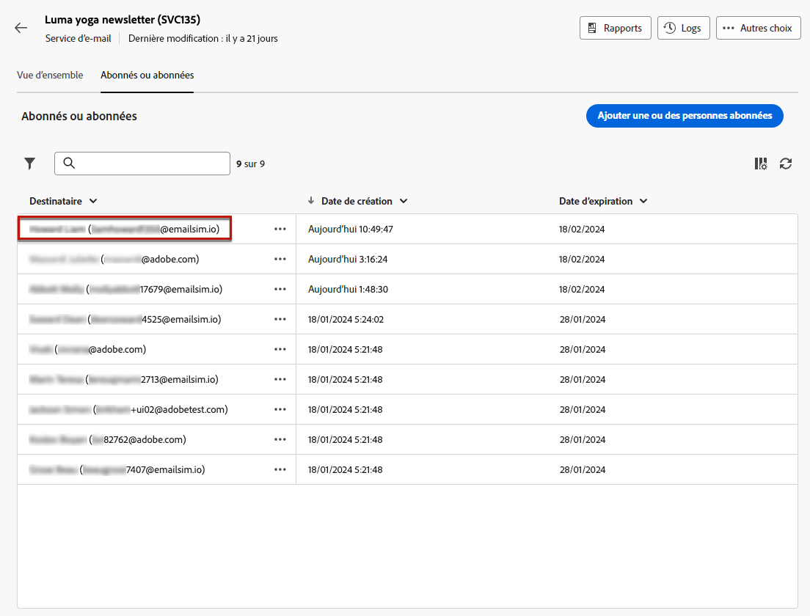{zoomable=&quot;yes&quot;}

## Abonnement à un service {#lp-subscription}

Un des cas d’utilisation les plus courants consiste à inviter vos clientes et vos clients à [s’abonner à un service](../audience/manage-services.md) (comme une newsletter ou un événement) via une page de destination. Suivez les étapes ci-dessous.

<!--For example, let's say you organize an event next month and you want to launch an event registration campaign. To do this, you're going to send an email including a link to a landing page that will enable your recipients to register for this event. The users who register will be added to the subscription list that you created for this purpose.-->

1. Créez tout d&#39;abord un modèle de confirmation pour les utilisateurs qui s&#39;abonnent à votre événement, afin que vous puissiez le sélectionner facilement lors de la création du service. [En savoir plus](../audience/manage-services.md#create-confirmation-message)

   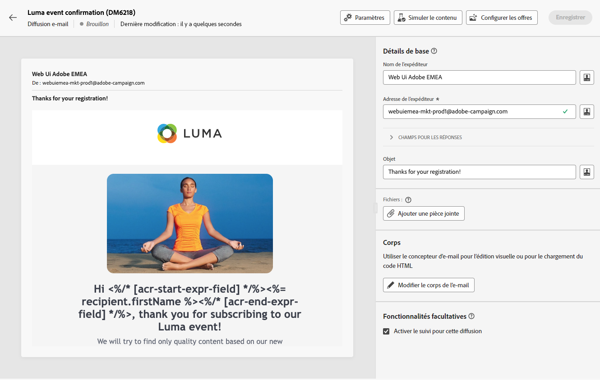{zoomable=&quot;yes&quot;}

1. Créez un service d’abonnement qui stockera les utilisateurs enregistrés dans votre événement. [Découvrez comment créer un service](../audience/manage-services.md)

1. Sélectionnez le modèle que vous avez créé comme email de confirmation que les utilisateurs recevront lors de leur inscription.

   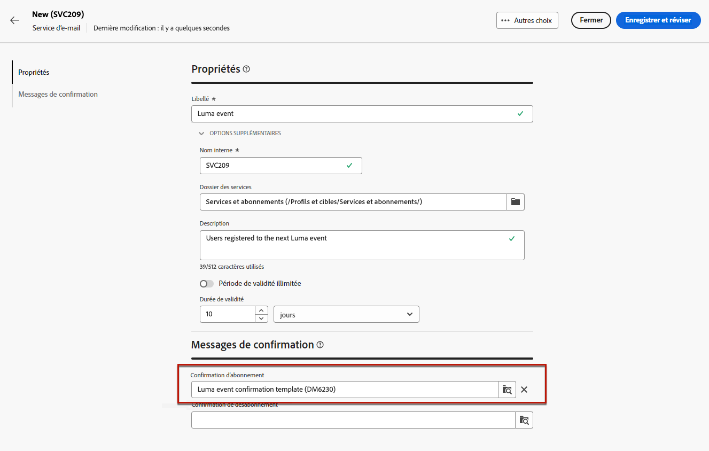{zoomable=&quot;yes&quot;}

1. [Créer une landing page](create-lp.md#create-landing-page) pour permettre aux destinataires de s&#39;inscrire à votre événement. Sélectionnez la variable **[!UICONTROL Abonnement]** modèle.

1. Sélectionnez la variable **[!UICONTROL Abonnement]** pour modifier son contenu.

1. Le contenu de la page s’affiche. Sélectionnez la partie correspondant au formulaire de landing page et développez l&#39;objet **[!UICONTROL Case à cocher 1]** .

1. Dans le **[!UICONTROL Abonnements et services]** , sélectionnez le service que vous avez créé pour votre événement. Laissez le champ **[!UICONTROL S’abonner à si cette option est cochée]** activée.

   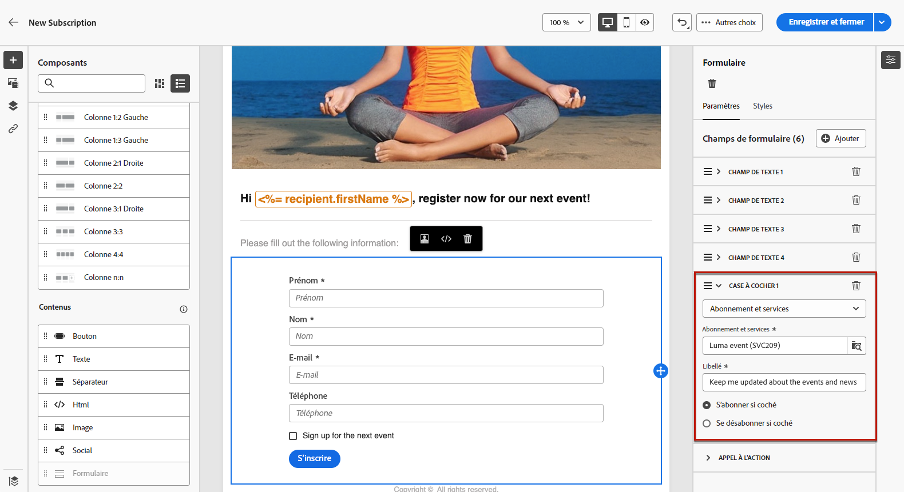{zoomable=&quot;yes&quot;}
<!--
1. You can add an additional checkbox to offer subscription to your newsletter for example.-->

1. Ajustez votre contenu selon vos besoins et enregistrez vos modifications.

1. Révision et [publier](create-lp.md#publish-landing-page) votre landing page.

1. Créez un [email](../email/create-email.md) et [ajouter un lien](../email/message-tracking.md#insert-links) pour diriger le trafic vers la page d’entrée de l’enregistrement.

1. Concevez le courrier électronique pour annoncer que l’enregistrement est désormais ouvert pour votre événement.

A la réception de l&#39;email, si vos destinataires cliquent sur le lien vers la landing page et envoient le formulaire, ils seront redirigés vers la page de confirmation et ils seront ajoutés à la liste d&#39;inscription.

## Désabonnement {#lp-unsubscription}

Vous pouvez permettre à vos clients de se désabonner d&#39;un service à l&#39;aide d&#39;une landing page.

1. Assurez-vous d&#39;avoir créé un modèle de confirmation pour les utilisateurs qui se désabonnent de votre service, afin que vous puissiez le sélectionner facilement lors de la création du service. [En savoir plus](../audience/manage-services.md#create-confirmation-message)

1. Dans votre [service d&#39;abonnement](../audience/manage-services.md), sélectionnez le modèle que vous avez créé comme email de confirmation que les utilisateurs recevront lors de leur désinscription.

1. [Créer une landing page](create-lp.md#create-landing-page). Sélectionnez la variable **[!UICONTROL Désabonnement]** modèle.

1. Sélectionnez la variable **[!UICONTROL Désabonnement]** pour modifier son contenu.

1. Le contenu de la page s’affiche. Sélectionnez la partie correspondant au formulaire de landing page.

1. Vous pouvez ajouter une **[!UICONTROL Case à cocher]** , sélectionnez le service et choisissez la **[!UICONTROL Se désabonner si cette case est cochée]** .

   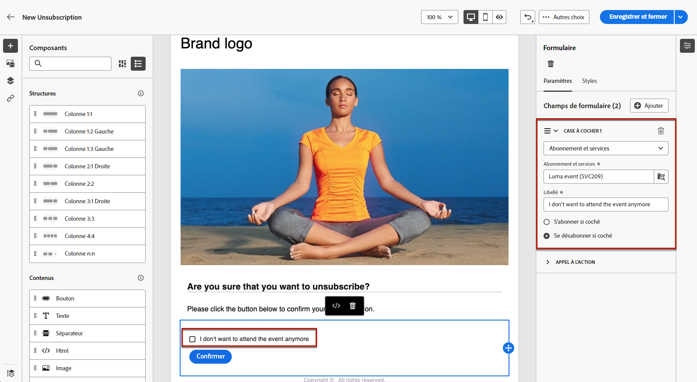{zoomable=&quot;yes&quot;}

1. Vous pouvez également développer la variable **[!UICONTROL Appel à l’action]** et sélectionnez la variable **[!UICONTROL Mises à jour supplémentaires]** . Sélectionnez le service et vérifiez le **[!UICONTROL Exclusion]** .

   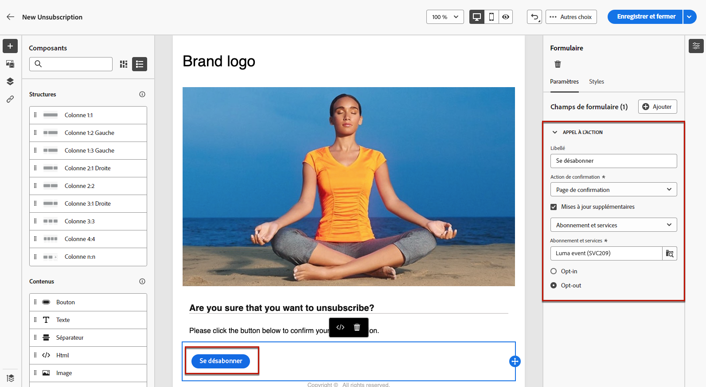{zoomable=&quot;yes&quot;}

1. Ajustez votre contenu selon vos besoins et enregistrez vos modifications.

1. Révision et [publier](create-lp.md#publish-landing-page) votre landing page.

1. Créez un [email](../email/create-email.md) et [ajouter un lien](../email/message-tracking.md#insert-links) à la landing page.

A la réception de l&#39;email, si vos destinataires cliquent sur le lien vers la landing page et envoient le formulaire, ils seront redirigés vers la page de confirmation de désinscription et seront retirés du service d&#39;inscription correspondant.

## Liste bloquée {#lp-denylist}

Donner aux personnes destinataires la capacité de se désabonner des communications d’une marque est une obligation légale. Par conséquent, vous devez toujours inclure une **lien de désabonnement** dans chaque email envoyé aux destinataires. Lorsque vous cliquez sur ce lien, les personnes destinataires sont redirigées vers une page de destination comprenant un bouton pour confirmer leur désinscription.

Vous pouvez configurer une **[!UICONTROL Liste bloquée]** landing page qui permettra aux utilisateurs de se désinscrire de toutes les diffusions.

1. When [création de votre landing page](create-lp.md#create-landing-page), sélectionnez la variable **[!UICONTROL Liste bloquée]** modèle.

1. Sélectionnez la variable **[!UICONTROL Liste bloquée]** pour modifier son contenu.

1. Développez l’objet **[!UICONTROL Appel à l’action]** et sélectionnez la variable **[!UICONTROL Mises à jour supplémentaires]** .

1. Dans la liste déroulante correspondante, sélectionnez **[!UICONTROL Canal (email)]** pour permettre aux destinataires de ne pas recevoir de communications par email uniquement. Vous pouvez également sélectionner **[!UICONTROL Par canal]** pour les exclure de toutes les communications sur tous les canaux.

   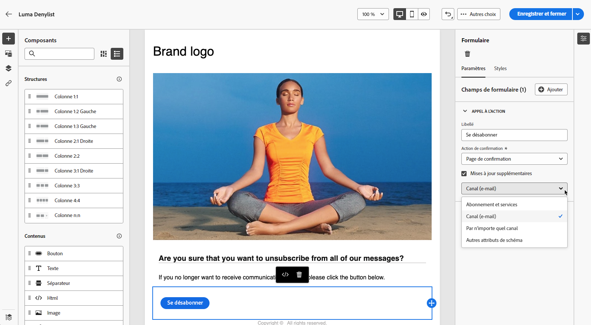{zoomable=&quot;yes&quot;}

1. Ajustez votre contenu selon vos besoins et enregistrez vos modifications.

1. Révision et [publier](create-lp.md#publish-landing-page) votre landing page.

1. Créez un [email](../email/create-email.md) et [ajouter un lien](../email/message-tracking.md#insert-links) à votre landing page afin de permettre aux utilisateurs de se désinscrire de la réception des communications.

A la réception de l&#39;email, si vos destinataires cliquent sur le lien vers la landing page et envoient le formulaire, ils seront redirigés vers la page de confirmation de liste bloquée et leur profil sera mis à jour avec les informations qu&#39;ils ont fournies.

Pour vérifier que le choix du profil correspondant a été mis à jour, accédez à la **[!UICONTROL Profils]** et sélectionnez ce profil.

Par exemple, si vous choisissez de mettre à jour la variable **[!UICONTROL Canal (email)]** dans votre landing page, l’option **[!UICONTROL Ne plus contacter par email]** est cochée.

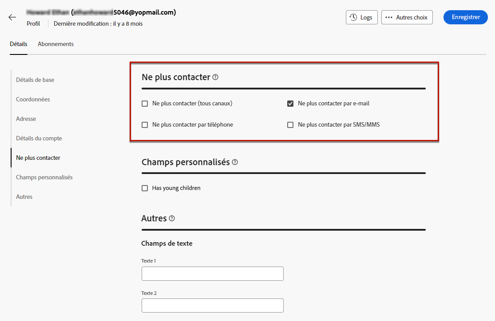{zoomable=&quot;yes&quot;}

Ce profil ne recevra pas de communications par e-mail de votre marque, sauf si vous vous êtes à nouveau abonné.

