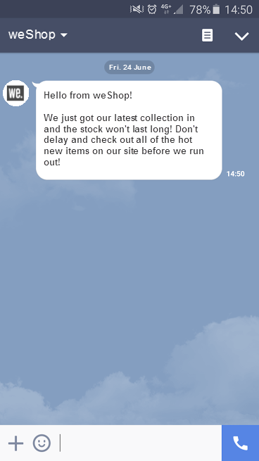

# Prise en main des messages LINE {#get-started-line}

LINE est une application gratuite de messagerie instantanée, d’appels vocaux et vidéo, disponible sur tous les appareils mobiles et sur PC. Vous pouvez utiliser Adobe Campaign pour envoyer des messages LINE. Utilisez LINE dans des diffusions autonomes ou dans des workflows, aux côtés de vos autres canaux.

* **[!UICONTROL Diffusions]** : créez une diffusion LINE autonome à partir du menu **[!UICONTROL Diffusions]** sur le rail de gauche, comme pour les SMS ou les notifications push. [En savoir plus](send-line.md).

* **[!UICONTROL Workflows]** : dans la zone de travail des workflows, ajoutez une activité de canal **[!UICONTROL LINE]**, choisissez un modèle de diffusion, puis définissez le contenu et les paramètres dans le tableau de bord de la diffusion. En savoir plus sur les activités de canal dans [cette page](../workflows/activities/channels.md).

  >[!NOTE]
  >
  >Dans l’activité **[!UICONTROL Créer une audience]** qui alimente votre activité de canal **[!UICONTROL LINE]**, modifiez la dimension de ciblage en **[!UICONTROL Abonnements des visiteurs]**. Veillez à activer l’option **[!UICONTROL Afficher tous les schémas]** dans le panneau latéral. Le sélecteur de modèles de diffusion n’est disponible qu’une fois cette dimension de ciblage définie.
