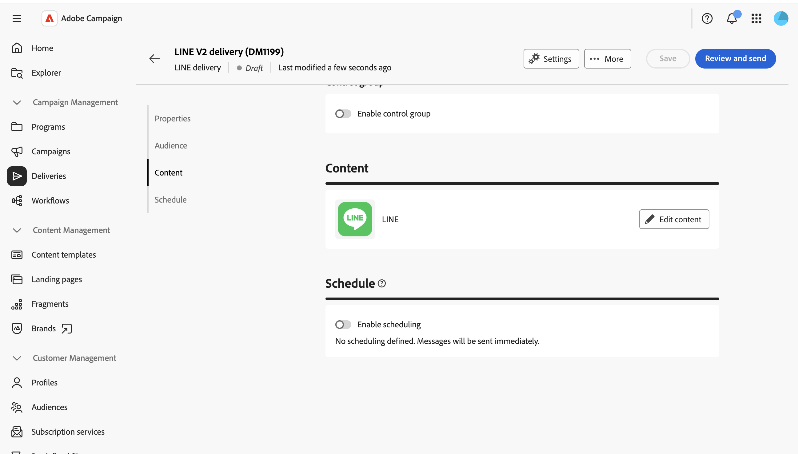
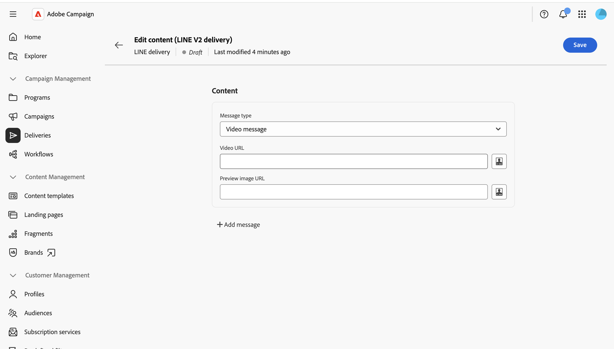
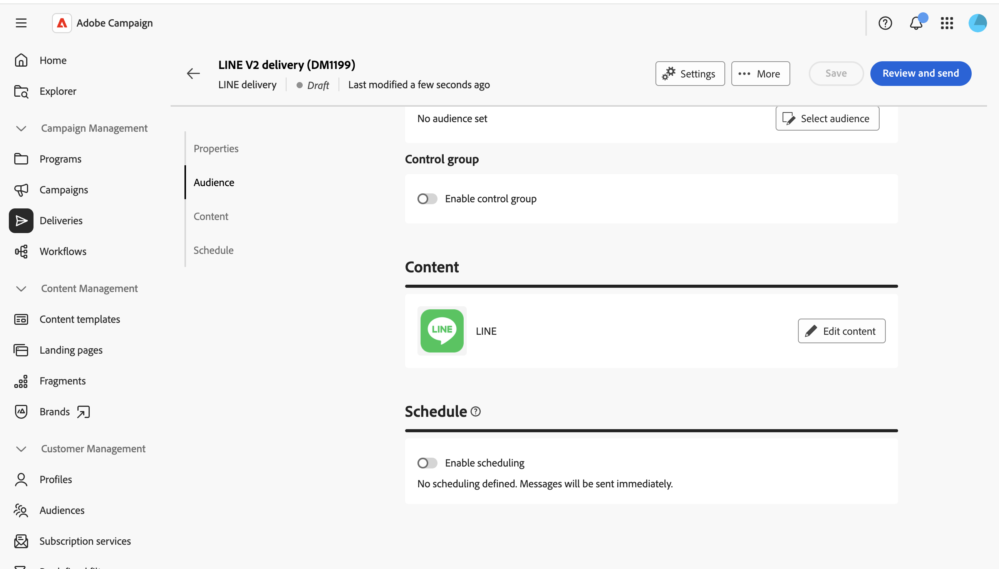

# Envoyer un message LINE {#send-line}

Vous pouvez créer et envoyer des messages LINE à vos abonnés, à l&#39;aide de contenu texte, image ou vidéo. Les diffusions LINE peuvent être créées en tant que diffusions autonomes ou ajoutées à un workflow.

Cette page décrit comment créer une diffusion LINE autonome, mais les mêmes étapes s&#39;appliquent lors de la configuration d&#39;une activité de canal LINE dans un workflow.

>[!IMPORTANT]
>
>La prévisualisation des messages n’est actuellement pas prise en charge pour les diffusions LINE. Examinez soigneusement votre contenu dans l’éditeur avant l’envoi, car vous ne pouvez pas prévisualiser le message rendu au préalable.

## Créer une diffusion LINE {#create-line-delivery}

1. Parcourez le menu **[!UICONTROL Diffusions]** et cliquez sur **[!UICONTROL Créer une diffusion]**.

1. Choisissez **[!UICONTROL LINE]** et sélectionnez un modèle de diffusion, tel que le modèle par défaut **[!UICONTROL diffusion LINE V2]**. [En savoir plus sur les modèles](../msg/delivery-template.md).

   

1. Cliquez sur **[!UICONTROL Créer une diffusion]** pour confirmer et afficher l’écran de configuration de la diffusion.

1. Saisissez un **[!UICONTROL Libellé]** pour la diffusion et définissez des options supplémentaires ou personnalisées, si nécessaire. [En savoir plus](../push/create-push.md#configure-push-settings).

   

## Sélection de l’audience {#audience}

1. Cliquez sur **[!UICONTROL Sélectionner une audience]** pour cibler une audience existante ou en créer une. Le ciblage des diffusions LINE est basé sur **[!UICONTROL abonnements des visiteurs]**. [En savoir plus sur les audiences](../audience/about-recipients.md).

1. Activez l’option **[!UICONTROL Activer la population témoin]** pour définir une population témoin et mesurer l’impact de votre diffusion. Les messages ne sont pas envoyés à cette population témoin. Vous pouvez ainsi comparer le comportement de la population qui a reçu le message avec celui des contacts qui ne l’ont pas reçu. [En savoir plus](../audience/control-group.md)

## Définir le contenu {#content}

Cliquez sur **[!UICONTROL Modifier le contenu]**.

L&#39;éditeur de contenu LINE s&#39;affiche.

Une diffusion LINE peut contenir jusqu&#39;à cinq messages. Cliquez sur **[!UICONTROL Ajouter un message]** pour ajouter un autre message à la diffusion, ou **[!UICONTROL Supprimer un message]** pour en supprimer un.

Vous pouvez utiliser, le cas échéant, l’éditeur de personnalisation pour insérer du contenu dynamique. [En savoir plus](../personalization/personalize.md).

Chaque message utilise l’un des types suivants.

>[!NOTE]
>
>Seules les URL d’image et de vidéo sont prises en charge. Le chargement d’un fichier local n’est pas disponible, ce qui correspond au comportement de la console cliente.

### Message texte {#text-message}

Un message texte est un message simple envoyé sous forme de texte. Il vous suffit de saisir le message dans le champ associé et d’utiliser les champs de personnalisation, si nécessaire.

### Message image {#image-message}

Un message image vous permet d’envoyer une image, éventuellement divisée en zones cliquables, chacune d’elles étant liée à une URL différente.

* **[!UICONTROL Image personnalisée]** : définissez l’image dynamiquement par destinataire.
* **[!UICONTROL URL de l’image]** : indiquez l’URL de votre image. La taille recommandée est de 1 040 x 1 040 px. Activez **[!UICONTROL Définir des images par taille d’écran d’appareil]** pour fournir différentes résolutions d’image optimisées pour différentes tailles d’écran.
* **[!UICONTROL Texte secondaire]** : texte secondaire obligatoire affiché si l’image ne peut pas être chargée.
* **[!UICONTROL Liens]** : choisissez une mise en page pour diviser votre image en une ou plusieurs zones cliquables, puis attribuez une URL à chaque zone.

### Message vidéo {#video-message}

Un message vidéo permet d’envoyer une vidéo à vos destinataires.

* **[!UICONTROL URL de la vidéo]** : URL de votre vidéo. Seul le format MP4 est pris en charge.
* **[!UICONTROL URL de l’image d’aperçu]** : URL d’une image affichée avant la lecture de la vidéo.

## Planifier et envoyer {#schedule-send}

1. Après avoir défini le contenu, cliquez sur **Enregistrer** puis sur l’icône Précédent pour revenir à l’écran de configuration de la diffusion.

1. Activez **[!UICONTROL Activer la planification]** pour envoyer à une date et une heure spécifiques. [En savoir plus](../msg/gs-deliveries.md#gs-schedule).

   

1. Une fois votre contenu prêt, cliquez sur **[!UICONTROL Vérifier et envoyer]**. Le tableau de bord de la diffusion s’ouvre alors.

   

1. Cliquez sur **[!UICONTROL Préparer]**, puis confirmez. En cas d’erreur, corrigez-la et cliquez de nouveau sur **[!UICONTROL Préparer]**.

1. Cliquez sur **[!UICONTROL Envoyer]**. Vous pouvez ensuite suivre les résultats à partir des points d’entrée **[!UICONTROL Rapports]** et **[!UICONTROL Logs]** de la diffusion.
