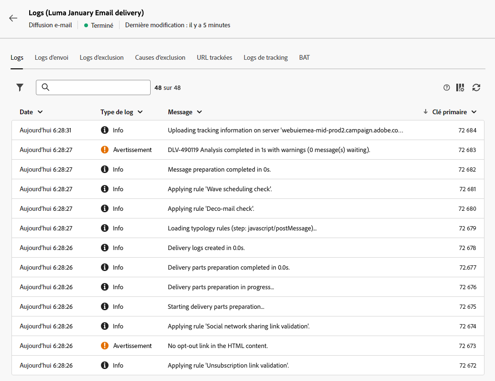
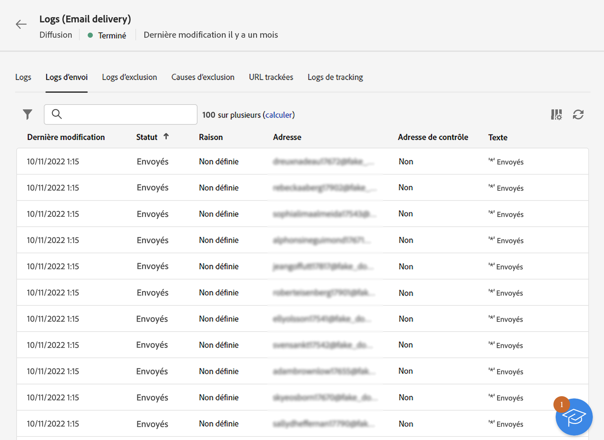

# Surveiller les logs de diffusion {#delivery-logs}

>[!CONTEXTUALHELP]
>id="acw_deliveries_email_preparation_logs"
>title="Logs de diffusion"
>abstract="TBC"

Après avoir préparé et envoyé un e-mail, les logs de diffusion vous permettent de vérifier qu’il n’y a aucune erreur. Vous pouvez accéder à ces logs depuis le tableau de bord des messages. Ils indiquent le détail de l’envoi, la cible exclue et les raisons de l’exclusion et fournissent des informations de tracking telles que les ouvertures et les clics.

Pour afficher les logs, accédez au tableau de bord de votre diffusion et cliquez sur le bouton **Logs**.

Plusieurs onglets sont disponibles :

## Logs

L’onglet **Logs** contient tous les messages relatifs à la diffusion et aux bons à tirer (BAT). Des icônes spécifiques permettent de repérer les erreurs ou avertissements.

Toutes les étapes de validation, les avertissements et les erreurs sont répertoriés. Les icônes colorées indiquent le type de message :

* L’icône grise indique un message informatif.
* L’icône jaune indique une erreur de traitement non critique.
* L’icône rouge indique une erreur critique qui empêche l’envoi de la diffusion.

## Diffusions

L’onglet **Diffusions** propose un historique des occurrences de cette diffusion. Y est répertoriée la liste des messages envoyés et leur statut. Il permet de visualiser l&#39;état de la diffusion pour chaque destinataire.

## Exclusions

Le **Exclus** tab répertorie tous les messages qui ont été exclus de la cible et indique la raison de l’échec de l’envoi.

## Causes d&#39;exclusion

Le **Exclusions appliquées** onglet affiche le volume (en nombre de messages) des messages qui ont été exclus de la cible.

## Tracked URLs

L’onglet **URL trackées** regroupe les URL contenues dans le message envoyé, leur type et leur URL source.

## Tracking

L’onglet **Tracking** affiche l’historique du tracking pour cette diffusion. Cet onglet affiche les données de tracking sur les messages envoyés, soit toutes les URL qui ont fait l’objet d’un tracking par Adobe Campaign.

>[!NOTE]
>
>Si le tracking n’est pas activé pour une diffusion, cet onglet n’est pas affiché.

