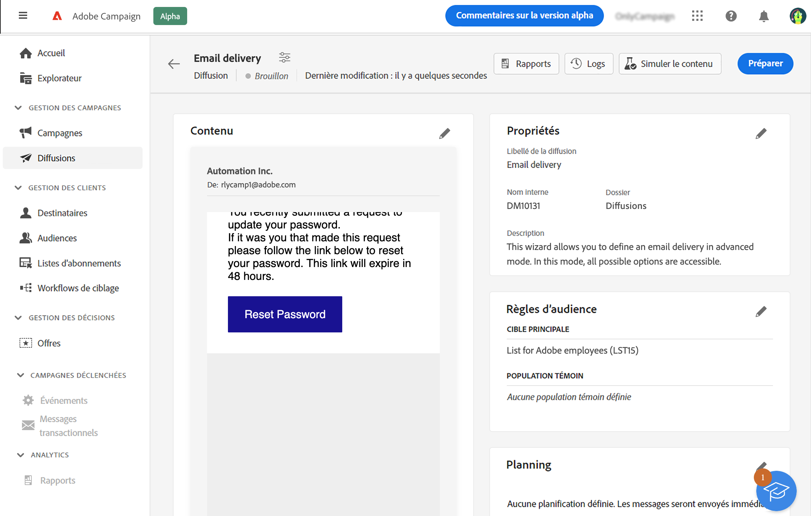
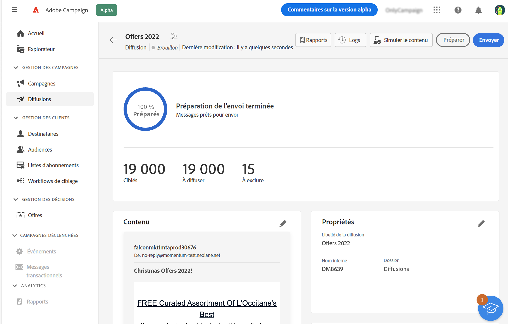
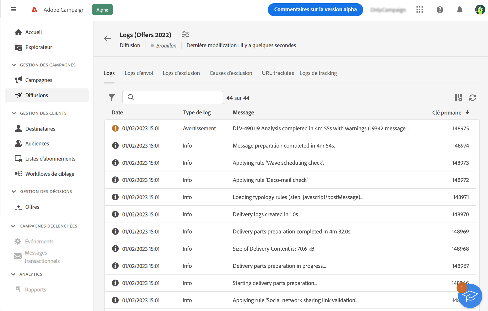
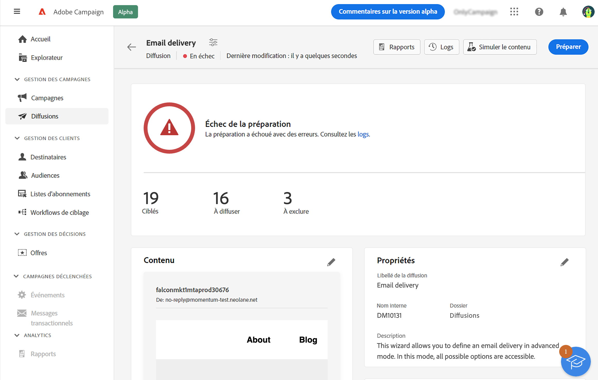
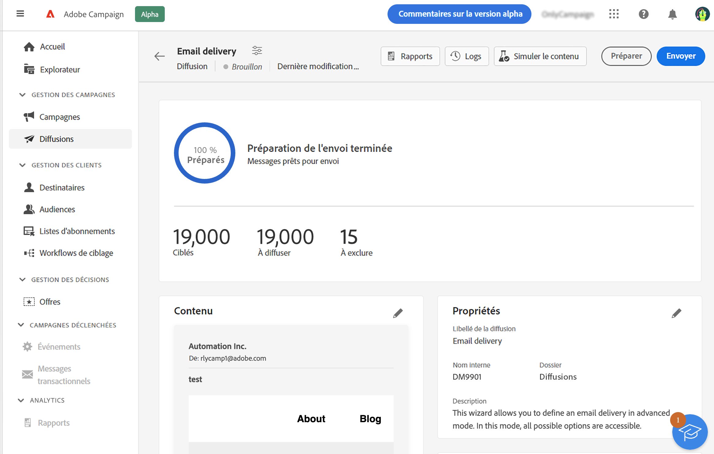
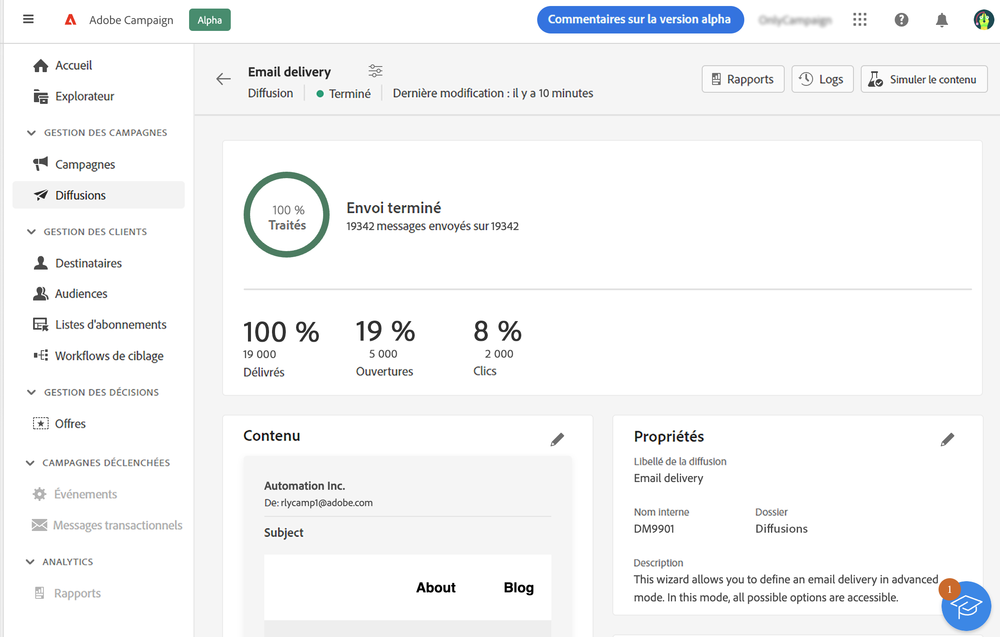

# Préparer et envoyer votre e-mail {#prepare-send}

>[!CONTEXTUALHELP]
>id="acw_homepage_card5"
>title="Préparer et envoyer votre e-mail"
>abstract="Découvrez comment préparer un e-mail et comment envoyer des KPI."

<!--

	show how to prepare and send the email + the live kpis in the dashboard

like acc when preparation, target calculated then send
real time KPIs, not in AJO. similar to ACS.
exclusion logs, causes
-->

<!--
send also KPIs
-->

## Préparer l’envoi{#prepare}

Lorsque vous avez défini le contenu, l’audience et le planning, vous êtes prêt(e) à préparer votre message. Pendant la préparation, la population cible est calculée et le contenu du message est généré pour chaque profil inclus dans la cible. Lorsque la préparation est terminée, les messages sont prêts à être envoyés immédiatement ou à la date et à l’heure planifiées. Les règles de validation utilisées pendant l’analyse sont décrites dans cette section [Documentation de Campaign Classic v7](https://experienceleague.adobe.com/docs/campaign-classic/using/sending-messages/key-steps-when-creating-a-delivery/steps-validating-the-delivery.html?lang=fr#validation-process-with-typologies){target="_blank"}.

Procédez comme suit :

1. Dans le tableau de bord de la diffusion, cliquez sur le bouton **Préparer** dans le coin supérieur droit et confirmez.

   

   La progression de la préparation s’affiche. La durée de cette opération varie en fonction de la taille de la population ciblée.

   >[!NOTE]
   >
   >Vous pouvez arrêter la préparation à tout moment à l’aide du bouton **Arrêter la préparation**. Pendant la phase de préparation, aucun message n&#39;est envoyé. Vous pouvez donc lancer ou annuler cette opération sans aucun risque.

1. Une fois la préparation terminée, vérifiez les KPI. Si le nombre de messages à envoyer ne correspond pas à vos attentes, modifiez l’audience et relancez la préparation.

   

   Voici les KPI qui s’affichent :

   * **Ciblés** : le nombre de destinataires ciblés.
   * **À envoyer** : le nombre de messages qui seront envoyés.
   * **À exclure** : le nombre de messages exclus par une règle de typologie.

1. Cliquez sur le bouton **Logs** et vérifiez qu’il n’y a aucune erreur. Le dernier message de logs affiche les erreurs éventuelles et leur nombre. Voir à ce propos cette [section](delivery-logs.md).

   

Si la préparation détecte une erreur critique qui empêche l’envoi de la diffusion, le statut de préparation apparaît comme ayant échoué dans le tableau de bord de la diffusion.

Si vous devez modifier la diffusion après la préparation, vous devez relancer la préparation pour que ces modifications soient prises en compte.

Une fois la préparation terminée sans erreur, le message est prêt à être envoyé. Voir à ce propos cette [section](#send).

## Envoyer le message{#send}

Une fois la préparation terminée, vous pouvez envoyer le message. Cette étape n’est nécessaire que pour les messages envoyés immédiatement. Si le message est planifié, il sera envoyé à la date définie.

Procédez comme suit :

1. Dans le tableau de bord de la diffusion, cliquez sur le bouton **Envoyer** dans le coin supérieur droit et confirmez.

   

1. La progression de l’envoi s’affiche. Vérifiez les KPI qui s’affichent. Vous pouvez également consulter les logs. Voir à ce propos cette [section](delivery-logs.md).

   

   Voici les KPI qui s’affichent :

   * **Diffusés** : le nombre de messages envoyés avec succès. Le pourcentage est basé sur le nombre total de destinataires ciblé(e)s.
   * **Ouvertures** : le nombre de messages ouverts. Le pourcentage est basé sur le nombre de messages diffusés.
   * **Clics** : le nombre de destinataires ayant cliqué au moins une fois dans l’e-mail. Le pourcentage est basé sur le nombre de messages diffusés.

   >[!NOTE]
   >
   >Les indicateurs **Ouvertures** et **Clics** sont mis à jour en temps réel.

   Vous pouvez suspendre l’envoi à tout moment, puis reprendre. Si vous arrêtez la diffusion pendant son envoi, vous ne pourrez pas reprendre.
